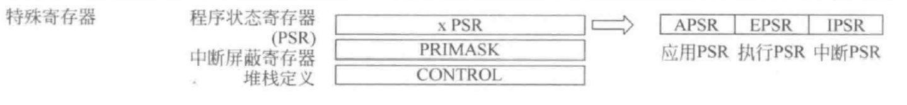
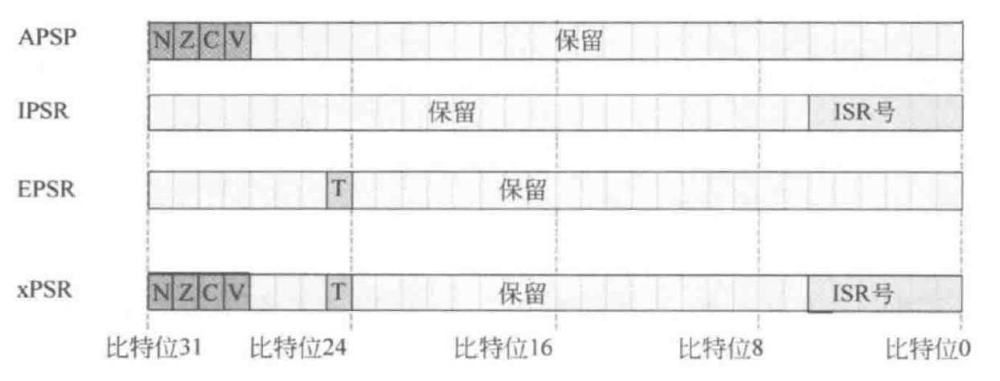

本系列博文旨在以计算机组成的角度剖析嵌入式应用中较常见的ARM架构，由于CM0是相对先进且*简单*的内核，所以选择了CM0作为切入点而不是STM32中常见的CM3/CM4

# Cortex-M0解读1【内核结构】

Cortex-M0处理器是ARM Cortex-M系列里面结构和功能最简单的处理器，基于**32位ARMv6-M架构**，**三级流水**（取指-译码-执行）；使用**冯诺依曼架构**（指令数据共享TCM）；支持绝大部分的16位**Thumb-1**指令和部分32位**Thumb-2**指令，一共包含**56条指令**；支持Cotrex-M系列内核常见的32位中断，并且支持**NMI**（不可屏蔽中断），提供低功耗休眠模式

CM0内核中包含**处理器核**、嵌套向量中断控制器（Nested Vector Interrupt Controller，**NVIC**）、调试子系统（**DAP**）、唤醒中断控制器（Wakeup Interrupt Controller，**WIC**）、**AHB-Lite**接口及内**核总线**


NVIC用于管理外部中断，并向处理器核发出中断请求信号，可以用于处理32个中断请求，并额外处理一个NMI中断。NVIC能够自动处理嵌套中断（比较中断请求之间的优先级以及当前中断的优先级）。总线系统用于处理内核内部握手交互，并连接了AHB-Lite接口单元，总线宽度固定为32位，总线系统还直接连除JTAG调试口，能够满足CoreSight调试架构的需求。DAP调试子系统提供调试控制、程序断点、数据监控点的功能，在产生调试事件时，它会将处理器核阻塞，开发者可以在此时调用查看处理器状态。WIC用于低功耗应用，通过设置寄存器中的指定位来控制，启用后会将外设时钟关断、电源下电，当检测到发生中断后，WIC再通知PMU（电源管理单元）给系统上电，并恢复外设时钟，处理器恢复正常状态

## 内核

CM0内核包含三级流水线、寄存器组和特殊控制寄存器


### Register File寄存器组

CM0的RegFile结构如下所示


如上图所示，R0\~R12是**通用寄存器**。其中R0\~R7为低寄存器，这些寄存器可以被任何指令访问；R8~R12为高寄存器，一些Thumb指令不可以访问这些寄存器

R13寄存器是**堆栈指针**（**SP**，Stack Pointer）。堆栈中的**栈**（Stack）是内存中的一片固定区域，CM0的栈结构从高地址区域向低地址区域生长。当进行子程序跳转的时候，使用堆栈来保存上下文（现场保护、恢复现场）。SP用于记录当前栈顶的地址。入栈过程中，每有一个寄存器的数据被放入当前SP位置，SP都会随之**-4**；出栈中，每有一个寄存器数据被弹出，SP会随之**+4**


堆栈结构中的另一部分是**堆**（heap），这是在栈更高地址的一片区域，一般由用户程序或操作系统自行分配，堆是按照内存地址从低向高生长的。CM0为堆栈都预留了内存区域，在上面的内存映射部分已经提过

CM0中SP分为**MSP**（Main Stack Pointer，主堆栈指针）和**PSP**（Process Stack Pointer，进程堆栈指针）。MSP用于应用程序的特权访问（privilege access），一般来说嵌入式程序直接使用MSP而不使用PSP，MSP可以访问操作系统内核和异常句柄等关键区域；PSP不能执行异常句柄的跳转，这个指针在使用操作系统的情况下会应用于一般用户程序代码

R15是**程序计数器PC**（Program Counter），记录了**当前运行的指令代码的地址**。在取指阶段，每个时钟周期PC自动+4（32位指令的情况）或+2（16位指令的情况）。在执行分支跳转指令的情况下，会将PC指向所要跳转到的地址，同时将当前PC值保存到**链接寄存器LR**（Link Register）中

R14就是链接寄存器，专门保存子程序或程序调用的返回地址。当程序调用结束后，LR中的值会被加载到PC。在后面的分支跳转部分会详细叙述这一过程

### SFR特殊控制寄存器（Special Function Register）

SFR有三个寄存器：xPSR、PRIMASK、CONTROL



xPSR是组合程序状态寄存器，实质上是三个寄存器，但CM0中可以通过相同的地址调用三个寄存器中的不同位——三个寄存器被映射到了同一个32位地址上

> 需要注意：这三个寄存器真的被映射成了同一个寄存器——xPSR在压栈时是作为一个整体进入栈的，返回时也会作为一个整体传回到三个寄存器对应位中
>
> CM0的官方实现中采用了如下代码
>
> ```verilog
> assign cm0_xpsr = {vis_apsr[3:0],3'd0,vis_tbit,18'd0,vis_ipsr[5:0]};
> ```
>
> 直接把这三个寄存器给合并成了一个
>
> 不过在内核中，它们就是三个寄存器，下面是官方实现进行例化的部分（例化的是内核模块）
>
> ```verilog
>   .vis_apsr_o           (vis_apsr[3:0]),
>   .vis_tbit_o           (vis_tbit),
>   .vis_ipsr_o           (vis_ipsr[5:0]),
> ```



三个寄存器分别是**APSR**应用程序状态寄存器、**IPSR**中断程序状态寄存器、**EPSR**执行程序状态寄存器


### 取指


### 译码


### 执行


### 分支跳转


## Memory存储器


