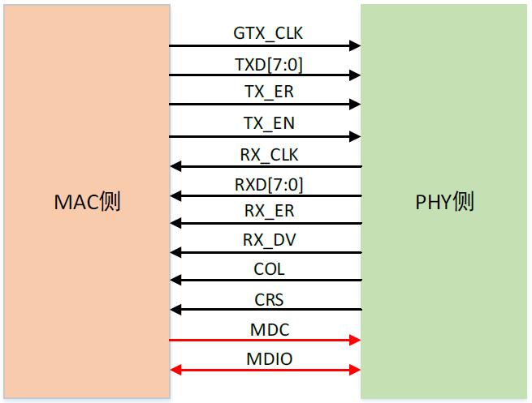

# 以太网协议

stm32f407配置了以太网外设，可以按照IEEE 802.3-2002标准进行以太网通信

## MAC内核特性

* 支持外部PHY接口实现**10/100Mbits/s数据传输速率**
* 半双工/全双工适应
* **报头和帧起始数据（SFD）在发送路径中插入、在接收路径中删除**，计算IPv4头校验和 与 TCP、UDP、ICMP校验和 并将其插入在存储转发模式下发送的帧中
* 可逐帧控制CRC和pad自动生成，接收帧时可自动去除pad/CRC
* **可编程帧长度（支持16KB的巨型帧）、可编程帧间隔（40-96位时间，以8为步长）**
* 支持**多种**灵活的**地址过滤模式**，配备4个48为完美（DA）地址过滤器、3次48位SA地址比较检查、可选64位Hash滤波器（多播、单播适用）、支持混合模式，无需过滤网络监视、传送所有数据包（每次过滤）时均附有一份状态报告
* 发送和接收数据包分别返回32位状态
* **为应用程序提供单独的发送、接收和控制接口**
* 接收功能中**支持IPv4和TCP数据包**，增强型接收功能中**支持检查IPv4头校验和IPv4/IPv6数据包中封装的TCP、UDP、ICMP校验和**
* **支持以太网时间戳**，每个帧收发时给出64位时间戳
* 配备**2组FIFO**：可编程阈值的2KB发送FIFO 和 可编程阈值（默认为64字节）的2KB接收FIFO；接收FIFO进行多帧存储时，通过在EOF传输后向接收FIFO插入接收状态矢量，从而使接收FIFO无需存储这些帧的接收状态
* **存储转发模式**下可以在接收时**过滤所有错误帧**，不将这些错误帧转发给应用程序，可转发过小的好帧
* 为接收FIFO中丢失或损坏的帧生成脉冲，可以统计丢帧
* 向MAC内核发送数据时支持存储转发
* **发送时处理冲突帧的自动重新发送，丢弃延迟冲突、过度冲突、过度延迟和下溢条件下的帧**
* 可软件控制刷新Tx FIFO
* 支持调试时通过MII进行内部回送

## DMA特性

* 支持所有AHB突发类型、**软件在AHB主接口中选择AHB突发类型为固定或不确定突发**、可从AHB主端口选择地址对齐突发
* **支持ui数据缓冲区进行字节对齐寻址**
* 双缓冲区（环）或链表（链接）描述符链接，采用描述符架构可以在CPU几乎不干预的情况下传输大型数据块，**每个描述符可传输高达8KB数据**
* 报告正常工作和传输错误时的综合状态
* 可为收发DMA控制器单独编程突发大小来充分利用主总线，**可编程中断**
* 可按帧控制发送、接收完成中断，配备启动、停止模式
* 接收/发送引擎间采用**循环调度仲裁**或**固定优先级仲裁**
* 当前的Tx/Rx缓冲区指针和描述区指针作为状态寄存器

## PTP特性

* 接收帧/发送帧时间戳，支持粗略校准和精细较准，系统时间大于目标时间时可触发中断
* 输出秒脉冲

# STM32的以太网实现

以太网传输的底层离不开MAC和PHY，stm32内部实际集成了一个MAC，需要搭配外加的PHY芯片才能进行网络通信，**这里主要介绍stm32以太网的配置和基本操作，所以不对PHY或其他外部电路进行过多介绍**

## 以太网控制器Mac与接口PHY芯片

以太网外设一般负责管理OSI协议中的**物理层**和**数据链路层**，但MAC控制器不能独立完成电器信号和数据流的控制工作，一般由专用的PHY芯片辅助，PHY芯片提供了和对端设备连接的重要功能并通过LED灯显示出当前连接的状态和工作状态。*网卡接入网线后，PHY会不断发出的脉冲信号检测对端设备*，它们通过一套标准的语言交流，互相协商并确定连接速度、工作模式、是否采用流控等。通常情况下，协商的结果是两个设备中能同时支持的最大速度和最好的双工模式，这个技术被称为**AutoNegotiation**即**自协商**。PHY芯片面向数据链路层提供寻址机构、数据帧的构建、数据差错检查、传送控制、向网络层提供标准的数据接口等功能，MAC控制器主要负责这一部分的工作。

MAC和PHY通过规范化的接口**MII**（Medium Independent Interface）进行通信，常见的千兆以太网MAC会使用**GMII**（Gigabit Medium Independent Interface）或**RGMII**（RGMII Gigabit Medium Independent Interface）接口与PHY芯片连接

### GMII与RGMII

**GMII接口提供了8位数据通道，125MHz的时钟速率，从而具有1000Mbps的数据传输速率**

GMII除MDC和MDIO 外，有24根接口信号线，如上图所示。包括四个部分

* MAC2PHY发送数据接口
* PHY2MAC接收数据接口
* PHY2MAC状态指示信号接口
* MAC-PHY间传输控制和状态信息接口

各信号线功能如下所示：

| 信号名称  | 数量 | 描述             | 归类                            |
| --------- | ---- | ---------------- | ------------------------------- |
| (G)TX_CLK | 1    | 发送时钟         | MAC2PHY发送数据接口             |
| TXD[7:0]  | 8    | 发送数据         | MAC2PHY发送数据接口             |
| TX_ER     | 1    | 发送错误指示     | MAC2PHY发送数据接口             |
| TX_EN     | 1    | 发送使能         | MAC2PHY发送数据接口             |
| RX_CLK    | 1    | 接收时钟         | PHY2MAC接收数据接口             |
| RXD[7:0]  | 8    | 接收数据         | PHY2MAC接收数据接口             |
| RX_ER     | 1    | 接收错误指示     | PHY2MAC接收数据接口             |
| RX_DV     | 1    | 接收数据有效信号 | PHY2MAC接收数据接口             |
| COL       | 1    | 冲突检测信号     | PHY2MAC状态指示信号接口         |
| CRS       | 1    | 载波侦听信号     | PHY2MAC状态指示信号接口         |
| MDC       | 1    | 管理时钟         | MAC-PHY间传输控制和状态信息接口 |
| MDIO      | 1    | 管理数据         | MAC-PHY间传输控制和状态信息接口 |

RGMII是GMII 接口的简化版本，采用**4位数据接口，工作时钟125MHz**，通过**在上升沿和下降沿同时传输数据，因此传输速率可达1000Mbps**

采用RGMII可以直接降低电路成本，使用该接口的器件的引脚数可从24个减少到14个（不包括MDC和MDIO），接口信号如下图所示

不难看出RGMII接口相对于GMII接口在TXD和RXD上总共减少8根数据线；TX_CTL代替了TX_EN和TX_ER两条信号线——在TX_CLK的上升沿发送TX_EN，下降沿发送TX_ER；同样RX_CTL信号线上会传送RX_DV和RX_ER两种信息，在RX_CLK的上升沿发送RX_DV，下降沿发送RX_ER。其他信号同GMII接口

> 需要特殊指出的是：MII/GMII/RGMII都使用了lvds电平，PCB上需要使用**差分布线**才能获得MCU和PHY的良好连接

STM32的以太网控制器也需要外接PHY芯片才能使用，以下部分使用NI的DP83848芯片为例实现STM32的以太网驱动

## 以太网驱动

==**所有MAC信号映射到AF11**==

详见参考手册

### 以太网控制器初始化

