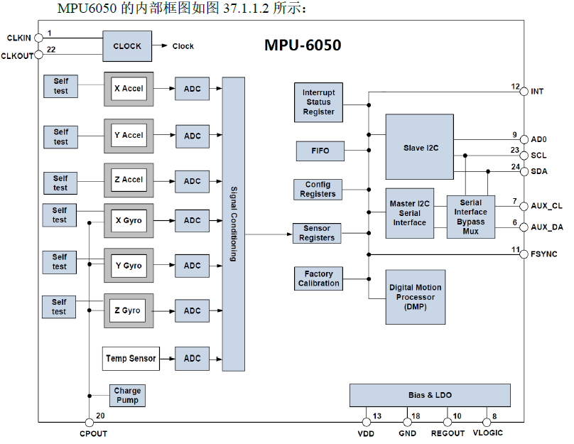

# 六轴传感器

常见的六轴传感器有MPU6050、6500、9150、9250等

MPU6050内部集成了3轴陀螺仪、3轴加速度传感器，并自带两个IIC接口，其中一个可以用于连接外部磁力传感器，达到九轴传感器的效果；MPU6050内部还自带数字运动处理器（DMP，Digital Motion Processor）硬件加速，可通过主IIC接口向上位机输出完整的九轴融合演算数据

内部结构框图如下所示：

SCL、SDA是IC的主IIC，应该连接到MCU；AUX_CL和AUX_DA可以用于连接外部从设备，一般连接磁传感器用于组成九轴传感器；AD0是主IIC接口的地址控制引脚，该引脚决定了MPU6050的IIC地址的最低位，如果接GND，则IIC地址为0x68，如果接VDD，则IIC地址是0x69（需要注意：这里的地址不包含数据传输的最低位，数据传输最低位用来表示读写）

# 电子罗盘