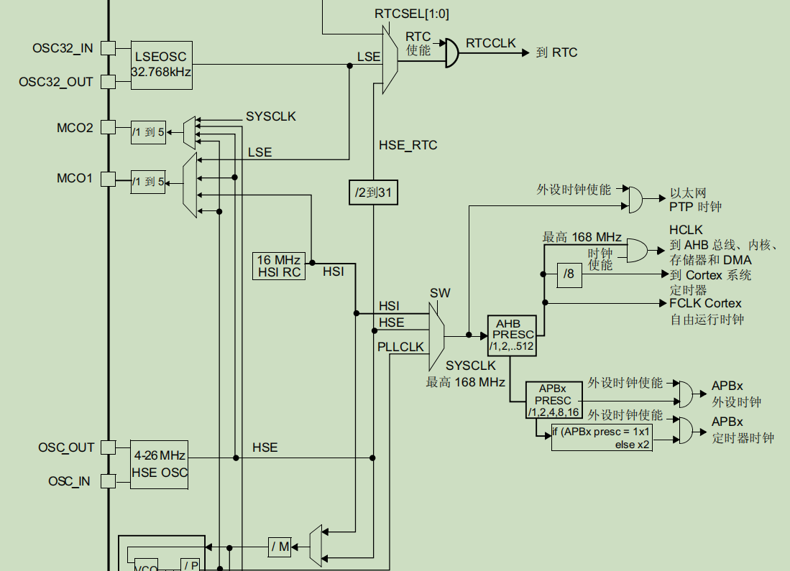
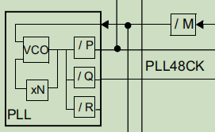
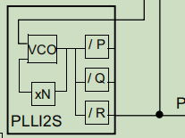

# 复位

## 系统复位

系统复位将所有寄存器复位，**除了时钟控制寄存器CSR中的复位标志和备份域寄存器**

复位条件：

1. **外部复位：NRST引脚电平拉低**

2. WWDG复位：窗口看门狗计数结束

3. IWDG复位：独立看门狗计数结束

4. **软件复位(内核软复位)：将Cortex-M4内核的应用中断和复位控制寄存器(SCB_AIRCR)中的SYSRESEREQ(sys_reset_eq)位 置1**

   在以下三种情况下会产生**内核复位**：

   1. 上电复位：MCU通电时内核自动将所有组成部件复位
   2. 系统复位：只复位处理器和外设，不会复位内核debug部分（常用来进行debug）
   3. 处理器复位：仅复位处理器

   上电复位和系统复位持续时间取决于MCU设计，在一些情况下，复位会持续数毫秒来等待晶振时钟稳定。在复位后、处理器运行程序之前，Cortex-M处理器将从内存中读取前两个字，即 位于中断向量表之前的**主栈顶指针(MSP Main Stack Pointer)**和**复位向量**初始值，其中复位向量就是复位句柄的起始地址。在这两个字被处理器读取以后，处理器会以这两个值建立主堆栈指针MSP和程序计数器PC

   提前建立MSP的原因：上电后可能会出现系统错误以至于处理器调用NMI或硬件错误相关服务函数，就需要栈内存和MSP把一些处理器状态信息压栈来处理系统错误相关的中断

   注意：Cortex-M4的SP初始化和传统ARM核的初始化不相同，它必须被在软件中初始化，而中断向量表存储的是中断向量的地址，因为M4的栈是自顶向下生长的，初始化的SP值应该被设置到栈顶以下的第一个内存，如下图所示：**中断向量表之前的SP初始值是一个指向栈顶的指针**

   

   下面是arm提供的core_cm4.h文件中有关系统复位的程序,以C内嵌汇编代码写成

   ```c
   __STATIC_INLINE void NVIC_SystemReset(void)
   {
     __DSB();/* Ensure all outstanding memory accesses included
     			buffered write are completed before reset */
     SCB->AIRCR  = (uint32_t)((0x5FAUL << SCB_AIRCR_VECTKEY_Pos)    |
                              (SCB->AIRCR & SCB_AIRCR_PRIGROUP_Msk) |
                               SCB_AIRCR_SYSRESETREQ_Msk    );/* Keep priority group unchanged */
     __DSB();/* Ensure completion of memory access */
   
     for(;;)/* wait until reset */
     {
       __NOP();
     }
   }
   ```

5. 低功耗管理复位

   引发低功耗复位的方式：

   1. 进入待机时复位：清零用户选项字节中的nRST_STDBY位。使能后，只要成功执行进入待机模式序列，MCU就不会进入待机，而是进行复位
   2. 进入停止模式时产生复位：清零用户选项字节中的nRST_STOP位。使能后，只要成功执行进入停止模式序列，MCU就不会进入停止模式，而是进行复位

## 电源复位

将**除备份域内的寄存器外**，其他所有寄存器复位

MCU内部的复位信号会在NRST引脚上输出，脉冲发生器会确保每个内部复位源的**复位脉冲都至少持续20us**

条件：

1. 上电/掉电/欠压复位
2. 退出待机模式复位

复位电路如下：


## 备份域复位

备份域复位会将**所有RTC寄存器和RCC_BDCR寄存器复位**，但**BKPSRAM不受影响**

BKPSRAM的**唯一**复位方式是通过FLASH接口将FLASH保护等级从1切换到0

复位条件：

1. 软件复位：将RCC备份域控制寄存器(RCC_BDCR)中的BDRST位 置1
2. 在$V_{DD}$和$V_{BAT}$都掉电后，其中任意一个又再上电

即 备份域靠$V_{BAT}$来维持断电情况下的运行，但如果$V_{BAT}$掉电则备份域无法保存数据

# 时钟控制(RCC)

ARM核的SoC底层都采用了同步时序电路和时钟门控技术。外设控制寄存器使用D触发器构成，在时钟信号的变沿触发，这就导致了想配置外设寄存器就必须供给其时钟，而时钟又是片上资源消耗较多的一个功能实现，所以stm32采用了时钟门控技术，可以独立开启/关闭某个外设的时钟，在不需要时可以关闭一个外设的时钟来实现低功耗

## 时钟源

系统时钟由**HSI时钟、HSE时钟、主PLL时钟**三者之一来驱动

同时，MCU可接入**32kHz低速内部RC(LSI RC)**驱动IWDG，也可用于RTC在停机/待机模式下的自动唤醒；还可接入**32.768kHz低速外部晶振(LSE晶振)**来驱动RTC时钟

每个时钟源都可以独立打开或关闭，同时开启的时钟源越少，功耗越低

## 时钟树

stm32f4的内部时钟相当复杂，呈多输入-多输出的树形结构，可分为以下几个主要组成部分

### 总线时钟

所有内部总线都可以通过多个预分频器进行时钟配置

AHB最大频率168MHz

高速APB2最大频率84MHz

低速APB1最大频率42MHz

### 特殊外设时钟

| 外设       | 频率                        | 时钟源                                | 时钟源频率 | 说明        |
| ---------- | --------------------------- | ------------------------------------- | ---------- | ----------- |
| USB OTG FS | =48MHz                      | 特定PLL输出                           | 48MHz      | PLL48CLK    |
| RNG        | <=48MHz                     | 特定PLL输出                           | 48MHz      | PLL48CLK    |
| SDIO       | <=48MHz                     | 特定PLL输出                           | 48MHz      | PLL48CLK    |
| I2S时钟    | 数据包位宽\*2\*音频采样频率 | 特定PLL输出 或 I2S_CKIN引脚的外部时钟 |            | PLL I2S     |
| USB OTG HS | =60MHz                      | 外部USB2.0 PHY                        | 24-60MHz   | USB HS ULPI |
| 以太网     | \>=25MHz                    | 外部PHY提供的以太网MAC时钟            | 25-50MHz   | MACRXCLK等  |
| 以太网     |                             | (包括TX、RX、RMII)                    |            | （见下图）  |

下图为特殊外设时钟树


### 系统定时器(SysTick)时钟

使用**8分频的AHB时钟(HCLK)**或直接使用**AHB时钟(HCLK)**

可在SysTick控制和状态寄存器中配置

### 硬件定时器时钟

stm32f42xxx和43xxx的定时器时钟频率由**硬件自动设置**

根据RCC_CFGR寄存器中TIIMPRE位的取值分为两种情况

1. TIMPRE=0

   APB预分频器分频系数为1，则设定定时器时钟TIMxCLK=PCLKx；否则，TIMxCLK=2\*PCLKx

2. TIMPRE=1

   APB预分频器分频系数为1、2或4，则设定定时器时钟TIMxCLK=HCLK；否则，TIMxCLK=4\*PCLKx

### 内核自由运行时钟

由**FCLK**充当

### 其他外设时钟

其他所有外设时钟均由系统时钟SYSCLK提供




## 内部时钟信号

### 高速外部时钟HSE(High-speed Signal Extern)

==时钟源：HSE外部晶振 或 HSE外部用户时钟==

1. 外部源（HSE旁路）模式

必须提供占空比约为50%的外部时钟信号来驱动OSC_IN引脚

信号可以是方波、正弦波或三角波之一

OSC_OUT引脚应保持高阻态

**将RCC_CR->HSEBYP=1和RCC_CR->HSEON=1可使用此模式**

2. 外部晶振（HSE晶振）模式

硬件要求：谐振器和负载电容必须尽可能靠近振荡器引脚来减少输出失真和起振稳定时间

RCC_CR->HSERDY标志位指示高速外部振荡器是否稳定，该标志位为1时才能使用该时钟

将RCC_CR->HSEON=1才能使用HSE晶振，即**RCC_CR->HSEON=1和RCC_CR->HSERDY=1可使用此模式**

特别地，可以在RCC时钟中断寄存器RCC_CIR中使能中断来开启此模式下的中断

### 高速内部时钟信号HSI(High-speed Signal Inner)

==时钟源：内部16MHz频率RC振荡器==

可以直接用做系统时钟或用作PLL的输入

优点：成本低、起振速度较快	缺点：精度不如HSE

ST会对器件进行出厂较准，可达到$T_A=25+273K$下1%的精度；复位后，工厂校准值将加载到RCC_CR->HSICAL[7:0]位中，用户可通过RCC_CR->HSITRIM[4:0]位进行HSI频率微调以适应各种电压或温度

RCC_CR->HSIRDY标志位为1表示HSI RC稳定运行，只有此情况下，HSI才能使用

将RCC_CR->HSION=1可打开HSI RC

**RCC_CR->HSION=1和RCC_CR->HSIRDY=1可使用此模式**

特殊情况下，HSII信号可以作为备份时钟源使用，以防HSE晶振故障

### 锁相环电路PLL(Phase Lock Loop)

stm32f4xx具有2个PLL

1. 主PLL(PLL)

   由HSE或HSI提供时钟信号，具有两个不同的输出时钟

   1. 高速系统时钟输出：最高可达168MHz
   2. PLL48CLK输出：最高可达48MHz，用于提供USB OTG FS、RNG、SDIO时钟

   通过RCC_PLLCFGR寄存器进行配置，有M、N、P、Q共4个分频系数位

   

2. 专用PLL(PLLI2S)

   由HSE或HSI提供时钟信号

   用于生成精确时钟来在I2S接口实现高品质音频性能

   通过RCC_CFGR寄存器进行配置，有使能/禁止位N和分频系数位R

   

==注意：使能PLL后，PLL配置参数不可再更改，应先对PLL进行配置，然后再使能==

进入停机或待机模式后，两个PLL将被硬件禁止；如将HSE或由HSE提供信号的PLL用作系统时钟时，HSE发生故障，则两个PLL也将由硬件禁止

### 低速外部时钟信号LSE(Low-speed Signal Extern)

==时钟源：LSE外部晶振 或 LSE外部用户时钟==

1. 外部源（LSE旁路）模式

必须提供占空比约为50%，最高频率不超过1MHz的外部时钟信号来驱动OSC32_IN引脚

信号可以是方波、正弦波或三角波之一

OSC32_OUT引脚应保持高阻态

**将RCC_CR->LSEBYP=1和RCC_CR->LSEON=1可使用此模式**

2. 外部晶振（LSE晶振）模式

硬件要求：使用32.768kHz晶体振荡器，精度较高、功耗较低，谐振器和负载电容必须尽可能靠近振荡器引脚来减少输出失真和起振稳定时间

RCC_BDCR->LSERDY标志位指示低速外部振荡器是否稳定，该标志位为1时才能使用该时钟

将RCC_CR->LSEON=1才能使用LSE晶振，即**RCC_CR->LSEON=1和RCC_CR->LSERDY=1可使用此模式**

特别地，可以在RCC时钟中断寄存器RCC_CIR中使能中断来开启此模式下的中断

### 低速内部时钟信号LSI(Low-speed Signal Inner)

**可用作低功耗时钟源再停机和待机模式下保持运行**

可供独立看门狗IWDG和自动唤醒单元AWU使用

时钟频率在32kHz左右

RCC_CSR->LSIRDY标志位指示低速内部振荡器是否稳定，该标志位为1时才能使用该时钟

将RCC_CR->LSION=1才能使用LSE RC，即**RCC_CR->LSION=1和RCC_CR->LSIRDY=1可使用此模式**

可以在RCC时钟中断寄存器RCC_CIR中使能中断来开启此模式下的中断

## 系统时钟(SYSCLK)

系统时钟：MCU内部的主时钟，为内核处理器提供运行时钟

系统复位后，默认系统时钟为HSI，且在直接使用HSI或通过PLL使用HSI时钟源来作为系统时钟时，该时钟源无法停止

只有目标时钟源已经就绪（时钟在启动延迟或PLL锁相后稳定时），才能从一个时钟源切换到另一个；如果选择了尚未就绪的时钟源，则切换在该时钟源就绪时才进行，就绪状态由RCC_CR寄存器中的状态标志位指示

## 时钟安全系统(CSS)

时钟检测器可以通过软件打开，激活后将在HSE振荡器启动延迟后使能，在此振荡器停止时被关闭

**负责监控HSE时钟信号**

HSE故障时，此振荡器将自动禁止，CSS会发送一个时钟故障时间到TIM1和TIM8的短路输入，并生成一个时钟安全系统中断CSSI来向软件通知该故障，CSSI直接和M4内核的NMI（不可屏蔽中断）异常向量链接

注意：如果HSE偶发故障，则CSS会生成一个中断，NMI将无限期执行，需要在NMI ISR中将CSS中断清零，即**将RCC_CIR->CSSC=1**才能避免这种情况

## RTC/AWU时钟

一旦选定RTCCLK时钟源后只能通过复位电源域来修改

配置RCC_BDCR->RTCSEL[1:0]和RCC_CFGR->RTCPRE[4:0]进行选择时钟源

可用于RTC的时钟源：

1. HSE 1MHz：系统电源掉电或内部调压器关闭后无法保证RTC状态
2. LSE：只要$V_{BAT}$工作即可让RTC工作
3. LSI：系统电源丢失后无法保证AWU状态

## 看门狗时钟

独立看门狗强制要求LSI RC开启且不可禁止，LSI稳定后将被用于IWDG

## 时钟输出功能

1. MCO1

可以通过预分频器向MCO1(PA8)输出HSI、LSE、HSE、PLL时钟之一

通过RCC_CFGR->MCO1PRE[2:0]和MCO1[1:0]进行选择

2. MCO2

可以通过预分频器向MCO2(PC9)输出HSE、PLL、SYSCLK、PLLI2S时钟之一

通过RCC_CFGR->MCO2PRE[2:0]和MCO2[1:0]进行选择


**注意：MCO输出时钟不得超过最大IO速度(一般为100MHz)**

**必须将对应引脚设置为复用模式才可使用时钟输出功能**

## 时钟测量

所有时钟源的频率都可以通过TIM5channel4和TIM11channel1的输入捕获进行**间接测量**


### TIM5channel4的测量

TIM5具有一个输入捕获复用器，可选择输入捕获是由IO触发还是由内部时钟触发

通过设置TIM5_OR->TI4_RMP[1:0]位进行选择

借助待测信号连续边沿之间的比较信号计数数量即可对内部时钟周期进行测量

$待测信号周期=\frac{比较信号周期}{比较信号数量}$

比较信号和待测信号频率（周期）之比越大，得到的结果越精确

### TIM11channel1的测量

TIM11自带一个输入复用器，可选择输入捕获是由IO触发还是由内部时钟触发

另外，HSE_RTC时钟(由一个可编程预分频器分频的HSE)连接到channel1输入捕获，可用来粗略指示外部晶振频率

# 常用RCC库函数

| 函数                     | 功能                           |
| ------------------------ | ------------------------------ |
| RCC_AHBPeriphClockCmd()  | 使能/失能AHB外设时钟           |
| RCC_APB2PeriphClockCmd() | 使能/失能APB2外设时钟          |
| RCC_APB1PeriphClockCmd() | 使能/失能APB1外设时钟          |
| RCC_HSICmd()             | 使能/失能HSI晶振               |
| RCC_PLLConfig()          | 设置PLL时钟源及倍频系数        |
| RCC_PLLCmd()             | 使能/失能PLL输出               |
| RCC_SYSCLKConfig()       | 设置系统时钟SYSCLK             |
| RCC_HCLKConfig()         | 设置AHB总线时钟HCLK            |
| RCC_PCLK1Config()        | 设置低速APB时钟PCLK1           |
| RCC_PCLK2Config()        | 设置高速APB时钟PCLK2           |
| RCC_USBCLKConfig()       | 设置USB时钟                    |
| RCC_ADCCLKConfig()       | 设置ADC时钟                    |
| RCC_LSEConfig()          | 设置LSE晶振                    |
| RCC_LSICmd()             | 使能/失能LSE晶振               |
| RCC_RTCCLKConfig()       | 设置RTC时钟                    |
| RCC_RTCCLKCmd()          | 使能/失能RTC时钟               |
| RCC_GetClocksFreq()      | 返回不同片上时钟的频率         |
| RCC_BackupResetCmd()     | 强制/释放后备域复位            |
| RCC_HSEConfig()          | 设置HSE晶振                    |
| RCC_GetSYSCLKSource()    | 返回用作系统时钟SYSCLK的时钟源 |
| RCC_ITConfig()           | 使能/失能指定的RCC中断         |
| RCC_GetITStatus()        | 检查指定的RCC中断是否发生      |
| RCC_ClearITPendingBit()  | 清除RCC的中断待处理位          |
| RCC_GetFlagStatus()      | 检查指定的RCC标志位是否设置    |


