# 信号与系统与自动控制0.5【信号和系统的基本描述】

描述系统性能的数学表达式称为系统的数学模型。其中描述系统动态过程的方程称为**动态模型**，一般使用微分方程、偏微分方程、差分方程等描述。在静态条件（变量的各阶导数为0）下，描述系统各变量之间关系的方程称为**静态模型**。**如何建立系统的数学模型是对控制系统进行描述的最核心问题**

## 连续系统的微分方程建模

我们可以通过**演绎**和**归纳**两种方法对系统进行数学建模。**演绎法**就是通过对系统本身的机理进行分析来从理论上推导出系统的数学模型；**归纳法**则是将系统看作黑箱，通过测量所得到的大量输入输出数据来分析系统数学模型。

一般来说通过演绎法来建立控制系统的微分方程可以分成以下步骤：

1. 确定系统输入输出变量、系统内部变量及各变量之间的相互关系
2. 从输入端开始按照信号流向分析各环节的运动机理，写出描述各环节动态关系的微分方程
3. 采用微偏线性化等方法对原始方程进行简化
4. 推导方程直到消除中间变量，仅保留系统输入和输出变量
5. 整理微分方程，将输出变量及各阶导数项放在等号左边，输入变量及各阶导数项放在等号右边，按降序排列

**数学模型**（Mathematical model）：描述系统性能的数学表达式

**动态模型**（Dynamic model）：描述系统动态过程的方程。一般使用微分方程、偏微分方程、差分方程描述

**静态模型**（Static model）：静态条件下（即变量的各阶导数为零）描述系统各变量之间关系的方程

### 非线性微分方程线性化

一定条件下，为了简化的数学模型，可以将非线性的物理元件视为线性元件。也可以采用**切线法**（小偏差法）来处理具有连续变化的非线性特性的函数，即在小范围内将非线性特性用一段切线来替代，从数学原理上将就是**在需要点附近进行微分近似**

假设所求点位于x0，非线性函数为f(x)，则其线性化方程简记为
$$
\Delta y=f(x)-f(x_0)=f'(x_0)(x-x_0)=K\Delta x
$$
略去增量算符，得到
$$
y=Kx,K=f'(x_0)
$$
即完成了x0点附近函数的线性化。由于自动控制系统在正常状态下都位于平衡状态（稳定工作状态），被控量和期望值是基本保持一致的，偏差不会很大，所以这一线性化方法**普遍适用**

### 线性系统的数学模型

我们在前面章节中提到过LTI系统可以使用**n阶**（一般都在2阶及以下，高阶的不好计算）**线性常系数常微分方程**来描述，这种微分方程描述了系统输入（激励）函数与输出（响应）函数之间的关系，称为**输入-输出描述**

一般表述如下
$$
\frac{d^nr(t)}{dt^n}+a_{n-1}\frac{d^{n-1}r(t)}{dt^{n-1}}+a_{n-2}\frac{d^{n-2}r(t)}{dt^{n-2}}+\cdots +a_1\frac{d r(t)}{dt}+a_0r(t)=b_m \frac{d^{m}e(t)}{dt^{m}}+b_{m-1}\frac{d^{m-1}e(t)}{dt^{m-1}}+b_{m-2}\frac{d^{m-2}e(t)}{dt^{m-2}}+\cdots +b_1\frac{de(t)}{dt}+b_0 e(t)
$$
可以使用微分算子$p$和积分算子$\frac1p$来简化表述
$$
pr(t)=\frac{dr(t)}{dt},p^2r(t)=\frac{d^2r(t)}{dt^2},\cdots,\frac{1}{p}r(t)=\int_{-\infin}^t r(\tau)d\tau
$$
上式可以简化为
$$
(p^n +a_{n-1}p^{n-1}+\cdots+a_1p+a_0)r(t)=(b_mp^m+b_{m-1}p^{m-1}+,\cdots,b_1p+b_0)e(t)
$$
即
$$
\sum_{n=1}^{n-1} (a_{n}p^{n}) + p^n +a_0=\sum_{m=1}^{m-1} (b_{m}p^{n}) + p^n +b_0
$$
其中，令
$$
D(p)=p^n +a_{n-1}p^{n-1}+\cdots+a_1p+a_0,N(p)=b_mp^m+b_{m-1}p^{m-1}+,\cdots,b_1p+b_0
$$
则有
$$
D(p)r(t)=N(p)e(t)
$$
从而
$$
r(t)=\frac{N(p)}{D(p)}e(t)=H(p)e(t)
$$
我们可以得到**转移算子**
$$
H(p)=\frac{N(p)}{D(p)}=\frac{b_mp^m+b_{m-1}p^{m-1}+,\cdots,b_1p+b_0}{p^n +a_{n-1}p^{n-1}+\cdots+a_1p+a_0}
$$

### 连续时间系统的响应

## 系统传递函数

线性定常系统在零初始条件下，输出量（响应）的拉氏变换与输入量（激励）的拉氏变换之比称为**传递函数**

在信号与系统中，我们会使用到傅里叶变换对信号做频域分析，但是傅里叶变换很难应用到对系统的分析——因为系统往往不满足傅里叶变换的绝对可积条件，于是我们选择要求不那么严格的拉普拉斯变换一步到位分析系统。拉普拉斯变换相对转移算子和一般的时域分析有三个巨大优势：

* *频域分析*：一般的时域分析的A-t虽然简单，但很明显只能描述信号；系统的特征需要用一大堆A-t曲线才能展示出来，因此我们换用频域分析以后可以更好地展示系统特征
* *信息量大*：频域分析的φ-ω或A-ω，都只能反映信号的单一特征；拉氏变换将信号转换到复频域，直接使用复平面来描述系统，直接把A、φ、ω全部反映在一张图上，信息量更大
* *运算简便*：利用拉氏变换的性质我们可以把积分、微分运算转换到复频域的加减乘除

只有使用拉氏变换和反变换我们才能够快速求解后续复杂的系统方程和传递函数，因此我们先回顾一下拉氏变换。

### 拉普拉斯变换与反变换

> 相关内容可以参考复变函数教材，或者后续的信号复频域分析章节。这里只列举几个常用的定义和性质
>
> 后续的信号复频域章节会对傅里叶变换、拉普拉斯变换作细致讲解

拉氏变换是对傅里叶变换推广得来的。

拉氏变换定义式
$$
L[f(t)]=F(s)=\int_0^{\infin} e^{-st} dt[f(t)]=\int_0^{\infin}f(t)e^{-st}dt
$$
其中f(t)是时间t的函数，对于信号来讲，它必须是*因果信号*（t<0时f(t)=0）；F(s)就是拉氏变换得到的函数，F(s)和f(t)构成一个拉氏*变换对*

拉氏变换与傅里叶变换相差一个$e^{-\sigma t}$

在复变函数中我们还推导出了下面这些定理

时移特性——**拉普拉斯变换定理**：时间函数f(t)向右平移α相当于其拉氏变换F(s)与$e^{-\alpha s}$相乘
$$
L[f(t-t_0)]=F(s)e^{-t_0 s}
$$
微分化简——**拉氏变换微分定理**：$L[\frac{d}{dt} f(t)]=sF(s)-f(0)$，对于t=0处存在间断点的函数，将f(0)换成t=0的左右极限即可

利用微分定理，可以将时域的微分转换成频域的s乘积

积分化简——**拉氏变换积分定理**：$L[\int f(t) dt]=\frac{F(s)}{s} + \frac{f^{-1}(0)}{s}$，其中$f^{-1}(0)=\int f(t)dt|_{t=0}$

利用积分定理，可以将时域的积分转换成频域的s除法

结合上面两个定理，我们不难发现：**时域上每进行一次微分，就相当于频域上乘一个s；时域上每进行一次积分，就相当于频域上除一个s**，最后将所有存在的f(0)相加减即可

**终值定理**：若f(t)和df(t)/dt可以进行拉氏变换，有
$$
\lim_{t \rightarrow \infin} f(t)
$$
存在，且除了在原点有唯一极点外，sF(s)在包含jω轴的右半s平面是解析的，那么
$$
\lim_{t \rightarrow \infin} f(t)=\lim_{s \rightarrow 0} sF(s)
$$
也就是说频域信号的稳态值可以转换成时域信号的初值

**初值定理**：若f(t)和df(t)/dt可以进行拉氏变换，且有
$$
\lim_{s \rightarrow 0} sF(s)
$$
存在，那么
$$
f(0^+)=\lim_{s \rightarrow \infin} sF(s)
$$
拉氏反变换定义
$$
L^{-1}[F(s)]=f(t)
$$
复杂的拉氏反变换可以使用**部分分式展开法**简化计算

对于控制理论的问题，F(s)常常是如下形式：
$$
F(s)=\frac{B(s)}{A(s)}
$$
其中A、B都是s的多项式，且分子B的阶次不高于A。我们可以通过留数-极点之间的对应关系来将F(s)展开成
$$
F(s)=\frac{B(s)}{A(s)}=\frac{a_1}{s+p_1}+\frac{a_2}{s+p_2}+\cdots +\frac{a_k}{s+p_k}+ \cdots+\frac{a_n}{s+p_n}
$$
其中，
$$
a_k= Res[F(s), -p_k] 
$$
也就是$s=-p_k$极点处F(s)的留数。我们需要依次求出每个极点对应的留数，之后将F(s)写成部分分式展开和

可以用$(s+p_k)$乘到上面方程两边，令$s=-p_k$，得到
$$
[\frac{B(s)}{A(s)}(s+p_k)]_{s=-p_k}=[\frac{a_1}{s+p_1}(s+p_k)+\frac{a_2}{s+p_2}(s+p_k)+\cdots +\frac{a_k}{s+p_k}(s+p_k)+ \cdots+\frac{a_n}{s+p_n}(s+p_k)]_{s=-p_k}
$$
不难发现，$(s+p_k)$全部等于0，只剩下一项$\frac{a_k}{s+p_k}(s+p_k)=a_k$可以约分，最后得到留数
$$
a_k=[\frac{B(s)}{A(s)}(s+p_k)]_{s=-p_k}
$$
以此类推求出每个极点对应留数。期间要注意极点阶数对留数的影响

> 较复杂的求法可以参考复变函数教程

于是我们能得到
$$
f(s)=\frac{a_1}{+1}
$$

### 常用拉氏变换

$$
\delta(t) \leftrightarrow 1 \\
\epsilon (t) \leftrightarrow \frac{1}{s}\\
t \epsilon(t) \leftrightarrow \frac{1}{s^2} \\
\frac{t^2}{2} \epsilon(t) \leftrightarrow \frac{1}{s^2} \\
t^n \epsilon(t) \leftrightarrow \frac{n!}{s^{n+1}}\\

Ae^{-\alpha t} \epsilon(t) \leftrightarrow \frac{A}{s+\alpha}\\

sin(t) \epsilon(t) \leftrightarrow \frac{A\omega}{s^2 + \omega^2}\\
cos(t) \epsilon(t) \leftrightarrow \frac{As}{s^2 + \omega^2}\\

\leftrightarrow \\
\leftrightarrow \\
\leftrightarrow \\
\leftrightarrow \\
\leftrightarrow \\
\leftrightarrow \\
\leftrightarrow
$$

### 传递函数

**传递函数**又称系统函数，是指线性或线性化的定常系统在零初始条件下，输出量的拉氏变换与输入量的拉氏变换之比。传递函数是以系统本身的参数描述的线性定常系统输入量与输出量的关系式，它表达了系统内在的固有特性，**只与系统的结构、参数有关，而与输入量或输入函数的形式无关**。

传递函数通常用复变量s的*真分式*函数来描述，**传递函数分母多项式的阶次总是大于或等于分子多项式的阶次（n>=m）**。其分母多项式称为系统的特征多项式，记为$D(s)$。

> 传递函数分母多项式的阶次总是大于或等于分子多项式的阶次这个特性反映到实际中，描述了系统所普遍存在的惯性

对于线性定常系统（微分算符描述）
$$
(p^n +a_{n-1}p^{n-1}+\cdots+a_1p+a_0)r(t)=(b_mp^m+b_{m-1}p^{m-1}+,\cdots,b_1p+b_0)e(t)
$$
对应转移算子为
$$
H(p)=\frac{N(p)}{D(p)}=\frac{b_mp^m+b_{m-1}p^{m-1}+,\cdots,b_1p+b_0}{a_np^n +a_{n-1}p^{n-1}+\cdots+a_1p+a_0}
$$
对应传递函数为
$$
H(s)=\frac{N(s)}{D(s)}=\frac{b_ms^m+b_{m-1}s^{m-1}+,\cdots,b_1s+b_0}{a_ns^n +a_{n-1}s^{n-1}+\cdots+a_1s+a_0}
$$
不难发现，**从转移算子得到传递函数只需要把微分算符p改成复变量s即可**

传递函数是经拉普拉斯变换导出的，拉氏变换是一种线性积分运算，也就是只适用于线性常系数方程，因此**传递函数只适用于线性时不变系统**

传递函数可以是无量纲的，也可以是有量纲的，视系统的输入、输出量而定，它包含着联系输入量与输出量所必须的单位，但不能表明系统的物理特性和物理结构——许多物理性质不同的系统，有着相同的传递函数，正如一些不同的物理现象可以用相同的微分方程描述一样

> 这也就是在系列博文开头用数学物理方程和信号与系统作类比的原因之一

单个传递函数只表示单输入和单输出之间的关系，对于工程中常见的多输入多输出系统，需要换用**传递函数矩阵**来描述。传递函数也只能表示输入与输出的函数关系，系统的中间变量无法反映出来，如果需要体现系统的中间过程，还是需要基于信号与系统的信号分析

我们可以令$D(s)=0$，就得到系统的**特征方程**。特征方程的根称为**特征根**。在前面用微分方程描述系统部分提到过的特征方程和这里的特征方程是一回事，只不过进行了一次拉氏变换

### 传递函数的零点和极点

将传递函数的分子、分母多项式变为首一多项式，然后在复数域内因式分解，得
$$
G(s)=k\frac{(s-z_1)(s-z_2)\cdots (s-z_m)}{(s-p_1)(s-p_2)\cdots (s-p_n)}
$$

式中$k=\frac{b_0}{a_0}$称为**传递系数**或者系统的**根轨迹增益**；$p_n$为分母多项式的根，称为传递函数的**极点**；$z_m$为分子多项式的根，称为传递函数的**零点**。从实际的物理含义出发：当系统输入幅值不为零且输入频率使系统输出为**零**（系统只有输入而没有输出）时，对应输入频率值为零点。当系统输入幅值不为零且输入频率使系统输出为**无穷大**（系统的稳定性被破坏，发生振荡）时，此频率值为极点。

传递函数的零极点可以是实数也可以是复数。把传递函数的零点和极点分别表示在复平面上所形成的图形，就称为系统的**零极点分布图**，简称**零极图**

### 系统的经典环节

控制系统由许多元件组合而成，这些元件的物理结构和作用原理多种多样，但抛开具体结构和物理特点，从传递函数的数学模型来看，可以划分成几种基本的环节来分析。反之，**任何一个复杂系统都是由有限个典型环节组合而成的**。

1. **比例环节**
    $$
    G(s)=K
    $$
    环节输出量与输入量成正比，不失真也无时间滞后的环节称为比例环节，也称无惯性环节。其中K表示放大系数或，我们更习惯称之为**增益**（Gain）
    
    一个电阻分压电路就可以被认为是比例环节
    
2. **惯性环节**
    $$
    G(s)=\frac{K}{Ts+1}
    $$
    针对一个微分方程
    $$
    T\frac{dc(t)}{dt}+c(t)=Kr(t)
    $$
    进行拉氏变换，就可以得到上面的传递函数，其中T表示惯性**时间常数**，K表示增益
    
    用电路直观表现就是一阶RC或者RL电路：含有一个储能元件
    
    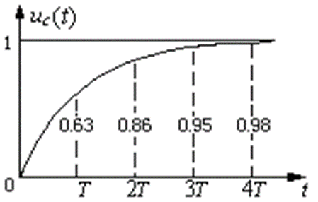
    
    惯性环节最大的特征就是对突变的输入其输出不能立即复现，但输出无振荡。如果输入一个阶跃信号，那么惯性环节的输出表现为ln对数上升
    
3. **积分环节**
    $$
    G(s)=\frac{1}{Ts}
    $$
    输出量正比于输入量积分的环节。其中T表示积分时间常数
    
    当积分环节的输入信号为单位阶跃函数时，则输出为t/T，它随时间线性增长。不难想象，如果输入是一个反褶的单位阶跃函数，t>0后输入从1变为0，也就是输入消失，但输出还是会保持下去，只是不会再增长，因此积分环节具有记忆功能
    
    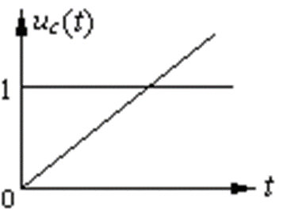
    
    最典型的积分环节就是RL串联电路或者RC并联电路了——当输入消失，电感中的电流仍然会保持，电容两端电压也会保持不变，除非有外部回路供其放电（也就是外接一个惯性环节）
    
4. **理想微分环节**
    $$
    G(s)=Ts
    $$
    理想微分环节的输出量正比于输入量的微分，即
    $$
    c(t)=T \frac{dr(t)}{dt}
    $$
    其中T为微分时间常数
    
    看似很简单对吧？不妨看看惯性环节输入阶跃信号时候的输出——是$\delta(t)$，一个冲激信号
    
    很明显理想微分环节不像积分环节那样是具有实际电路表现（物理可实现）的
    
5. **实际微分环节**
    $$
    G(s)=\frac{T_1 s}{T_2 s +1}
    $$
    我们通过引入一段惯性环节来让微分环节物理可实现。
    
    上式中分子是一个理想微分环节，分母拆开可以发现是一个惯性环节，即
    $$
    G(s)=(T_1 s) \times (\frac{1}{T_2 s +1})
    $$
    为了更好地反映特征，不妨将T1拆开，得到
    $$
    G(s)=T_d s \times \frac{T_\delta}{T_\delta s +1}
    $$
    其中$T_d$就是微分时间常数，$T_\delta$是惯性时间常数
    
    相当于理想微分环节和惯性环节的串联——这样传递函数相乘表示环节串联的方式后面还会遇到很多
    
    这样我们就能得到实际的微分环节
    
    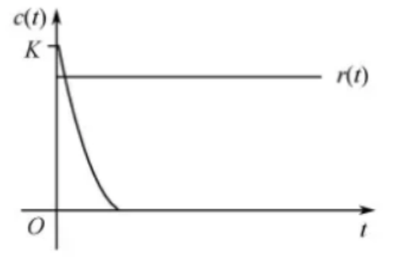
    
    面对阶跃信号，它会输出按指数规律下降的信号，一开始具有比输入更高的输出，后面随着输入信号的稳定而迅速减小。当Td很大而Tδ很小时，微分环节随着输入信号急剧变化，惯性环节具有很短的衰减区间，于是实际微分环节就接近于理想微分环节
    
    从中我们还衍生出了*一阶*和*二阶*微分环节
    
    一阶微分环节$G(s)=\tau s + 1$，本质上是一阶微分方程拉氏变换得到的；与之对应，二阶微分环节$G(s)=\tau^2 s^2 +2\xi \tau s + 1$则是二阶微分方程经过拉氏变换得到的
    
    实际微分环节的输出量基本正比于输入变化的速度，具有输出信号超前于输入信号的相位关系，对应到实际电路中，就是RC串联电路，输入的电压信号会被微分后输出一个电流信号。微分环节还具有**预测输入信号变化趋势**的特点
    
6. **振荡环节**
    $$
    G(s)=\frac{\omega_n^2}{s^2 +2\omega_n \xi s + \omega_n^2}
    $$
    其中$\omega_n$表示**无阻尼自然振荡频率**，$\xi$表示**阻尼比**，有$0<\xi <1$

    对于二阶微分方程
    $$
    T^2 \frac{d^2 c(t)}{dt^2}+2\xi T \frac{dc(t)}{dt}+c(t)=Kr(t)
    $$
    将其进行拉氏变换就可以求得和上面相似的传递函数，不过形式不完全一样
    $$
    G(s)=\frac{1}{T^2 s^2 +2\xi Ts+1}
    $$
    我们把分子分母全部除以T^2，
    $$
    G(s)=\frac{\frac{1}{T^2}}{s^2 + 2 \xi \frac{1}{T} s + \frac{1}{T^2}}
    $$
     再令$\omega_n =\frac{1}{T}$
    
    就得到
    $$
    G(s)=\frac{\omega_n^2}{s^2 +2\omega_n \xi s + \omega_n^2}
    $$
    令人震惊！这个$\omega_n$为什么叫“频率”？T的倒数！
    
    高数告诉我们上面这个微分方程的解具有三角函数（sin/cos）的形式——它会随时间振荡。相信大家都学过电路理论，里面出现了二阶电路，使用三要素法就可以简单求解得到它的输出——随时间振荡的信号。尝试联系一下三者关系。
    
    假设这样一个RLC串联二阶电路：
    
    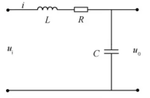
    
    我们不难得到它的动态方程是类似上面二阶微分方程的形式
    $$
    LC \frac{d^2 u_o(t)}{dt^2}+RC\frac{du_o(t)}{dt}+u_o(t)=u_i(t)
    $$
    根据电路理论中的死推导，能求解得到电路的固有频率
    $$
    \omega_n =\sqrt{\frac{1}{LC}}
    $$
    以及电路的阻尼系数
    $$
    \xi =\frac{R}{2}\sqrt{\frac{C}{R}}
    $$
    以电容两端电压为输出，RLC串联电压为输入，我们还能对动态方程拉氏变换得到系统的传递函数
    $$
    \frac{1}{LCs^2 + RCs + 1}
    $$
    我们用拉氏变换方程，很自然地导出了振荡环节的传递函数，而此时我们再用自控原理中的概念对应，不难发现*固有频率和无阻尼自然振荡频率是一个东西*；*阻尼系数和阻尼比也是同一个东西*。
    
    无阻尼自然振荡频率描述了这样一件事：一个理想的振荡环节的输出，如果没有外界影响（无阻尼状态），将会保持振荡，这种振荡的频率即**自然振荡频率**
    
    阻尼比则是衡量振荡环节受到外界影响大小的标志。一个振荡环节能分成四种状态：**无阻尼**，$\xi=0，$也就是系统完全理想，没有任何外界因素干扰输出的振荡，我们用弹簧振子来体现，无阻尼在现实中是不存在的；**欠阻尼**，$0< \xi <1$，这种情况如下图所示，输出会随着输入（阶跃信号）振荡，同时出现超调，随后振幅慢慢减小，趋近于稳定的输入信号，我们为弹簧振子加上一个微弱的阻力，那么其振动情况就是欠阻尼；**临界阻尼**，$\xi =1$，如下图蓝色线所示，这种情况下方程刚好变成惯性环节的形式$G(s)=\frac{\omega_n^2}{(s +\omega_n)^2}$，生活中很难见到这么巧合的情况，但临界阻尼往往是控制设备最理想的情况：没有超调且对突发变化的响应迅速；**过阻尼**，如下图绿色线所示，$\xi > 1$，当我们把RLC串联电路的电阻加到很大时，电容、电感的储能总会被电阻所消耗，这样的情况就是过阻尼，或者说把弹簧振子扔进油里，振子受到很大阻力，会非常缓慢地回到原位，如果阻力够大，甚至振子需要无穷长的时间才能复位
    
    
    
    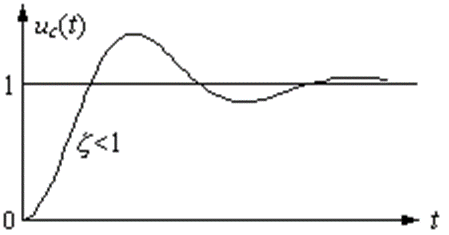
    
    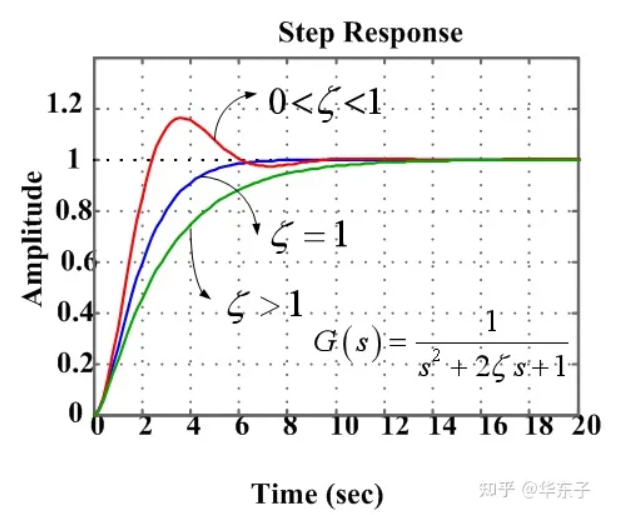
    
    振荡环节是工程中需要应对的最常见环节之一，但它也是最复杂的环节之一
    
7. **延滞环节**
    $$
    G(s)=e^{-\tau s}
    $$
    
    在实际生产中，有很多场合是存在迟延的，比如大型货轮的控制。迟延过大往往会使控制效果不佳，甚至使系统失去稳定
    
    延滞环节表现为输出和输入量一样，但延迟（滞后）一段时间
    
    其传递函数本质上就是拉氏变换的时域延迟特性
    $$
    f(t-\tau) \leftrightarrow F(s)e^{-\tau s}
    $$
    

## 系统控制结构图

求取系统的传递函数时，需要对微分方程组或经拉氏变换后的代数方程组进行消元。如果方程组的中间变量较多，消元比较麻烦。且消元后仅剩下输入与输出两个变量，信号在系统内部的中间传递过程得不到反映。

采用**系统结构图**或信号流图，将更便于求取系统的传递函数，同时还能形象直观地表明输入信号以及各中间变量在系统中的传递过程。因此，结构图和信号流图作为一种数学模型，在控制理论中得到了广泛的应用。 

从一个物理系统中抽象系统结构图可以采用以下三步：

1. 列写系统各部件（子系统）输入-输出的微分方程
2. 对各个部件的微分方程进行拉氏变换得到经典环节
3. 按照各变量的传递顺序连接结构图，将系统输入放在左边，输出放在右边

### 信号流图

由节点和支路组成的信号传递网络称为**信号流图**

信号流图是由节点和支路构成的有向图，在图中用小圆圈*节点*表示变量；每条支路都是定向线段，连接相邻节点，*支路增益*用来表示传递函数。

* 只有输出支路没有输入支路的节点称为输入节点 
* 只有输入支路没有输出支路的节点称为输出节点
* 既有输入支路又有输出支路的节点称为混合节点
* 从某一节点开始沿支路箭头方向经过各相连支路到另一节点所构成的路径称为通路
* 从输入节点开始并终止于输出节点且与其它节点相交不多于一次的通路称为前向通路
* 如果通路的终点就是通路的起点，并且与任何其它节点相交不多于一次的通路称为回路
* 如果一信号流图有多个回路，各回路之间没有任何公共节点，则称为不接触回路

下面的系统结构图

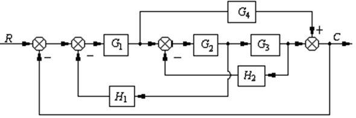

对应信号流图

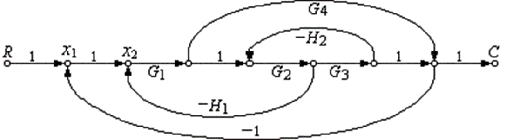

### 梅森公式

使用梅森公式可以求得信号流图的总增益，也就是从输入到输出的等效支路增益，这与系统传递函数等价。也就是说梅森公式可以求得传递函数
$$
P=\frac{\sum_{k=1}^{n}P_k \Delta_k}{\Delta}
$$
$n$表示从输入节点到输出节点所有前向通路的条数

$P_k$表示从输入节点到输出节点第k条前向通路的增益

$\Delta_k$​表示在Δ中，将与第k条前向通路相接触的回路增益除去后所余下的部分，称为*余子式*

其中Δ称为*特征式*
$$
\Delta = 1-\sum L_i +\sum L_i L_j - \sum L_iL_jL_k + \cdots
$$
$\sum L_i$表示所有回路的回路增益之和

$\sum L_i L_j$表示所有两两互不接触回路的回路增益乘积之和

$\sum L_iL_jL_k$表示所有三个互不接触回路的回路增益乘积之和

### 闭环控制系统

一般的闭环控制系统如下图所示：

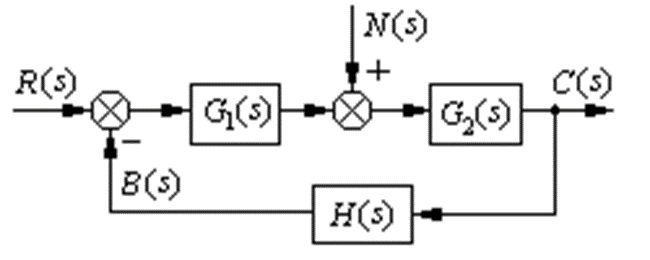

其中N(s)表示扰动信号

控制系统在工作过程中会受到两类外作用信号的影响。一类是有用的输入信号、**给定值**、参考输入等，常用r(t)表示；另一类则是扰动，或称为**干扰**，常用n(t)表示。输入r(t)通常加在系统的输入端，而干扰n(t)一般作用在受控对象上，但也可能出现在其它元部件上，甚至夹杂在输入信号之中

在开环控制系统存在干扰的情况下，输出将与输入出现较大差距，导致系统的控制功能失效。我们**引入闭环控制系统的主要目的就是通过反馈过程来减小干扰对输出的影响**

在上面的图中，若令N(s)=0，我们可以得到

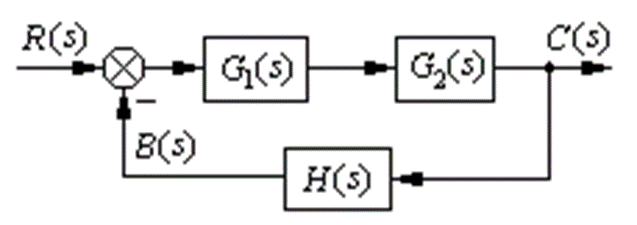

这便是无干扰状态下的闭环控制系统结构框图

有**闭环传递函数**
$$
W(s)=\frac{C(s)}{R(s)}=\frac{G_1(s)G_2(s)}{1+G_1(s)G_2(s)H(s)}
$$
从而得到输出
$$
C(s)=W(s)R(s)=\frac{G_1(s)G_2(s)}{1+G_1(s)G_2(s)H(s)}R(s)
$$
这便是R(s)单独作用下的系统输出

根据叠加定理，我们可以计算N(s)单独作用下系统输出，和R(s)单独作用下的系统输出相加即可得到在N(s)影响下闭环系统的输出

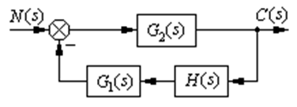
$$
W_n(s)=\frac{C_n(s)}{N(s)}=\frac{G_2(s)}{1+G_1(s)G_2(s)H(s)}
$$
得到输出
$$
C_n(s)=W_n(s)N(s)=\frac{G_2(s)}{1+G_1(s)G_2(s)H(s)}N(s)
$$
相加即可得到总输出
$$
C_{\sum}(s)=\frac{G_1(s)G_2(s)}{1+G_1(s)G_2(s)H(s)}R(s)+\frac{G_2(s)}{1+G_1(s)G_2(s)H(s)}N(s)
$$
这便是在影响下闭环系统

**开环传递函数**：闭环系统在开环状态下的传递函数，即断开系统的主反馈通路，这时前向通路传递函数与反馈通路传递函数的乘积称为闭环系统的开环传递函数
$$
\frac{B(s)}{R(s)}=G_1(s)G_2(s)H(s)
$$

### 控制系统的传递函数

