# 信号与系统与自动控制1.5【线性系统时域分析】

将视角从信号转回LTI，这部分来讲述LTI系统的时域分析方法。正如前面所述，拉氏变换在系统分析中起到了重要的“工具”作用，但与信号分析不同，系统分析过程中使用拉氏变换*简化运算*而不是变换分析域。虽然复频域下系统特征一览无余，但一般来说我们对系统（尤其是控制系统）还是更重视其时域特征。

概论中已经提到过稳定性、动态性能指标、稳态误差这三个指标。下面也将从响应特征（求出响应，动态性能指标也就不言自明了）、稳定性、稳态误差三个主要方面介绍LTI系统的时域分析方法——实际上这三个主要方面就是经典控制中时域分析的全部了，其他技巧也不过是在用更方便的手段分析更复杂的系统，万变不离其宗：“瞬态响应”、“系统稳定性”、“稳态误差分析”

## 瞬态响应与常用标准激励

系统的输出从输入信号r(t)作用时刻起，到稳定状态为止随时间变化的过程称为系统的**瞬态响应**。在信号与系统领域，我们常将系统瞬态响应产生的信号称为**受迫响应**

**控制系统的瞬态响应与输入信号具有相同的形式**

> 在自控原理内容中我们主要关注与输入信号有关且反映系统动态特征的瞬态响应，因为实际工程中很少存在稳态激励，激励总是会变化，稳态响应几乎不出现，也就无需关注

为了描述一个系统的瞬态响应特性，我们往往会选择一些具有代表性的激励作为输入信号，观察系统的输出，以此反映系统特性。常用的信号包括

* **阶跃信号**

    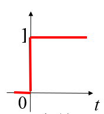

    即单位阶跃函数$\epsilon(t)$，用于描述指令突然转换、合闸、负荷突变等 

    对应拉氏变换$R(s)=\frac{1}{s}$

* **单边脉冲信号**

    相当于$\epsilon(t)-\epsilon(t-t_0)$，也就是窗函数

    常用于描述持续一段时间的激励（其实很少用到，因为根据叠加原理用阶跃响应的线性组合就能够表达窗函数激励的响应）

* **冲激信号**

    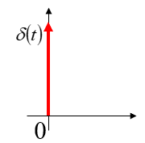

    单位冲激函数$\delta(t)$，用于描述瞬间的冲击作用

    对应拉氏变换$R(s)=1$

* **斜坡信号**

    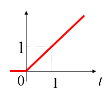

    即$r(t)=At$，对应拉氏变换$R(s)=\frac{1}{s^2}$

    用于描述激励随时间线性变化（增加）

* **抛物线信号**

    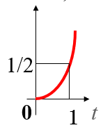

    一般为$r(t)=At$形式，对应拉氏变换$R(s)=\frac{1}{s^3}$

    用于描述机动的指令输入信号

* **正弦信号**

    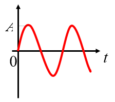

    信号描述为$Asin\omega t$

    常用于频域分析，输入传递函数再从频域变换回时域从而反映系统的某些特征。其拉氏变换对应$R(s)=\frac{A\omega}{s^2 + \omega^2}$

观察上面的冲激信号、阶跃信号、斜坡信号、抛物线信号，我们会发现它们的拉氏变换很有规律

| 信号       | 函数表示         | 拉氏变换        |
| ---------- | ---------------- | --------------- |
| 冲激信号   | $\delta(t)$      | $1$             |
| 阶跃信号   | $\epsilon(t)$    | $\frac{1}{s}$   |
| 斜坡信号   | $t\epsilon(t)$   | $\frac{1}{s^2}$ |
| 抛物线信号 | $t^2\epsilon(t)$ | $\frac{1}{s^3}$ |

发现存在
$$
\delta(t)=\frac{d}{dt}\epsilon(t)=\frac{d^2}{dt^2}t=\frac{d^3}{dt^3}t^2
$$
**单位斜坡激励和单位抛物线激励是单位阶跃激励对时间的一重和二重积分；单位阶跃激励可以由单位斜坡激励和单位抛物线激励对时间的一阶导数和二阶导数求得；单位脉冲激励是单位阶跃激励对时间的一阶导数**

> 看不明白上面这段文字？它就是在叙述上面的公式(= - =)

我们在之前的信号分析中提到过，LTI系统有两个重要性质——**线性**（齐次性、可加性（叠加性））和**时不变性**（积分特性）。初始条件不变（或者说零初始条件下），系统的输出是线性的，且随输入的微分、积分变化而进行微分、积分变化

> 这段内容在《信号与系统与自动控制0【概论】》提到过

于是，我们会发现存在**单位斜坡响应和单位抛物线响应是单位阶跃响应对时间的一重和二重积分；单位阶跃响应可以由单位斜坡响应和单位抛物线响应对时间的一阶导数和二阶导数求得；单位脉冲响应是单位阶跃响应对时间的一阶导数**

这段话是把上面黑体复制粘贴过来以后再将“激励”替换成“响应”得到的（笑）

说人话就是上面那段公式不仅适用于激励信号，也适用于系统响应！这意味着**只要知道系统对某一种典型信号的响应，对其它典型信号的响应也可推知**

在后面，我们只介绍系统阶跃响应特性。在各种考试中，最常出现的并不仅仅是阶跃响应，还有冲激响应、斜坡响应、抛物线响应。怎么从阶跃响应推广到后面这些，甚至是它们的线性组合？求导、积分就行了！按照上面的公式，先求出系统的阶跃响应，然后积分一次就能得到斜坡响应，积分两次就得到抛物线响应，微分一次就能得到冲激响应，把几个响应乘系数加减就能得到线性组合，岂不美哉。

## 系统的阶跃响应特性

在正式介绍系统阶跃响应之前，我们还需要说明一下系统动态性能指标分析中常用的物理量（前提是时域下的性能指标）。

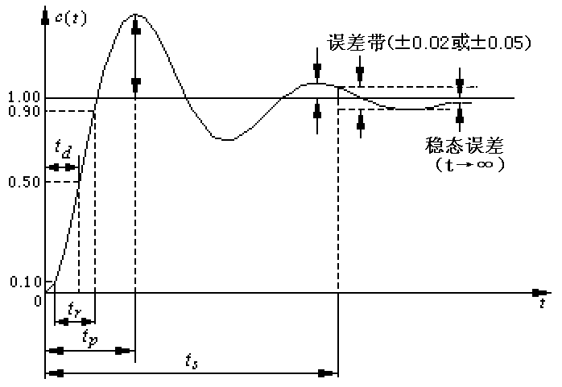

* **上升时间**（Rise Time）$t_r$

    响应曲线从稳态值的10%上升到90%所需的时间

* **峰值时间**（Peak Time）$t_p$

    响应曲线到达第一个峰值所需的时间

* **调整时间**（Settling Time）$t_s$

    > 笔者最早以为调整时间的英文是Switch Time，实际上是Settling Time，或者称之为“整完时间”——系统从跟随激励开始变化到整完活（Settle）的时间

    响应曲线从零开始到进入并保持在稳态值的±95%到±105%（或±98%到±102%）误差带时所需要的最短时间。

* **超调量**（Overshoot）$\sigma_p$

    响应曲线偏离稳态值的最大值，常以百分比表示

    定义式$\sigma_p = \frac{c(t_p)-c_{\infin}}{c(\infin)}$

* 延滞时间（Delay Time）$t_d$

    响应曲线第一次到达稳态值50%所需的时间。相对不怎么常用

* 震荡次数（Oscillation）

    在调整时间内，被调节量偏离稳态值进行振荡的次数。相对不怎么常用

* 衰减比（Decay Ratio）$\frac{\sigma_p}{\sigma_p '}$

    第一个峰值与第二个峰值之比。相对不怎么常用

再放一下之前的图片，读者可以对应上面文字再加深一下印象

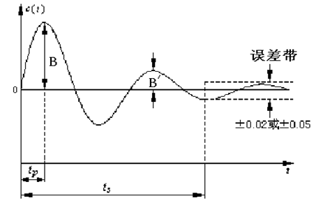

了解完这些常识，让我们来做一些简单的练习罢（雾）

让我们正式来到简单的一阶系统

### 一阶系统的阶跃响应

这便是一阶系统的最简表示

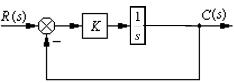

可用一阶微分方程描述其动态过程的系统，称为**一阶系统** 

注意：**这里和下面所说的系统都是闭环控制系统**

从上图中可以化简出闭环传递函数
$$
G(s)=\frac{1}{Ts+1}
$$
其中$T=\frac{1}{K}$称为一阶系统的**时间常数**

将单位阶跃响应$\epsilon(t)$或者其拉氏变换$\frac{1}{s}$输入系统，得到**一阶系统的单位阶跃响应**曲线
$$
c(t)=1-e^{-\frac{1}{T}t}
$$
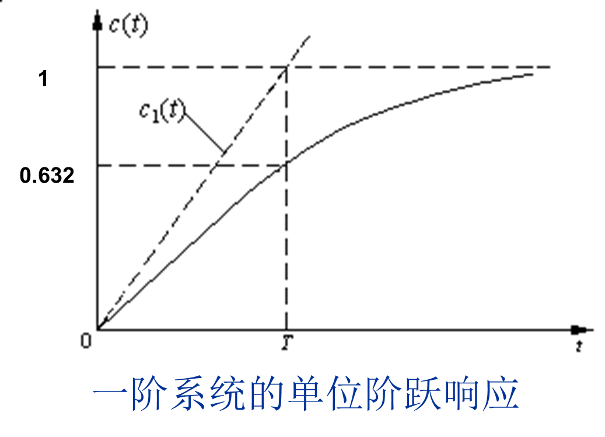

从图像中我们可以看出系统输出值与时间常数的对应关系，从而给出T的另一个定义：系统响应达到稳态值的63.2%所需要的时间 

对其微分即可得到**一阶系统的单位脉冲响应**
$$
c(t)=[\frac{1}{T}e^{-\frac{1}{T}t}]\epsilon(t)
$$
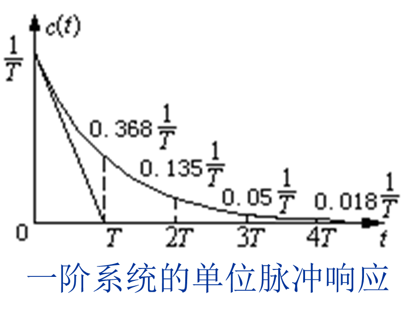

积分可以得到**单位斜坡响应**
$$
c(t)=[(t-T)+Te^{-\frac{1}{T}t}]\epsilon(t)
$$
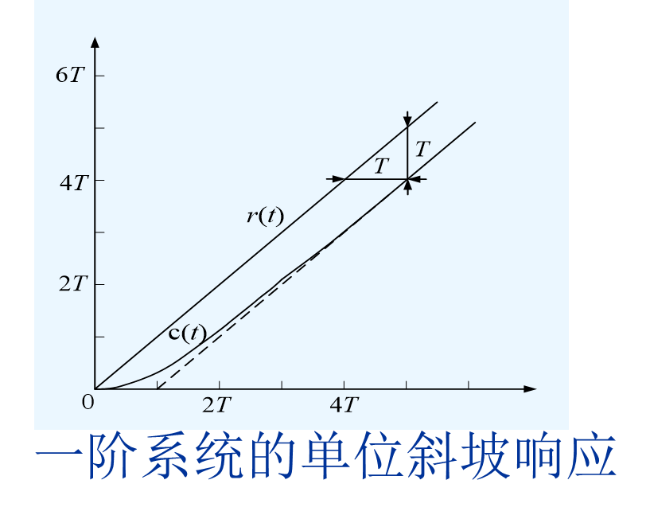

一阶系统的响应曲线简单到令人发指（？），以至于我们不需要关注它的瞬态响应关键参数——遇到问题，闭着眼求出响应曲线，问题就迎刃而解。那么实际应工程中一阶系统有什么用呢？我们常常见到的RC滤波电路就是个经典的一阶系统，它能够实现低通或者高通滤波器，这是因为它能够让处于目标频率的信号指数衰减。但除此之外，一阶系统是不能较好实现控制的。

这要从一阶系统的稳态误差说起。稳态误差的概念后面还会详细讲述，读者只要先按照概论的说明理解即可。首先观察单位阶跃和脉冲响应——当然不存在稳态误差。**时间常数T越大，响应曲线变化得越慢**，但不论T取何值，响应的终值均为1或0。再看上面的斜坡响应：一阶系统在跟踪单位斜坡信号时，存在位置误差，并且位置误差的大小随时间增大，最后趋于时间常数T。减小T就可以提高系统响应速度并减小系统对斜坡输入的稳态误差，似乎很合理，但T可是K的倒数，K是系统增益。我们在运放部分学到过运放的K很大，但实际的运放也不过有10^5量级的增益，系统的稳态误差不可能达到零。这就会让高精度高复杂度的控制系统崩溃。

这还只是输入信号变化缓慢的情况，如果遇到复杂的信号（比如一个十几次多项式才能拟合出来的复杂函数），那一阶系统提供的控制能力根本不值一提。

我们可以选择提高控制系统的阶数，来到二阶系统

### 二阶系统的阶跃响应

在分析和设计自动控制系统时，常常把二阶系统的响应特性视为一种基准，因为二阶系统是很多高阶控制系统的基础。

典型的二阶系统结构如下所示

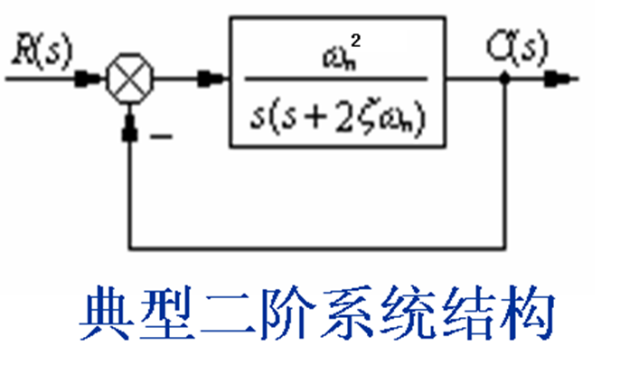

不难得到其闭环传递函数
$$
G(s)=\frac{\omega_n^2}{s^2+2\xi \omega_n s+\omega_n^2}
$$
其中$\xi$称为阻尼比，$\omega_n$称为无阻尼自然振荡频率

有点熟悉？这不就是前面讲过的*振荡环节*嘛！有忘记的读者可以先翻回去自行查看，这里不再赘述。

我们根据特征方程得到特征根，发现阻尼比决定了特征根的性质，从而影响系统的响应特性，这对单位阶跃响应是一样的。下面按照阻尼比的不同来分别列举系统响应曲线

| 阻尼比     | 分类     | 二阶系统单位阶跃响应曲线                                     | 稳态误差 |
| ---------- | -------- | ------------------------------------------------------------ | -------- |
| $0<\xi <1$ | 欠阻尼   | $c(t)=1-\frac{1}{\sqrt{1-\xi^2}}e^{-\xi \omega_n t}sin(\omega_n\sqrt{1-\xi^2} t+arctan(\frac{\sqrt{1-\xi^2}}{\xi}))$ | 0        |
| $\xi =0$   | 无阻尼   | $c(t)=1-cos\omega_n t$                                       | -        |
| $\xi = 1$  | 临界阻尼 | $c(t)=1-e^{-\omega_n t}(1+\omega_n t)$                       | 0        |
| $ \xi >1$  | 过阻尼   | $c(t)=1-\frac{1}{2\sqrt{\xi^2 - 1}}(\frac{e^{-(\xi -\sqrt{\xi^2 - 1})\omega_n t}}{\xi - \sqrt{\xi^2 - 1}} - \frac{e^{-(\xi + \sqrt{\xi^2 - 1})\omega_n t}}{\xi + \sqrt{\xi^2 - 1}})$ | 0        |

欠阻尼图像如下（左半平面共轭极点，收敛振荡）

需要注意：有阻尼振荡频率$\omega_d$在图像中表示$\omega_n$在虚轴的投影；阻尼角$\phi$在图像中表示极点的相角

> 这两个概念在之前都没有进行系统阐述，读者只需要了解大致概念即可。在后面的信号与系统复频域分析部分，将会详细说明这两个概念的物理含义

无阻尼图像如下（虚轴共轭极点，等幅振荡）

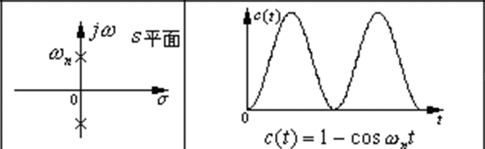

临界阻尼图像如下（单一负实轴极点，无超调也无振荡，类似一阶系统的响应）

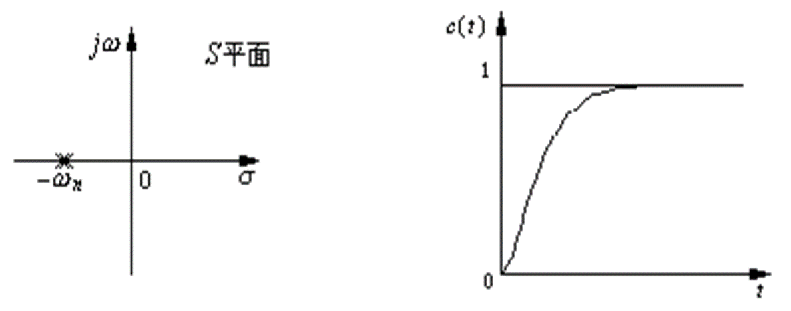

过阻尼图像如下（两个负实轴极点，无超调，但需要经过比$\xi = 1$时（临界阻尼）更长的时间才能达到稳态）

观察上面四种形式，我们会发现实际系统中常常使用欠阻尼状态的二阶系统，因为它通过调节能够获得更快的响应速度、更低的超调量和更小的稳态误差

下表给出了**欠阻尼二阶系统在阶跃响应中的关键性能指标**

| 性能指标         | 表达式                           | 完整表达式                                                  |
| ---------------- | -------------------------------- | ----------------------------------------------------------- |
| 上升时间         | $\frac{\pi - \phi}{\omega_d}$    | $t_r=\frac{1}{\omega_d}arctan(-\frac{\sqrt{1-\xi^2}}{\xi})$ |
| 峰值时间         | $\frac{\pi}{\omega_d}$           | $t_p=\frac{\pi}{\omega_n \sqrt{1-\xi^2}}$                   |
| 调节时间（近似） | 3T（95%到105%）或4T（98%到102%） | $t_s=\frac{3}{\xi \omega_n}$或$t_s=\frac{4}{\xi \omega_n}$  |
| 超调量           | -                                | $\sigma_p=e^{-\frac{\xi \pi}{\sqrt{1-\xi^2}}} \times 100\%$ |

其中，*有阻尼振荡频率*
$$
\omega_d=\omega_n \sqrt{1-\xi^2}
$$
表示加入阻尼比修正之后的振荡频率

*阻尼角*
$$
\phi = arctan(\frac{\sqrt{1- \xi^2}}{\xi})
$$
分析表达式，我们要用更数学的角度解读Tr、Tp概念：上升时间是在峰值时间的基础上得到的。可以联想到$T=\frac{2\pi}{\omega}$这个经典的角频率-周期公式，峰值时间可以看成用$\frac{T_d}{2}=\frac{\pi}{\omega_d}$得到的——即有阻尼振荡周期$T_d$的一半。我们回看欠阻尼状态二阶系统的图像，会发现万变不离其宗，这还是一个有指数衰减三角函数形式的函数，完成一次振荡的时间就可以近似看出“有阻尼振荡周期”，其一半（受到指数衰减的影响）也就差不多是从开始到峰值的时间。

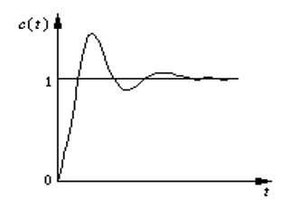

上升时间则是用$\frac{\pi - \phi}{\omega_d}$得到。我们回看复平面的特征根分布如下

$\pi - \phi$得到的正是极点辐角，我们可以理解成上升时间是在峰值时间中减去阻尼角对应延迟所得到的时间。阻尼角会令信号产生延迟也与上面时域图像受到阻尼影响，三角函数振荡呈指数衰减的概念不谋而合。

至于调节时间就比较玄学了：经过计算得到的$t_s$随$\xi$变化曲线是不连续且无规律可循的，$\xi$的微小变化就可能引起$t_s$突变，于是我们只能用近似的方法总结出上面的表达式

对于单位冲激激励，我们只需要对上面的阶跃响应求导就可以得到对应状态的单位冲激响应

列举如下

| 分类     | 单位冲激响应                                                 |
| -------- | ------------------------------------------------------------ |
| 欠阻尼   | $c(t)=\frac{\omega_n}{\sqrt{1-\xi^2}}e^{-\xi \omega_n t} sin(\sqrt{1-\xi^2} \omega_n t)$ |
| 临界阻尼 | $c(t)=\omega_n^2 t e^{-\omega_n t}$                          |
| 过阻尼   | $c(t)=\frac{\omega_n}{2\sqrt{\xi^2 - 1}}[e^{-(\xi - \sqrt{\xi^2 - 1})\omega_n t}-e^{-(\xi + \sqrt{\xi^2 - 1})\omega_n t}]$ |

对于斜坡响应，积分即可，这里不再赘述

### 高阶系统的阶跃响应

对于高阶系统，我们往往采用零极图分析。可以发现高阶系统中瞬态响应各个分量的衰减速度由系统零极点决定。对于**系数很小**（影响很小）的分量和**远离虚轴衰减很快**的分量常常可以忽略，因而**高阶系统的性能就可用低阶系统来近似估计** 

假如高阶系统中距离虚轴最近（分量衰减最慢）的极点，其实数部分为其它极点的$\frac{1}{5}$或更小且附近没有零点，则可认为系统的响应主要由该极点（或其共轭复数极点）决定。这种对系统瞬态响应起主要作用的极点称为系统的**主导极点**。可以采用主导极点代替系统的全部闭环极点来估算系统性能指标

如果一个高阶系统包含有零点，且该零点位于主导极点附近，则会对系统的瞬态响应产生影响。系统的阶跃响应中包含有标准二阶系统的阶跃响应及该响应的导数，导数项的大小与零点成反比，也就是零点距离虚轴越远，附加零点的影响就越小。可以通过**零极相消**的方法，将相互靠近的零点和极点相抵消，从而实现降阶

## 稳定性分析

系统在受到外作用力后，偏离了正常工作点，而当外作用力消失后，系统能够返回到原来的工作点，则称系统**稳定**

在有界输入的作用下，其输出响应也是有界的，这叫做有界输入有界输出稳定，简称为**BIBO**（Bounded-Input Bounded-Output）**稳定**

### 零极点的性质

### 劳斯判据

## 稳态误差

系统的稳态误差定义为
$$
e_{ss}(\infin)=\lim_{t \rightarrow \infin} e(t)=\lim_{t \rightarrow \infin}[r(t)-c(t)]=r(\infin)-c(\infin)
$$
系统的稳态误差，顾名思义是指系统在稳定状态的误差，稳定状态即时间趋于无穷时刻，误差e(t)则是指响应r(t)和激励c(t)之间的差值

