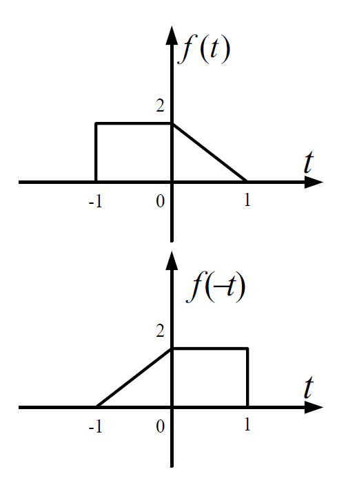
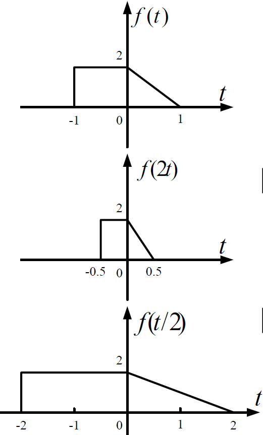

# 信号与系统与自动控制1【连续信号时域分析】

在前面的内容中，我们已经完成了对信号、系统基础概念的介绍。信号的分析主要是借助时域的微分方程和频域的傅里叶变换实现，而系统分析更多借助复频域的拉普拉斯变换实现。后面会分别从频域分析、时域分析、复频域分析、离散分析四种角度详细描述连续、离散信号和系统的分析方法。整数章节重点介绍信号分析方法；小数章节重点介绍系统分析方法

## 高数微分方程部分回顾

时域分析部分开始之前，我们先来回顾一下高数中微分方程的部分知识。

## 时域分析法

对于连续线性时不变（LTI）信号与系统，我们最简单的分析方法就是从**时域**角度分析，也就是直接观察信号的函数值（信号是关于时间的函数）或通过系统的时间信号输入-输出来完成分析

> 这便是归纳法的一个体现

时域分析中要充分利用LTI系统的线性和时不变性两大特性，将激励信号分解为不同单元信号加权和的形式，这样就能大大简化分析流程

> 时域、频域、复频域三套分析方式都是相同的，总的来说都是要利用LTI系统特性，不断拆分激励为便于求解的形式，对应求出其各自的响应，最后把响应加在一起得到系统的响应

### 信号的时域运算

时域中，信号可以进行线性运算，即信号之间进行**加**法或**乘**法（也可以信号与增益值之间进行乘法），按照**坐标原点对齐，对应时刻信号值相加或相乘**的规则进行运算
$$
f_{sum}(t)=f_1(t)+f_2(t),f_{mul}(t)=f_1(t)\cdot f_2(t),f_{gain}(t)=kf(t)
$$
信号一般还可以进行**时移**、**反褶**和**尺度变换**运算
$$
f(t)\rightarrow f(t-t_0)
$$
当t0<0时，信号图像左移；当t0>0时，信号图像右移，这和函数平移运算一致

信号的反褶运算对应函数自变量取反，函数图像关于x轴对称
$$
f(t)\rightarrow f(-t)
$$

尺度变换即将信号进行缩放
$$
f(t)\rightarrow f(at)
$$
当$\abs{a}>1$时，信号被在x轴方向上压缩；当$\abs{a}<1$时，信号被在x轴方向上展宽，对应结果如下图所示

在对信号进行变换过程中，需要注意几个操作的先后顺序，要按照目标信号的形式对现有信号进行合理变换

## 全响应=零状态响应+零输入响应

在前面《信号与系统与自动控制0.5【信号和系统的基本描述】》中，我们提到过全响应的概念，这里我们从更加数学（贴近信号分析）的角度解读。一个LTI系统的响应也被称为**全响应**，记为$r(t)$

在时域分析中，我们的主要任务就是通过**已知激励求得全响应**，或**已知响应求出激励**

### 零输入响应

**零输入响应**（Zero Input Response）：外加激励为0时，仅由初始状态**单独作用**所产生的响应，记为$r_{zi}$

**零输入响应不会随激励变化而变化**，它只会随**系统**初始状态而变化。如果用数学一点的语言描述，那就是零输入响应描述系统微分方程的边界条件（一般是第一类边界条件）。**若系统的初始条件发生变化，零输入响应会随之发生相同的变化**

### 零状态响应

**零状态响应**（Zero State Response）：初始状态为0时，仅由外加激励**单独作用**所产生的响应，记为$r_{zs}$

**零状态响应与系统的初始状态无关**，只与当前激励有关。因此如果激励发生了变化，零状态响应一定会发生相对应的变化。比如有$e(t)\rightarrow e(2t-3)$，那么一定存在$r_{zs}(t)\rightarrow r_{zs}(2t+3)$

### 全响应=零状态响应+零输入响应

我们可以很简单地用LTI系统的线性特性得到
$$
r(t)=r_{zs}(t)+r_{zi}(t)
$$

> 这里还要强调：系统不是函数，它更像是函数的算子。系统的输入和输出信号是时间的函数，系统在这个过程中只起到了变换的作用。LTI系统是不会随输入信号而变化的，求全响应不是简单的解函数！

## 阶跃和冲激

### 单位阶跃函数

### 单位冲激函数

## 卷积积分

### 卷积积分

