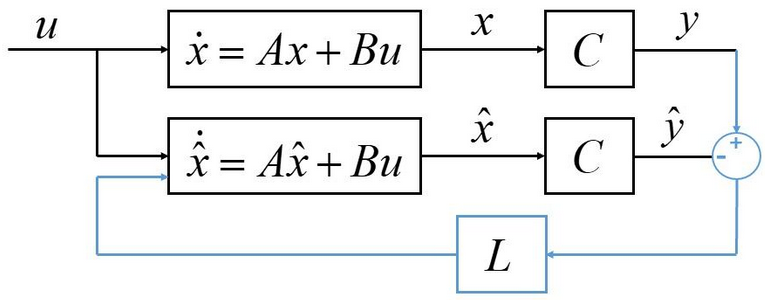
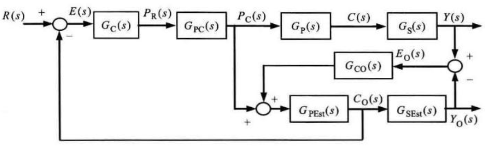
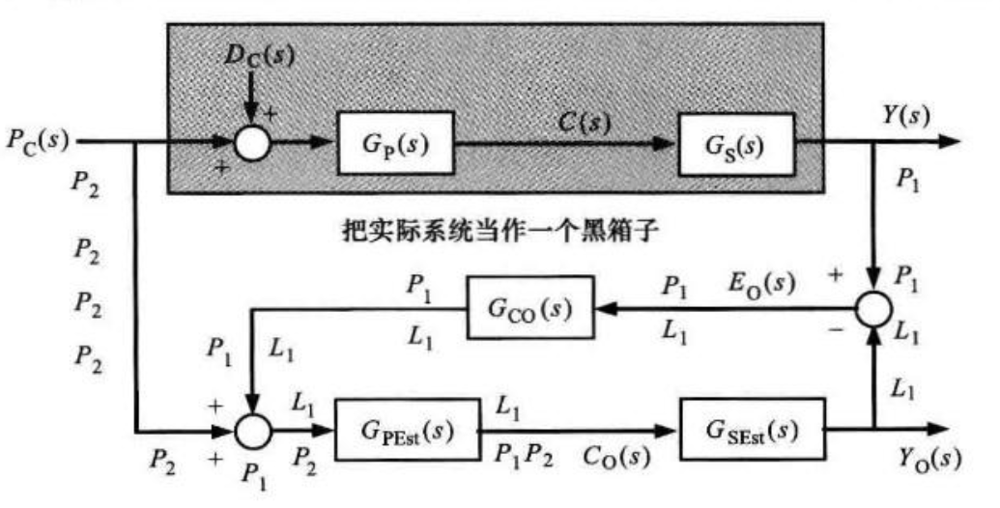
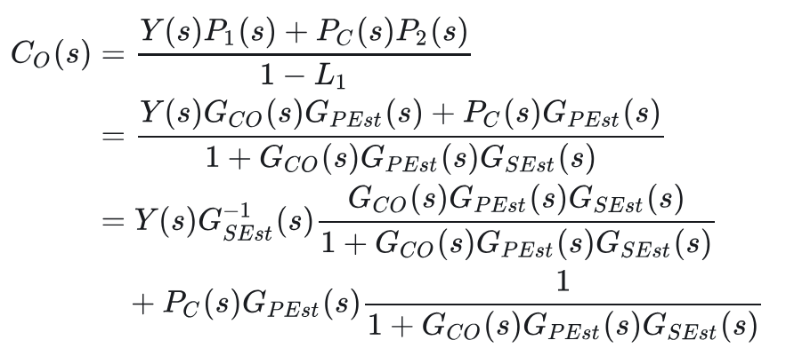
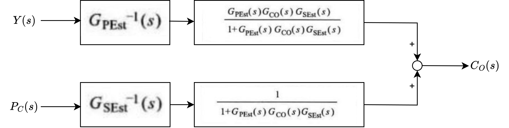

# 信号与系统与自动控制9【卡尔曼滤波】

## 观测器

控制理论中的反馈需要依赖传感器实现，在理论中传感器给出的反馈信号是近乎完美的，但物理世界中的传感器给出的反馈信号带有大量噪声：部分信号无法测量、有的信号会引入测量误差。为了解决该问题，我们需要引入**观测器**来补充或者取代控制系统中的传感器。

所谓观测器并不是一种具体的器件，而是一种根据系统的输入输出来估计系统的状态的算法。在有些情况下，观测器可以用来提高系统性能，减少采样延迟。但观测器技术不是万能的，它增加了系统的复杂性，并且需要更多计算资源；此外同实际传感器相比，观测器的鲁棒性往往更差。但观测器比物理传感器具有一个重要优势：能够实现获取状态变量的反馈。

**状态反馈**是现代控制理论引入的反馈控制方式。最简单的状态反馈就是将系统的状态变量通过比例环节送到输入端，得到系统状态变量的误差。由于状态变量能全面反映系统的内部特性，因此相较于输出反馈，我们更希望采用状态反馈来改善系统的性能。状态反馈需要知道真实的系统状态，但在实际情况中常常因状态不可测量、测量成本高等原因，无法直接获取状态变量。这就需要利用输入、输出等已知信息设计状态观测器来对状态变量进行估计。

> 举例来说，在惯性导航任务中，我们希望得到准确的物体运动速度，这样就可以通过速度-时间积分得到物体位移。但对于某些场景（比如空中和水中），速度反馈信息是难以被测量的，这时候就只能通过陀螺仪来获得加速度信息，再通过加速度-时间积分得到速度。在这样的过程中，我们就希望引入一个观测器，直接预测得到物体速度信息

考虑LTI系统
$$
\dot{x}=Ax+Bu, y=Cx
$$
推导出 $x(t)$ 的条件是知道边界条件 $x(t_0)=X$ 且已知所有输入u。输入u是控制器指定的，因此根据上式，我们就需要先根据 $y$ 求 $x(t_0)$

在C矩阵比较复杂的情况下，只得到准确的 $y(t_0)$ 并不能准确计算出 $x(t_0)$。但基于大量输出 $y(t_0 + m), m=0,1,2,...$，就可以得到
$$
y(t_0 + m)-CBu(t_0)=C*Ax(t_0)
$$
通过该式就可以推断出 $x(t_0)$ 的分布规律。

上述公式说明了构建观测器的基本思想和原理：如果得到被控系统的初值，那就可以直接构建一个模拟系统，并让这个模拟系统的初值等于原系统，在理想情况下两系统的差值就为零，模拟系统非常完美地复现了被控系统的一切输出。针对可能存在的误差，就利用真实被控系统输出 $y(t_0 +m)$ 进行误差反馈校正来构造闭环的模拟系统，在足够多历史数据的支持下，最终可以准确观测到系统真实状态 $x(t_0)$。这里的“模拟系统”指的就是观测器。

下面给出较严谨的推导过程。依旧以上述LTI系统的状态空间方程为例，假设A、B、C矩阵已知，那么系统的估计模型可以被描述为
$$
\dot{\hat{x}}=A\hat{x}+Bu, \hat{y}=C\hat{x}
$$
该模型被称为**开环观测器**。显而易见，该式把根据 $y$ 求 $x(t_0)$ 的过程描述为状态空间方程形式。我们分析这个系统的估计模型和实际系统的状态变量之差如下
$$
\dot{\widetilde{x}} =\dot{x}-\dot{\hat{x}}=Ax+Bu-(A\hat{x}+Bu))=A\widetilde{x}
$$
整理后，得到
$$
\dot{\widetilde{x}} =e^{A(t-t_0)}[x(t_0)-\hat{x}(t_0)]
$$
限制误差的最关键因素就在于系统矩阵A：如果A的特征值实部都小于0，那这个差值就会逐渐衰减最终会趋于0。在不考虑干扰的理想情况下，若已知边界条件 $\hat{x}(t_0)=x(t_0)$，该式可以准确根据输入 $u$ 得到系统真实状态和输出。但物理世界中 $x(t_0)$ 的分布规律未知且不可获得，因此使用开环观测器将导致估计误差随时间增长而累积增大。

> 可以发现矩阵A取决于原被控系统，原系统的特征值关系到我们构建的模拟系统的效果。如果矩阵A渐进稳定，观测器的工作效果（模拟被控系统的效果）就很好，但矩阵A由系统内部决定，**当系统矩阵A不稳定时，状态观测量将无法有效跟踪实际状态量**。这便是实际系统中的开环观测器核心问题的来源。

但我们知道，为控制器添加闭环反馈就可以进行系统的极点配置，从而使得不可控的被控系统受控——作为模拟系统的观测器也能够采用类似的方案，在开环观测器中引入反馈，也可以改造系统矩阵A，实现对实际状态的观测，这就构造了**闭环观测器**。因此在开环观测器的基础上加入误差反馈校正环节 $L(y-\hat{y})$，得到
$$
\dot{\hat{x}}=A\hat{x}+Bu+L(y-\hat{y})=A\hat{x}+Bu+L(y-C\hat{x})
$$
整理后得到
$$
\dot{\hat{x}}=(A-LC)\hat{x}+Bu+Ly
$$
上式即为最基本的**龙伯格观测器**，其中L被称为**龙伯格增益矩阵**。

带有龙伯格观测器的被控系统如下图所示。可以发现这个控制系统中上半部分是典型的LTI系统，下半部分则是观测器。看起来观测器实际上就是在通过L矩阵模拟系统本身的特性（即状态变量）。

### 龙伯格观测器

**龙伯格观测器**（Luenberger Observer）是一种常用的状态观测器，适合于LTI动态系统的状态估计。它能够根据系统模型和实际输出估计系统的状态，从而实现对系统内部不能直接测量状态的观测。

对于线性化后的低阶系统，龙伯格观测器能够以很高的计算效率实现高精度的状态观测，具有**实现简单、实时性好**的优势；但它也仅适用于线性系统或近似线性系统，**对高度非线性的模型精度不高**，并且对系统模型精度的依赖较大，**缺乏鲁棒性**。下面展开说明。

设观测器估计误差为 $\widetilde{x}=x-\hat{x}$，存在
$$
\dot{\widetilde{x}}=\dot{x}-\dot{\hat{x}}=Ax+Bu-(A-LC)\hat{x}-Bu-Ly
$$
整理后得到
$$
\dot{\widetilde{x}}=(A-LC)\widetilde{x}
$$
我们希望 $\dot{\widetilde{x}}$ 越小越好，最好能为零。这个目标下，理论上只需要选择合适的增益矩阵L，使得A-LC的所有特征值均具有负实部即可令观测误差逐渐趋于0。在该条件下，观测器最终可以准确观测到系统状态。然而这样的条件还是非常苛刻，它主要受到两方面制约：系统可观测性和系统非线性。

**系统可观测性**是指可以根据系统的输入和测量输出得到系统的真实状态。上述例子中，系统是可观测的，因此可以利用输入输出设计合适的观测器，最终估计到真实系统状态。而一个可观测的系统定义如下：对于线性定常系统，存在一有限的观测时间 $t_1 > t_0$，使根据 $[t_0,t_1]$ 期间的输出 $y(t)$，能唯一确定系统在 $t_0$ 时刻的状态 $x(t_0)$。并不是所有系统都是可观测的，只有可观测的系统才能够针对性设计观测器。

非线性是制约观测器应用的重要条件：上述全部推导均在LTI系统下做出，而实际系统并不是LTI的，甚至可能是非线性时变的，那么龙伯格观测器的效果就会变得很差。

此外，龙伯格观测器的估计误差方程的解符合指数收敛形式
$$
\dot{\widetilde{x}} =e^{A-LC}(x-\hat{x})
$$
尽管时间趋于无穷时，估计误差会无限接近0，但始终不会等于0。所以龙伯格观测器是渐近地估计系统的状态，观测器系统的收敛时间不受控制。这在很多高实时系统中是不可接受的

### 分离原理

在考虑龙伯格观测器的改进前，先介绍控制理论中的分离原理，即**观测器和控制器可以独立设计**。先设计状态观测器来估计系统状态，再将估计到的状态反馈给控制器，二者参数设计互不影响。

以龙伯格观测器为例，带有观测器的控制系统可以被描述为下图的形式

其中 $G_{P}$ 代表被控对象，$G_{S}$ 代表传感器环节，$P_{C}$ 代表控制量（即u）

这里 $G_{PEst}$ 是被控对象的估计值，$G_{SEst}$ 是传感器的估计值， $G_{CO}$ 是观测器补偿项（可以等效为上面所说的龙伯格增益环节）。这里系统使用龙伯格观测器基于传感器输入计算得到的系统估计值（本质上是估计得到的系统状态量）作为反馈值

基于上图描述的控制系统，控制器可以与观测器相互分离。该思想在后续的其他观测器中也被保留下来。

### 龙伯格观测器的滤波器形式

继续考虑滤波器（Filter）和观测器（Observer）之间的关系。

数学表达上，滤波器和观测器都需要一个微分方程（连续）或差分方程（离散）描述的动态系统，系统在上一时刻的参数值可以通过这个方程递推到下一时刻。同时，二者需要对系统状态的直接测量来减小误差（误差可以是初始误差，也可以是动态系统噪声带来的误差）。

但作为二者核心区别的特征在于：观测器的理论基础不考虑随机噪声，它的目标是让误差（实际系统状态变量和观测器预测状态变量之差）为0，即**观测器一定是收敛的**（Convergent）——理论上观测器可以让系统状态的估计值从错误的初始值收敛到正确的零误差值。但滤波器建立在随机噪声建模基础上，它的目的是追求另一种意义上的最优，一般定义为**误差的最小期望**。

> 很遗憾的是，滤波器所期望的最优一般是达不到的，也就是所谓的“不存在最优滤波器”
>
> 特别地，线性系统高斯噪声条件下，我们可以通过卡尔曼滤波实现最优

如果滤波器是最优的，并且初始误差的不确定度和噪声强度完全已知，那滤波器的精度一定优于观测器；但实际应用中系统往往是非线性的、噪声是非高斯的，这就导致滤波器并非最优。雪上加霜的是初始误差的不确定度、噪声强度也都未知，在极端情况下滤波器很有可能出现误差发散，始终收敛的观测器则能很好地处理这一点。

观测器和滤波器之间存在着微妙的差别，但它们的数学表达非常相似，我们正可以利用这一点，将观测器改编成滤波器的形式，这样就可以使用递推公式将观测器整合到控制系统内部。

上图是去除了控制器环节的龙伯格观测器结构。黑框内的部分是实际系统，包含了实际系统传递函数 $G_P$ 和传感器环节传递函数 $G_S$。

考虑从系统传感器输出 $Y(s)$、控制器输入 $P_C(s)$ 到观测器输出 $C_O(s)$ 的传递函数。采用Mason法得到

观察整理后的两项，分别包含

* 传感器相关项 $Y(s)G^{-1}_{SEst} \frac{G_{CO} G_{PEst} G_{SEst}}{1+G_{CO} G_{PEst} G_{SEst}}$
* 控制量相关项 $P_C G_{PEst} \frac{1}{1+G_{CO} G_{PEst} G_{SEst}}$

这就足够将龙伯格观测器改写成输入传感器 $Y(s)$ 和控制器 $P_C(s)$，输出系统状态预测量 $C_O(s)$ 的滤波器了，如下图所示

上半个分支只在 $Y(s)$ 基础上估计 $C(s)$；下半个分支只在 $P_C(s)$ 基础上估计 $C(s)$，整个观测器的形式变得明了：分别利用传感器、被控系统和控制器的传递函数，使用历史观测量对系统状态进行估计，最终模拟出与被控系统相同的输出

### 降维观测器

龙伯格观测器所代表的观测器流派属于全维状态观测器，它估计每一个状态变量，观测器维数等于原系统维数。

为了减少系统状态个数，可将某部分可测量的状态作为系统输入u来处理，这就构造了降维观测器。全维观测器的输入u一定是输入系统的实际控制变量，而降维观测器则能够引入来自实际系统的反馈输入替代内部估计，从而减少计算复杂度，而且大多数时候都可以提高观测器的精度。

## 卡尔曼滤波器

> 卡尔曼滤波器去掉协方差阵等随机变量相关的东西剩下的就是龙伯格观测器
>
> 卡尔曼滤波器最早是为了实现一种时域滤波器，解决维纳滤波器应用不便的问题，所以并没有基于观测器理论来解释

### 几何描述

首先来看卡尔曼滤波器的几何描述，这是一个相对简单的视角。

我们考虑一个离散时间的线性动态系统，系统状态随时间演化，并**受到随机噪声扰动**；同时，使用**带有噪声**的观测来间接感知系统输出。该场景下，存在以下假设：

* 系统线性、具有可控性、具有可观测性
* 所有噪声源及其初始状态都服从高斯分布
* 过程噪声、测量噪声、初始状态三者之间互不相关
* 系统具有马尔可夫性

在该系统内，滤波算法目标定义为：**基于直到当前时刻的所有观测历史，寻找系统状态的误差的最小期望**

### 概率描述

### 优化描述

### 卡尔曼观测器

[状态观测器](https://zhida.zhihu.com/search?content_id=741615580&content_type=Answer&match_order=1&q=状态观测器&zhida_source=entity)的本质，是有个矩阵K，根据输出的差异迭代推算状态量的误差。

状态误差迭代值=K*输出误差

一般的状态观测器可以让K是常数，尤其是线性定常系统。

[卡尔曼滤波器](https://zhida.zhihu.com/search?content_id=741615580&content_type=Answer&match_order=1&q=卡尔曼滤波器&zhida_source=entity)和它的变种经常用在组合导航中，有一些状态量具有相乘的关系，不是线性系统。所以K不是常数，要根据具体情况调一调K。这就是卡尔曼滤波的内涵。

龙伯格观测器的增益则确定了这个观测器的动态特性。当一个线性动态系统的状态和输出含有白噪声的时候，卡尔曼观测器代表了该情况下的观测值方差最小的增益矩阵。

比如上面回答中很多人提到的[卡尔曼滤波](https://zhida.zhihu.com/search?content_id=673427534&content_type=Answer&match_order=1&q=卡尔曼滤波&zhida_source=entity)，本质上是根据模型和测量的噪声特性选取一个最优的权重系数，从而使得最后结果具有最小的方差特性。而很多人一提到卡尔曼上来就是那5个迭代公式，根据模型建立观测器，最后给个试凑出来的Q和R就完事了。其实如果模型是固定的，Q和R是固定的，用[matlab](https://zhida.zhihu.com/search?content_id=673427534&content_type=Answer&match_order=1&q=matlab&zhida_source=entity)一下就把最优的增益算出来，不用迭代了，用它去建个[龙伯格观测器](https://zhida.zhihu.com/search?content_id=673427534&content_type=Answer&match_order=1&q=龙伯格观测器&zhida_source=entity)就好了。如果Q和R是变化的，才需要根据Q和R的变化趋势不断迭代新的最优增益出来。我觉得用了卡尔曼的论文至少讨论一下噪声特性吧，别只是把Q和R当成个参数试凑，这样真的有什么意义吗？

### 递推形式的卡尔曼滤波

## 扩展卡尔曼滤波

## 无迹卡尔曼滤波

