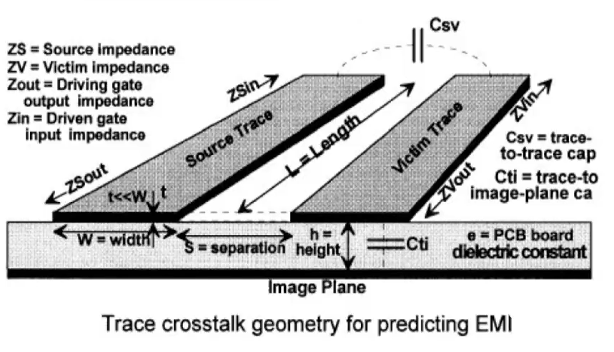

# 信号完整性分析笔记2【传输线】

对于高速信号，要使用集总参数电路分析方法是不可能的。我们引入了**传输线理论**来对高速信号进行分析

在高频信号传输时，要考虑到传输线的固有电感和固有电容，同时要考虑到相邻传输线之间存在的寄生效应

传输线本身的反射、延迟都会导致信号传输产生问题；传输线之间的影响会导致串扰和电磁辐射；传输线造成的高频小电流负载还会对电源产生影响。SI、PI、EMI本质上就是在讲述如何解决这三方面的问题。三方面知识的公共基础就是传输线理论

## 传输线的分类

在高频PCB上，传输线分为

* **微带线**：走在PCB表层（顶层或底层），只有一个参考平面的传输线

    > 对于双面板，微带线上的信号会按照**共面波导线**规律传输

* **带状线**：在两个参考平面之间的PCB布线

## 反射

### 阻抗匹配

对于潜在的传输线反射，我们可以通过阻抗匹配来解决

* 串联端接
* 并联端接
* 戴维南端接

## 串扰

由于在相邻PCB布线之间存在寄生电容$C_{sv}$，高频信号会通过该电容产引起相互干扰，传输线之间的寄生电感也会导致高频信号的跨线传播。这些干扰对数字信号来说尤为强烈——当一路有脉冲信号通过，另一路在脉冲信号的边沿位置会有干扰脉冲出现，极大影响信号的传输质量

同时，串扰也是数字电路EMI的主要发射源

### 3W原则

### 20H原则

