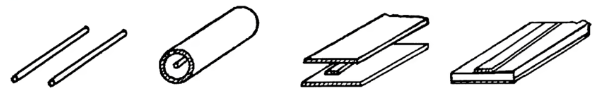
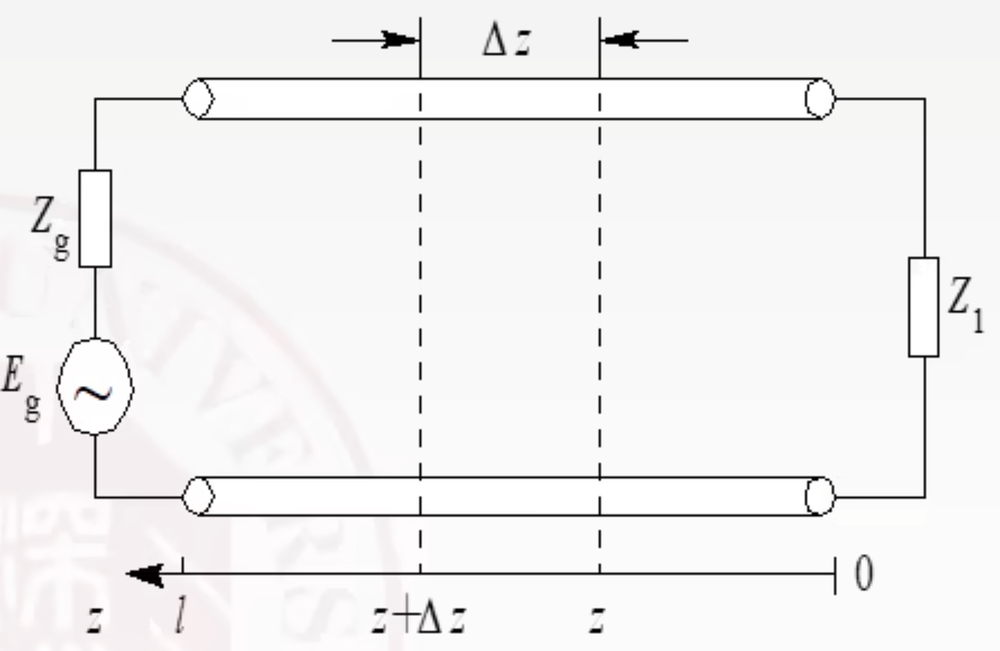
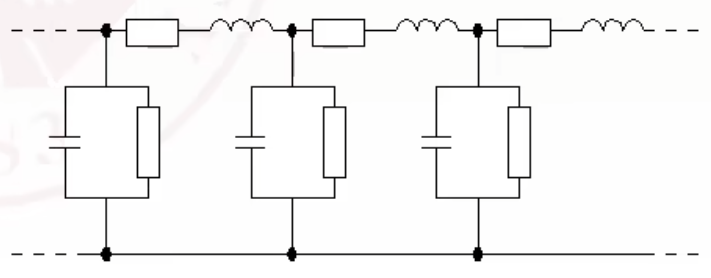
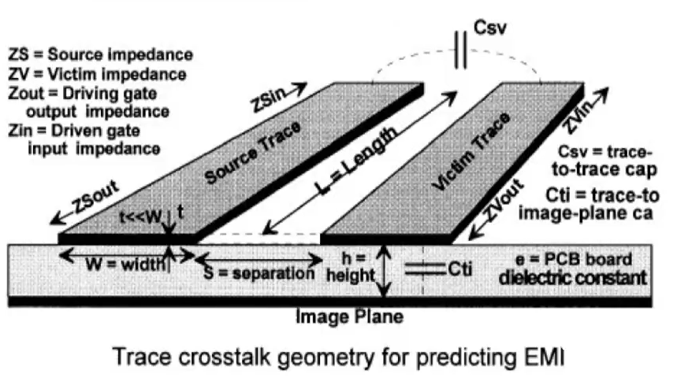

# 信号完整性分析笔记2【传输线】

对于高速信号，要使用集总参数电路分析方法是不可能的，同时电路板或板间的导线的物理性质也都与低频情况下截然不同。为了处理这样的变化，我们引入了**传输线理论**来对高速信号进行分析，从而将高频信号的分析统一到已有的电路理论框架下。

在高频信号传输时，要考虑到传输线的固有电感和固有电容，同时要考虑到相邻传输线之间存在的寄生效应

* 传输线本身的反射、延迟都会导致信号传输产生问题
* 传输线之间的影响会导致串扰和电磁辐射
* 传输线造成的高频小电流负载还会对电源产生影响

SI、PI、EMI本质上就是在讲述如何解决这三方面的问题。三方面知识的公共基础就是传输线理论

## 传输线及其分类

### 什么是传输线

高频信号下，所有导线的性质都发生了变化——由于在导线中传输的电磁波波长可以与导线长度相当，集总参数电路的分析方法不再适应于这样的导线，我们只能退回麦克斯韦方程组的框架下

> 回顾集总参数电路的适用范围： $\frac{l}{\lambda} \ll 1$ ，也就是导线长度远小于信号波长
>
> 当 $\frac{l}{\lambda} \ge 1$ 时，**KVL和KCL就不能直接使用了**，需要利用**分布参数电路**来描述它

但使用偏微分方程计算射频电路显然有些离谱，因此老一辈工程师们建立了一套适用于高频信号的理论，从而让高频信号分析统一到基本的电路框架中，这就是**传输线理论**。

传输线是用来传输电信号和能量的各种形式传输系统的总成，其作用是引导电磁波沿一定方向传输。一般来说，当电路系统中的信号频率在1MHz以下时，大部分电路元器件的特性都能用集总参数电路的形式来描述；但当信号频率升高到10MHz以上时，就需要使用等效集总参数电路来描述各个器件，同时原本被认为是理想节点（在电路理论中，可将元件视为图的边，自然连接元件的线就是节点）的连线就需要使用传输线理论来描述。

由于传输线的作用是引导电磁波沿着一定方向传输，在射频电子电路下传输线又被称为**导波系统**，其所引导的的电磁波被称为**导行波**。

将导行波传播方向称为纵向，垂直于导行波传播的方向称为横向。对于电路系统，我们希望传输线上的电磁波尽可能没有损耗，越接近集总参数电路中那样的理想节点越好，因此传输线上的电磁波最好是**没有纵向电磁场分量的电磁波**，这样的电磁波被称为横电磁波（**TEM波**）。

> 作为对比，同样是工作于高频/射频的天线器件，它的目的就是尽可能将电磁波发射出去，正好和传输线的目的相反
>
> 我们常将由传输线（包括存在寄生参数导致不连续性的传输线）、无源器件等效模型、有源器件高频模型、各类天线构成的电路模型称为微波系统模型，对应实际电路中可用的**微波系统**

### 传输线的分类

总体上看，传输线大致可以分为三类：

* **双导体传输线**：由两根或以上平行导体构成，其传输的电磁波是TEM波或准TEM波，因此也被称为**TEM波传输线**。

    其中包含**平行双线**、**同轴线**、**带状线**和**微带线**四类，如下图从左到右示意。

    

    在常见的高频PCB上，比较常见的双导体传输线就是：

    * **微带线**：走在PCB表层（顶层或底层），只有一个参考平面的传输线

        > 对于双面板，微带线上的信号会按照**共面波导线**规律传输

    * **带状线**：在两个参考平面之间的PCB布线，可以理解为走在PCB内层的信号线

* **均匀填充介质的金属波导管**：由金属制造的密闭管状结构，电磁波在管内传播，又被称为**波导**。其中传输的是TE波/TM波，而不再是TEM波，这一特性导致波导不能用特征阻抗来描述。由于本文主要讨论SI相关内容，因此不再对其进行详细讲解。

    > 波导相比双导体传输线的优势在于它具有更大的功率容量和品质因数，因此在基站、雷达等大功率设备中更加常见。

    其中包含矩形波导、圆波导、脊形波导和椭圆波导，如下图所示。

    

* **介质传输线**：完全由介质（非金属）构成的传输线，电磁波沿其表面传播，又被称为**表面波波导**。这与低频情形完全不同，介质传输线的原理类似于光纤，利用电磁波的全反射或其他波的特性来实现导波。

    其中包含介质波导、镜像线和单根表面波传输线等

    

### 传输线的分析方法

前面提到过，可以从麦克斯韦方程组出发，使用偏微分方程计算满足射频电路边界条件的波动解，得出传输线上面电场和磁场的表达式，从而分析传输特性，但显然这种方法不适合人类理解（仿真软件可以利用这样的方式对传输线进行定量分析）。在工程实践中，我们更倾向于采用**等效电路法**，也就是“传输线理论”来进行分析。应用传输线理论的关键在于从**传输线方程**出发求解满足边界条件的电压、电流波动方程，得到沿线等效电压电流表达式，进而分析传输特性。

高频电路中，导线的内阻被阻抗取代，导线可以看成内阻、寄生电感和寄生电容的RLC串并联网络，特别地，我们需要将导线划分成无数小段微元，每个微元都存在对地寄生电容、串联寄生电感和内阻。由于内阻在导线中常常以毫欧、微欧级别表示，导线的容抗、感抗就成为阻抗的最重要组成部分。由这些微元构成的传输线具有与低频完全不同的参数。

此处省略推导过程，直接给出以双绞线为代表的平行双线传输线电压方程
$$
u(z,t)=A_1 e^{+\alpha z} cos(\omega t+\beta z) +A_2 e^{-\alpha z} cos(\omega t-\beta z)=u_{+}(z,t) + u_{-}(z,t)
$$
平行双线传输线电流方程
$$
i(z,t)=\frac{1}{Z_0} [A_1e^{+\alpha z} cos(\omega t+\beta z) -A_2 e^{-\alpha z} cos(\omega t-\beta z)] =i_{+}(z,t) + i_{-}(z,t)
$$
其中，等号右侧被拆分为正负两个子项，对应正电流/电压方向和负电流/电压方向，分别表征了**入射波**和**反射波**。上式给出了传输线的关键特性：**电压和电流以波的形式传播，在任意一点的电压或电流均由沿-z方向传播的行波（称为入射波，传向负载）和沿着+z方向传播的行波（称为反射波，离开负载）叠加而成**。

原始的电压电流方程中存在于传输线特性相关的系数，这里省略证明地给出：已知负载电压U1、负载电流I1、传输线特性参数γ和Z0，则传输线上任意一点的电压方程为
$$
U(z)=U_1 \frac{e^{\gamma z}+ e^{-\gamma z}}{2} + I_1 Z_0 \frac{e^{\gamma z}- e^{-\gamma z}}{2}
$$
电流方程为
$$
I(z)=I_1 \frac{e^{\gamma z}+ e^{-\gamma z}}{2} + \frac{U_1}{Z_0} \frac{e^{\gamma z}- e^{-\gamma z}}{2}
$$

### 传输线的工作特性参数

在上述公式基础上，可以给出传输线的主要工作特性参数

1. **特征阻抗**

    传输线上任意位置**入射波电压与入射波电流之比**都为恒定值，可将其定义为特征阻抗（也被叫做特性阻抗），用$Z_0$表示，这就是传输线方程中的Z0参数。表达式如下
    $$
    Z_0=\sqrt{\frac{R+j\omega L}{G+j\omega C}}
    $$
    特征阻抗通常是个复数，与工作频率有关，它**只由传输线自身的分布参数决定**而与负载/源的情况无关

    > 注意到理想无损耗的均匀传输线上，有R=G=0，此时特征阻抗表达式退化为“电感电容之比开根号”，这种情况下特征阻抗为与频率无关的实数——这凸显了特征阻抗的意义：特征阻抗描述了传输线“全局”的阻抗特性

    决定传输线内阻的长度因素就显得无关紧要，反倒是传输线的材料、外形等决定寄生参数的因素决定传输线的特征阻抗。特征阻抗和传输线的长度无关，它仅相当于无穷长传输线上电压和电流的比值。

    对于直径为d，间距为D的平行双导线传输线，存在特征阻抗
    $$
    Z_0=\frac{120}{\sqrt{\epsilon_r}}ln\frac{2D}{d}
    $$
    对于铜芯材，介质为空气的平行导线（忽略绝缘介质）的特征阻抗转换为下式
    $$
    Z_0=276*lg(\frac{b}{a})
    $$
    a是导体的半径，b是两导体的中心间距

    对于内导体半径a，外导体半径b的无损耗同轴线，其特征阻抗为
    $$
    Z_0=\frac{60}{\sqrt{\epsilon_r}}ln\frac{b}{a}
    $$
    对于铜芯材，介质为空气的同轴电缆（忽略绝缘介质）的特征阻抗用下式计算
    $$
    Z_0=138*lg(\frac{b}{a})
    $$
    可以发现，双绞线相比同轴线，特征阻抗更容易做大。常见的同轴线特征阻抗有50Ω和75Ω两种，而双绞线的特征阻抗常设计为250Ω、400Ω、600Ω

2. **传播常数**

    传播常数是描述传输线上波传播过程中衰减和相移的参数，用$\gamma$表示，这就是传输线方程中的γ参数。在传输线方程中存在
    $$
    e^{\gamma z}=e^{\alpha z}e^{j\beta z}
    $$
    其中前一项是单调函数（e指数），为传输线上的波带来包络衰减；后一项是周期函数（欧拉公式），通过影响相位来反映波的传播快慢。因此，α被称为**衰减常数**，单位dB/m。β被称为**相移常数**，单位rad/m。

    > 对于理想无损耗的均匀传输线，有α=0，此时
    > $$
    > \gamma = j\beta, \beta=\omega \sqrt{LC}
    > $$
    > 不难发现，传播常数没有实部，表明**信号没有衰减**

3.  **相速**

    相速定义为电压、电流入射波（或反射波）等相位面沿传输方向的传播速度，用$v_p$表示
    $$
    v_p=\frac{dz}{dt}=\frac{\omega}{\beta}
    $$
    与空间中的波长类似，可以利用相速定义传输线上的波长
    $$
    \lambda=\frac{v_p}{f}
    $$
    因此，传输线上的波长与自由空间中的波长存在换算关系如下
    $$
    \lambda=\frac{2\pi}{\beta}=\frac{v_p}{f}=\frac{\lambda_0}{\sqrt{\epsilon_r}}
    $$
    在理想无损耗的均匀传输线上，有 $\beta=\omega \sqrt{LC}$ ，因此导行波的相速与频率无关。在准理想的均匀传输线上，相速与频率相关，但仍可以近似认为频率带来的相速差作为微扰可以忽略。

4. **输入阻抗**

    定义**传输线上任意一点z处的总电压和总电流之比为该点的输入阻抗**，记作$Z_{in}(z)$，即
    $$
    Z_{in}(z)=\frac{U(Z)}{I(Z)}
    $$
    输入阻抗与特征阻抗不同——特征阻抗仅为入射波电压电流之比，而输入阻抗包含了入射波和反射波电压电流。可以对传输线方程展开得到具体的输入阻抗表达式如下
    $$
    Z_{in}(z)=Z_0 \frac{Z_1 +jZ_0 tg(\beta z)}{Z_0 +jZ_1 tg(\beta z)}
    $$
    式中Z1为终端负载的阻抗，Z0是传输线特征阻抗。

    上式定量证明了：均匀无损耗传输线上任意一点的输入阻抗受到观察点位置、传输线特征阻抗、终端负载阻抗、工作频率均相关。

    > 在射频天线中，我们还常常利用到均匀无损耗传输线上输入阻抗的另一个性质：任意相距 $\lambda /2$ 处的阻抗相同，即**半波长重复性**

    利用这个公式，我们可以完成传输线的**阻抗变换**：通过设置合适的传输线长度，可以利用已知的终端负载、特征阻抗和工作频率来获得确定的传输线输入阻抗。阻抗变换就是实际应用中阻抗匹配的原理

5. **反射系数**

    定义**传输线上任意一点的反射波电压（或电流）与入射波电压（或电流）之比为电压（或电流）反射系数**，记作 $\Gamma_u$ 或 $\Gamma_i$，存在
    $$
    \Gamma_u =\frac{U_{-} (Z)}{U_{+} (Z)}=\frac{z_1 -z_0}{z_1 + z_0}e^{-j2\beta z}
    $$

    > 实际应用中，多采用电压反射系数，因为根据传输线方程推导可发现 $\Gamma_u (z)= -\Gamma_i (z)$

    注意到式中e指数包含2β而不是β，这是因为总的反射系数需要叠加入射波和反射波得到。同时可以将 $\frac{z_1 -z_0}{z_1 + z_0}$ 整理为一个与终端负载和特征阻抗有关的常数（对于同一个电路是不变的），因此定义式可以简化为
    $$
    \Gamma_u =\Gamma_1 e^{-j2\beta z}
    $$
    其中，
    $$
    \Gamma_1 = \frac{z_1 -z_0}{z_1 + z_0} =\abs{\Gamma_1} e^{j\Phi_1}
    $$
    称为**终端反射系数**，因此可以将原式整理为
    $$
    \Gamma_u =\abs{\Gamma_1} e^{2\beta \Phi_1 z}
    $$
    反射系数的定义表明了反射波就是由于阻抗不匹配或者说**终端阻抗与特征阻抗之间的差异**（$z_1 -z_0$）引起的。

    

6. 驻波比

传输线匹配

传输线效率

功率容量

## 反射

### 阻抗匹配

对于潜在的传输线反射，我们可以通过阻抗匹配来解决

* 串联端接
* 并联端接
* 戴维南端接

## 串扰

由于在相邻PCB布线之间存在寄生电容$C_{sv}$，高频信号会通过该电容产引起相互干扰，传输线之间的寄生电感也会导致高频信号的跨线传播。这些干扰对数字信号来说尤为强烈——当一路有脉冲信号通过，另一路在脉冲信号的边沿位置会有干扰脉冲出现，极大影响信号的传输质量

同时，串扰也是数字电路EMI的主要发射源

### 3W原则

### 20H原则

