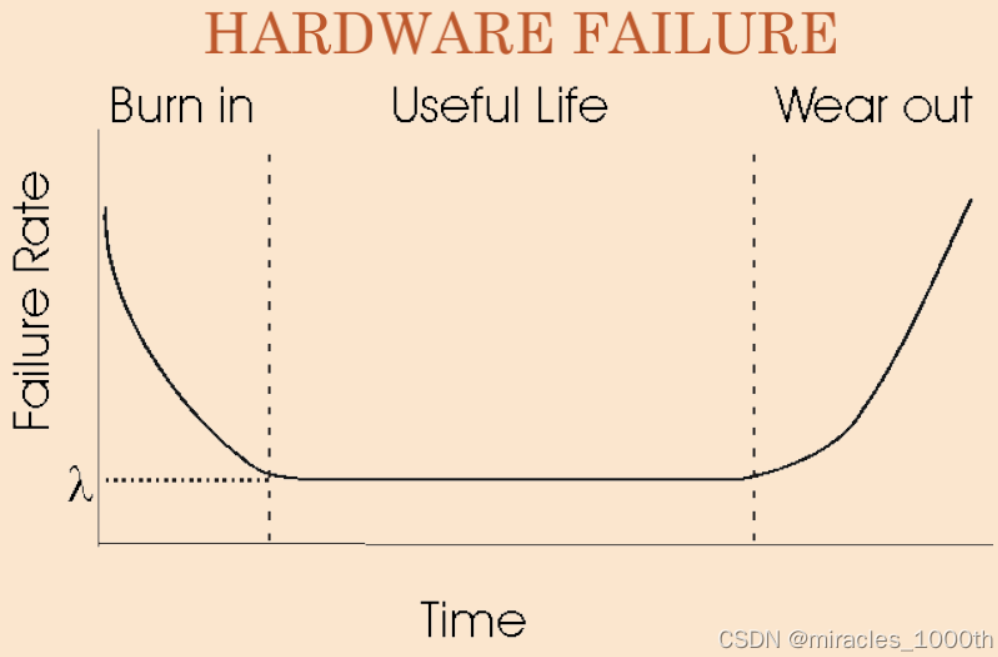

# 嵌入式可靠性基础1【理论】

嵌入式系统是一种典型的复杂系统：电气、机械、接口、板级硬件、片上硬件、底层软件、算法软件等每个子系统都具有较高复杂度——当它们组合在一起，就需要针对嵌入式系统进行**可靠性**设计。可靠性设计是保障设备可用的根基，它包含了三个方面：功能设计、系统设计和容差设计。

在开始介绍可靠性设计之前，先来了解一下可靠性设计应当遵循的几条基本原则：

1. **可靠性设计的目的是利润**

    **可靠性的目标是保障系统在规定时间、规定条件下，完成规定功能**

    > 这就是可靠性的定义

    这个目标不是指工程师要尽可能降低成本设计粗制滥造的产品，而是应当合理分析需求，保障产品在成本允许范围内**能够**（be able to）完成预先**规定**的产品功能

2. **可靠性设计的重点是系统设计**

    系统设计可以理解成子系统接口设计。学习过计算机组成原理的同学能够理解，这里的接口不仅仅是接插件的接口，还包括抽象层之间的接口。事实上，广义的接口包括：PCB和PCB、PCB和线缆、线缆和线缆相互连接时所使用的九针、RJ45、航空插头等**电气接口**；PCB和产品结构件连接时使用到的螺柱、卡扣、热熔胶等**机械接口**；片上硬件和软件系统、上位机下位机软件、顶层软件和底层软件之间所使用的指令集、协议栈等**信息接口**；项目工作的外界条件如额定电压、最高输入电流、最低温度、最高湿度等**环境接口**

    良好的系统设计有助于子系统解耦，并降低系统调试的难度。在可靠性方面，针对这四种接口，分别要设计四大措施保障接口的安全，只要每个层级之间的接口不出问题，那么系统的失效概率就会大大降低：**防错**、**判错**、**纠错**、**容错**，这四个措施层层递进——出现接口干扰问题时，只要四类措施中的一种发挥作用，就能保证系统安全

3. **可靠性设计的难点是容差设计**

    容差设计的本质就是把系统中各个子模块部分的参数漂移上下限都列举出来，找出系统中各个子系统偏差漂移后的最坏组合（最坏情况分析WCA，Worst Condition Analysis），通过工程计算的方式确保子系统仍能工作在有效范围内，从而让系统能够耐受规定的极限情况

    PCB设计中的物理仿真、IC设计中的STA、软件设计中的冗余设计等都是为了满足容差。容差设计是可靠性设计中最难进行测试的，一般只能在理论层面进行仿真验证；并且容差涉及到了每个子系统的具体分析，复杂度比其他任何设计标准都高，因此是设计中的难点

4. **可靠性设计的标准是用户满意**

    技术是为人服务的，因此用户满意的产品才是好产品，在严格按照标准进行可靠性设计后交付的产品尽管可以在工况保障正常使用，但有可能出现部分子系统工作不良的情况

    > 比如一个随身听可以实现+30℃、相对湿度70%的条件下正常工作，但用户使用中发现听感存在严重下降，那么这个产品必然不受南方用户的欢迎，产品利润也就下降，变相地没能完成“嵌入式可靠性设计目标”

    因此，可靠性设计中的规定时间、规定条件、规定功能偶要基于用户的满意度和主观感受来确定

## 嵌入式失效率

嵌入式系统的失效率定义为：批量生产后，出现失效情况产品占总产品数量的百分比。嵌入式产品是否可靠，可以使用嵌入式失效率作为基本衡量因素

嵌入式系统失效受到多种因素影响，它们量化值的乘积就是整机失效率$\lambda_S$

* **元器件平均失效率**

    每种器件都可能失效，并且失效机理都有所不同。在设计中，应当根据所选对象的缺陷是否对设计故障有致命的影响来决定是否选用

    > 例如MLCC的抗机械应力能力差，设计上应当通过减震、远离接插件、远离安装柱等方式避免MLCC因为应力而断裂失效

    在电路中，并不是器件的所有参数都要关注，在外界环境相对稳定时，器件的一般特性就不必苛求，这要根据应用场景和器件的数据手册曲线进行认真分析

    一般取值为`(1~3)*10^(-5)`

* **降额因子**

    降额因子用于描述器件降额带来的鲁棒性增加。*降额是提升嵌入式系统可靠性最简单、最有效、最低成本的技术方法*：器件在工作接近满载情况下，任何外界干扰都会导致其达到超标状态，从而引起器件失效，进而导致系统层面的失效；而进行降额就是为这些外界干扰留出裕量

    同一器件在不同场景下的降额参数不尽相同，降额的程度也需要具体情况具体分析

    一般该参数取值在`(1~10)*10^(-2)`

* **老练筛选效果因子**

    取值在`0.1~0.5`

* **环境因子**

    恶劣环境会让系统失效率极大上升，因此就需要根据*整机和器件*的运行环境选取合适的器件

    需要注意：器件选型时不能只根据整机的运行环境来，更要考虑到器件的所处环境——器件失效是整机失效的前提之一

    下表给出了常见场景的参考环境因子

    | 场景             | 环境因子 |
    | ---------------- | -------- |
    | 实验室           | 0.5~1    |
    | 室内             | 1.1~10   |
    | 陆地固定         | 5~10     |
    | 车载             | 13~30    |
    | 舰船载           | 10~22    |
    | 机载（含航天器） | 50~80    |

* **机械结构因子**

    机械工艺会对电路板施加外应力，从而产生电路硬件上的失效

    这一项的取值一般为`1.5~2.5`

* **制造工艺因子**

    产品整个生命周期中，每个环节都会引入导致失效的盈利，因此必须保证制造过程中的一致性：器件从制造、包装、存储到运行、维修，每个环节的处理都应该和预期保持一致

    比如为了保证器件不在制造过程中出现过度暴露于高温高湿环境，就需要对拆机、入检等环节的操作做出严格规范，并加入烘烤等要求

    这一项的取值一般为`1.5~3.5`

* **元器件个数**

    越简单的系统，其鲁棒性越高，这是非常朴素的原理。任何器件都有优缺点，多一个器件就多引入数个失效机理，因此元器件的个数越少，带来的不稳定因素越少。这也是现在电子系统优先考虑使用集成电路的原因之一——携带电路的die与外界环境的接触仅限于外壳和焊接引脚，失效机理大大减少

    > 事实上也有对片上系统进行分析的*微电子器件可靠性*理论

### 嵌入式系统失效率曲线

电子器件的失效率-时间曲线也被称为“浴盆曲线”，意思是说产品生成完成投入使用后，会出现高失效率的**早期失效期**，度过早期后会进入低失效率、可长期使用的**偶发失效期**，但随着器件老化，产品最终会进入高失效率**老化失效期**

因此，制造厂家出厂前大都会进行高温老化工序，通过高温老化来让早期失效期在生产车间内完成，这样产品到客户处时就进入了偶发失效期。

偶发失效期内的事效率呈现为一个常数，可以用MTBF（Mean Time Between Failure，平均无故障间隔时间）基本公式计算
$$
MTBF=\int_{0}^{\infin} R(t) dt
$$
其中
$$
R(t)=exp(-\int_{0}^{t} \lambda (t) dt)
$$
表示可靠度（Reliability），它又和失效率$\lambda$相关，因此我们可以推导出**偶发失效期内MTBF和$\lambda$之间的关系**：
$$
MTBF=\frac{1}{\lambda}
$$
**当且仅当偶发失效期，硬件可靠性遵循该数学模型；但在早期失效期和老化失效期，MTBF将随时间迅速减小**。这便是浴盆曲线给我们的另一个推论

对于软件而言，存在一个与硬件最大的区别：**软件不会“磨损”**

根据浴盆曲线，我们可以看到硬件在早期的失效率是很高的，失效率在老化后逐渐降低并在一段时间内保持平稳，但是随着时间的推移、硬件组件损耗累积，失效率再度提高，说明硬件开始磨损；对于嵌入式软件的失效率-时间曲线，到目前为止在国际上尚未有成熟的数学模型，但一般来说随着时间的推移，软件的失效率会逐步下降。这基于一个常识性判断：软件会得到正确合理的维护改进

软件不会磨损，但**软件退化是可能发生的**。在完整的产品生命周期里，软件会面临*变更*，每次变更都可能会引入新的错误使得失效率陡然上升，在失效率回到稳定失效率之前，新的变更又会引起曲线上升。我们可以说，**不断的变更是软件退化/软件改进的根本原因**

综上所述，如果没有持续的有效的改进，软件不可能自动地越来越可靠，反而有可能随着变更越来越不可靠。这就又要提到**软件可维护性**：软件可靠性提升的前提就是软件可以被维护，这被称为软件可维护性。硬件上要留出软件升级的接口，而软件文档和代码注释也是相当必要的

我们暂且把软件问题放在一旁，软件层面的问题涉及到软件工程和系统工程的理论，不是嵌入式可靠性所关心的主要矛盾。我们先来看一些软硬件共性的问题

## 嵌入式可靠性模型

嵌入式系统的可靠性模型分成**串联结构模型**和**并联结构模型**

在进行系统设计时，往往会采用并联备份的冗余设计，使得系统可靠性成倍提升，这是并联结构模型，其可靠度为
$$
R=1-(1-R_A) \times (1-R_B)
$$
相对应的串联结构模型，可靠度为
$$
R=R_A \times R_B
$$
可以说串联结构的可靠性比并联结构的可靠性要关键得多，因此双机热备、器件冗余、电路冗余等设计都可以较好地提高系统的可靠性，设计者也应该在串联结构中关键器件的可靠性上花费更多时间进行检验

### RAMS

广义上讲可靠性是RAMS的结合，即包括：**可靠性**、**可使用性**、**可维护性**、**安全性**

可靠性的基本工作之一就是要了解目标设计未来运行环境对应的规定条件和可能故障，从而保障RAMS

在项目开始时要进行**设计输入环境调查**，说人话就是**对规定工况的各种条件进行准确检测和定义**，至少要包括以下因素：

* 环境因素：温度、风速、风向、昆虫、化学物质、照明状态、噪声、光闪、污染物、工作电源波动、电磁干扰、避雷错误、防静电
* 人为因素：视力、听力、触觉、操作距离、专业知识、培训等
* 关联设备因素：输入、输出、控制设备（按钮：可单手操作、尺寸是否合适、操作生效是否有触感、不同的按钮是否有防错措施；触摸屏：触摸有效性、定位精确、响应时间）
* 设备本身：报警、软件界面、结构方面、标识方面、器件输出能力

### 容差分析

**容差分析**：考虑器件的最大误差并进行分析

在片上硬件设计中，我们通常进行工艺角（Process Corner）分析，找到WCS（Worst Case Slow）下的电路参数；在板级硬件中也需要进行WCCA（Worst Circuit Condition Analysis，最坏电路情况分析），综合最坏情况审查电路设计是否能满足需求

在容差分析过程中，最关键的技术是**精度分配方法**：

1. 得到系统的总精度要求
2. 找出影响精度的各个模块
3. 推导出系统输出值与各模块测控物理量的工程计算公式
4. 利用微分公式，按照工程经验将精度分配给各个影响参数
5. 判断是否满足要求，若无法满足则重新到上一步骤

这个算法比较适合于产品批量生产中，芯片生产中的工艺角分析是最贴切的例子，但实际嵌入式系统中的随机现象还要更多，设计者应当遵循“理论计算上行得通，工程上未必行得通；但计算上行不通，实践中一定行不通”的开发思想，通过随机器件误差仿真等方式得到精度参数

### 过渡过程

设备从停止到上电开机、从启动到停止等阶跃过程并不会带来系统阶跃响应，而是会带来一个过渡过程——现实中的系统总是滞后的

在可靠性分析中，对过渡过程的分析也十分重要。实验室稳态下能工作的产品，参数设计一般没有问题，但在用户现场出现的问题往往是由于复杂的现场过渡过程导致的系统故障

### 系统设计和DFMEA

嵌入式系统是包含了传感器、机械执行机构、硬件控制单元、软件等子系统的复杂人工系统。在工作过程中，嵌入式系统的可靠性是由每个关联部分的本体、各部分之间相互关联的特性决定的，包括：

* 器件失效机理
* 器件相互连接
* 工作时器件相互影响
* 软硬件相互影响
* 生产影响

因此解决系统问题的途径有很多，从系统整体和部分的相互作用上考虑才能得到最优方案。**故障模式与失效分析（FMEA）**是一套统一的分析方法，可以分为**设计阶段的DFMEA**和**制造环节的PFMEA**

在方案设计阶段，根据应用的环境、运行的状态、器件的失效机理以及同类产品以往的投诉记录等，确定产品可能出现的故障模式，然后根据**故障的危害程度S**、**发生概率O**和**可探测程度D**三个量化的指标，定量计算**风险顺序数**（Risk Priority Number，**RPN**）
$$
RPN=S \times O\times D
$$
根据RPM可以对故障的严重程度进行排序分类，从而优先解决RPN数值最高的问题

> 实际应用中，一般不考虑可探测程度D的影响

### 阻抗连续性理论

嵌入式可靠性理论中的阻抗连续是一个广义概念，不仅包括电阻，也包括结构力阻尼、风阻、水阻、热阻等。阻抗连续性理论的核心就是：**路径中阻抗尽量保持一致，如果不得不有阻抗变换的情况，必须采取缓变过渡的设计**

急性或尖锐的阻抗突变往往会导致突变点附近设备损耗加重，从而使设备容易老化，如果采取缓变过渡的方式，可以让缓变点附近的设备载荷分散得更均匀
