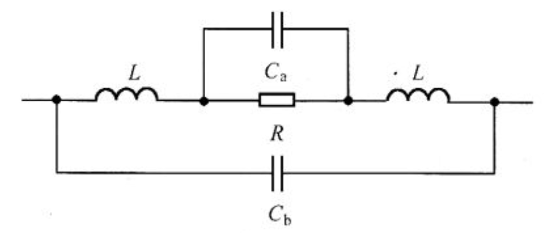
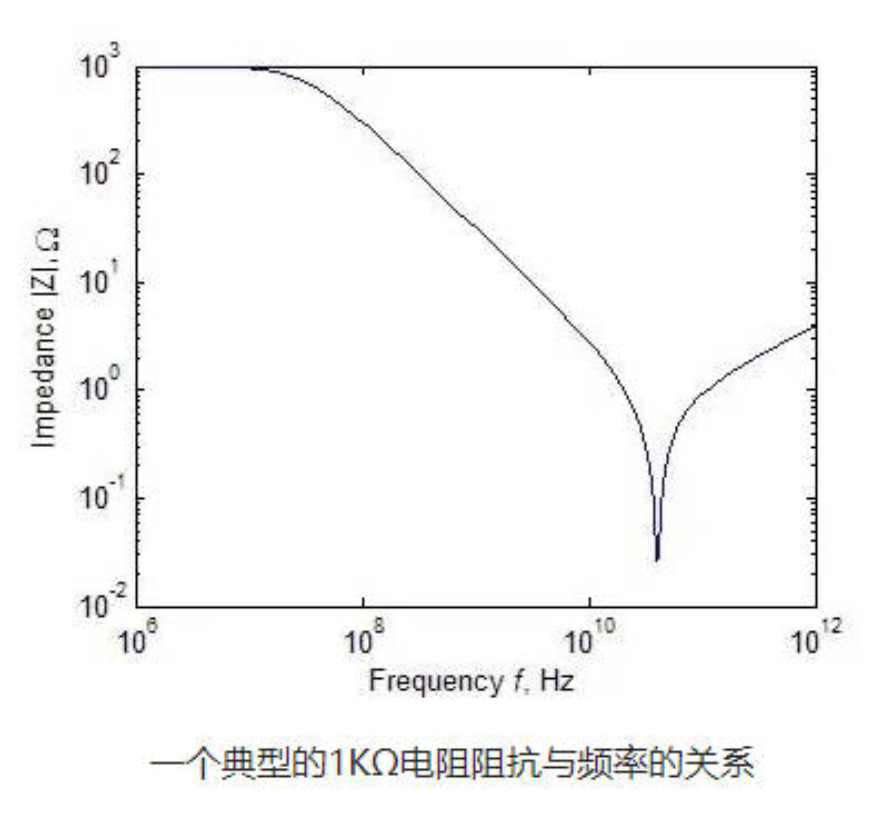
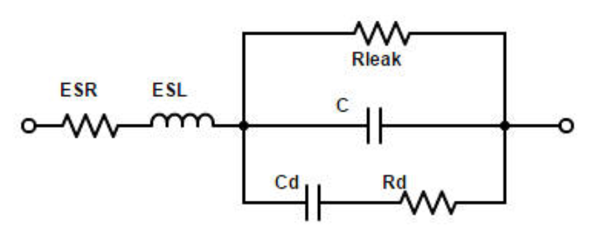
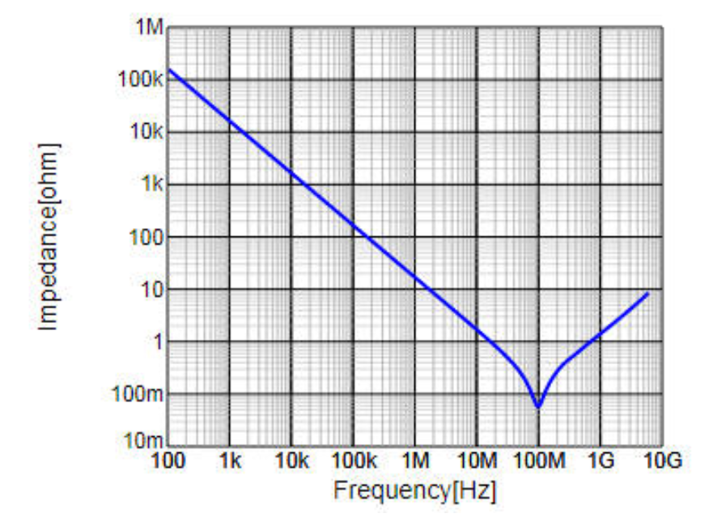
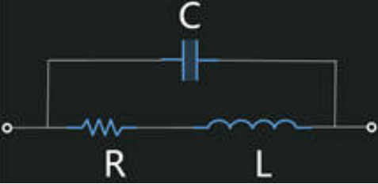
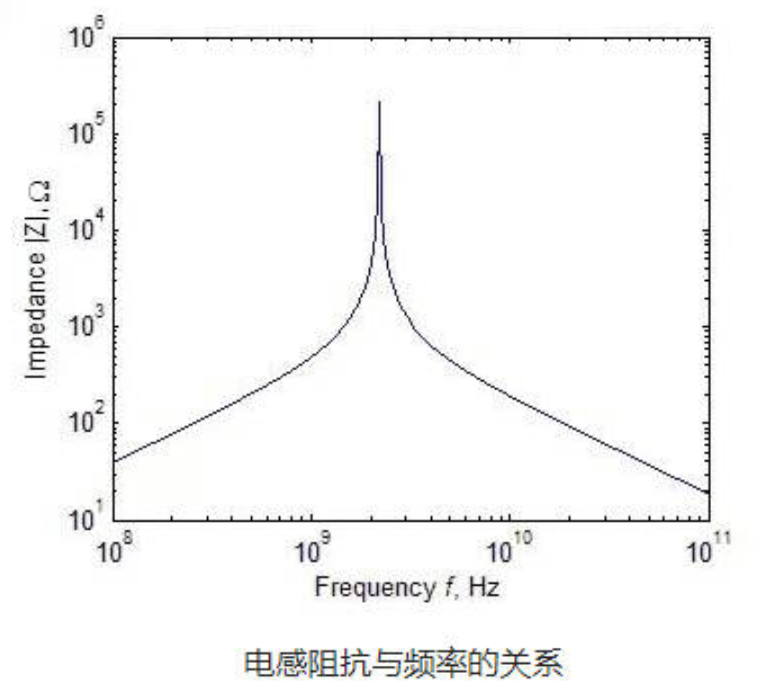
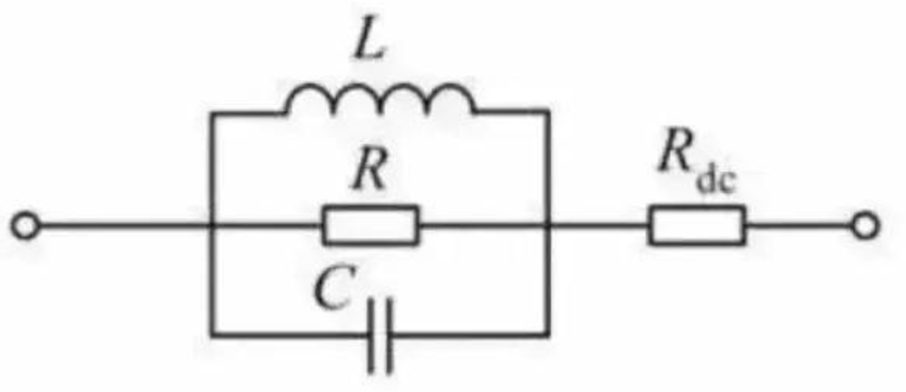
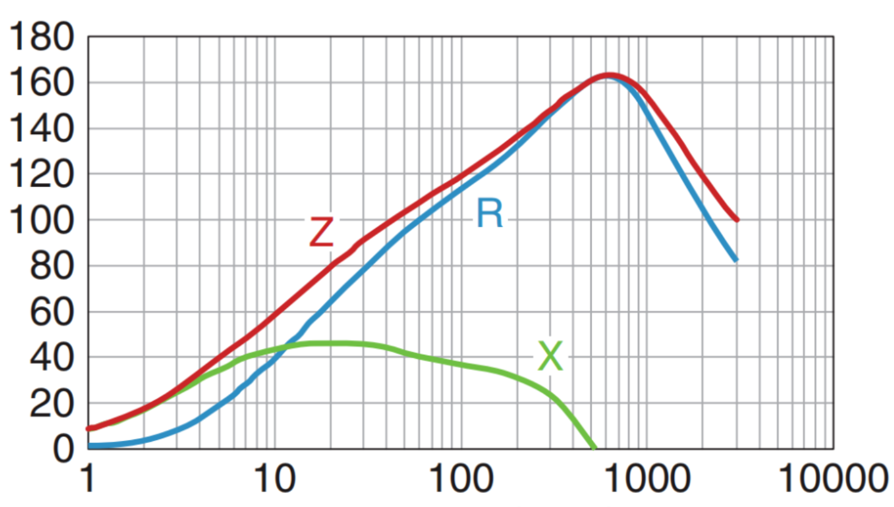
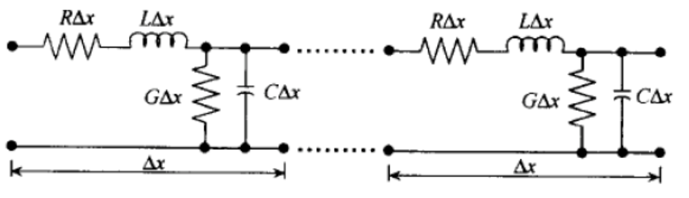

# 嵌入式可靠性基础4【EMC设计】

**电磁兼容**（Electro Magnetic Compatibility，**EMC**）是指设备或系统在其电磁环境中运行时，不会因为其他设备的合理电磁干扰而影响本机的功能和安全性，也不会对其环境中的任何设备产生不合理的 电磁干扰的能力。根据定义，EMC实际上内涵了EMI和EMS两方面的要求 ，**EMI**（电磁干扰）是指设备在正常运行过程中对环境产生的电磁干扰不能超过一定的限制；**EMS**（电磁敏感性）是指设备对所在环境中存在的电磁干扰具有一定程度的抗干扰能力

## 电磁兼容测试要求

EMC的国家标准测试规定有11项测试内容，包含

* 4项EMI指标：**辐射发射RE、传导发射CE、谐波电流Harmonics、闪烁Flicker**
* 7项EMS指标：**辐射抗扰度RS、传导抗扰度CS、静电抗扰度ESD、电快速瞬变脉冲群EFT/B、电压跌落与短时中断DIP/i、工频磁场抗扰度PMS、浪涌抗扰度Surge**

## 面向EMC设计

EMC是信号完整性、电源完整性和嵌入式可靠性的交叉部分，也是在产品制造中相当重要的一个部分：如果产品无法通过EMC测试，往往是不允许批量生产上市的；在电磁环境比较糟糕的情况下，EMC设计不过关的产品则会经常发生“玄学问题”

### EMI故障的典型现象

1. 接收端测得信号良好但电路还是存在bug
2. 将信号速率降低能够环节故障
3. 更换发送端或接收端芯片，故障可能变好也可能变差
4. 原理图没有变化，只是重新布线，原来的正常信号就出bug了
5. 换用了相同参数规格的电源，但会导致信号问题
6. 单板测试通过，但两板互联后会导致信号端口异常

面对上面这些“玄学问题”，新手工程师往往选择盲目加电容、加阻抗匹配！但有经验的工程师则会发现这极有可能是信号完整性或EMI问题导致的，应当从信号与电源完整性的角度重新审视原理图和PCB

### 数字电路工作异常时排查的十个要素

大多数电路出现信号完整性或EMI问题都是由**多因素**导致的，多种复杂的故障因素综合作用于某总线信号才导致电路工作异常，因此应当依次排查关键要素来确定主要问题原因

1. 接收端高电平阈值
2. 接收端低电平阈值
3. 接收端电源完整性问题
4. 接收端地平面噪声/地弹问题
5. 发送端高电平输出值
6. 发送端低电平输出值
7. 发送端电源完整性问题
8. 发送端地平面噪声/地弹问题
9. 传输线阻抗问题
10. 板内或外来EMI导致的信号完整性问题

### 处理EMC的要点

EMC问题的产生机理和串扰的机理几乎是一样的，无非是“**干扰源、传播路径、敏感设备**”，而解决措施则是分别在这三者中应用“**处理接地、信号屏蔽、线路滤波**”三大法宝

传播耦合路径的耦合方式有**传导**和**辐射**两种，EMI干扰信号也分为两种：由变化电压产生的**电场干扰**和由变化电流产生的**磁场干扰**

我们都知道，冲激函数的频谱是包含所有频率的曲线，这就导致电压突变$\frac{du}{dt}$或电流$\frac{di}{dt}$突变会导致大量高频杂波

> 这部分内容涉及信号完整性的基本理论，读者可以参考笔者的信号完整性分析笔记。这里仅进行简要介绍

电阻的高频等效模型如下图所示

可以发现，信号频率较高时，引脚感抗和分布电容容抗就成为决定信号传输阻抗的主要因素

当频率升高并超过一定值时，寄生电容容抗成为主要影响因素，它引起电阻阻抗的下降；而当频率继续升高时，由于引线电感的影响，总阻抗反而上升

电容的高频等效模型如下图所示

随着信号频率升高，ESR和RSL会成为电容阻抗的决定性因素，如下图所示

理想电容的阻抗随频率的增加而不断较小，但实际电容中的ESL会让电容阻抗出现“折返”，导致电容在高频段变成了一个电感；而ESR则让电容在谐振点的阻抗不为0（是一个微小值）。

电感的高频等效模型如下图所示

实际电感的高频特性和理想电感的特性有所不同，会出现当频率接近谐振点时阻抗比预期更快提高的情况，这是因为分布电容和电感本身阻抗共同作用；而当频率继续提高时，寄生电容成为阻抗的主要影响因素，让电感阻抗反而降低，在较高频下电感变成了一个电容

磁珠的高频等效模型如下图所示

磁珠和电感都能够抑制高频电流，但二者区别在于：磁珠在高频信号下表现为先缓慢上升、后缓慢下降的阻抗特性

如上图Z，随着频率升高，X由正值逐渐变为负值，当X=0时，磁珠呈现纯电阻特性，此时处于谐振状态，阻抗最大，此时的频率称为谐振频率。当频率大于谐振频率时，X为负值，磁珠呈现容性；当频率小于谐振频率时，X为正值，磁珠呈现感性。

正是因为**磁珠拥有比较平缓的频率特性曲线，因此常常被用在电源信号EMI滤波**；对于信号线，往往期望滤除特定频率噪声，则适合使用电感或频率特性曲线比较陡峭的磁珠，并让噪声频率在磁珠的谐振频率附近

导线的高频等效模型如下图所示

高频信号下的导线相当于一系列串联的RLC串并联电路，需要注意：虽然图中画出了一个贯穿分布电容一端的网络，但分布电容的下端其实是悬空的，因为导线上信号的耦合对象是变化的——如果导线靠近地层，则线缆上的高频信号通过分布电容对地耦合；如果导线靠近其他导线，则会通过分布电容形成串扰（如果导线传输的是电源，这就又来到电源完整性问题的领域）

> 此外，还应当注意：高频信号在导线或者说传输线上传播时，可能会发生反射现象，这同样会导致

处理EMC问题的关键就是把握好上面这些基础器件之间的关系

### 差模干扰和共模干扰

对于有返回路径的信号，其对其他信号产生的干扰称为差模干扰；而信号线对地平面或信号线对电源平面的干扰则称为共模干扰。差模干扰会在两根信号线之间传输，线A对线B的干扰和线B对线A的干扰是等价的，采用双绞线和在电路中增加阻抗匹配电阻可以较好地削弱差模干扰。共模干扰则是信号线和参考地之间产生的干扰，是信号线对地单向的干扰，会引起地弹。采用屏蔽线并有效接地、采用低纹波电源可以较好地削弱共模干扰

## 面向嵌入式可靠性的EMC设计

在嵌入式可靠性领域，我们一般将EMC问题看作产品和外界环境之间的问题，这不同于SI/PI的视角

> 在SI/PI视角下，EMC问题可以在板内得到解决，通过进行整体硬件规划来将单板内部存在的EMI削弱，同时避免受到外部EMI的影响。显然，SI/PI会有意地忽略掉单板对外界产生的EMI，这正是嵌入式可靠性中EMC设计的关键

### EMI敏感接口

微动开关和面板是目前大多数嵌入式设备的标准人机交互接口，它们会直接和人体接触；操作杆、旋钮、机械按键也经常被使用。对于嵌入式可靠性而言，机械结构的长期可靠性是一个值得考量的项目，同时它们也是主要的ESD防护点。一般采取三种措施对这些裸露的交互器件加以保护：

* 在薄膜键盘和临近电路之间放置接地保护层
* 在安装孔周围填充密封剂，阻塞空气放电途径
* 在金属按键或面板周围放置隔离舱，在信号线上设置TVS

电源接口是EMC测试中的重点测试部位：双向的传导、辐射效果都需要关注。电源接口一般需要通过采用电源滤波器和浪涌防护两种方式加以保护

> **双向**是指干扰由电网传入设备和由设备传入电网的过程

电源滤波器需要根据想滤除干扰的波段进行选择，在正确安装的同时还要保障滤波器采用*面接地*的方式有通路泄放掉高频干扰。常见的滤波器包含有源滤波器和铁氧体磁环，有源滤波器可以放置在机体内，铁氧体磁环则套在电源线输出端靠近电网一侧的线外层。浪涌防护电路可以是主动浪涌抑制，也可以是共模电感等常见无源器件

### 接地的分类

接地是EMC设计的三大措施之一，这里需要强调保护性接地与一般电路意义上参考地的区别：理想状态的保护地就是大地，它应当具有**对电荷无限容量**，也就是一个无穷大的电容，无论多少电量再多短时间内流入大地，地的电位都应该保持0V；同时他还应该拥有**0Ω的泄放路径阻抗**，地线上的电流不应该造成压差。实际设计中，两个理想特性都无法满足，因此要根据不同电路选择接地方法。

> 接地的标准定义是：电流回流的最小阻抗路径——而人为设定的接地路径未必是阻抗最小的路径，因此要人为断开不希望产生电流接地通路的部分，让电流沿唯一路径到地

功能上可以把接地分成四类：

* **工作接地**

    工作接地实际上就是一般电路意义上的参考地，我们要求它实现三个基础功能：

    * **信号回流**：在信号完整性理论中我们可以了解到每条信号都需要对应的返回路径，如果返回路径的阻抗与信号阻抗不匹配，就会产生反射和压降。如果返回路径选择地平面，那么压降就会以地弹的形式出现
    * **平衡电位**：在不同子电路间，其内部地平面可能由于地弹形成不同的地线基准电位，但我们需要一个完整的地平面将电位统一起来，这时候就需要在各个子电路间建立低阻抗的地路径
    * **泄放电流**：在一些需要大电流的场景，需要保证入地阻抗足够低，从而让瞬间或持续的大电流能顺利通过，不至于烧毁地线

    对工作接地的最终要求就是电位稳定且平衡，且不出现烧毁地线的情况

    此外，为了应对地弹带来的种种问题，工作接地又根据应用场景划分出多种形式，主要包括：*单点串联接地*、*单点并联接地*、*多点接地*三种，这些内容都被归类在电源完整性理论，这里仅提一下相关概念

* **安全接地**

    安全接地的作用是将对人体有潜在危害的电流导入大地，不会在人体和大地间形成通路（或者说大电流优先从接地线进入大地，从而让机壳等潜在带电体与大地保持等电位）

    安全接地也具有工作接地地的三个基础，只是不强调信号回流，它也被称为*安规接地*

    > 一般安规接地阻抗不允许超过1Ω，并且接地线必须采用黄/绿色导线便于识别

* **防浪涌接地**

    防浪涌接地主要是为外来突变的大电流干扰提供一个泄放路径，从而保护设备中的脆弱点。静电接地、防雷接地都属于防浪涌接地。

    我们可以发现常规要求阻抗越低越好，但静电（防浪涌）接地不一样：静电荷在分布电容上产生，引起非常高的电势，如果接地阻抗太低，会导致静电荷瞬间释放，在电路和元件上造成瞬间尖峰电流，对芯片内部走线、PCB信号线、电气触电等脆弱环节潜在危害极大。如果接地阻抗太大也不好，过高的阻抗等同于绝缘，积累的电荷泄放不掉。

    > 一般静电接地阻抗保持在1~1000MΩ为优

    防雷接地比静电接地更加极端一些，需要更低电阻、耐高温的地线、更可靠的防浪涌器件，还要让接地点独立于其他任何接地线，从而保障浪涌电流能够及时释放掉

* **屏蔽接地**

    屏蔽接地更特殊一些，我们一般使用浮地来实现EMI屏蔽效果：使用不和大地联通的屏蔽罩提供了一个参考的等电位地，如果外界EMI传入或内部EMI传出时，电荷会在壳体上积累，抬高壳体电位，让内部电路笼罩在一个均匀静电场中，也就是将差模干扰转化为共模干扰，电路照常工作。对于干扰磁场，则会在屏蔽罩上形成涡流，从而将磁场削弱殆尽

    > 一个常见的例子就是手持设备的外壳：壳体并未单独接入大地，但却联通为一体

    与浮地屏蔽不同，EMC屏蔽接地则是泄放电流的另一个应用：它用于泄放掉高频电流，一般采用扁平的金属蛇皮电缆或宽铜皮以降低地线上的串联寄生电感。这在各种EMC测试设备上很常见

### 接地规范

根据上面内容，我们可以发现嵌入式可靠性的接地是为应用服务的，**接地方式取决于接地目的**，因此设备接地和电路接地的规范是相通的：在设计上把安规接地、工作数字地、工作模拟地、工作功率地、防浪涌接地、EMC屏蔽地、屏蔽浮地依次分开布线，最后在系统联调时根据各子电路接地的目的将各个地联通

一般连接地的方式有下面几种：

* 中低频信号地之间低阻抗导线直连（高频信号不应该用导线直连）
* 高频信号地之间宽扁平线缆直连或铜皮直连
* 泄放电路地串接大电阻
* 外壳和保护地串接电容（这种情况下要求保护地和外壳地稳定，目的是泄放掉PCB地平面的杂波）
* 弱信号地之间串接磁珠
* 大电流地之间串接电感
* 小信号或振铃信号地上串联电阻连接（目的是抑制信号过冲和尖峰）
* 防雷线单独与真正的大地通过粗导线单点相连
* 安规地与真正的大地通过短粗导线单点相连

## 面向EMC的电路板设计

在处理设备级EMC问题时，往往也需要从单板PCB、原理图设计入手，对潜在的隐患加以解决

### ESD和EMI防护

如上面所述，设备各种接口处的ESD防护和EMI泄露是EMC的重点，而除了从传播路径上想办法以外，还可以在干扰源和敏感器件处加以防护。防静电电容、TVS、串接电阻、磁珠等都是为此而生

比较经典的防护电路就是在敏感电路上加一个560pF的防静电电容跨接到地，随着技术进步，双向TVS也可以很好地替代防静电电容，不过要求TVS管的结电容不能大于1000pF

对于按键，还可以采用并联去抖电容和串接限流电阻的方式来消除由人体静电和操作引起的信号抖动和ESD。串接限流电阻的方法也可以应用在晶振电路上，如果存在由晶振引起的EMI问题，可以尝试使用该方法削弱晶振信号过冲

电路板裸露的接插件接口处也可以加装RC去耦和TVS防护电路，这在车规CAN和工业用RS485通信中经常使用，能够防护经常插拔带来的摩擦静电。

在单片机IO口直出信号连接电机等大噪声器件时，可以选择在IO口和噪声源之间加入一个$\pi$型滤波电路，隔离噪声；对于连接长线缆的电流型驱动器件，也应该在驱动端或接收端放置串联电阻和磁珠。以太网提供了比较好的样例：使用Bob-Smith电路对长导线和PHY驱动电路进行隔离兼具防雷功能

要求电路中的去耦点电容选用高频可靠的MLCC，保障ESR和ESL都较小。根据信号频率选择容量：100MHz取10nF，33MHz取4.7~100nF。最好选择相差两个数量级的电容并联去耦。去耦电容选型经验公式
$$
C=\frac{t}{V_{CC}-V_{min}} I_{max}
$$
具有较高辐射源特征的电路应该安装在金属屏蔽罩内，尤其是高速数字电路和晶振；高频模拟电路则作为敏感器件，也应当使用金属屏蔽罩。继电器和其外围电路因为要切断强电流，具有比较大的EMI发射，因此应当采用包铝箔屏蔽等手段
