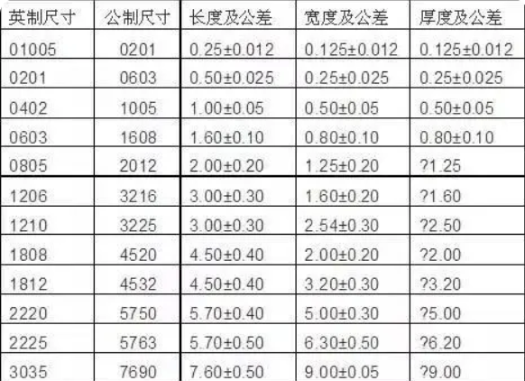
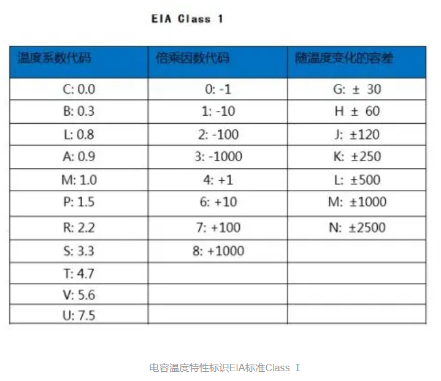
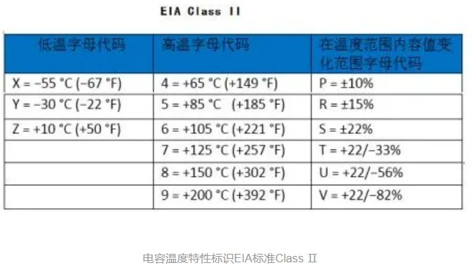
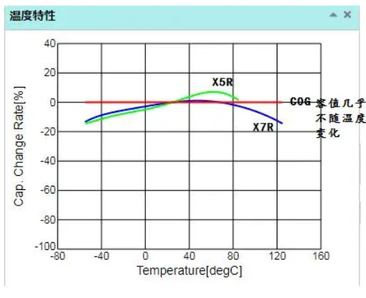
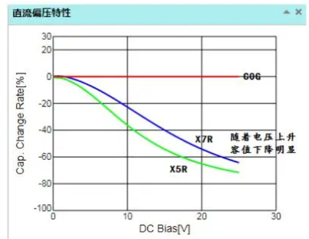

# 嵌入式可靠性基础6【国家标准】

达到国家标准是嵌入式可靠性设计的最基本要求，国标限制了某一类产品的最低安全规格，如果产品无法达到要求，很有可能造成严重后果，轻则产品无法出售或被退回，重则可能危害用户安全

为了满足国家标准，工程师应当了解自己产品所处领域的国标条例，并从中总结与自己工作有关的部分，从而让设计满足标准的要求

对于消费电子产品，最常用到的国标就是《**GB8898-音频、视频及类似电子设备安全要求**》和《**GB4943信息技术设备的安全**》。这两个国标手册可以在eetop上下载到

本章主要在整体层面上说明安规的重要性，同时介绍一些安规相关的知识

## 器件基础知识拾遗

在开始前，先来复习一下一些基础器件和可靠性有关的规格知识

### 电阻

电阻失效一般是由于物理失效或热失效，物理失效即电阻受到内外力断裂，热失效就是电阻通过电流引起发热超过自身散热能力导致烧毁。先来看贴片电阻的尺寸

如上图所示，我们一般使用英制尺寸来指明电阻物理大小

贴片电阻、电容、电感的尺寸大都是统一的，可能有些贴片电容、电感具有自己的特殊封装（比如排电容、穿心电感）。以0805封装为例，08代表`0.08 inch`，05代表`0.05 inch`，根据`1 inch = 25.4mm`，可以发现0.08封装器件尺寸`2mm x 1.25mm`，也就是对应公制尺寸2012。一般来说贴片器件都要制造成扁长方体，因此高度应当小于1.25mm。0603、0402等器件也都按此规则确定尺寸

电阻的尺寸和规格不仅仅决定了其能够承受的最大电流，也影响到其能耐受的电压。如果耐压过低，采用薄膜工艺制造的电阻很有可能发生击穿现象；对于电容、电感来说其外形尺寸还会影响特征频率，在高频电路中尤为明显。

> 说句题外话，制造中常用的mil单位正好是inch的千分之一，即`1 mil = 0.001 inch`

### MLCC的规格

电容的分类暂且略过，这里主要提一下片式多层陶瓷电容器MLCC的规格

参照国际电工技术委员会（IEC）和美国电子工业联合会（EIA）标准，根据MLCC容值随温度变化的规律，对陶瓷MLCC电容分为两个类别：I类和II类，I类使用顺电陶瓷制成，II类由强介铁电陶瓷作基材。I类MLCC使用的EIA规格查找表如下所示

I类MLCC在电子产品上不太常用，不过其中C0G、U2J两个指标电容也可以在产品上看见。

> 根据上表，容值随温度变化大小为：温度系数代码 x 倍乘因数代码 ± 随温度变化容差，单位是ppm/K
>
> 因此C0G的含义就是0±30ppm/K，U2J表示容值随温度变化为-750±120ppm/K

II类MLCC规范就比较常见了，查找表如下

、

工业中常用的X5R电容就表示工作温度在-55~+85℃，整个温度范围内容值变化为±15%

由于I类MLCC使用的介质材料介电常数比较低，导致它们的容值普遍低于II类MLCC，这也就是为什么工业上I类MLCC不太常见的原因了。

> 同样容值的I类和II类MLCC，II类MLCC可以做得更小，符合当前电子产品微型化趋势

不过在一些需要高可靠性的场合下，我们能看到对C0G电容的要求

如上图，I类MLCC容值几乎不随温度产生变化，因此适用于高温/低温场景下高精密设备

X5R、X7R电容在外加直流电压时，随着外电压增大，材料介电常数会变小，导致电容值变小，而I类电容不会出现这样的情况，如下图

同样，C0G在交流电压下不会产生很严重的容值偏移

> 对于高电容（hi-cap）器件，即C值以uF为单位的MLCC，其直流偏置效应也是需要考虑的重要因素。
>
> 直流偏置是基于施加的直流电压而导致电容降低的效应。在额定电压下，电容有可能下降到标称值的20%左右。使用I型MLCC有助于避免直流偏置效应，但这会带来产品成本的提高

I型MLCC还在ESR、Q值、发热量上具有明显优势，因此在高可靠性领域I型是比II型更具优势的

### MLCC的老化现象

MLCC还存在**老化现象**。老化现象会导致MLCC的容值随着时间的推移而损失，在每个对数尺度差距下的损失大约在1%到6%之间，MLCC的容值越高且内层越薄，MLCC就越容易老化

> 很多用了许多年的服务器，电路已经出现了MLCC的严重老化，这时候MLCC的指标只能满足最低运行要求，可能无法满足整个系统启动时的高负荷，因此这样的服务器一旦关机就有可能再也重启不了

特别地，MLCC器件的老化是可逆转的，只需要进行适当加热（放置在+150°C温度下1小时，然后静置24小时），即可焕发新生

### 为什么高压情况下不使用MLCC

我们经常看到在服务器电源上会使用到巨大的电解电容，这时候自然而然有一个想法：如果换成高压MLCC堆叠是不是可以把高功率电源的尺寸降到最低？

理论上是可行的，MLCC在性能上要远远优于电解电容，而随着现在制造工艺的提升，高压大容量MLCC也成为可能。但有两个致命的问题：成本和可靠性

大容量MLCC往往非常昂贵，对于服务器电源这种非军工非科研用途的设备来说是负担不起的

另外MLCC在长期使用中，会出现老化和容值偏移现象，在外加高压时尤为明显，在长期使用中的稳定性不如电解电容——很多时候电解电容即使漏液也不会出现太大的容值偏移或耐压降低。此外，大型MLCC外壳非常脆，容易随PCB老化出现微小形变甚至断裂，一旦断裂或击穿就会发生短路失效，在大功率环境下极其容易引发明火。

综上所述，在高压高功率环境下往往要避免使用MLCC

### 电感

## 电路安规

## 电源安规

电源类产品的国家标准称为电源安全规范，即电源安规。每个国家都有不同的安全标准，比如我国的3C认证，过不了安规检测的产品是不合格的，不允许上市销售

### 爬电距离

安全距离包括**电气间隙**、**爬电距离**和**绝缘穿透距离**

电气间隙是指两相邻导体或一个导体与相邻电机壳表面*沿空气*测量的最短距离；爬电距离指两相邻导体或一个导体与相邻电机壳表面沿*绝缘表面*测量的最短距离；绝缘穿透距离是指设备在正常工作时可能承受的最大电压，超过这个最大电压后，此绝缘体不再绝缘时的厚度。

对工作电压小于交流50V（71V交流峰值）或直流70V时，无厚度要求；加强绝缘厚度最小应为0.4mm

> 爬电是指由于导体周围的绝缘材料被电极化，导致绝缘材料呈现带电的现象，出现爬电时的带电区半径即爬电距离。

一般常用的规范如下

很多具有空间限制的产品中，能够满足电气间隙而不能满足爬电距离，这时候就要考虑在PCB上**开槽**——在两个器件之间最近的地方设计槽孔，相当于将爬电距离拉大

