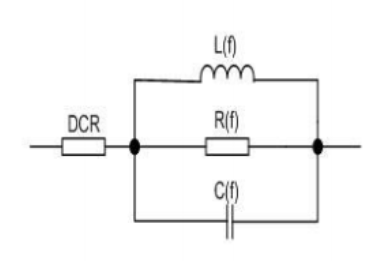
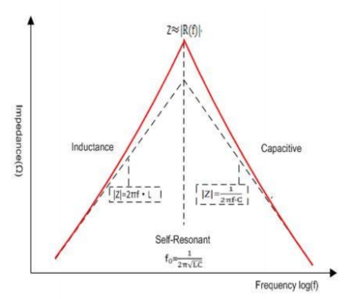

# 嵌入式可靠性基础6【国家标准】

达到国家标准是嵌入式可靠性设计的最基本要求，国标限制了某一类产品的最低安全规格，如果产品无法达到要求，很有可能造成严重后果，轻则产品无法出售或被退回，重则可能危害用户安全

为了满足国家标准，工程师应当了解自己产品所处领域的国标条例，并从中总结与自己工作有关的部分，从而让设计满足标准的要求

对于消费电子产品，最常用到的国标就是《**GB8898-音频、视频及类似电子设备安全要求**》和《**GB4943信息技术设备的安全**》。这两个国标手册可以在eetop上下载到

本章主要在整体层面上说明安规的重要性，同时介绍一些安规相关的知识

## 器件基础知识拾遗

在开始前，先来复习一下一些基础器件和可靠性有关的规格知识

### 电阻

电阻失效一般是由于物理失效或热失效，*物理失效*即电阻受到内外力断裂，*热失效*就是电阻通过电流引起发热超过自身散热能力导致烧毁。先来看贴片电阻的尺寸

如上图所示，我们一般使用英制尺寸来指明电阻物理大小

贴片电阻、电容、电感的尺寸大都是统一的，可能有些贴片电容、电感具有自己的特殊封装（比如排电容、穿心电感）。以0805封装为例，08代表`0.08 inch`，05代表`0.05 inch`，根据`1 inch = 25.4mm`，可以发现0.08封装器件尺寸`2mm x 1.25mm`，也就是对应公制尺寸2012。一般来说贴片器件都要制造成扁长方体，因此高度应当小于1.25mm。0603、0402等器件也都按此规则确定尺寸

电阻的尺寸和规格不仅仅决定了其能够承受的最大电流，也影响到其能耐受的电压。如果耐压过低，采用薄膜工艺制造的电阻很有可能发生击穿现象；对于电容、电感来说其外形尺寸还会影响特征频率，在高频电路中尤为明显。

> 说句题外话，制造中常用的mil单位是inch的千分之一，即`1 mil = 0.001 inch`

电阻的精度标准由EIA（美国电子工业协会，Electronic Industries Association）规定，下表给出了几个系列的精度标准

| 标称 | E3             | E6           | E12  | E24  | E48  | E96  | E192                 |
| ---- | -------------- | ------------ | ---- | ---- | ---- | ---- | -------------------- |
| 精度 | ±50%（已淘汰） | ±20%（少见） | ±10% | ±5%  | ±2%  | ±1%  | ±0.5% ，±0.2%，±0.1% |

市面上目前较常见的贴片电阻大都采用E96标准，精密电阻则一般采用E192标准。部分直插电阻（尤其是碳膜电阻）还在遵循E12或E24标准

### 电阻噪声

低频下，无源器件经常被视为理想的，但实际上也存在噪声，即使器件开路，两端也会存在电压差，更会与外加电压叠加产生干扰，这被称为**固有噪声**。电阻的固有噪声分为两种，一种是电阻**热噪声**，另一种为**电流噪声**

虽然电阻在宏观来看呈电中性，但电子浓度的瞬时值存在梯度，因此任意两小块体积内会形成电势差，这个电势差引起的噪声主要和温度有关，因此被称为**热噪声**或**约翰逊噪声**，它是电阻噪声的主要来源

> 由导体中自由电子的不规则热运动使导体任意两点间发生电压的不规则变化称为热噪声

热噪声在频率特性上等幅分布，属于典型的白噪声，且属于系统本征噪声，无法消除。

热噪声服从高斯分布（满足中心极限定理），均方根电压幅值等于高斯分布在±1σ范围内分布的振幅，应用中也可能用3σ原则近似噪声峰值

电阻两端开路时，它的热噪声有效值为
$$
E_t=\sqrt{P_t}=\sqrt{4kTRB}
$$
其中k为玻尔兹曼常数，T是开氏温度，R是电阻值，B是系统等效带宽

> 计算可得：当温度是27度（300K）时，10KΩ的电阻在100kHz激励下，开路热噪声有效值是4uV

根据该公式，温度越高、电阻越大，热噪声就越大。频谱密度与带宽开方后的数值相乘可以计算出带宽内白噪声的大小，所以在计算热噪声时，需要指定截止频率，也就是确定器件的带宽。

> 根据经验公式，电阻每增大一倍，信噪比增加3dB
>
> 容易理解，**两个电阻串联产生的噪声等于两个电阻阻值和对应的噪声；两个电阻并联产生的噪声等于两个电阻并联后阻值对应的电阻的噪声**

电流噪声也称为**过剩噪声**，主要由材料和制造因素引起。电阻薄膜并不均匀，因此当电流通过电阻时也不能均匀流经电阻的每一个区域，当某个区域较为密集时，就会产生过剩噪声

线绕电阻和金属氧化膜电阻的不连续性较小，使得过剩噪声较小；而碳膜、合成膜电阻的不连续性较大，导致过剩 噪声更大。综合考虑下金属氧化膜电阻、金属膜电阻、绕线电阻具有更小的固有噪声，因此对于需要低噪声放大的场合，这些电阻是最适合的

由于过剩噪声的存在，电阻固有噪声往往大于热噪声。但电流噪声往往会在带宽变大时下降，这是由于趋肤效应，因此电阻*固有噪声并不会一直按照热噪声的关系变化*（不是电阻越大、带宽越大噪声就越大）

### 电阻的失效特性

在长时间的使用过程中电阻阻值也会产生变化，*额定电压和功率下，电阻具有较长的使用寿命，估计值为10万小时以上*。虽然没有定型的数学模型来说明，但通常认为温度每增高10度，电阻器件寿命缩短一半。

电阻的失效模式和机理如下：

* 开路：主要失效机理为电阻膜烧毁或者大面积脱落，整体断裂
* 阻值精度偏移：受外界影响导致电阻膜故障，电阻阻值偏移超出规格
* 引线断裂：由于焊接等工艺缺陷导致焊点污染，机械应力损伤
* 短路

### 电容寄生参数

实际电容具有比理想电容更复杂的高频等效模型，可以看成是一个由理想电容、ESR、ESL串联成的RLC串联网络，这就导致电容的寄生参数需要被纳入考量。

这里我们主要关注ESR，它对嵌入式可靠性的影响相对最大。理想电容为了维持两端电压不变，会吸收或释放大电流，而ESR会将大电流转换成尖峰电压
$$
\Delta V = \Delta I * ESR
$$
同时，ESR上的大电流会引起热效应，从而使电容发热
$$
W=\Delta I ^2 *ESR
$$
这会导致滤波电容上会出现额外的纹波电压。不过，ESR也不是没有利用价值——一部分电源，尤其是LDO，会利用输出电容的ESR来形成快速反馈从而让电压稳定下来，这也是LDO不能缺少输出电容的原因之一

而从嵌入式可靠性的角度，ESR导致电容发热是影响电容寿命的重要问题，因此需要针对应用选取合适的电容

### 电容精度和温度系数

电容器实际电容量与标称电容量的偏差称*误差*，在允许的偏差范围称*精度*

标称电容量是标识在电容器上的电容值，这也是电容器制造时参考的标准，但由于制造和存储时产生的误差，允许产生误差。电容器的允许误差值分为绝对误差和相对误差

* 绝对误差

    以电容量的值的绝对误差表示，这种表示方法通常用于小容量电容

    | 标称 | B      | C       | D      | Y    | A      | V    |
    | ---- | ------ | ------- | ------ | ---- | ------ | ---- |
    | 精度 | ±0.1pF | ±0.25pF | ±0.5pF | ±1pF | ±1.5pF | ±5pF |

* 相对误差

    以电容量标称值的偏差百分数表示

    | 标称 | D     | P       | F    | R      | G    | U     | J    | K    | M    | S         | Z         |
    | ---- | ----- | ------- | ---- | ------ | ---- | ----- | ---- | ---- | ---- | --------- | --------- |
    | 精度 | ±0.5% | ±0.625% | ±1%  | ±1.25% | ±2%  | ±3.5% | ±5%  | ±10% | ±20% | ±50%/-20% | ±80%/-20% |

温度也会对电容值造成影响，电容的**温度系数**是指在给定的温度间隔内，温度每变化1℃时，电容的变化数值与该温度下的标称电容的比值，单位一般为ppm，计算公式如下
$$
\frac{\Delta C}{C}=\frac{C_{max}-C_{min}}{C_{typical}} \times 100\%
$$
自然地，上面提到的ESR导致温升就会改变电容的温度，因此温度系数更优秀的电容往往可以容忍更高的ESR（不过这样的电容一般在制造时就会采用较小ESR的工艺）

### MLCC的规格

电容的分类暂且略过，这里主要提一下片式多层陶瓷电容器MLCC的规格

参照国际电工技术委员会（IEC）和美国电子工业联合会（EIA）标准，根据MLCC容值随温度变化的规律，对陶瓷MLCC电容分为两个类别：I类和II类，I类使用顺电陶瓷制成，II类由强介铁电陶瓷作基材。I类MLCC使用的EIA规格查找表如下所示

I类MLCC在电子产品上不太常用，不过其中C0G、U2J两个指标电容也可以在产品上看见。

> 根据上表，容值随温度变化大小为：温度系数代码 x 倍乘因数代码 ± 随温度变化容差，单位是ppm/K
>
> 因此C0G的含义就是0±30ppm/K，U2J表示容值随温度变化为-750±120ppm/K

II类MLCC规范就比较常见了，查找表如下

、

工业中常用的X5R电容就表示工作温度在-55~+85℃，整个温度范围内容值变化为±15%

由于I类MLCC使用的介质材料介电常数比较低，导致它们的容值普遍低于II类MLCC，这也就是为什么工业上I类MLCC不太常见的原因了。

> 同样容值的I类和II类MLCC，II类MLCC可以做得更小，符合当前电子产品微型化趋势

不过在一些需要高可靠性的场合下，我们能看到对C0G电容的要求

如上图，I类MLCC容值几乎不随温度产生变化，因此适用于高温/低温场景下高精密设备

X5R、X7R电容在外加直流电压时，随着外电压增大，材料介电常数会变小，导致电容值变小，而I类电容不会出现这样的情况，如下图

同样，C0G在交流电压下不会产生很严重的容值偏移

> 对于高电容（hi-cap）器件，即C值以uF为单位的MLCC，其直流偏置效应也是需要考虑的重要因素。
>
> 直流偏置是基于施加的直流电压而导致电容降低的效应。在额定电压下，电容有可能下降到标称值的20%左右。使用I型MLCC有助于避免直流偏置效应，但这会带来产品成本的提高

I型MLCC还在ESR、Q值、发热量上具有明显优势，因此在高可靠性领域I型是比II型更具优势的

### MLCC的老化现象

MLCC还存在**老化现象**。老化现象会导致MLCC的容值随着时间的推移而损失，在每个对数尺度差距下的损失大约在1%到6%之间，MLCC的容值越高且内层越薄，MLCC就越容易老化

> 很多用了许多年的服务器，电路已经出现了MLCC的严重老化，这时候MLCC的指标只能满足最低运行要求，可能无法满足整个系统启动时的高负荷，因此这样的服务器一旦关机就有可能再也重启不了

特别地，MLCC器件的老化是可逆转的，只需要进行适当加热（放置在+150°C温度下1小时，然后静置24小时），即可焕发新生

### 为什么高压情况下不使用MLCC

我们经常看到在服务器电源上会使用到巨大的电解电容，这时候自然而然有一个想法：如果换成高压MLCC堆叠是不是可以把高功率电源的尺寸降到最低？

理论上是可行的，MLCC在性能上要远远优于电解电容，而随着现在制造工艺的提升，高压大容量MLCC也成为可能。但有两个致命的问题：成本和可靠性

大容量MLCC往往非常昂贵，对于服务器电源这种非军工非科研用途的设备来说是负担不起的

另外MLCC在长期使用中，会出现老化和容值偏移现象，在外加高压时尤为明显，在长期使用中的稳定性不如电解电容——很多时候电解电容即使漏液也不会出现太大的容值偏移或耐压降低。此外，大型MLCC外壳非常脆，容易随PCB老化出现微小形变甚至断裂，一旦断裂或击穿就会发生短路失效，在大功率环境下极其容易引发明火。

综上所述，在高压高功率环境下往往要避免使用MLCC

### 电容损耗

电容在电场作用下，在单位时间内因发热所消耗的能量叫做**损耗**。电容的损耗主要由*介质损耗*，*电导损耗*和电容所有金属部分的电阻所引起。

介质损耗包括介质的漏电流所引起的电导损耗以及介质极化引起的极化损耗等；金属损耗包括金属极板和引线端的接触电阻引起的损耗。从实际电容高频等效模型上就可以看出引起损耗的原因，这里不再赘述

由于电容器损耗的存在，使加在电容器上的正弦交流电压与通过电容器的电流之间的相位差不再是90度，而是稍小于90度，偏离90度的夹角被称为**损耗角**。习惯上以损耗角正切$tan(\delta)$表示电容器的损耗大小，称为损耗因数。

电容器损耗因数是衡量电容器品质优劣的重要指标之一。各类电容器都规定了在某频率范围内的损耗因数允许值.在选用脉冲、交流、高频等电路使用的电容器时应考虑这一参数。

### 品质因数

大家可能都习惯于在选型时了解电感的品质因数，但电容也可以定义品质因数，即
$$
Q_C=\frac{\frac{1}{\omega C}}{ESR}
$$
表示电容的存储功率与损耗功率之比

### 电感

电感的3个重要参数：温升电流、饱和电流、自谐振频率

寄生电阻是电感在直流下（或谐振时）呈现的阻抗，它与电感封装热阻共同决定了温升电流。**温升电流**用$I_{rms}$表示，即加电流后，电感器件自我温升温度不超过40℃时的电流。如果负载电流超过温升电流，将导致电感迅速升温，若外界散热措施不到位极有可能导致器件烧毁

**饱和电流**是指在外加电流下器件电感值下降到原来的30%的电流，用$I_{sat}$表示。实际电感不可避免地会出现磁损，随着外加电流的增大，磁损也会增大，表现在电路中就是电感下降，本应作为无功功率存在的电流会转换成有功功率使电感升温。如果负载电流超过饱和电流，电感将几乎呈现为阻性，导致阻抗减小、发热剧增，同样可能导致器件烧毁；即使散热措施到位，饱和后的电感也不能够作为正常的器件使用，这时电感被视为*失效*

> 饱和电流的定义与电感工艺和磁芯材料有关。使用无气隙的铁氧体材料制成的电感一般具有较为陡峭的磁滞回线，有些厂家会将其衰减10%时对应的外加电流定为饱和电流；对于硅钢片等磁材料磁芯电感，会适当放宽饱和电流要求。这里的30%是指电路中常见的铁粉磁芯电感

因此，我们在电路设计中应当取饱和电流和温升电流的最小值作为电感工作电流，同时因为电感长期工作在高频电路中，一般**取80%降额**作为能够使用的电感工作电流

**自谐振频率**是指电感感抗达到最大的频率点，用SRF表示。当电流频率低于SRF时，感抗随频率增加而增加；当频率等于SRF时，电感感抗达到最大值；电流频率高于SRF，感抗随频率增大而减小。

不同于电容在低于自谐振频率区间才能正常使用；电感必须工作在自谐振频率附近。如果外加电流频率远低于电感自谐振频率，那么电感将呈现阻性，RMS电流只会导致电感升温；如果频率远高于自谐振频率，电感将呈现容性

常见的电感有下面几种：

* **环形电感**

    环形电感具有闭合的环状磁路，对外磁场辐射少，但体积较大。在高端领域被扁平铜线圈电感和高密度PCB电感取代

    绿环：锰锌铁氧体。高频损耗大，磁导率高，常用于滤除共模干扰，但对频率较高的噪声抑制作用较弱

    黑环：铁硅铝。磁导率适中，常用作储能电感

    黄白环：铁粉磁芯。磁导率低，常用作开关电源的主储能电感

* **立式电感**

    和环形电感类似，但使用PVC骨架支撑并引出针脚，常用作输入侧的共模电感，感量较大

* **工字电感**

    常用于小功率电源滤除输入差模干扰或用于小电流升压。体积相对较小，具有高Q值、低阻抗、低分布电容的特点。但其磁路是开放的，EMI问题比较严重。感量一般在1-3mH

* **色环电感**

    与工字电感一样，由导线在陶瓷骨架上缠绕制成，一般用于小功率电源的π型滤波或各种高频电路作为感抗器件。体积大，只能容许小电流通过，且存在较严重的EMI问题。目前正在被贴片电感取代

* **绕线贴片电感**

    在氧化铝芯绕制铜线而成。与色环电感类似，但NLV型贴片电感一般具有高Q值，常用于射频电路。目前村田murata是为数不多的绕线贴片电感生产商，其电感能够实现低直流阻抗，具有非常高的Q值且能够耐受大电流通过

* **叠层贴片电感**

    目前最主流的贴片电感，采用叠层工艺制造，尺寸小、Q值高，但感值不容易做大。饱和电流非常小，一般只能用于信号线滤波或射频电路

* **功率贴片电感**

    基于新叠层工艺的贴片电感，能够耐受2A以上的电流通过，Q值高、尺寸小，常作为小功率板载电源的主电感

* **一体成型电感**

    基于一体成型工艺的贴片电感，在扁铜线圈外使用铁粉压铸而成，磁路闭合，对外EMI微弱。但由于工艺限制，Q值一般不高，常用于电源电路

* **高密度PCB电感**

    基于HDI工艺设计的集成在PCB上的电感。采用微孔在多层板上设计环形的电感导线，并在PCB两端插入铁氧体磁芯制造。具有体积小、阻抗低、Q值高、饱和电流大的特点，但两侧铁氧体磁芯对接时会产生气隙，磁路无法完全闭合而导致EMI问题。常见于高功率密度电源

### 磁珠

磁珠（或者说磁环）与电感不同，它是在有效工作频带内呈现阻性的器件，它的阻值会随频率变化。**低频**下，磁珠呈现**电感**特性，阻抗较低，磁芯损耗较小；随着**频率升高**，磁珠的电阻增大、感抗减小，磁珠呈现**电阻**特性。因此当高频信号通过磁珠时，电磁干扰被吸收转换成热能消散；而较低频信号通过磁珠时，可能会发生谐振，干扰现象加剧。

电感滤波的过程是将电能转化为磁能的过程，可能会导致更严重的EMI；但磁珠直接将高频信号的能量转化成热能，不会对周围环境造成二次干扰，并且磁珠与电容配合使用不容易出现谐振情况，因此适合用在模拟信号输入端或模拟电源输出端

磁珠的等效电路如下图所示

其小信号等效模型是一个LCR并联网络后串接DCR电阻。磁珠直流电阻DCR是一个恒定值，由磁珠的导体电阻决定；后三个元件参数随频率变化而变化。当频率低于磁珠LC谐振频率$f_l$时，磁珠呈现电感特性；频率高于$f_l$时，磁珠呈现电容特性。幅频特性如下所示

在选型时，应当注意磁珠的典型阻抗、直流电阻DCR、额定电流。磁珠的阻抗在EMI噪声频率处应达到最大，磁珠的典型阻抗以$\Omega @ f $形式标注，即在什么频率下达到的峰值阻抗是多少，在选型时可以参考要滤除的EMI噪声来选择。

大部分磁珠被用于电源线或参考平面回流路径滤波，在有偏置电流的情况下，随电流增加，磁珠峰值阻抗减小，同时阻抗峰值点的频率也会变高。因此在低频大偏置电流应用（电源线）情况下应该选择大尺寸、阻抗幅频特性平缓的磁珠，以获得更好的阻抗特性；在在高频应用（信号线）中，则应该选取小尺寸、阻抗幅频特性陡峭的磁珠以减小串联电感

磁环常常用于电源线或高速信号线束末端。在高速数字系统中，设备内部空间杂散EMI非常严重，而较长的信号线或电源线就成为了吸收EMI的天线。针对可能的干扰，在线束末尾加一磁环可以很好地减轻EMI影响

## 电路安规

### 电阻的失效机理 

常见的电阻失效是由于腐蚀、断裂、振动引起的。

**腐蚀**就是因为空气中潮气深入，膜式电阻上涂层成分和杂质同潮气形成化学电池，使得**电阻阻值增大**，直至损坏开路。**断裂**常发生在贴片电阻上，由于其抗机械应力能力差 ，在靠近板边或接插件附近的电阻经常受到电路板形变带来的纵向作用力，使得电阻出现裂纹，导致**电阻开路**；但在一些情况下，断裂电阻会出现**短路**情况。可调电位器容易受到振动影响，旋钮被振松后导致调整值出现偏差

> 大部分产品都要求在调好电位器组织后要加固定胶

### 电容的失效机理

电容的失效机理相对复杂，比较典型的情况包括：引脚/电容体断裂、低电压失效、热爆裂、电解液干涸、过压失效

当应力集中在电容引脚或焊盘连接点时，容易导致电容引脚脱离焊盘，这就是**引脚断裂**，常发生在大的电解电容上。由于引脚断裂属于疲劳断裂，卧式和立式的安装方式都会受到影响。一般为了应对该情况，要在电容底部涂敷硅橡胶固定；极端情况下，冲击力会导致硅橡胶被拉伸到极限长度（硅橡胶拉伸强度4~5MPa，伸长率最高可达200%），电容仍会受到较大的拉伸应力和剪切应力，因此推荐使用E-4X环氧树脂胶，能够很好地应对引脚断裂

对于安规电容来说，耐压裕量留的太大常常会导致**低电压失效**。在较大湿度下，因为电容不密封，会让潮气渗入，在电容加压后，潮气表面会因为导电形成漏电流，从而让电容储能特性大大降低；但经过2小时以上高温储存后，电容性能又可以恢复；将电容拆下，两端加不低于0.7倍额定电压的电压值一段时间后，再装机会发现电容性能也可以恢复，这是因为高电压导致漏电流路径上电热效应将水分蒸干，因此在设计电容时按照III级降额到70%额定值是比较妥当的

**热失效**主要发生在电解电容上，极端情况下的热失效会让电容内电解液受热膨胀，当内部压力大于大气压足以撑开电容壳体后，就会发生**热爆裂**。热失效分为内热和外热，外热是由电解电容环境温度过高导致的，这会让**电解液干涸**，从而让电容值下降；内热是由于电容ESR存在，在高频大电流情况下，电流会因为ESR产生热量，从而让电解液受热膨胀，是热爆裂的元凶之一。

**过压失效**不难理解，外加电压超过额定电压，或随电容寿命减少，额定电压低于外加电压后，会出现电容击穿，电解液直接通过电流，受热膨胀后出现热爆裂

### IC和功率器件失效机理

IC的失效通常由EOS损伤、ESD损伤、MSD损伤、内部故障等带来

**EOS损伤**（电过应力损伤）主要分为**电压损伤**和**电流损伤**，分别是由于引脚过压和芯片内部电路过流导致。电压损伤后果是单个或部分引脚开路、短路或功能异常，是非完全性损伤；而电流损伤本质上是热损伤，一般发生后就会让芯片直接烧毁，无法工作

**MSD损伤**即潮敏失效，是由于IC封装内的水汽在突然高温情况下迅速汽化，随着温度进一步提高，气体在不能瞬间被释放的情况下气压迅速增高，克服禁锢气体的密封材料，让IC封装崩裂

> 这个过程类似于爆米花制作过程，因此又被称为**爆米花效应**

MSD损伤中前提的水汽可能是在封装过程中不慎引入，也可能是封装空隙中渗入的潮气。一般MSD损伤会让从引脚到die的导电带崩裂，使某个或部分引脚开路。一般MSD损伤发生在焊接前后，且具有批次性、随机性，但与故障器件的存储环境高度相关

**ESD损伤**则是由于外部引入的静电干扰由于某种原因未能被排除导致的。外部静电顺引脚直接进入芯片，引起瞬时大电流烧毁die内部走线，通常会引起部分引脚开路或芯片工作异常。通过在关键位置优化ESD防护措施、让芯片引脚全部接地/接VDD/参考源可以尽可能防止ESD损伤

功率器件失效和IC失效机理基本相同，最大的不同是大电流引起发热导致的**热失效**在功率器件中占据很大比例，通过对功率器件的降额设计和散热设计能缓解或解决失效问题

### 电感和磁珠失效机理

磁珠/磁环和电感的失效机理类似，主要都是由于机械应力和热应力导致。

磁珠材质较脆，更容易受到**外部机械应力**影响，导致开路，因此不应当在直插接插件3cm内或PCB边缘布放磁珠（贴片叠层电感/小一体成型电感同理），如有可能 ，应当对导线上的磁环进行固定和粘接

当磁珠和电感上通过大电流时，热量较大无法及时散掉，就会导致磁珠/电感整体受热不均，让磁珠由于内应力出现裂纹或让电感外层磁芯裂开，导致导磁材料气隙增大，影响导磁性能，让磁珠/电感感抗下降，这是**热应力**导致失效

### 安规测试后的电强度和连续漏电流

正常温度安规试验后的**电介质强度**如下表所示

| 被试绝缘           | U<=50 | U<=150 | U<=250 | U<=1000    | U<=10000  |
| ------------------ | ----- | ------ | ------ | ---------- | --------- |
| 基本绝缘           | 500   | 1000   | 1500   | 2U+1000    | U+2000    |
| 辅助绝缘           | 500   | 2000   | 2500   | 2U+2000    | U+3000    |
| 加强绝缘和双重绝缘 | 500   | 3000   | 4000   | 2(2U+1500) | 2(U+2500) |

正常温度安规试验后的**连续漏电流**如下表所示

| 种类       | 测量状态     | 漏电流/mA |
| ---------- | ------------ | --------- |
| 对地漏电流 | 正常状态     | 0.5       |
| 对地漏电流 | 单一故障状态 | 1         |
| 外壳漏电流 | 正常状态     | 0.1       |
| 外壳漏电流 | 单一故障状态 | 0.5       |

## 电源安规

电源类产品的国家标准称为电源安全规范，即电源安规。每个国家都有不同的安全标准，比如我国的3C认证，过不了安规检测的产品是不合格的，不允许上市销售

### 爬电距离

安全距离包括**电气间隙**、**爬电距离**和**绝缘穿透距离**

**电气间隙**是指两相邻导体或一个导体与相邻电机壳表面*沿空气*测量的最短距离；**爬电距离**指两相邻导体或一个导体与相邻电机壳表面沿*绝缘表面*测量的最短距离；**绝缘穿透距离**是指设备在正常工作时可能承受的最大电压，超过这个最大电压后，此绝缘体不再绝缘时的厚度。

对工作电压小于交流50V（71V交流峰值）或直流70V时，无厚度要求；加强绝缘厚度最小应为0.4mm

> 爬电是指由于导体周围的绝缘材料被电极化，导致绝缘材料呈现带电的现象，出现爬电时的带电区半径即爬电距离。

一般常用的规范如下

很多具有空间限制的产品中，能够满足电气间隙而不能满足爬电距离，这时候就要考虑在PCB上**开槽**——在两个器件之间最近的地方设计槽孔，相当于将爬电距离拉大

有些时候为了满足空间要求，还会采用填充绝缘材料的方式增大电气间隙和爬电距离，比如在两个器件之间涂抹绝缘硅胶
