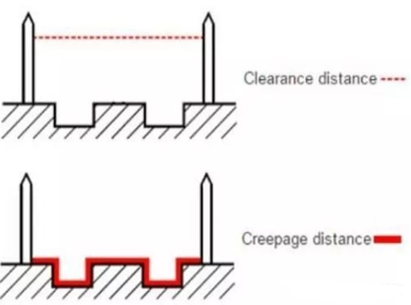
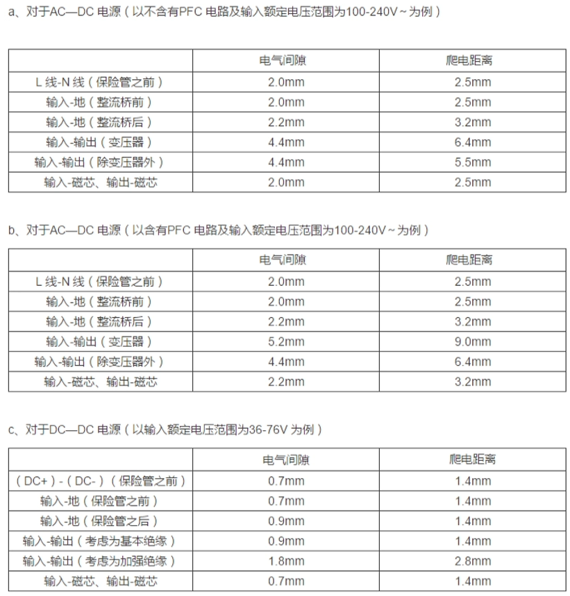

# 嵌入式可靠性基础6【国家标准】

达到国家标准是嵌入式可靠性设计的最基本要求，国标限制了某一类产品的最低安全规格，如果产品无法达到要求，很有可能造成严重后果，轻则产品无法出售或被退回，重则可能危害用户安全

为了满足国家标准，工程师应当了解自己产品所处领域的国标条例，并从中总结与自己工作有关的部分，从而让设计满足标准的要求

对于消费电子产品，最常用到的国标就是《**GB8898-音频、视频及类似电子设备安全要求**》和《**GB4943信息技术设备的安全**》。这两个国标手册可以在eetop上下载到

本章主要在整体层面上说明安规的重要性，同时介绍一些安规相关的知识

## 电路安规

## 电源安规

电源类产品的国家标准称为电源安全规范，即电源安规。每个国家都有不同的安全标准，比如我国的3C认证，过不了安规检测的产品是不合格的，不允许上市销售

### 爬电距离

安全距离包括**电气间隙**、**爬电距离**和**绝缘穿透距离**

电气间隙是指两相邻导体或一个导体与相邻电机壳表面*沿空气*测量的最短距离；爬电距离指两相邻导体或一个导体与相邻电机壳表面沿*绝缘表面*测量的最短距离；绝缘穿透距离是指设备在正常工作时可能承受的最大电压，超过这个最大电压后，此绝缘体不再绝缘时的厚度。

对工作电压小于交流50V（71V交流峰值）或直流70V时，无厚度要求；加强绝缘厚度最小应为0.4mm

> 爬电是指由于导体周围的绝缘材料被电极化，导致绝缘材料呈现带电的现象，出现爬电时的带电区半径即爬电距离。

一般常用的规范如下

很多具有空间限制的产品中，能够满足电气间隙而不能满足爬电距离，这时候就要考虑在PCB上**开槽**——在两个器件之间最近的地方设计槽孔，相当于将爬电距离拉大

