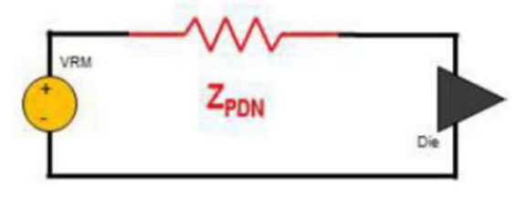
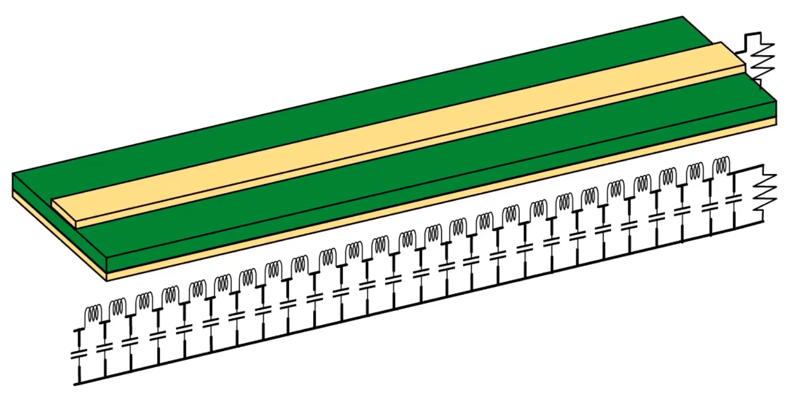
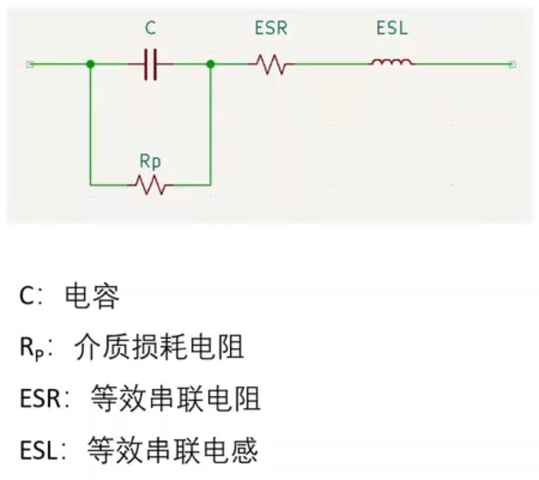
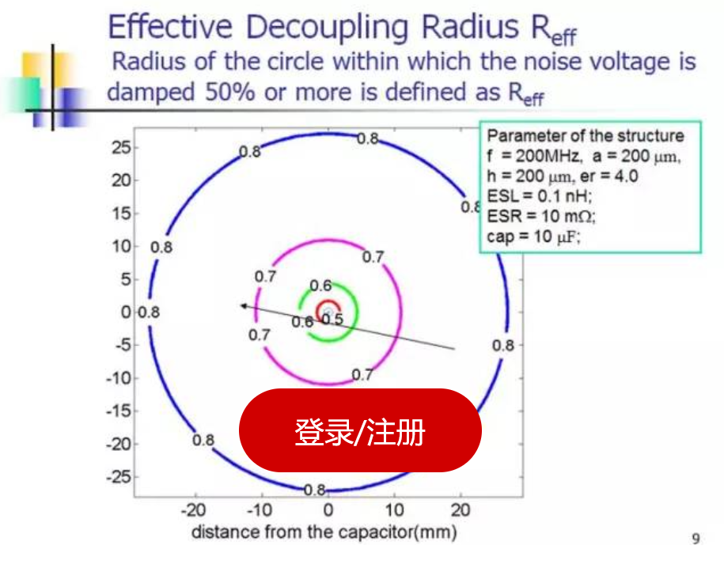

# 电源完整性分析笔记2【PDN】

**PDN**即电源分配网络（Power Distribution Net），是将电源功率从VRM输送给负载的实体路径，PCB上的电源回路走线、参考平面、滤波电容、分布参数等与电源信号有关的网络都是PDN的一部分。电流通过PDN从VRM流向负载终端，再通过PDN回流路径返回VRM。PDN的作用就是为负载提供稳定的电压，快速响应负载电流变化，尽可能削弱SSN和电源噪声

### PDN上的噪声来源

PDN上的噪声主要有**电源噪声**、**同步开关噪声SSN**、**EMI噪声**三种，它们是主要的电源完整性干扰源

电源噪声产生的原因：

* 电源本身的噪声纹波
* 负载调整率
* 电源变化在电源路径上产生IR压降

SSN产生的原因：

* 直流DC问题：大量IC开关的脉动直流加在PDN等效电阻上产生IR压降
* 交流AC问题：信号电流通过PDN的分布参数建立回流路径

EMI噪声产生的原因：

* 来自其他信号回路的EMI干扰
* 来自不同PDN不同电压支路之间的EMI干扰
* 来自高频芯片或射频天线的EMI干扰

## PDN阻抗

### 高频电路的传输线

### 返回路径

> SI中的一切问题总与返回路径有关，PI的种种问题也总能体现在返回路径上

想要深入理解返回路径问题，我们要先从麦克斯韦的**位移电流**（Displacement Current）理论谈起：导体中有电流即代表导体中存在电场，而当这个电场发生变化时，就会产生位移电流，表达式如下
$$
I_D=\frac{\partial}{\partial t} \iint_S \vec{D} \cdot d\vec{S}
$$
而对于两个靠近的导体，如果它们之间存在变化的电场，那么也会在二者之间产生位移电流——记得大学物理中提到过变化着的电场（即位移电流）可以存在于真空、导体、电介质中，这不同于只能存在于导体中的传导电流。在电路理论中，我们常把位移电流这种随电场变化产生电流的现象抽象成*电容*

回到传输线中，我们可以发现考虑位移电流的情况下，原本双层板上并行的两根导线就会变成一个个电容器的两极板，如下图所示

### 分布参数

由于PDN网络并不是理想的导体，各个组成部分都存在着寄生电感、电阻特性，因此在功率传输的过程中会产生电源电压波动、功率损耗和功率传输延时。需要我们通过PCB板、封装甚至DIE上进行滤波设计来满足功率的可靠传输。

芯片需要外部提供高频电流来满足IO翻转、指令的传输需求，而VRM能够提供的是DC到几十KHz的低频电流

如果直接将VRM的电源供给芯片显然不能满足要求。由VRM到芯片的供电路径上不可避免的会存在过孔、平面、封装管脚以及封装内部的布线和平面等物理结构，这些结构都或多或少的表现为感性和阻性，高频电流流过会产生电源跌落。

从另一方面，电感的高频阻抗较高，对芯片需求的高频电流来说会带来功率传输的延时。为解决电感给供电系统带来的问题就需要用到各种频带的电容。VRM在非常低的频率范围内起作用，一般为DC~几十KHz；Bulk电容在几十~几百KHz起作用，一般为电解电容或者钽电容；陶瓷电容的作用频率一般为几M到几十MHz范围内；更高频率的就是电源平面的电容一般在几百MHz。此外一些高端芯片在封装内部会有封装电容、芯片的die上也会有on die decap，由于package decap和on die decap拥有很小的电感，这样就更好为芯片提供高频供电。

### PDN阻抗

PDN设计的目的就是为了保障芯片的电源供应稳定可靠，主要包含两部分内容：

（1）电流从VRM输出到芯片端由于直流电阻的存在会产生一个IR drop；

（2）VRM和芯片的高频电流需求使得电源产生电压噪声。

IR Drop与PDN的直流电阻有关，电源噪声和PDN的交流阻抗相关。电流一定的情况下电阻和阻抗越小IR Drop和电源噪声越小

而PDN的阻抗我们通常用负载端的自阻抗来衡量。所谓自阻抗就是从芯片负载向VRM看去的阻抗，我们可以想象一下，芯片负载是电流的需求方，它要将电流从VRM拉到自己这里，那么自阻抗越小就越省力，产生的噪声也就越小

自阻抗的定义 ： *Z**ii**=**U**i/**I**i*，*I**j* =0，j *≠i* 。

自阻抗的物理意义，在端口i注入电流，其余端口都没有注入电流时在端口 i产生的电压 。PI仿真中主要是看PDN自阻抗，自阻抗越小PDN性能越好。

互阻抗的定义 ： *Z**ji**=**U**j/**I**i* ，*I**j* =0，j *≠i*

互阻抗的物理意义，在端口i注入电流，其余端口都没有注入电流时在端口 j产生的电压 。互阻抗描述了两个端口间的相互干扰，互阻抗越小两个端口之间的相互干扰越小。当一个PDN用存在多个用电芯片时，为了避免负载之间的相互干扰就需要对其互阻抗进行分析。

## PDN Layout

在开始PDN布线技巧的讲解前，我们先补充一些元件相关的基础知识

### 电容高频等效电路

进入高频线路后，电容模型需要经过修正，变成非集总参数下的电容等效电路模型。一个电容的等效电路如下图所示

可以发现电容中加入了ESL这个重要影响因素，并且由低频下的一阶电路变成了二阶的RLC串并联网络，这会对电路的分析造成很大困难，不过我们往往并不需要精确计算（事实上仿真软件会基于更精确的模型进行有限元分析，而在高频下的电路模型依赖于这些仿真软件）

对于PI，我们需要关注的是ESR、ESL在高频下对电容造成的影响。根据二阶电路基本理论，电容的阻抗会随频率出现如下变化

曲线的极值点就是电容的**自谐振频率**
$$
\frac{1}{2\pi \sqrt{ESL \times C_0}}
$$
当电容两端激励频率小于自谐振频率时，整体呈容性，且频率越高，等效容抗越大；当大于时，整体呈感性，且频率越高，等效感抗越大。

**我们一般希望电容在PDN中充当低阻抗器件**。因此在低频时，电容的C0主导电气特性，想让电容的阻抗更小，就需要更大的电容元件；电路工作在高频时，电容的ESL起主导作用，就需要选择更低ESL的电容。

> 电容值和容抗成正比，电感值和感抗成反比——对应电容值越大，容抗越小；ESL越小，感抗越小

在这里重申：低频下的电容和高频下的电容分别由C和ESL作为主导，几乎可以看成是不同的器件

### MLCC

MLCC就是我们常说的贴片电容。随着电路集成化需求发展，在24V以下的领域，直插电容逐渐被贴片电容取代。同时带来的还有ESL、ESR的变化：过去我们常常将103、102瓷片电容用于高频应用，而将大号100uF电解电容用在低频滤波，这是因为基于不同封装，它们的ESL也存在很大不同，一般电容体积越小，ESL也就越小；但随着MLCC快速发展，10uF乃至100uF的MLCC和10nF、1nF的MLCC具有相同的封装，它们的ESL也都比最小的瓷片电容还小，因此这样的高低频差异开始模糊化。

现在我们认为，**对于ESL，MLCC小于贴片电解电容小于直插瓷片电容小于直插电解电容。**

除了ESL以外，MLCC还带来了更小的ESR，这对电源应用来说也有着重大意义：ESR降低就是电容发热降低，热阻一定的情况下，小体积的MLCC可以通过和大体积高频低阻铝电解电容相当乃至更大的电流。

> 随着电容制造技术的发展，一些特殊的电容被制造出来用以获得更低的ESL。降低ESL的目的就是为了让电容能够更好地应对高频电子线路中的高频噪声。
>
> 电容并联可以有效降低ESL，于是四个电容合而为一的“**排电容**”被用于处理；电容两端信号反向，当信号线靠近时串扰会导致互阻抗相减，因此短而宽的低自感芯片电容**LICC**出现，同样是0805的规格，但能够减小环路面积，获得将近四分之一于普通0805电容的ESL；结合这两种思路的下一代电容就是岸面栅格阵列**LGA**电容，将电容布局横过来，同时相当于四个乃至更多电容的并联叠放，即可得到十分之一于同体积电容的ESL，从而将自谐振频率大大提高，让PDN获得更低的阻抗

### PDN中去耦电容的设计思路

* 选用高容值、小尺寸的MLCC
* 在系统几倍减小去耦电容ESL（比如尽可能减小电源环路的面积）

需要牢记：去耦电容是为了控制PDN阻抗而设置，不要为了滤波而滤波。将PDN阻抗在合理预算下控制到合理的范围内，这才是可靠、高性能的电源设计方法

> 如果有必要，还是应该用仿真软件跑一下

### 电容滤波半径

​	传统的说法,电容有其滤波半径,低频电容滤波半径大,所以布局的时候可以放的稍微远一些。并且常规来说,单纯滤波作用的低频电容不要扎堆布局,讲究均匀摆放。而中高频电容的滤波半径较小,需要严格靠近芯片管脚放置,不能离得太远,要不然电容就“不起作用”了。

​	这个说法,作为我们滤波电容布局的设计指导,没有问题,依旧是正确的指导原则,这个不是我们要讨论的设计误区。不过开场白里面说了,高速先生,就是要追根究底,看看电容的滤波半径到底是怎么回事?

​	 首先,滤波半径还是基于著名的四分之一波长理论。(四分之一波长理论在高速先生的各种文章会反复多次出现,为了方便大家理解,我们会专题讨论各种四分之一波长的问题,这里就不再赘述,如果觉得理解这篇文章有问题,可以单独和高速先生进行讨论)  电容去耦半径理论认为,当电容的位置距需要滤波的器件(管脚)的距离刚好是四分之一波长的时候,电容的补偿电流和信号噪声电流相位刚好相差180度,滤波失效。所以为了保证电容的滤波作用,要求电容的位置距需要滤波的器件(管脚)的距离小于1/10的四分之一波长,当然,更严格的要求希望小于1/20的四分之一波长

$$
D_{EFF}=\frac{\lambda}{40}=\frac{1}{V \times f_R}=\frac{1}{2\pi \sqrt{ESL_{Total} \times C}}
$$

我们常用的0．1 uf电容,在考虑四十分之一波长的时候,电容的有效去耦半径居然有12英寸。就算严格点考虑两百分之一波长,也有将近2英寸的去耦半径。我们在滤波电容布局的时候,这个去耦半径还是问题吗?

前面的文章讨论过,由于去耦电容只是电源供电网络的一部分,同时高频噪声会更加依赖电源地平板电容及封装内的滤波电容甚至是Die电容来滤除。10Nf或者更小的1Nf电容,在电源滤波系统中的作用会越来越小。在大部分的设计中,0．1 uf电容就是板级系统设计的时候,电源滤波系统中用到的最“高频”的电容了

“小”电容(高频电容)的去耦半径很小,需要严格靠近芯片管脚。这个设计原则没有错误,只是当数码消费类产品由于更小的面积,更低的成本以及结构的要求(如厚度),需要我们把电容单面布局,放在和BGA的同一面的时候,很多人困惑了,电容离芯片的电源管脚这么远(有时还要考虑3mm或者5mm的返修间距,就更远了),电容还能起作用吗

由此引申的另一个问题,和我们的这次的主题相关,先提前预告一下:我们做设计的时候,很喜欢把同种类的数字电源,对不同芯片进行供电的时候,用磁珠隔离一下,希望能避免不同芯片之间同种电源的干扰。电容的作用范围这么大,磁珠隔离了“想象中”的芯片间电源轨道的干扰的同时,会不会也阻碍了电容的作用呢?

​	本节的结尾,再给大家看一个图片,也是关于电容的去耦半径和作用范围的。之前讨论的谐振频率的四分之一波长,还是有局限性的,首先电容起作用的最高频率不止是谐振频率。其次,作用范围还得考虑你设定的滤波效率。理论是复杂的,任重而道远,多前进一些,真相就更清晰一点。

​	当然,本节的结论还是继续有效的,我们常用的0．1uf电容,滤波半径远远比我们想象的要大。

## PDN仿真

项目在PCB走线过程中，需要对电源部分进行PDN仿真，软件会模拟将电源功率从电源输送给负载的实体路径，电流通过PDN从电源端流向负载端，再通过PDN，从负载端流回电源端，如果电源走太细或GND不够，PDN仿真将会显示出来结果。如果PDN仿真不通过，就匆匆发板，就会造成不开机、死机或电源烧毁的一些重大问题

# 参考资料

https://blog.csdn.net/qq_29476769/article/details/126808830

https://blog.csdn.net/qq_29476769/article/details/127647205

https://blog.csdn.net/weixin_43839976/article/details/127182525

https://m.elecfans.com/article/1311056.html

bilibili：BV1G3411S78Y
