本系列博文参考《电源设计基础》（辽宁科学技术出版社）罗伯特·A·曼马诺（美）著，文天祥译总结归纳而成。如有疏漏敬请批评指正！

# 电源系统设计1【概论】

电源系统是一套上承供电系统、下连工作负载的“连接器”。针对不同需求场景，电源往往按照变换交支流（AC/DC）分为以下几个种类

*   **DC-DC**电源：常见于各种设备中的芯片供电或电平转换
*   **AC-AC**电源：常见于各种供电设施中，为后级供电系统提供初步转换
*   **AC-DC**电源：常用的直流稳压电源或开关电源在总体上说都属于这一类型
*   **DC-AC**电源：也称为逆变器，现代开关电源的初级部分就是一个小型的DC-AC电源

可以用两电阻分压得到需要的电压，这就是一个最简单的DC-DC电源，而在此之后为它的“输出端”到地跨接一个稳压二极管，就能让这个“电源”的性能更好。当然大家都知道，这种电源变换的方式很粗糙，如果用在不合适的场合还容易引起伤亡事故

>   在PC装机领域，有一个被称为红星电源的传说，这个电源以虚标功率和燃烧起火而闻名，其中输出部分就用到了两个电阻分压。
>
>   不过这个操作并不是一无是处，在很多便宜小家电中就会使用电阻分压来让小夜灯、小风扇等负载工作起来

使用运放、三极管进行线性控制就能够获得一个线性电源，当输入输出电压差小的时候，能够在较低的效率下获得稳定的电压输出，这就是当下大部分**LDO**（低压差稳压器）的原理；使用**开关电源**技术可以在理论上得到完美的效率，实际上算入所有损耗，电源效率也能轻松达到95%，但代价就是复杂的电路和更难以处理的电源管理算法。

电源作为一个复杂的电气系统，其内部元件也需要供电，特别是在使用了大量集成电路元件的现代开关电源中，**辅助电源**的效率同样重要

与此同时，电源也有自己的安规标准，包括输出纹波、高频干扰、EMI电磁兼容等等

这些内容会在之后的博文里提及，作为开始的第一篇，这里仅仅介绍一下基本的电源概念、常见元件和拓扑

## 稳压电源控制电压的手段

使用一个稳压器，放置在负载和输入电源两端，从而让它吸收掉输入输出电压之差，这样就能起到降压稳压作用并为低压负载提供供电。这是比较自然的想法。

使用一个稳压二极管可以基本实现目的，如下所示

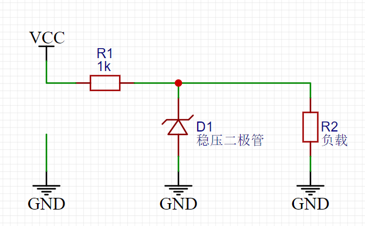

但其中二极管损耗会很大：
$$
W=(V_{IN} - V_{OUT})(I_L+I_Z)+V_ZI_Z
$$
当且仅当输出电压小于输入电压时才能正常工作。输入输出之间的压差会由R1平衡掉，稳压管的反向击穿电阻与功率还限制了输出电流，其效率和输出精度都受到很大限制。不过，将这个思路扩展一下，只使用**电阻分压**不能让输出稳定，如果增加一个负反馈机制，那么输出将稳定很多（虽然还没能解决效率问题）

### 线性电源

使用一个比较器，将输出的电压引入反馈回路，与参考电压（想得到的电压值）比较后再转换成合适的电阻R1值，那么就能让整个电路有效工作了，这就是**线性稳压器**的基本思路。

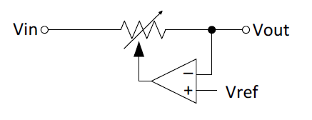

> 所有线性稳压器都可以看成一套受控的电阻分压网络

其功率损耗还是比较大，这是线性稳压器不可避免的缺陷
$$
W=(V_{IN}-V_{OUT})I_L
$$
如果是理想状态下，用于控制反馈的半导体器件不存在损耗，整个电源的效率就等于
$$
\mu=\frac{V_{OUT}}{V_{IN}}
$$
线性稳压器的一个经典实现就是使用达林顿管作为可变电阻，用一个精密的运放作为比较器，再从输入电压处引出一个电流源为整套系统供电。过去达林顿管由多个NPN功率管构成，耐压、功率都很高，组成达林顿管后会导致C-E极电压差至少是2V，这就大大限制了线性电源的工作范围。后来随着PNP管的出现，常使用以下拓扑：

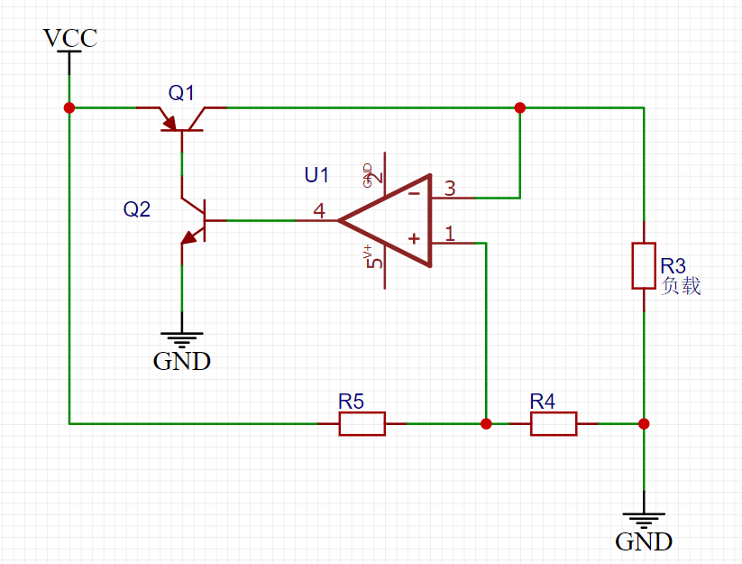

其具有低压差放大的特性，输入输出的压差可以低至0.5V，现在很多线性稳压器都采用了基于这个拓扑的改进架构。

> MOSFET也可以用在线性电源中，但是因为稳压器完全导通时需要在器件两端形成足够低的压降，MOSFET这个多子载流器件并不能很好地控制导通电阻，这就导致需要并联多个MOSFET以降低导通损耗（导通电阻），这对于控制晶圆规模来说是致命的；栅极开启电压较高的MOSFET比起小电流低电压就能使其导通的三极管，更是难以驱动，甚至需要一个额外的辅助偏置电源来进行栅极驱动（换用成本更高、没什么开启电压的PMOS也是一种方案，氪金使人变强）。不过随着现在高性能MOSFET与GaN等新材料的出现，MOSFET器件制成的线性稳压器也正在逐渐成为不错的解决方案
>
> 

线性稳压器由于结构上不可避免的缺陷，常常会导致大量发热和损耗，因此目前只有被称为LDO的电源管理芯片或是小功率的稳压器使用这种类型的拓扑。**LDO**即低压差线性稳压器，常见的型号有AMS1117、CJ1117等，常常用于提供5V-3.3V、12V-5V、3.3V-1.8V的低压小功率供电。小功率的稳压器则包括广为人知的LM317、78xx等，最好不要用它驱动超过5A的输出，否则将会出现过热、电压不稳等问题。

### 开关电源

开关稳压器可以看成在线性稳压器上进一步改进而来——原来的“晶体管可变电阻”损耗大得离谱，而且造成的都是实实在在的有功功率损耗。考虑使用一个滤波器对交流信号滤波的过程，理想状态下没有损失有功功率，同时还获得了理想的电压输出，如果将这个可变电阻换成一个DC变AC的系统，通过不同的反馈调节它，就能模拟出AC-DC电源的效果

这个DC变AC的系统一般使用*PWM发生器*，它会生成一个方波，随着反馈而来电压的高低调整其开关占空比，用于控制导通与否的晶体管全部工作在开关状态，因此损耗很小（理想情况下只存在开关动态功耗）；输出部分的滤波器则使用无源器件，从而避免了有功功率的损失，最后可以估算理想功耗
$$
W=P_{SW(open)}+P_{SW(close)} \approx 0
$$
开关管断开时，存在一个极小的漏电流；开关管导通时，由于管中内阻很小，所以管子分得电压也不大，也就是说实际情况下整体损耗是很少的。事实上整体电路损耗最大的时间段还是在导通段，而当**频率相当高、占空比相当大**的情况下，大部分时间里开关管都是关断的，于是这段时间的损耗也可以视作0。

以上这种使用方波占空比调节输出电压，配合滤波电路实现控制的方法被称为脉冲宽度调制（**PWM**），到目前为止仍在广泛使用的一个PWM生成技术如下：一个固定频率的振荡器输出高频三角波给比较器负相端；从电源输出端反馈来的电压值首先与参考电压共同输入差分放大器，控制放大二者的差模电压，随后这个差值被输送到比较器的正相端；两个波形（三角波和控制电压信号）经过比较后输出一个PWM，驱动开关管。这个振荡器输出的三角波也被称为载波，它的频率就是开关管的开关频率。

> TL494就是一个使用了该技术的芯片，它经典到现在还有不少低端充电器在使用这个作为主控
>
> 下图是mp4462的内部结构框图，现在很多大功率降压模块都用它作为主控。它提供3.5A输出电流，可以在0.8到30V之间调节输出电压，但是要保证输出电压低于输入（3.8V到36V）
>
> 
>
> 从图中可以看出电路主体就是上面所述的几个组成部分——输入差分放大器、比较器、振荡器时钟源、输出控制电路。但除此之外还包括了过流、过压保护、电压源、死区控制、斜坡补偿等等特殊的功能模块

对于一个完整的开关电源系统，通常实现了AC-DC-AC-DC这样一个信号链，第一次AC-DC变换是为了初步滤除噪声获取为电源供电的辅助电源（这是针对AC-DC电源而言，如果是DC-DC电源则只需要后面的DC-AC-DC两步变换），第二次DC-AC变换则是将低频信号转换为高频信号，从而能让变压器体积减小，第三次AC-DC则是将信号输出并完成滤波过程，可能会引入一个与源端隔离的反馈源，实现整体的负反馈控制。特别地，输出端还可以串接一个线性稳压器来让输出电压/电流更加平滑

## 稳压电源中常见的元件

### 电阻

电源中常用的电阻有三类：

* 小功率电阻：通常使用**金属膜电阻**，它具有低成本、高精度的特征，通常以贴片元件（*SMD*）形式出现在电路里

* 大功率电阻：通常使用**碳膜电阻**或水泥电阻，他们会很大，耐受功率较高。低端电源也会使用SMD的碳膜电阻（一般都是0805封装）来降低成本，但是其最大用途还是以直插形式用作功率电阻

* 采样电阻/精密电阻：采样电阻要求功率极大、阻值较低，通常使用双向绕线电阻或水泥电阻，二者可以很好消除寄生电感的影响（不过还是会有一点，因此推荐这些电阻直插、外包散热片且周边没有数字器件）；精密电阻多使用昂贵的金脚电阻或干脆用线路板铜箔走线替代（阻值极低的情况）

> 这里有一个计算公式
> $$
> R_s=0.47m\Omega \times \frac{L}{W}|_{1oz}
> $$
> 1Oz铜厚下的电阻如上式，2Oz铜厚则需要将结果除以2
>
> 网络上还有不少铜箔电阻计算器可用

### 电容

电源中电容的选取只有一点：**贵就是好**

90%的情况下，越贵的电容，ESR（寄生电阻）、ESL（寄生电容）、耐压、容值、温度条件就越好

> 实际电容可以视为一个RLC串联网络，在低频下体现为容性，在较高频下仍然以容性居上，而在超高频下则会体现为感性，还存在一个谐振点，谐振频率下电容表现为一个电阻

因此就需要在各种电容间进行权衡

* **陶瓷电容**、**塑料膜电容**都是常用的贴片电容材料，可以用于数控部分，但是一般电源主体关键部分的电容不会考虑它们

* **钽电容**的特点就是超低ESR和较高的价格，体积也相对较大

* **独石电容**具有相对均衡的性能，耐压一般会比较高，容值在pF等级

* **铝电解电容**相对常见，电源里面的大容值电容一般都会用它，耐压高、容值范围广，缺点就是体积很大，铝电解电容屹立在PCB之上

> 顺带说一下，原书这里写成了铝点解电容，大伙都没看出来这个输入法问题.jpg

* **超级电容**是一类超高容值电容的统称，它们往往具有上F的容值，但是耐压奇小，一般需要串联好几个使用，更多情况下会用它们作掉电保护（不要妄想把它放在输出端）

* **固态电容**是一些特殊类别电容的统称，基本性能都不太好，但是具有较高的容值或耐压，有些电容适应于高频

### 电感和变压器

电感是一个针对需求高度定制化的器件，很多磁相关的性能指标都需要规定电感的规格。电感值决定了电感中电流的峰峰值，也决定了电感储磁的大小；电感内部还存在磁损耗，特定的磁芯影响着电感工作频率和磁损耗大小。磁性元件的磁通密度越小的电感，越容易在峰值时出现电流饱和，从而影响输出效率乃至弄坏电感器件（磁饱和时电感会变0，电流迅速上升），因此还需要配备一些保护，并斟酌材质

电源中电感一般体积越大，工作频率越低。常见的磁芯包括

* 空心：空气磁芯不会饱和，但是电感量会很低，还容易造成天线，只有射频电路的发射部分才会考虑使用螺线管密绕空心电感
* 铁心、合金芯：磁导率一般较高，铁心硬饱和，坡莫合金具有软饱和特性，二者都不适用于高频电路，但是因为铁芯便宜，所以常常作为输出电感；合金芯造成更少涡流，所以用于大电流场合
* 铁粉芯：最常见的中高频电感，体积相对较大，但是价格低、可以适用于多种场合。现在开关电源中的逆变部分高频变压器都会选用铁粉芯
* 绝缘硅钢片：高频损耗极大、体积极大、耐受涡流极大，常见于各种低频变压器

> 电感峰值的磁通密度$B=\frac{LI_{MAX}}{A_eN}$
>
> 其中A表示磁芯有效截面积，L表示电感量，I表示峰值电流，N为线圈匝数
>
> $N=\sqrt{\frac{L}{A_e}}$
>
> 几个量之间会出现相互纠缠的情况，这也是选择电感参数的难度所在
>
> 实际情况下，常常选用**合理**的电感而不是最优的电感

变压器与电感不一样，它的选型更加复杂，涉及到正激、反激、多绕组等等问题

电源中的变压器在基本的变压器理论上还叠加了一系列高频和温度特性，总体上可以分成两种：

* **正激**式变压器：连续将能量从原边传输到副边，绕组内存储能量极小（良好耦合且寄生电感少）
* **反激**式变压器：先将能量存储在原边磁场，然后将能量传输到副边绕组（更像是一对耦合的电感）

两种变压器都可以拥有多个副边绕组，输出不同的电压。

> 现代电源设计中反激变压器的应用更广一些，因为反激变压器的使用方式让变压器变得更小

实际的变压器存在如下图一样的电气模型：

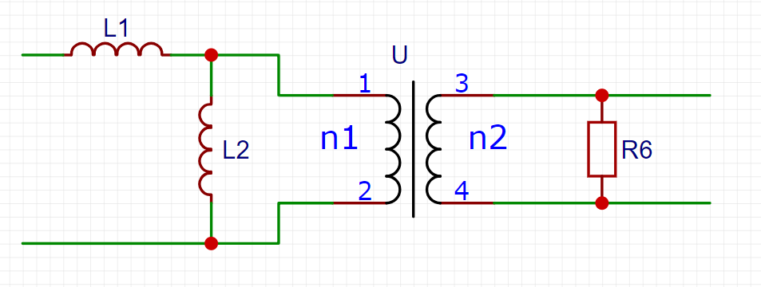

其中L1表示**漏感**，L2表示**励磁电感**，U则是变压器本体

励磁电感又称为**磁化电感**，代表用于建立磁耦合场的那部分输入能量产生的电感，其值由原边匝数盒磁芯特性确定，传统的工频变压器和一些其他低频变压器中磁芯磁导率高，于是磁化电感值很高，磁场（变压器两端的磁链）得以迅速建立，磁场循环中损失的能量很小。反激变压器中的储能就利用了磁化电感的性质：低磁导率磁芯使得变压器内部磁场建立速度较慢，能量会优先存储在L2，待磁链完全建立后才会传输给次级端，这就允许磁场在一定时间内能存储更多能量

在原理图内，变压器漏感和原边绕组串联，但这只是电学近似，漏感实际上存在于原-副边之间（在上图就表现为变压器U的1、3脚之间跨接电感L1）。传统变压器中的漏感比较严重，因为传统的大变压器中两个线圈间距很大。在反激变压器应用中需要尽量减少漏感影响：**漏感表现为减缓变压器内电流的变化频率**，这会导致变压器磁功耗增加；同时还要让每个功率传输周期中磁化电感、漏感能量全部复位归零以防止变压器**饱和**

### 二极管

电源电路中二极管的正向压降、击穿电压和功率都很重要，需要根据电路需要特地挑选；在高频开关电路中二极管的反向恢复时间是另一个重要参数，因此会使用到**快恢复二极管**，它在两端电压突然从正向变为反向时会迅速变化阻断电流，内部会有一个极大的瞬态电流，一般的二极管无法适应，很可能损坏

**肖特基二极管**是开关电路中的一个常见选择：它具有较低的导通压降、较快的恢复速度，但是价格也更贵（某些管子居然要0.7元）

### BJT与MOSFET

模电老朋友了，事实上在开关电源中MOSFET是最常出现的功率器件，因为他是一个电压驱动期间，栅极呈容性，因此导通时需要一个大瞬态电流来为电容充电，但是关断时的反向恢复时间很短，它不像三极管那样导通容易关断难，因此很适合放在大功率下实现快速关断

> 在更大功率的情况下，BJT和MOSFET的混合体IGBT就出现了，它兼具二者优势，唯一的缺点就是高昂的价格，一个民用级IGBT常常要30元以上，工业级的IGBT桥堆更是能轻松突破千元，它常常用于特高压、超大电流的场合（比如变电站的电源系统）

目前作为开关器件使用的晶体管材料性能对比如下

| 器件                       | 特点                                                       |
| -------------------------- | ---------------------------------------------------------- |
| BJT                        | 低成本、种类多的高速开关器件，但正在被MOSFET淘汰           |
| JFET                       | 在电源领域很少用，淘汰产品                                 |
| MOSFET                     | 高速、高效率、相对便宜，最常见的开关管类型                 |
| IGBT                       | 高耐压、大电流，适用于低速开关的大功率应用                 |
| 晶闸管                     | 能量回馈式开关，适用于高压高速场合                         |
| 氮化镓晶体管、碳化硅晶体管 | 导通电阻极低，能够在极小体积下实现高能量密度               |
| 其他新型材料               | 仍待市场检验的锗化硅、砷化镓、钙钛矿等材料制成的半导体器件 |

功率MOSFET的基本性能指标在之前的《电路设计从入门到弃坑2.5【场效应管】》部分已经介绍过，如果有需要可以参考一下

这里主要说明电源中MOSFET的开关特性

从模电课程的结论中可以知道MOSFET中的导通阻抗具有正温度系数的特性，如果电流增大，会导致MOSFET内阻增大——当在硅衬底上并连大量MOSFET时，这一特性相当于充当了负反馈，让局部过流过热的MOSFET电阻增加，从而自动减少该部分流过的电流，于是常见的大功率MOSFET都会并练数千个MOS单元实现更均衡的电流负载和更大电流输出

功率MOSFET的一些重要特性如下：

* 阈值电压：当且仅当栅极电压高于阈值时，MOSFET才回到同，且由于栅极呈容性，没有静态电流消耗；不过也正因如此MOSFET需要很大电流才能实现快速导通，这就让很多电源电路中需要独立的MOSFET驱动器来为MOSFET栅极输出大电流

* MOSFET导通状态下的D、S端相当于一个微小电阻，这对电源拓扑设计具有很大影响

* 高速MOS开关电路存在以下四种损耗：

	* 动态功耗$V_{DRV} Q_G f_{SW}$
	* 导通功耗$I_{DS}^2 R_{DS(on)} D$
	* 电流电压交越损耗：$\frac12 V_{DS} I_{ON} (t_{ON}+t_{OFF})f_{SW}$
	* 导通时D极、S极间电容放电损耗：$\frac12 C_{DS} V_{DS}^2 f_{SW}$

	其中$f_{SW}$为开关频率

实际的功率MOSFET作为一个复杂的器件，存在大量寄生参数，这让其开关特性明显不同于理论分析。MOSFET的开启明显分为四个阶段：

1. MOSFET驱动器输出高电平（超过门限阈值电压），栅极电流对栅极电容充电，栅极电压随之上升；但因为栅极存在外电阻，栅极电压还不能达到门限电压；由于G极阻抗，栅极电流将逐渐下降
2. 栅极电压达到门限电压，开始有DS电流出现，栅极电压不变，由于DS阻抗逐渐下降，DS电压也会降低
3. 随着D极电压降低，又因为存在GD寄生电容，因此栅极电流会发生转移，在D极电压下降期间方式栅极电压进一步升高
4. 漏极电压转换完成，此后GD寄生电容中不会有电流流过，栅极电压会上升到栅极驱动电路提供的电压，进一步增强MOSFET导通，DS阻抗达到$R_{DS(on)}$

同样，关断可以分成四个区间，它们收到栅极驱动器电路特性影响：关断时驱动器输出低电平，栅极驱动电流变为$(-V_{Threshold})/R_{Gate}$，通常会导致实际开关管关断速度较慢，因此驱动器一般会采取增强拉电流的方式来弥补这个问题

1. GS寄生电容通过外部驱动器放电，使得G极电压回落到阈值电压，同时D极电压不变
2. 栅极逐渐关断，GD寄生电容通过上升的漏极电压和栅极驱动允许的*拉电流*进行充电；在此期间栅极电压电流相对恒定
3. 漏极电压达到电路规定的钳位电压（由外电路决定），GD寄生电容中电流归零，栅极电压继续线性下降到阈值电压
4. 当栅极电压低于阈值，MOSFET关断

由于驱动电路提高驱动频率过程中需要更大的拉电流，因此随着频率提升，开关损耗会线性增加，之后会讨论如何平衡二者

## 开关电源的基本拓扑

现代开关电源往往会使用很复杂的组合拓扑结构，但这些结构基本都是由基本的电源拓扑衍生而来，显得开关电源的基本拓扑结构就尤为重要

电源设计往往要考虑多方面因素，包括但不限于：

* 体积/面积
* PCB/器件/装配/其他成本
* PCB/器件可靠性
* 散热
* 设计周期
* 模块化率
* 是否有维修支持与维修成本

并且很多时候电源系统要与控制/功率/电力系统共存，还应该考虑这些模块之间的影响，这些因素基本由电源拓扑结构决定。开关电源的基本原理是固定的：**通过开关管，将大功率切分输出，再使用滤波单元将这些功率组合成稳定的输出**。而一般来说使用开关管、滤波器的组合就可以完成这个目的，最简单的开关电源只需要四个元件：**主开关管、开关二极管、滤波电容、滤波电感**。而实际上主开关管和开关二极管都可以使用更复杂的开关电路实现以提高效率和输出功率；滤波电容和电感则可以使用更复杂的变压器和滤波网络实现；在此基础上加入更多反馈、更多保护、更多控制算法、更多EMI器件......就让电路变得更复杂的同时具有更强的性能。

> 实际上现在很多开关稳压器芯片已经集成了上述所说的一切附件，电路里面的分立元件就只剩下几个基本元件了

开关电源的基本拓扑有以下几种：

1. **Buck**电路：降压电路，源电压必须大于输出电压才能工作，效率最高，$V_O=D V_I$

​	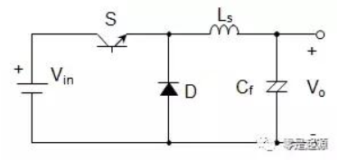

2. **Boost**电路：升压电路，输出电压必须大于源电压才能工作，$V_O=\frac{V_I}{1-D}$

​	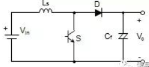

3. **Buck-Boost**电路：也称为反激电路（**Flyback**），既可以实现升压也可以实现降压，$V_O= - \frac{DV_I}{1-D}$

​	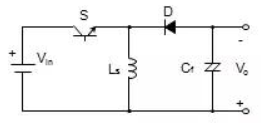

之前提到过开关电源一般使用PWM信号控制开关管，实质上是通过开关管的占空比来控制输出电压的“能量份数”

> 虽然已经品鉴过很多次——将主开关管的导通时间与周期时间之比定义为**占空比**，用D表示，这是一个可以在0到1之间的值

Buck-Boost电路具有一个非常特殊的性质：**输出电压与输入极性相反**，因此*非隔离*的反激电路常常用作*极性反相器*；这个特性有助于借助变压器实现复杂而高效率的电源，从而输出任意极性的电压。与反激电路相比，**Buck电路中电感是直接连到输出端的**，这就导致Buck电路是持续输出型电源：无论开关管状态如何，电感电流都会不断输出，整个过程中输出端电压保持连续。

而反激电源电路和Boost电路一样，功率传输明显分成两部分：

1. 输入电压先被开关管“切分”引入，能量暂存在电感中。当开关管导通时，输入电流流入电感，能量存储在其增加的磁场中；开关二极管截止，没有电流流向负载，输出电容放电来维持输出电压
2. 待开关管关断后能量从电感流出。开关管断开时，电感上极性反转，电流对输出电容充电并流向输出端提供一个电压

这里电感作为储能元件，由于其电流特性，能够输出更大的峰值电流。

考虑到三种拓扑开关管的位置，还需要将下面几个额外特性纳入考量：

1. Boot和Buck电路中开关管与输入电源串联，输入电流会变得不连续（而且是以极高的频率），需要输入滤波以减少RFI噪声
2. Boost和反激电路中，开关管导通时，整流二极管输出滤波电容的充电电流，相当于引入了输入电流，会产生开关噪声
3. Buck电路的降压比超过10：1（输入：输出=10：1）时，会由于占空比过低，产生大量峰值电流，从而降低效率
4. 三种基本拓扑都不具有高压隔离功能，因此它们主要用于相对较低电压的应用

> 实际上这三种拓扑均常见于各种DC-DC稳压模块和220V电源的辅助供电，常见的型号有：
>
> Buck：LM2596、MP2451
>
> Boost：TPS61390
>
> Buck-Boost：TPS63031

### 组合拓扑

> “在电源发展的长久历史中，人们不断提出各种改进方案”
>
> “可能有些方案是有用的？我对此并不持否定态度。有用或者没有用，对于这片大地不会有任何影响”
>
> “不过请再考虑一下......随机的堆砌真的能被称为“有用”吗？”

对于基本的电源拓扑的组合，大多数已经被证明实用性不强，但这里需要强调几套组合：

1. *Buck或Boost电路*

这个电路拓扑共用了Buck和Boost电路的电感，从而让输出电压固定，保证输入电压浮动时输出电压难以变化。很多锂电池充电电路都采用了这种拓扑。
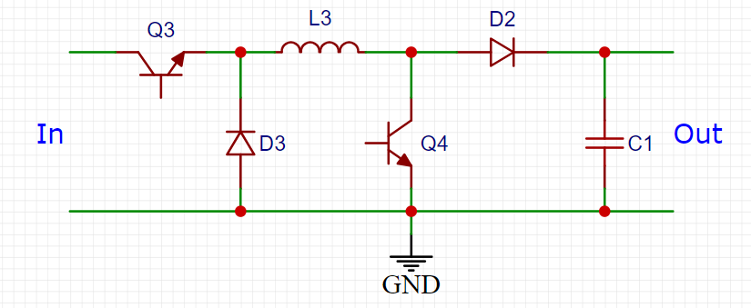

当输入电压低于输出时，Q3保持导通，仅有Q4控制电压；当输出电压低于输入时，Q4保持截止，Q3控制输出，D2起到了*续流*作用。在实际应用中往往使用一套滤波网络配合完善的滤波算法来让两种情况的交替平滑，还需要考虑死区来避免两个管子同时导通。

> 死区时间（Dead Time）在电源控制方面指两个或多个开关管同时关断，以防止多管同时导通导致短路的保护时间，这个时间应该尽可能小来提高电源效率，但是需要精确计算以杜绝开关管短路

2. *SEPIC电路*

这是组合了Boost和Flyback（反激）拓扑的组合拓扑，这是一个单端原边电感转换器。可以通过Q5实现任意电压输出。
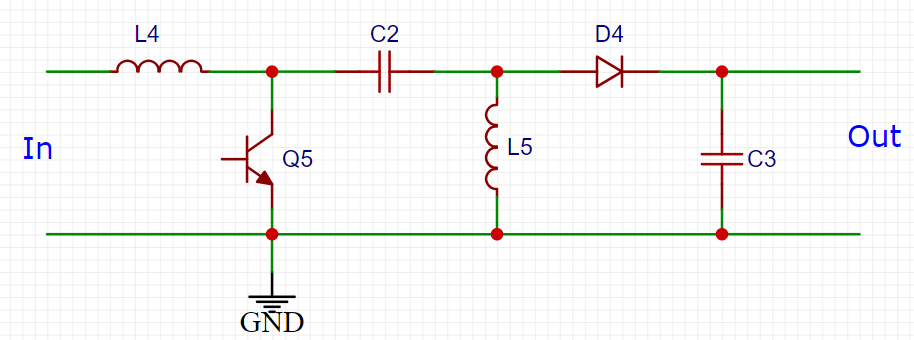
	
这个电路需要两个电感绕组，L4位于输入端，可以很方便地滤除输入端噪声，L5用于输出，可以和L4缠绕在同一磁芯上。串联的电容C2让浪涌电流和短路保护得到了很好的控制——但这也正是电路的致命缺陷：主回路里流经电容的电流有效值很大，需要谨慎的设计功率因数补偿电路，否则连安规都过不了；开关管和二极管都需要承受截止关断时由L4和L4产生的相当于输入输出电压之和的高压大电流，也间接导致电路效率下降

## 带变压器的基本电源拓扑

Boost电路里面的改造空间不大，升压本身就是一个“费力不讨好”的工作。但对于Buck和非隔离的Buck-Boost电路，我们还能进一步改进，从而得到几个现代开关电源（尤其常见于隔离的220V/110V功率稳压电源）拓扑。

将boost-buck电路中的电感换成一个反相绕组的变压器，将原来输出端的器件放到次级端，就可以得到一个如下图所示的**反激变换器**

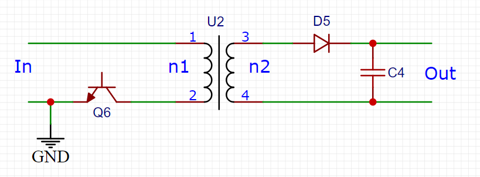

将buck电路如法炮制，就得到了如下面所示的**正激变换器**

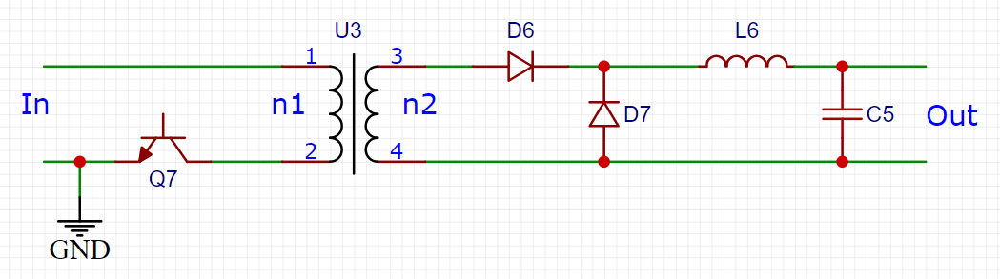

新加的变压器可以实现安全隔离，并且能通过调整输出极性来灵活地为绕组接地。变压器让输出电压可以随意设置，同时也能增加多个次级绕组来实现多电压输出。正激和反激的增益比公式与非隔离结构相同，只是增加了一个和变压器有关的匝比参数。不过尽管如此，拓扑还存在很大缺陷——使用*单管驱动*。开关管只能在一个方向上驱动变压器，因此变压器需要一个复位机制（这通常使用与能量脉冲相等的**伏秒复位**），就限制了最大占空比，从而让效率不能达到最高。

上面正激、反激拓扑之间的差异在于变压器：正激变压器的各种特性应当接近理想变压器，线圈中存储的能量非常少（有很大的磁化电感），并且要能将原边的能量尽可能多且迅速地传递到副边；反激变压器则需要存储负载所需的所有能量直到开关管断开，能量才能从整流管输出到外部电路。两种变压器的初级电流是相似的，并且都存在一个叠加在方波顶上的斜率电流，不过正激变压器的这个斜率取决于输出电感，反击变压器则取决于初级侧电感量。

**反激电路的效率比正激电路低，这是因为其峰值电流约是正激电路的两倍**。虽然反激变压器所需线圈匝数更少，电感量相对小了，但是这么高的RMS电流会在副边产生相当高的内部损耗。

这个缺陷也在电容的选取上造成了困难。正激拓扑的输出电容只有滤波的作用；反激拓扑的输出电容需要在副边不输出的半个周期为外围电路提供供电，并在副边线圈输出时接收能量（滤波）

### 多开关电源拓扑

为了改进上面这些问题，考虑加入更多开关管实现推挽电路。根据功率不同，常可以考虑选用*双管正激*、*推挽*、*半桥*或*全桥*拓扑

最早的大功率输出通常采用**推挽电路**实现。电路拓扑如下：

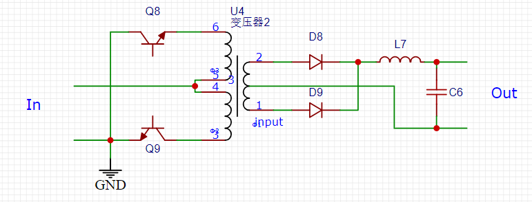

虽然名字上叫他“推挽”，实际上Q8、Q9两个开关管推拉的相位是相同的，只不过中间有一个180度的相位差，相当于这两个器件都在“以自己的节奏”推动或拉动电源输出。这个拓扑图没有指明控制电路，控制电路PWM会分成两个相位差180度的栅极/基极驱动信号送到初级端的开关管，两个管子交替导通，分别实现正半周和负半周的驱动，输出会被次级端接收并整流，因此**四个开关管和变压器上的开关频率相当于总开关频率的一半**，而在电感和电容上才能见到全部的开关频率

电路输出电压
$$
V_O=\frac{N_2}{N_1}DV_I
$$
应用这个电路需要注意**死区时间**的控制。它最大的缺点是当一个开关管导通时，全部输入电压会加在一半的初级绕组，从而在另一半初级绕组产生耦合，这会导致关断的开关管需要承受两倍输入电压，对开关管的耐压选型有较高要求。初级绕组结构不完全一致，这也导致漏感或变压器饱和会导致瞬间高压或振铃的产生

这个拓扑还有一套变体应用：**直流变压器**

我们可以发现占空比越接近100%，峰值电流越小，电路的转换效率越高，所以如果能去掉PWM，并让电路在尽可能接近100%的最大占空比下运行，那么电路方程变为
$$
V_O=\frac{N_2}{N_1}V_I
$$
因此该电路可以很高的转换效率实现隔离（变压器电气隔离）的直流电源，其开关管频率一直是输出开关频率的一半。这套拓扑没有调节功能，输出会随着输入而波动，但它可以作为整体电源的一个组成部分工作，比如前级接入一个非隔离的buck电路，从后级输出引回buck电路的反馈，从而有效实现隔离和反馈调节。

如果再加以改进，我们能得到**电流馈式推挽变换器拓扑**

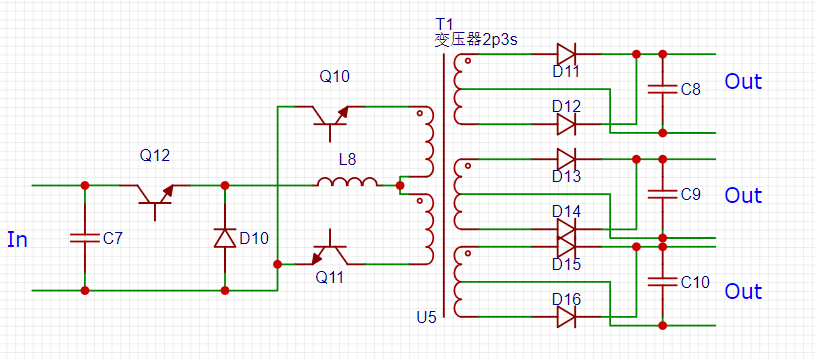

该拓扑正如其名，利用电流而不是电压驱动变压器，**变压器工作在正激状态**，从而消除了各个输出端对输出电感的要求。由于使用电流驱动，因此不同于电压需要把占空比设置为略低于100%，这个拓扑中必须将占空比设置**略微高于100%**

> 电压驱动情况下，如果存在两个开关管同时导通，变压器内磁场能量会经过开关管回路泄放，从而产生很大的短路电流烧毁开关管；电流驱动情况下，如果两个开关管同时关断，变压器内磁场能量则会无处可去，相当于电感充电后开路，产生巨大的开路电压击穿开关管

这个拓扑结构具有以下突出优点：

* 使用一个单绕组电感提供多输出，省去独立的输出电感
* 基于推挽结构，运行在占空比接近100%的条件下，变压器磁芯利用率高，电路内部损耗（电容损耗和开关损耗）小
* 无输出电感，输出阻抗最小化，利于负载调节
* 固定的输出死区时间，能宇同步整流器一起使用
* 输入串联电感，能够有效限制输入端尖峰

需要注意拓扑中的输出电容会在输出整流二极管同时关断的短暂时间内（初级端电流被一分为二，次级端绕组获得的磁场能量减弱从而导致一个输出死区时间）提供所有的输出电流，因此需要保证较低的ESR（等效串联电阻）

### 双管正激拓扑

双管正激拓扑采用两个功率开关管搭建，适合于中功率电源场景

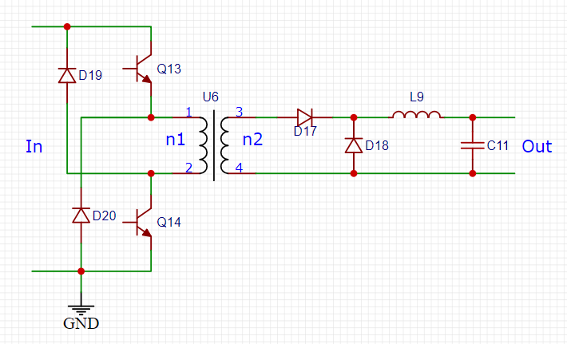

电路中两个开关管同时被**同相位同频率**的PWM驱动。当开关管导通时，输入电压加在初级，变压器中磁通量的上升由电源电压和开关管导通时间决定。当开关管关断时，磁通迫使初级侧电压反向，但两个钳位二极管迫使磁化电流和漏感电流归零，从而让能量回流到电源，在与导通时间相同的回馈时间下，磁通将返回起始值。因为这个原理，**该拓扑的最大占空比不能超过50%**，这会使得峰值电流相对推挽拓扑更大，影响到电源的效率

两个开关管需要承受输入电压和两个二极管导通压降之和，因此电压应力较小，对开关管选型不甚苛刻。同时变压器可以在控制回馈时间的前提下实现完全复位，相对不容易饱和，同时复位能量会被电源循环利用，损失较少。

变压器磁芯必须保持在磁滞回线的第一象限工作、存在上管（高端开关管）这两个特性会让电路驱动相对困难，这是该拓扑应用中的一个重大问题，同时输入输出电容上面交流电流有效值会相对较高，这就对电容选型（耐压）有着相对高的要求。

### 桥式拓扑

最后要介绍的拓扑常见于高功率场合和三相开关电源，被统称为**桥式拓扑**。包括半桥、全桥、三相桥，这里主要介绍**半桥**和**全桥**变换器

半桥变换器拓扑

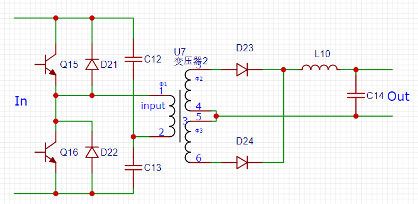

全桥变换器拓扑

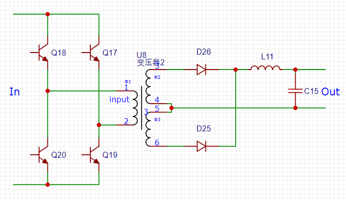

两个电路的基本原理都是**利用初级侧绕组开关管交替开关让初级侧变压器在两个方向上被驱动，从而达到变压器完全复位，最大化利用磁芯**的原理。开关管和变压器频率都以1/2的PWM开关频率工作，当开关管交替工作时，对于每个开关管来说100%占空比的PWM相当于50%占空比，因此**完成一个完整的电源工作周期需要两个PWM周期**。

半桥拓扑中的两个电容用于在输入电流桥中点处形成电源电压一半的**等效交流地**，开关管工作导致桥的另一端被交替地“连接”到正负电源。这样半桥电路会以一个摆幅等于输入电压的交流电压来去初级侧变压器线圈。对于全桥拓扑，由于去掉了电容，导通方式变成（Q17+Q20导通，Q18+Q19关断）-（Q17+Q20关断，Q18+Q19导通）-（Q17+Q20导通，Q18+Q19关断）这样一侧桥臂导通、另一侧桥臂关断，循环往复，因此全桥电路的原边侧会看到两倍于输入电压驱动电压——**全桥拓扑能够提供相对于半桥拓扑两倍的理论最大功率**

这个拓扑非常完美，面临的唯一问题就是——**变压器必须对称驱动**，不然轻则无法工作，重则直接爆炸（原边侧出现不平衡时，磁通会逐次累加直到饱和，一旦变压器饱和，电源就没法工作了。而且这是大功率应用的拓扑结构，通常需要耐受数十安培或者成百上千伏的电压，变压器饱和将导致瞬间爆炸）

### 关于常用的电源拓扑

对于上面的介绍，我们有如下基本结论：

1. 降压拓扑和正激拓扑总比升压拓扑和反激拓扑的效率高
2. 除了升压和SEPIC电路外的拓扑都会对输入电压进行斩波，应该在输入端加滤波器（一般使用去耦电容）来降低传导开关噪声
3. 上管往往难以驱动，因此尽量避免用上管，或者想办法把上管变成下管

* **反激**：效率较低，适合于100W以下的低功率场合，与元件数量少且只需要单磁芯，成本很低
* **单管正激**：仅使用一个功率开关管就能实现占空比50%以上的工作。输出功率一般，适用于100~300W场合；开关管需要承受2倍输入电压的电压应力，同时变压器不会自动复位
* **双管正激**：用于100~500W场合的高效率电源拓扑，最佳占空比为小于但接近100%，每个开关管都承受输入电压，使用二极管钳位来自动复位变压器；需要使用一个高端侧驱动开关管且必须考虑变压器伏秒平衡，成本较高
* **推挽**：最大占空比接近100%，高效率、高磁芯利用率的开关电源，不需要大感值输出电感就可以实现25~200W的输出功率；但开关管需要承受2倍输入电压的应力，也需要考虑伏秒平衡，成本较高
* **半桥**：可以在中等成本下实现100~500W的功率输出，最大占空比接近100%，每个开关管承受输入电压；但是需要高端侧驱动、考虑变压器伏秒平衡，成本较高。
* **全桥**：适用于500W以上的高功率输出，基于谐振式开关，每个开关管承受输入电压，变压器效率高；需要四个功率管、考虑高端侧驱动和伏秒平衡，成本很高
