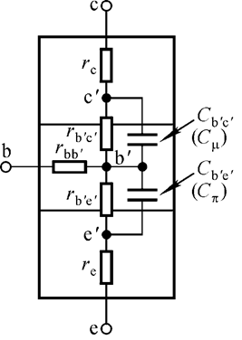
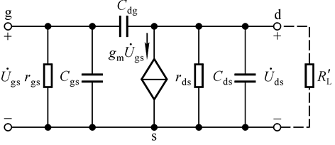

# 电路设计从入门到弃坑10【放大电路的频率响应】

所谓**频率响应**，就是**放大电路输入信号的频率对放大电路放大倍数的影响**。由于放大电路中寄生电容的存在，**放大倍数会呈现为频率的函数**，所以需要在设计放大电路时提前应考虑通频带和信号频率范围要求

> 首先考虑最基本的高通电路，如下所示
>
> 
>
> 存在Uo超前于Ui，电路的电压放大倍数可以等效为
> $$
> A_u=\frac{j \omega RC}{1++j\omega RC}
> $$
> 令$f_L=\frac{1}{2\pi RC}$，获得变换后的电压放大倍数
> $$
> A_u=\frac{j \frac{f}{f_L}}{1+j\frac{f}{f_L}}
> $$
> 于是可以得到一个Au-f公式
> $$
> |A_u|=\frac{\frac{f}{f_L}}{\sqrt{1+(\frac{f}{f_L})^2}}\\
> \phi=\frac\pi2 - arctan(\frac{f}{f_L})
> $$
> 
>
> 经过变换后绘制出上述图像
>
> 对于低通滤波器，同理有公式
> $$
> A_u（变换前）=\frac{1}{1+j\omega RC} \\
> |A_u|（变换后）=\frac{1}{\sqrt{1+(\frac{f}{f_H})^2}} \\
> \phi = -arctan(\frac{f}{f_H})
> $$
>
> 可推出以下图像
>
> 

经过一系列推导，可以得到高通电路和低通电路的相位-频率图像

发现**高通电路通高频阻低频；低通电路通低频阻高频，在相位角为45度时，Au为最大值的1/√2，可以视为阈值**，分别根据相角的滞后或超前决定两个阈值：**高频截止频率**$f_H$和**低频截止频率**$f_L$

定义**幅频特性**：放大电路的$A_u(f)$函数及其决定的图像

**相频特性**：放大电路的$\phi(f)$函数及其决定的图像

将基本的曲线图改为对数坐标系画法，可以得到反映电路频率响应的标准图示：**波特图**

波特图的横轴为lg(f)，纵轴为20lg|A|，单位为分贝（dB）

## BJT和MOSFET的高频等效模型

这里在之前《基础晶体管》的基础上强调一下分立式晶体管元件的高频等效模型

上图：三极管的混合π模型

设BJT的原始β值为β0
$$
\beta=\frac{\beta_0}{1+j\frac{f}{f_\beta}} \\
f_\beta=\frac{1}{2\pi r_{b'e}(C_\pi +C_\mu)}
$$
可推导出电流放大倍数频率特性曲线

改为波特图

其中阈值频率正好对应了1/√2点的位置，所以说**波特图中的折点反映了实际幅频特性图中的阈值点**

考虑一般的放大电路，

* **电路低频段的实际放大倍数需要乘因子$A_u=\frac{j \frac{f}{f_L}}{1+j\frac{f}{f_L}}$**
* **电路高频段的实际放大倍数需要乘因子$A_u=\frac{1}{1+j\frac{f}{f_L}}$**
* **截止频率取决于电容所在回路的时间常数$f_{L(H)}=\frac{1}{2\pi \tau}$**
* **频率响应具有幅频特性和相频特性两个表征函数和对应曲线**

场效应管也有类似的高频等效电路

推导过程和解释已经在前面博文里提过，这里不再赘述

## 一般放大电路的频率响应

### 单管放大电路的频率响应

### 增益带宽积

## 多级放大电路的频率响应

