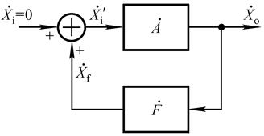
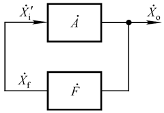
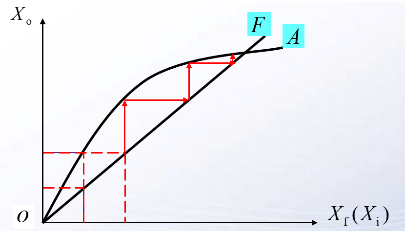

# 电路设计从入门到弃坑11【模拟信号】

所有电信号都是模拟信号，包括数字信号——数字信号用高低电平表示0和1，但本质上是一段无周期的方波信号。模拟电路可以完成所有模拟信号的波形转换

常见的模拟信号有正弦波、三角波、锯齿波、方波、尖峰、噪声等，利用这些模拟信号可以完成信息的处理和传递

使用基本电路器件可以实现模拟信号的发生、变换

## 模拟信号

模拟信号是经过简单抽象的电信号。同一个信号可以使用多种不同方式描述：

* 使用电压u-时间t图像描述模拟信号的时域变化
* 使用X-Y李萨如图形描述模拟信号的相位关系和频率关系
* 使用傅里叶变换后的频谱图描述模拟信号的频域特征
* 使用驻波比来反映模拟信号的特征频率

对模拟信号的测量（尤其是高频信号测量）通常需要结合使用示波器、网络分析仪等仪器

之前谈过的集成运放模拟运算电路可以在相位和数值上对模拟信号进行变换，而模拟信号的产生需要使用另一种思路

## 波形的发生

**直接数字频率合成器**是当前应用比较广泛的信号发生电路，缩写为”**DDS**“，经常被用在各种函数信号发生器中，具有可编程、信号准确的特点，可以使用数字控制系统（单片机、专用数字芯片等）输出特定波形的模拟信号

但是传统的**模拟信号发生电路**具有稳定可靠、易于实现的特点，在工控和特殊工况具有优势

首先从最基础的周期性信号看起

### 正反馈自激

先考虑简单的周期性的信号

想要获得一个周期性的信号，可以考虑使用“自激”的方法，使用一个深度正反馈回路把电路的输出引回输入，这样只需要加入一个微小的激励，输出端就会源源不断产生输出

如上图所示，电路中的初始输入Xi是一种极微小的电扰动，F被称为“选频网络”，它只会对某一特定频率f0的信号形成正反馈，从而让系统变成下面这张图所示

最后整个电路会达到动态平衡，输出稳定在某个固定值。一旦产生稳定的振荡，输出就会一直持续下去，系统的供电为它提供所需的能量。

模拟信号的产生过程大致分为三部分：

1. 电路构建：需要电路满足幅值平衡条件和相位平衡条件（**幅值条件**和**相位条件**，后面会深入分析）才能产生对应的震荡
2. 起振：由于微小扰动，输出电压刚开始产生幅值很小而且谐波复杂的输出信号
3. 稳幅：深度正反馈使得起振输出幅值逐渐变大：因为选频网络导致只有输出信号里某一特定频率的信号能够反馈到输入端，对应的谐波会成为信号的主要组分，也就是**选频网络和正反馈让某特定频率谐波变成基波**，最后输出信号幅值稳定在某一值

需要声明：**微小扰动是随机的且一定存在的**

> 静电作用、上电后微弱的电磁干扰、某个三极管的内电流、周围电磁环境......只要是和电有关的东西都可以作为微小扰动。它可能只有pV、fV乃至更低的强度，但是因为电路的正反馈特性和极大的放大倍数，微小扰动可以在非常快的时间内起振。不过实际应用中总会加入一些额外的协助起振的电路，这能让发生器具有更好的工作性能

### 文氏桥电路与振荡条件

下面这个电路是最经典的正弦信号发生电路：**文氏桥电路**

这个电路的标准名称是*RC桥式正弦波振荡电路*，首先了解这个电路具有产生正弦振荡的能力，我们来仔细分析一下

电路的主体是一个运放，运放可以为整个电路实现微弱扰动的放大，而反馈网络和选频网络也是基于运放搭建的

要产生正弦波，需要电路满足两个必要条件：

* **相位条件**：$\phi_A+\phi_F=2n\pi$
* **幅值条件**：$|\dot{A}\dot{F}|=1$

这两个条件基于“**发生自激振荡需要电路能用输出量维持自身的输入量**”得出，反映到公式上就是
$$
\dot{X_o}=\dot{A}\dot{X_f}=\dot{A}\dot{F}\dot{X_o}
$$
解上式得
$$
\dot{A}\dot{F}=1 \angle 0 \degree
$$
相位条件就是它的相角，幅值条件是它的模，这就是电路的**起振条件**

当电路满足$|\dot{A}\dot{F}|>1$时，可以起振，随后电路会把f0之外的输出量衰减到0（或者可以看成把f0放大到幅值极限），于是就产生了频率为f0的模拟信号。**电路中使用一组正反馈网络来实现这个大于1的目标**

> 这个条件在数学上被称为**巴克豪森法则**：电子振荡器系统信号由输入到输出再反馈到输入的相差为360°，且增益为1，为振荡器振荡的必要条件。
>
> 注意到，这里提到的正反馈自激振荡条件和在反馈一节中提到的负反馈回路自激振荡条件不完全一样，这是由于二者都是基于闭环传递函数推导出的结果，在幅值条件上具有相同的特点，但正反馈和负反馈放大的对象不同，因此出现相位反相

而随后，由于反馈网络和选频网络的存在，电路的总体反馈$\dot{F}$会在频域上呈现非线性逼近A的趋势，如下图所示

一个完善的振荡电路需要以下四个组成部分：

1. **放大电路**：用于放大微小扰动和维持电路工作
2. **正反馈网络**：用于满足相位条件
3. **选频网络**：
4. 非线性环节

### 矩形波

### 三角波

### 锯齿波

## 波形变换