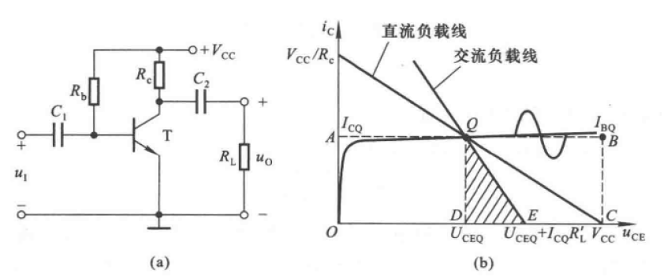
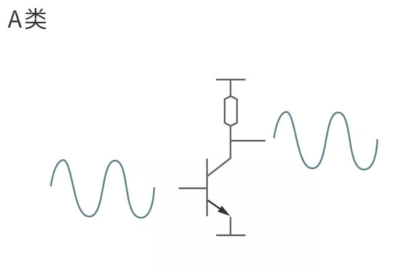
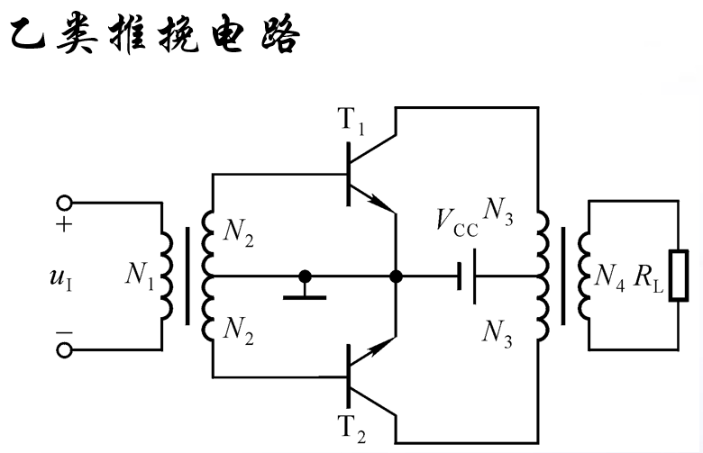
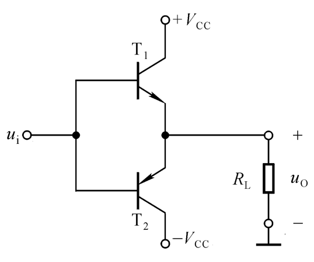
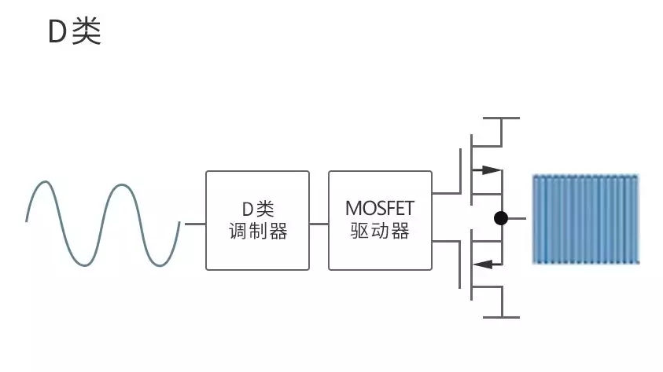
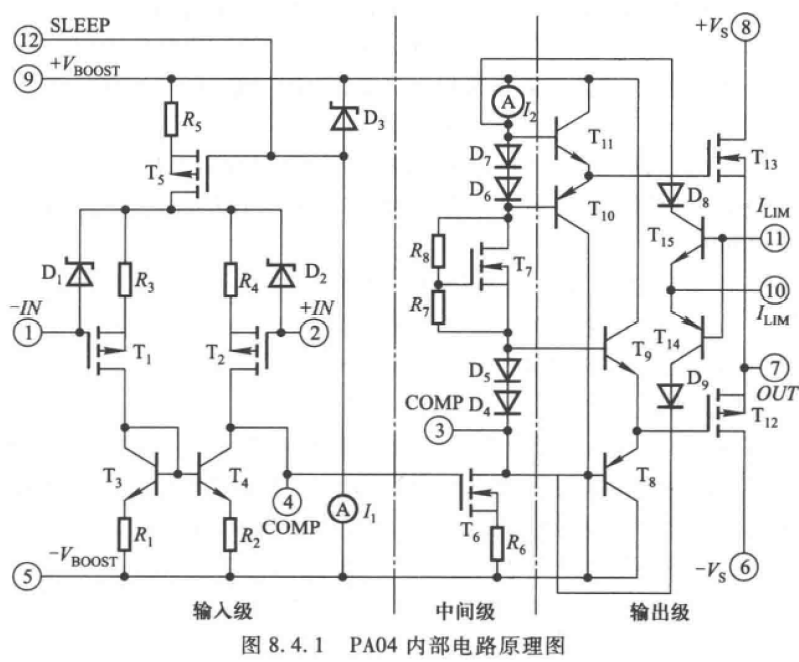
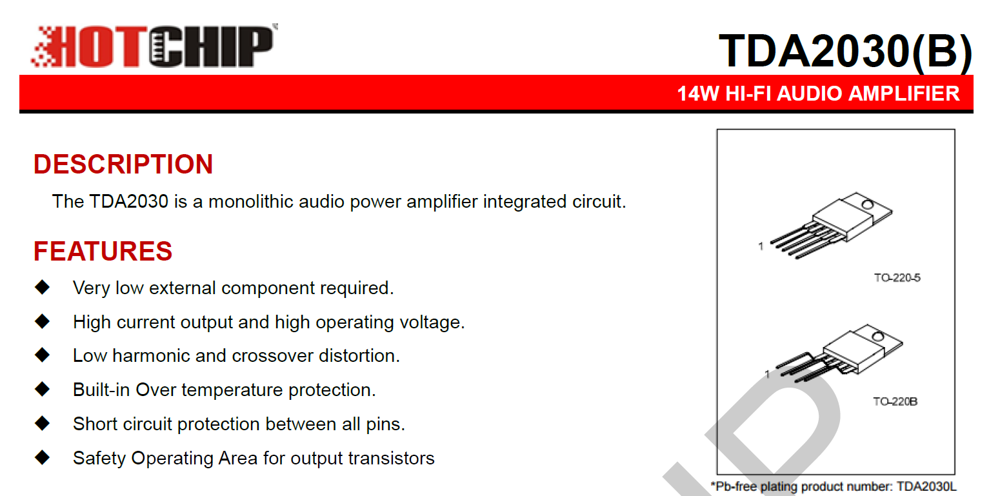
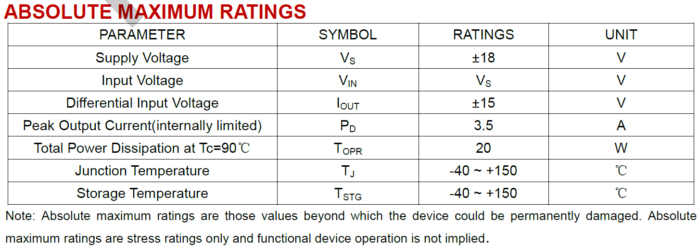

# 电路设计从入门到弃坑12【功率放大电路】

在信号放大的情况下，使用基本、多级晶体管放大电路或集成运放就可以解决遇到的问题，但是模拟电路往往需要在输出端驱动一些需要大电流或高电压的设备

> 扬声器、电机、天线等器件往往需要大电压（高频）或大电流来驱动，一般的放大电路远远不足以驱动这样的设备

于是专用于应对高负载情况的**功率放大电路**出现了，功率放大电路简称**功放**

功率放大电路具有五种主要类型，以晶体管工作状态进行区分：

* **甲类**：晶体管在信号整个周期内导通。失真度最小，但是效率最低

* **乙类**：晶体管在信号上/下半个周期内导通。效率较高，但只能放大一半波形，如果使用推挽输出，可能存在交越失真，需要单独考虑

* **甲乙类**：晶体管在信号的多半个周期处于导通状态。混合甲类和乙类电路的优缺点

* **丙类**：谐振式功率放大器，使用电压谐振/电流谐振实现信号放大。效率高，削波现象严重，多用于射频信号的发射级

    > 本质上丙类放大器是工作在失真状态的，利用调节频率来实现载波，即使失真

* 丁类（**D类**）：晶体管工作在开关状态。效率最高的放大电路，一般来说存在较大失真。目前在数字音频方面应用最广

## 功放的性能指标

功放最主要关注输出功率和驱动效率

**输出功率**$P_{OM}=\frac{U_{OM}^2}{R_L}$

**转换效率**$\eta=\frac{P_{OM}}{P_S}$，Ps为电源提供的功率

> 功率放大电路的最大输出功率与电源提供的功率之比称为转换效率

功放中往往需要*根据工作的极限参数选择晶体管*:由于要求输出电压高、电流大，晶体管需要在c极/e极电流接近最大集电极电流$I_{CM}$，管压降接近c-e反向击穿电压$U_{(BR)CEO}$，c极消耗功率接近集电极最大耗散功率$P_{CM}$的条件下工作。这样的晶体管工作状态称为**尽限状态**，会对晶体管造成较大负担，从而引起剧烈发热，因此还需要考虑晶体管体积和发热之间关系

> 我们常常能看见很多音频设备中有巨大的散热片，其中很多就是在晶体管上加装的，用于辅助散热防止*炸管*
>
> 晶体管是可能发生剧烈爆炸的——因为内部电流太大导致局部剧烈发热，瞬间汽化塑料封装甚至硅片，于是就发生爆炸

一个合格的功率放大电路至少要做到以下两点：

* **输出功率尽可能大**：电源电压一定的情况下，最大不失真输出电压$U_{OM}$最大
* **工作效率尽可能高**：电路损耗的直流功率尽可能小，静态时功放管的集电极电流近似为0

## 功放的分类

设计功放时，首先要考虑的就是如何获得非常大的驱动电流，以下三个思路是最基础的，衍生出多种基本功放拓扑

* 使用**变压器耦合**，直接把C极电流耦合到次级线圈，从而能带动大负载
* 使用图腾柱**推挽输出**，每个晶体管负责一半的驱动电流，从而获得更大的输出电流
* 使用工作在开关状态的晶体管，放大数字信号，由于晶体管的开关特性，可以轻易驱动大负载；利用信号调制和傅里叶变换的方法把模拟信号转化成高频数字信号。这种思路被单独分类为**D类**（丁类）放大电路

>**共射放大电路不适合作为功率放大电路**，因为：
>
>* 输出电流有限：电源输出的平均电流会受到RL影响，也就是负载阻抗越大，输出电流越小，难以驱动大负载
>* 效率不高：电源功率的一半会被消耗在c极电阻上，另一半会被作为晶体管c极耗散功率
>
>其负载特性曲线如下图b所示
>
>

下面分别介绍三种思路衍生出的电路拓扑

### 变压器耦合功率放大电路（甲类）

甲类功放的实现很简单：

直接用基本放大电路的拓扑改造就可以了，但是需要注意：**基本放大电路不能用于功放**

如下图所示，这是变压器耦合甲类功放

晶体管T工作在甲类状态，通过变压器耦合，能够产生很大的驱动电压
$$
P_{OM}=\frac{I_{CQ}}{\sqrt{2}} \frac{V_{CC}}{\sqrt{2}}=\frac12 I_{CQ}V_{CC}\\
P_V=I_{CQ}V_{CC}
$$
对应负载线如下所示

由于N1的感生电动势与Vcc叠加，可以让c极输出电压（次级电压）大小超过Vcc

从变压器初级看向负载的等效电阻为$R_L'=(\frac{N_1}{N_2})^2 R_L$，*当变压器初级绕组匝数小于次级匝数时，就可以起到阻抗变换-缩小阻抗的作用，从而提高输出电流*

经过计算可以得到最大效率$\frac{P_OM}{P_v}=50\%$

使用该拓扑可以轻松达到很高的输出功率（在三极管工作范围内增高Vcc即可提高输出功率）；但是要求输入信号频率较高，（输入电容和变压器特性决定）；同时变压器体积往往都很大，尤其是低频变压器，同时会对周围电路造成强电磁干扰

### 变压器耦合功率放大电路（乙类）

对于甲类电路，电源提供的功率不变，当输入电压为0时，效率也为0——输出功率和效率会随输入电压增大而增大。但是这样虽然可以提高放大电路的效率，但是会降低整个系统的供电效率（*输入为0时电源也会提供供电，并全部转换为没有用的发热*）。为了提高系统的整体效率，可以考虑采用乙类功放的实现思路

通过一对NPN-PNP管组成图腾柱结构，可以实现**推挽输出**

> 推挽输出是模电中一种非常普遍的输出结构，任何对偶的晶体管都可以简单实现这种拓扑，组成推挽输出的两个晶体管被称为**对管**
>
> 利用三极管的截止区和放大器特性，可以有效控制动态功耗

信号在正半轴通过上管放大；负半周通过下管放大，两管交替工作

**但是使用变压器，我们就不必采用两个对管了，而直接使用一对相同型号的三极管就可以实现推挽输出**，如下图所示

该电路可以让电源提供的功率随输入信号增大而增大

它的输出曲线正好被分成对偶的两部分

需要指出：这个拓扑可以进一步提高功率——当且仅当让功放管的导通角减小，增大其在一个周期内的截止时间。随着功放管的导通角减小到一定程度，这个拓扑将从乙类转换到丙类和丁类状态，整个电路也就成为了丙类/丁类谐振功率放大电路，集电极电流将发生严重失真。这两种电路比较特殊，一般的音频功率放大器不会使用丙类谐振功放，而丁类谐振功放通常配合数字控制系统实现

### OTL电路

虽然解决了效率问题，但是带有变压器的功放电路始终面临体积庞大、笨重、耗材多、价格贵的问题

> 苹果：这不环保

同时，变压器的物理特性限制了电路的高频和低频性能——变压器会在输入信号频率过高时发热，同时输入阻抗会在输入信号偏低时变大

因此我们考虑直接扔掉变压器，用一个**大**耦合电容（通常为数百uF甚至数F）输出。此时放大电路的拓扑就回到了上面介绍的推挽输出真正形式，如下图所示

这个电路的痛点在于低频性能不好，而且一个大电容也很占地方——但是已经足够好了，这个拓扑称为无输出变压器的功率放大电路，缩写为**OTL**（Output Transformerless）放大电路。信号的最大不失真输出电压可达$\frac{V_{CC}/2 - U_{CES}}{\sqrt{2}}$

> 在上世纪六七十年代，晶体管刚刚兴起后，各大厂商均追求将笨重的输出变压器去掉。这个电路拓扑由此诞生

虽然这个电路很不完美，但这个经典拓扑却在各种高端声学设备中配合其他电路出现，下一个拓扑将继续改进它

### OCL电路

上面的电路痛点明显，那我们就直接解决——去掉输出电容的电路，就是无输出电容的功率放大电路，简称**OCL**（Output Capacitors）电路

实现这个电路的难度从选取大电容变成了选取电气特性对偶（互补）的对管，并且引入了另一个负电源

利用这个拓扑可以完全地发挥PNP-NPN管的放大性能

> 可以直观理解成把两个共射放大电路的基极连到一起，分别用两套电源放大同一个信号
>
> 这就是简单的”团结力量大“
>
> 事实上这个电路中最难实现的是一个稳定的负电源，在实际应用中通常采用反馈机制调节这个电路的工作

两个管子交替导通，两路电源交替供电，实现双向跟随，$U_{OM}=\frac{V_{CC} - U_{CES}}{\sqrt{2}}$

### BTL电路

能不能把第二路电源也扔掉？能，但是需要多来一对三极管推挽

BTL电路是OCL电路的大电流版本，这种拓扑也常常被称为H桥或“***全桥***”，也就是所谓的桥式推挽功率放大电路，简称**BTL**（Balanced Transformerless或Bridge Transistors（个人更认同后一种称呼））放大电路。由两对OCL电路如下排列驱动同一个负载

单电源供电，双端输入双端输出，输入输出信号都无接地点。正半周信号通过T1、T4，负半周信号通过T2、T3，也就是左右两侧的OCL电路（被称为“***半桥***“）

桥式拓扑被广泛应用在放大器（桥式放大电路）、开关电源（桥式开关电路）、电机控制器（全桥驱动电路）、强电系统（三相桥电路）中，在之后谈开关电源的博文中还会涉及到这类拓扑

这个电路可以实现$U_{OM}=\frac{V_{CC} - 2U_{CES}}{\sqrt{2}}$，但是由于管子多了一倍（比最初带变压器的功放多四倍），导致损耗很大、效率很低，往往需要一个散热器防止炸管

### D类放大器

D类放大器是一种数模混合电路，主要放大流程如下图所示：

模拟信号输入到D类调制器，通过一个高频电压比较器，将模拟信号叠加到高频（一般为几十MHz）的三角波载波上，然后以SPWM方波输出到高频MOSFET驱动器，使用MOSFET半桥电路输出（实际上这部分就是一个乙类放大电路的拓扑），得到放大的方波信号，随后使用一个低通滤波器从高频方波信号中得到被叠加的模拟信号，此时模拟信号已经得到了放大，可以直接接入负载

下图展示了如何通过高频三角波和正弦波叠加出SPWM方波

> 音频信号实际是不规则的正弦波或其他周期波，但是根据傅里叶变换原理，只要是周期波，就可以等效成正弦谐波的叠加，因此所有模拟信号都可以用相同的方式被合成为高频方波
>
> 然而傅里叶变换存在一个限制：高次谐波的频率比低次谐波高，所以说复杂模拟信号中的高次谐波可能在输出部分的低通滤波器处被滤掉，导致信号失真。很多高端D类功放通常使用模拟分频器把信号拆分成两个乃至多个频率组分，通过低通滤波器和高通滤波器分别二次滤波，再进行输出，可以保证信号失真度降低

### 以上几种电路的比较分析

变压器耦合乙类推挽拓扑：单电源供电、笨重、效率低、低频特性差；但是输出功率高

OTL拓扑：单电源供电，低频特性差

OCL拓扑：双电源供电，效率高，低频特性好

BTL拓扑：单电源供电，低频特性好；双端输入双端输出，单电源供电，低频特性好；双端输入双端输出

## 功放的分析计算

分析一个功放电路时最重要的就是求解输出功率和效率，采用以下几步来进行求解：

1. 已知$R_L$，先求出$U_{OM}$
2. 计算$P_{OM}=\frac{U_{OM}^2}{R_L}$
3. 求解电源平均功率$P_V=I_{C(AV)} * V_{CC}$
4. 求解效率$\eta=\frac{P_{OM}}{P_V}$

由于功放电路的输出电压电流幅值很大，所以功放管的非线性特性不能忽略，分析时应尽可能采用图解法

### 消除交越失真的OCL电路

之前已经讲述过OCL电路，下面将根据上述分析方法对消除交越失真的OCL电路进行分析

一般的OTL和OCL电路都是最常用的乙类放大电路之一，但是单纯使用二者的拓扑会导致一个明显的问题：交越失真

交越失真指的是在输入信号发生正半周-负半周交替的时候，由于电压没有达到晶体管门限电压，负责放大的晶体管并不导通，在对应部分出现输出电压为0的特殊情况。消除交越失真的最好方法就是让晶体管提前/延后导通

消除交越失真的OCL电路拓扑如下所示

首先分析电路总体拓扑，R1、R2、D1、D2、R3组成了一个静态直流通路，会在两个三极管b极之间产生电压$U=U_{D2}+U_{D1}+U_{R2}$从而**抵消T1、T2开启电压之和**，让两个管子处于微微导通的状态，此时只要有信号从ui输入，晶体管就会工作在放大区；同时由于两个二极管动态电阻很小、R2也很小，可以近似认为两管之间的电位差是一个恒定值，不会造成信号的失真

**消除交越失真的OCL电路工作在甲乙类状态**，因为每个管子都会在超过半个周期的时间内导通——信号电压很小时（甚至没有输入信号时），两个管子也会同时导通。

需要注意：实际应用中只要左侧电阻-二极管通路有任意一个元件损坏，就会导致三极管承受很大电流，从而导致三极管可能的损坏，因此需要注意接入保护电路。很多高端运放都会采用多反馈的机制构造过流、过压保护，并使用电压并联负反馈提高电路稳定性

### 求解输出功率

可以从电路结构上看出，当管压降下降到饱和管压降时，其中一个三极管会达到最大输出电压
$$
U_{OM}=\frac{V_{CC}-U_{CES1}}{\sqrt2}
$$
另一个三极管具有相反的极性
$$
U_{CES1}=-U_{CES2}=U_{CES}
$$
可以得到最大输出功率
$$
P_{OM}=\frac{U_{OM}^2}{R_L}=\frac{(V_{CC}-U_{CES})^2}{2R_L}
$$

> 
>
> 如上图所示，这道题可以直接根据上面$P_{OM}$公式得到结果为C
>
> 之所以不是A，是因为明确提到输出电容分压为$\frac{V_{CC}}{2}$因此$U_{OM}$就要改变
>
> 其实这里还隐含了一个知识点：**功率放大电路的最大输出功率是在输入电压为正弦波时，输出基本不失真情况下，负载上可能获得的最大交流功率**，因此输出功率的计算公式才会被输出电容的分压所影响

### 求解效率

忽略b极电流，得到电源电流
$$
i_c=\frac{V_{CC}-U_{CES}}{R_L}sin \omega t
$$
求电源在负载获得最大交流功率时所消耗的平均功率

可以用电源平均电流与电压的积表述
$$
P_V=\frac1\pi \int_0^\pi \frac{V_{CC}-U_{CES}}{R_L}sin \omega t \cdot V_{CC}d\omega t
$$
整理后解得
$$
P_V=\frac2\pi \frac{V_{CC}(V_{CC}-U_{CES})}{R_L}
$$
可以计算得转换效率
$$
\eta=\frac{P_{OM}}{P_V}=\frac\pi 4 \cdot \frac{V_{CC}-U_{CES}}{V_{CC}}
$$
当饱和管压降可忽略的理想情况下，最大转换效率
$$
\eta=\frac \pi 4 \approx 78.5\%
$$

### 求解晶体管极限参数

输出功率最大时，管压降最小，导致晶体管损耗不大；输出功率最小时，c极电流最小，所以晶体管损耗也不大

通过求平均的方法得到管功耗和输出电压峰值的关系为
$$
P_T=\frac{1}{2\pi} \int_{0}^{\pi} (V_{CC}-U_{OM}sin(\omega t)) \cdot \frac{U_{OM}sin(\omega t)}{R_L} d(\omega t)
$$
可以以此式推出**晶体管选型的极限参数要求**：

* 最大集电极电流$I_{CM}>i_{C_{max}}\approx \frac{V_{CC}}{R_L}$
* 晶体管c-e反向击穿电压$U_{CEO(BR)}>u_{CE_{max}}\approx 2V_{CC}$
* 晶体管最大耗散功率$P_{CM}>P_{T_{max}}\approx 0.2 \times \frac{V_{CC}^2}{2R_L}$

## 实际的集成功率放大器

这是一个PA04集成功率放大器的内部电路，实际上前面的输入级和中间级都是常规运放的构造，而**输出级则是使用了一套带反馈和过流保护的消除交越失真的OCL拓扑**，并且把三极管换成了能承载更大电流、内阻更小、功率更大的MOSFET（很容易看出T13是NMOS，T12是PMOS）

一个经常使用的集成功率放大器就是TDA2030

这是一个音频功率集成放大器

可以看到它的封装很大，并且背后是金属基板，带定位孔，可以假装散热片，这就是功率集成放大器的特点：高发热，对应高散热需求

+-18V供电，标明它使用了典型的推挽输出结构，差分输入电压达到+-15V、输出电流3.5A、最高20W功率——这很明显和前面提到过的小功率运放不一样

值得一提，大多数功放并没有那么大的电压增益，闭环使用时仅能达到30dB

datasheet里面还给出了一部分典型应用，比如下面这个非常经典的扬声器驱动电路

芯片手册上还提到了如何使用闭环控制放大器

作为一个音频级（多少沾点hifi）功放芯片，TDA2030更强调保证低失真（或者说”高解析力“）前提下输出尽可能大的功率和相对较高的效率，实际上功放芯片也分成多个不同方向：电机驱动要求保证大功率和高效率，对于失真度没什么所谓；MOS管驱动要求高速输出和相对高的耐压；车规芯片则强调高效率低发热和宽使用温度

