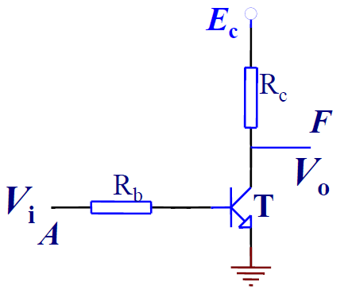
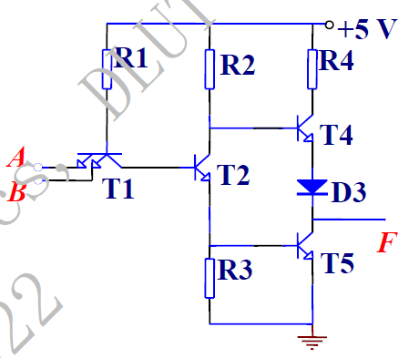
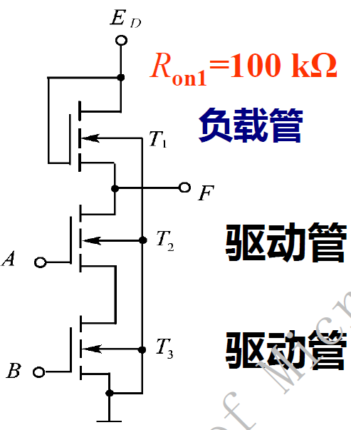
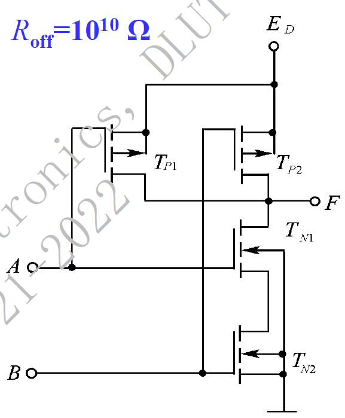
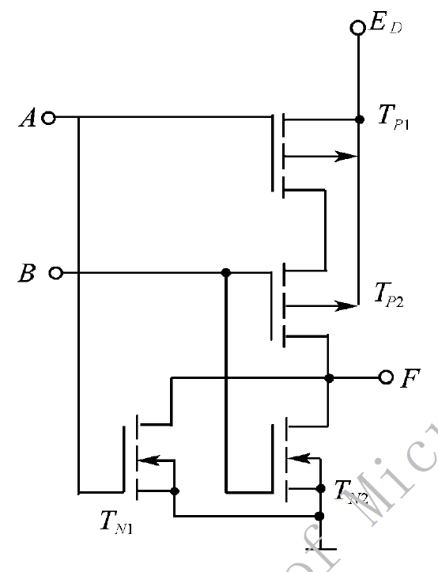

# 电路设计从入门到弃坑17【门电路结构】

数字电路是以模拟电路为基础的，这里先介绍一下逻辑门电路的实现

这里介绍的例子都是基于分立元件（MOSFET、BJT），如果有不清楚的地方可以参考前面的模拟电路部分章节

> 模电与数电的分界线就是这里啦OvO！

## 基本逻辑门的实现

在宏观上，只要是能实现逻辑门对应真值表的东西都可以当作逻辑门，所以说

* 几个开关可以实现逻辑门

    

* 三个打着旗子的人可以实现逻辑门

    > “陛下，请给我三个士兵，我将为您演示。"冯•诺伊曼兴奋起来。
    >
    > "三个?只要三个吗，朕可以轻易给你三千个。"秦始皇（他是三体星球上的统治者）用不信任的目光扫视着着冯•诺伊曼。
    >
    > “伟大的陛下，您刚提到东方人在科学思维上的缺陷，就是因为你们没有意识到，复杂的宇宙万物其实是由最简单的单元构成的。我只要三个，陛下。"
    >
    > 秦始皇挥手召来了三名士兵，他们都很年轻，与秦国的其他士兵一样，一举一动像听从命令的机器。
    >
    > "我不知道你们的名字，"冯•诺伊曼拍拍前两个士兵的肩，"你们两个负责信号输入，就叫‘入1’、‘入2’吧，"他又指指最后一名士兵，"你，负责信号输出，就叫 ‘出’吧，”他伸手拨动三名士兵，"这样，站成一个三角形，出是顶端，入l和入2是底边，"
    >
    > "哼，你让他们成楔形攻击队形不就行了?"秦始皇轻蔑地看着冯•诺伊曼。
    >
    > 牛顿不知从什么地方掏出六面小旗，三白三黑，冯•诺伊曼接过来分给三名士兵，每人一白一黑，说:白色代表0，黑色代表1。好，现在听我说，出，你转身看着入1和入2，如果他们都举黑旗，你就举黑旗，其他的情况你都举白旗，这种情况有三种:入1白，入2黑;入1黑，入2白;入1、入2都是白。"
    >
    > "我觉得你应该换个颜色，白旗代表投降。"奏始皇说。
    >
    > 兴奋中的冯•诺伊曼没有理睬皇帝，对三名士兵大声命令:"现在开始运行!入1入2，你们每人随意举旗，好，举!好，再举!举!"
    >
    > 入1和入2同时举了三次旗，第一次是黑黑，第二次是白黑，第三次是黑白。出都进行了正确反应，分别举起了一次黑和两次白。
    >
    > "很好，运行正确，陛下，您的士兵很聪明!"
    >
    > “这事儿傻瓜都会，你能告诉朕，他们在干什么吗?"秦始皇一脸困惑地问。
    >
    > "这三个人组成了一个计算系统的部件，是门部件的一种，叫‘与门'。"冯•诺伊曼说完停了一会儿，好让皇帝理解。
    >
    > 秦始皇面无表情地说：“朕是够郁闷的，好，继续。”
    >
    > 冯•诺伊曼转向排成三角阵的三名士兵:"我们构建下一个部件。你，出，只要看到入1和入2中有一个人举黑旗，你就举黑旗，这种情况有三种组合黑黑、白黑、黑白，剩下的一种情况一一白白，你就举白旗。明白了吗?好孩子，你其聪明，门部件的正确运行你是关键，好好干，皇帝会奖赏你的!下面开始运行:举!好，再举!再举!好极了，运行正常，陛下，这个门部件叫或门。"
    >
    > 然后，冯•诺伊曼又用三名士兵构建了与非门、或非门、异或门、同或门和三态门，最后只用两名士兵构建了最简单的非门，出总是举与入颜色相反的旗。
    >
    > ——三体

* 红石火把也可以实现逻辑门

    

不过在实现逻辑之前，我们还需要定义逻辑本身：红石的亮灭代表1和0；电路的通断表示1和0；黑旗和白旗表示1和0。而在数字电路中，通常使用两个界限电压来表示0和1，这是为了电路的抗干扰性。

### TTL与CMOS

模拟电路中，模拟信号往往会被微小扰动干扰以至于电路无法正常工作，而在数字电路中就不需要考虑这一点：定义两个明确的阈值电压，于是在这两个电压之间的扰动都会被忽略。对应的阈值电压被称为电平标准

常见的电平标准由TTL、CMOS、LVDS等

定义晶体管晶体管逻辑（**TTL**，Transistor Transistor Logic）：**2.8到3.6V为高电平；0到0.3V为低电平**

定义**CMOS**电平：*输出电压高于VDD-0.5V（VDD为数字电源）时为逻辑1，输入电压高于VDD-1.5V时为逻辑1；输出电压低于VSS+0.5V（VSS为数字地）时为逻辑0；输入电压低于VSS+1.5V时为逻辑0。CMOS电路输出高电平约为0.9Vcc，输出低电平约为0.1Vcc（Vcc为电路电源）*

COMS电路的供电电压VDD范围比较广，在+5到+15V均能正常工作，电压波动允许±10，相对TTL有更大的噪声容限；输入阻抗远大于TTL输入阻抗。

对应3.3V的TTL电平，还出现了LVCMOS电平可以与3.3V的TTL直接相互驱动，方便设备兼容

低电压差分信号（**LVDS**，Low Voltage Differential Signal）比较特殊，它是一种**电流驱动模式**，信号输出端将电压摆幅350mV加载在100Ω电阻上，也就是说**发送端是一个3.5mA的电流源**，产生的3.5mA电流通过差分传输线中的一路到接收端。**接收端对直流表现为高阻态**，电流会通过接收端的100Ω匹配电阻产生350mV的电压，同时电流经过差分线的另一路流回发送端。当发送端进行状态变化时，通过改变电流方向产生有效的0和1信号

LVDS传输具有以下特点

* **高速传输能力**：低电压摆幅可以让驱动源轻松实现高速变换以达到非常高速的信号传输
* **低噪声、低电磁干扰**：差分数据传输方式比单线数据传输对共模输入噪声有更强的抵抗能力，两条差分信号线比TTL单线信号传输的电磁辐射小得多。恒流源驱动模式也不易产生振铃和切换尖锋信号，进一步降低了噪声
* **低功耗、低电压**：LVDS能比较容易地应用于低电压系统中，只需要一个尽可能**靠近接收输入端的100Ω匹配电阻**跨在差分线上即可实现良好传输，静态功耗极低（负载功耗仅为1.2mW）

但是LVDS也有缺点：信号速度过快导致需要满足多层板布线、走线等长、差分布线、信号完整性检测等很多技术指标

### 半导体器件的开关工作状态

1. 二极管

    二极管正向导通，存在0.7V左右的压降

    二极管反向截止，只有微小的漏电流Is经过

2. BJT

    截止状态，ic达到最小，仅有微弱电流经过

    饱和状态，ic达到最大，由$i_{BS}=\frac{i_{CS}}{\beta}$

    三极管的包和-截止之间的阈值电压为0.7V（$V_{BE}$）

    转换成电压，针对NPN管可以描述为

    三极管截止，要求$V_{BE}<0.7$，可得$V_o \approx V_{cc}$

    三极管饱和，要求$V_{BE} \ge 0.7$，可得$V_o=V_{CES} \approx 0$

3. MOSFET

    下面都是以NMOS为例

    截止状态：$i_D \approx 0$，当$V_{GS}>V_{TN}$

    导通状态：$i_D \approx i_S$，当$V_{GS} < V_{TN}$

    在制作数字集成电路时，常常会用到**CMOS工艺**，即"Coupled MOSFET"：它使用一对D极相连的MOSFET组成推挽输出，从而让驱动能力最大化

    对于CMOS电路，由PMOS作为**负载管**提供**灌电流**，NMOS作为**驱动管**提供**拉电流**，在同一个电压下有且仅有一个MOS能够处于导通状态，另一个MOS一定处于截止状态，从而通过输出端分压来实现高驱动能力

### 基于分立元件的与门、或门、非门

基于二极管实现的基础逻辑门如下所示

> 与门
>
> 
>
> 或门
>
> 

使用晶体管可以实现非门

虽然说上面的电路都能实现基本的逻辑门功能，但是都存在诸如存在不稳定电压、驱动能力弱等问题，所以需要使用基于CMOS和TTL的集成门电路

## 集成门电路

常见的集成门电路就是**74门**系列，型号表示为74xxxx

* 74xx：经典系列，没有什么特殊功能
* 74Hxx：高速系列，TTL电平
* 74LSxx：基于低功耗肖特基晶体管的门电路，TTL电平
* 74Sxx：基于肖特基晶体管的门电路

使用集成门电路可以避免分立元件逻辑门的问题，因为集成门电路中使用了多发射极和一套自带的功率放大电路，可以消除不稳定电压，提高电路驱动能力

### TTL门电路

一个经典的TTL与非门电路如下所示

存在阈值电压为1.4V（两个二极管的阈值电压叠加）

输入电压小于1.4V，表示逻辑0；大于1.4V，表示逻辑1

TTL门电路最重要的特性就是**电流驱动**，根据这一点可以推导出所有TTL门电路遵循以下特性：

* 阈值电压为1.4V
* 输入端悬空相当于接高电平（输入电流为0）
* 输入端接入一个超过2kΩ的电阻时，视为高电平（输入电流太小）
* 输出端通过一个大于2kΩ的电阻接到下级输入时，低电平难以传递到下级电路（下级电路被2kΩ电阻分压）

在进行电路分析时注意2kΩ和开路的限制

定义**扇出系数**（Fan-out）：**一个输出所能驱动的同类门的最大数目**

TTL电路不能驱动过多负载门电路，驱动门的最大容许灌电流为**16mA**，最大允许拉电流为**400uA**

一般来说扇出系数$N\le 8$

需要特别指出：**一般的TTL电路禁止线与连接**，也就是两个门电路的输出端不能直接连接，因为没有保护电路的情况下，一个门的上管会处于导通，一个门的下管也处于导通，此时就会直接导致电源接地产生大电流把对应管烧毁，最好的情况也是会导致错误的逻辑电平。因此需要使用OC门进行线与操作，如下所示

在输出端通过一个上拉电路来保证电路正常工作

### CMOS门电路

不同于TTL门电路，MOS管搭建的门电路可以很好地接收电压信号并以此进行逻辑控制。对MOS逻辑门，根据MOS管导通和截止状态电阻，用**分压法**来分析输出逻辑电平的高低

基本MOSFET逻辑门电路使用两个同型号的MOS搭建

> 与非门
>
> 
>
> **两个NMOS驱动管串联，实现与非关系**
>
> 或非门
>
> 
>
> **两个NMOS驱动管并联，实现或非关系**

除了基本的MOSFET门电路，集成电路中常常使用互补性MOSFET电路（CMOS）工艺实现逻辑门，这是因为同时包含PMOS和NMOS的对管更容易制造

**在CMOS中PMOS称为负载管，NMOS称为驱动管**

> 与非门
>
> 
>
> **两个驱动管串联，两个负载管并联**
>
> 或非门
>
> 
>
> **两驱动管并联，两负载管串联**

通过上面的两个例子，可以看出CMOS门电路通过组合负载网络和驱动网络实现，在功率电路中，这样的拓扑称为“图腾柱拓扑”，或更广泛地说是推挽输出，要求

* 下拉网络由NMOS构成，上拉网络由PMOS构成

    因此提供灌电流的NMOS也称为**下管**；提供拉电流的PMOS称为**上管**

* 上拉网络和下拉网络互相对偶

* 要求每个输入端同时加到一个NMOS和一个PMOS的g极

* NMOS串联实现与操作；并联实现或操作

因为CMOS电路的特殊构造，导致使用时需要注意一些特殊点：

* 不需要考虑外接电阻的大小，输入端只要接地就是0，接电源就是1

* 不能让CMOS芯片的空脚悬空

    > 原因在之前模拟电路部分提到过：防止MOSFET的g极积累静电导致击穿

OC门也可以使用CMOS电路实现。虽然说推挽输出的CMOS门电路很难被烧坏，但是两个管子同时经过大电流会导致动态功耗过大，而且输出电流不确定是一个很难处理的问题，面对线与的情况必须使用**OD**（Open-Drain）门——**CMOS漏极开路门**

它的电路符号和OC门一样，实现上则采用在电路输出端额外加入一个MOSFET的方式，上拉电阻也是必须的

### 组合逻辑电路

组合逻辑电路的特点：**任何时刻输出仅取决于该时刻输入，与过去的输入无关**

组合逻辑电路**不存在反馈线或记忆元件**

使用基础的逻辑门即可实现任意组合逻辑电路，最简单的组合逻辑电路就是单个逻辑门

在集成电路中，常常会将两个或以上的组合逻辑电路器件封装在同一片芯片上，如下图所示

这是六路反相器74HC04的datasheet

其中包含六个独立的非门，pin-7是接地，pin-14是供电Vcc

组合电路的一个重要性能指标就是传输时间，下图给出了74hc04的传输时间

相对地，在模拟电路里面备受重视的电气特性在数字电路中并不很关键，用户主要观察最大值和典型值即可，俗话说的好，够用就行

