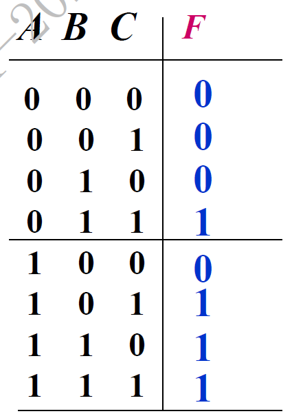
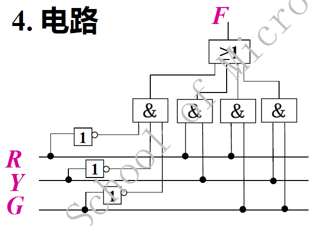

# 电路设计从入门到弃坑18【组合逻辑电路】

前两节简单介绍了数字电路的基础内容，接下来就是真正的数字电路应用部分了

数字电路主要分为两个部分：**组合逻辑电路**和**时序逻辑电路**，时序逻辑电路以组合逻辑电路为基础，两个部分相互配合实现一套逻辑操作，CPU和大部分数字电路设备内部也是靠着组合逻辑-时序逻辑共同实现的FSM（有限状态机）模型驱动的

## 组合逻辑电路的分析和设计

### 分析电路

流程如下

1. 从输入端到输出端逐级写出逻辑门的输出
2. 化简逻辑函数
3. 列出对应真值表
4. 分析电路功能

### 设计电路

流程如下

1. 确定输入输出关系
2. 列出真值表
3. 得出逻辑函数的最简形式
4. 确定要使用的电路器件
5. 按照器件应使用的逻辑函数画出电路图

### 常用的基本组合逻辑电路

1. 三人表决电路

    

    当ABC三个输入中的1数量多于0的数量时，输出1

    化简后的逻辑函数
    $$
    F=AB+AC+BC
    $$
    

2. 交通灯报警电路

    

    同时有且只有一个输入为1，否则输出1

    化简后的逻辑函数
    $$
    F=\overline{R} \cdot \overline{Y} \cdot \overline{G} +RY+RG+YG
    $$
    

## 组合逻辑电路中的竞争和冒险

**竞争**：从输入到输出的途径不同，延时时间不同，到达输出端的时间不同，这种现象为竞争

**冒险**：输入信号变化导致逻辑电路产生错误输出，称为冒险或险象

冒险分为两种：

* **0型冒险**：输出波形出现窄的负脉冲
* **1型冒险**：输出波形出现窄的正脉冲

### 识别冒险现象

* 代数法

    由于同一个信号到达终点的途径不同引起

    当函数表达式可以化成$F=A+\overline{A}$或$F=A\cdot \overline A$时，函数中含有**互补变量**，说明A变量的变化可能引起冒险

* 直接法

    输出波形出现毛刺表明存在冒险

* 卡诺图法

    卡诺图中出现两个圈相切的情况也是冒险的特征

    

### 消除冒险现象的方法

1. **接入滤波电容**

    竞争冒险引起的脉冲一般很窄(纳秒级)，可以在输出端并接一个滤波电容将其滤掉

    但是完全不实用：集成电路里面很难制造大电容，并且由于滤波电容可能导致额外的延迟

2. 引入**取样脉冲**

    在输出端接取样脉冲，仅在输出处于稳定值时出现，当取样脉冲为0期间，输出端信息无效

    这种思路就是使用时序逻辑电路进行采样，在后续章节中还会提到

3. 修改设计方案

    最直接的方法就是在逻辑函数里**引入冗余项**

    卡诺图两圈相切处增加一个圈（冗余），就能消除冒险

    

