# 电路设计从入门到弃坑2.5【场效应管】

在详细谈MOSFET之前，我们先通过一份datasheet回顾一下MOSFET的伏安特性

这是通用功率MOSFET IRF220的datasheet，我们可以了解到它能承受4A@150V，有些型号能够承受5A@200V，比一般的功率三极管高到不知哪里去了，同时它的导通电阻（DS电阻）仅为0.8~1.2Ω，并且具有很高的输入阻抗（High Input Impedance）

右下角是他的电路符号

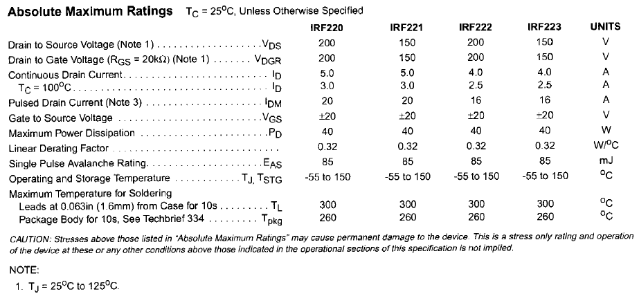

这则是IRF22x系列的最大电气值，V~DS~=200，I~D~=5A，P~D~=40W，耐温达到300℃

手册下面就是详细的电气特性：

阈值电压2V\~4V，I~D~=250μA

漏电流100nA

开启时延20\~40ns，关断时延50\~100ns

寄生电容有点大，但不完全大

同样存在略大的寄生电感

这个管子就是典型的增强型功率NMOSFET

## MOSFET伏安特性分析

场效应管可以如下进行分类

* 结型场效应管JFET

    * 增强型

    * 耗尽型

    * N-JFET

        

        

    * P-JFET

        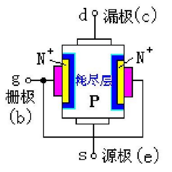

        

* 金属氧化物半导体场效应管MOSFET

    * 增强型

        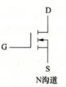

        

    * 耗尽型

        

        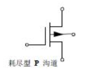

    * NMOS

    * PMOS

这里需要强调一下才JFET和MOSFET的区别：JFET是在同一块N形半导体上制作两个高掺杂的P区，将它们连接在一起引出栅极g，N型半导体两端分别引出两个电极，分别称为漏极d，源极s。与MOSFET相比，JFET更像三极管，原理也更加“原始”：通过电压改变沟道的导电性来实现对输出电流的控制；对应MOSFET则使用电压先控制反型层，进而控制导电沟道。

结型场效应管JFET是典型的单极型管，具有噪声小、抗辐射能力强、工作电压低的特点，同时器件工艺使得其适合制造（由于成本等限制，几乎所有JFET都是）耗尽型场效应管，常用于高速器件。但是由于它需要外加电压夹断导电沟道，也就使得电压低时漏电流相对较大，不够节能，因此在数字集成电路中不常用。本部分**主要以增强型MOSFET为例介绍场效应管的性质**

> MOSFET的基本知识已经在【基础晶体管】部分提到，这里默认读者已经*相对了解了MOSFET的电路符号并且能够判断其类型*，能够*大致说出电场效应是什么*，能够*理解增强型MOSFET的三种工作模式*

### 输出特性

当$V_{GS}$恒定时，测量S-D两端电压$V_{DS}$和漏极电流$I_D$之间的关系

公式表述就是
$$
i_D=f(u_{DS})|_{U_{GS}=Const}
$$
当$U_{GS}$很小时，反型层未形成，导电沟道不会开启，MOSFET工作在截止区，此使存在微小的GS漏电流。

理论上MOSFET工作在该区域时，G-S之间的电阻式无穷大的。

当$U_{GS}$在增大到**阈值电压**（开启电压）时，

当MOSFET处于饱和区时，当DS电压增加时，D极电流几乎恒定，称为**饱和状态**

综上可以推导出一个MOSFET静态工作模型如下：

实际上该电阻值在TΩ量级

特别地，如果$u_{GS}$过大，会导致MOSFET击穿——这与$u_{DS}$无关，当$u_{DS}$超过击穿电压后，沟道内发生雪崩击穿，漏极电流急速上升，如果瞬间电流过大，会之间烧毁导电沟道部分。这个特性导致了MOSFET的GS之间很害怕静电：GS之间存在非常小的寄生电容，当外界条件变化引起感应起电或让GS带电后，即使微小的电荷也会导致大电压，进而出现下面两种**静电击穿**：

* **电压静电击穿**：栅极的薄氧化层发生击穿，形成针孔，使GS间或GD间短路
* **功率静电击穿**：静电放电形成的是短时大电流，放电脉冲的时间常数远小于器件散热的时间常数，当静电放电电流通过面积很小的半导体结时，将产生很大的瞬间功率密度，形成局部过热，于是金属化薄膜铝条被熔断，造成栅极开路或者是源极开路

应用中，增强型和耗尽型场效应管都具有类似上面这样的输出特性

从最上面的曲线图可以看出MOSFET可以工作在三种模式下，分别是恒流（**饱和**）**模式**、**截止模式**、线性（**欧姆**）**模式**，具体的模式描述已经在上一篇博文中谈过，如果无法理解，请立刻中止阅读并复习上一篇博文内容

> 这里需要补充一下：MOSFET的性质在模电教材中并未显著提及，可能是作为电路基础教材不应谈及过深入的内容；本博文对于MOSFET的讲述也会不甚深入，因为其中很多原理需要先了解半导体物理、量子力学基础知识后才能有效应用，这里仅作为补充引入一些概念（对于上篇博文中概念的定量公式补充）
>
> * 由于电子能量的玻尔兹曼分布，导致总有一些高能量电子能够穿透沟道并运动到漏极，因此在截止模式下，MOSFET中总是不可避免出现弱反转电流，遵循以下公式：
>     $$
>     I_D \approx I_{DO}e^{\frac{V_{GS}-V_{th}}{nV_T}} \\
>     n=1+\frac{C_D}{C_{ox}}
>     $$
>
> * 跨导-电流比的定义式：$\frac{g_m}{I_D}=\frac{1}{nV_T}$
>
> * 经过整理的d-s电流公式
>     $$
>     I_D=K_n[2(V_{GS}-V_{th})V_{DS}-V_{DS}^2] \\
>     K_n=\frac{K_m}{2}=\frac{W\mu_n C_{ox}}{2L} \\
>     K_p=\mu_n C_{ox}=\mu_n \frac{\epsilon_{ox}}{t_{ox}}
>     $$
>     其中$K_n$是MOS常数，当且仅当W=2L时，$K_p=K_n$
>
> * MOSFET的导电是通过一个较宽的二维或三维电流分布实现的，这个区域关断的开始称为夹断。
>
>     MOSFET和三极管类似，也存在由于结而形成的厄利电压$V_M$，由于厄利电压的存在，夹断情况附近漏极电流并不主要依赖漏极电压，而是按以下公式：
>     $$
>     I_D=\frac{\mu_n C_{ox}W}{2L}(V_{GS}-V_{th})^2(1+\lambda V_{DS})
>     $$
>     于是可以根据该公式推导出MOSFET跨导的半导体物理描述
>     $$
>     g_m=\frac{2I_D}{V_{OV}}=\frac{2I_D}{V_{GS}-V_{th}}=g_m=\frac{\partial i_D}{\partial v_{GS}}
>     $$
>     同时可以得到MOSFET得到输出阻抗
>     $$
>     r_O=\frac{1}{\lambda I_D}=\frac{\partial V_{DS}}{\partial I_{DS}}
>     $$
>     若$I_D$趋于0时，器件无限大的输出阻抗会让电路的预期行为变得不可靠，出现速度饱和、准弹道传输、势垒降低效应

### 输入特性（转移特性）

输入特性又叫转移特性

当S-D两端电压$V_{DS}$恒定时，测量$V_{GS}$和漏极电流$I_D$之间的关系，即转移特性：$I_D=f(V_{GS})|_{V_{DS}=Const}$

这里主要解释一下MOSFET电压“输入”的思想

MOSFET相比三极管很特殊，它的G-S极被看作开路，所以它并不能把电流视为“输入”——而是将GS电压作为输入的信号，于是我们可以用一个经典的$i_D$-$u_{GS}$图像描述MOSFET在信号输入回路的电气特性

增强型：

存在一个由管型决定的门限电压（**开启电压**），输入信号小于开启电压不会有输出电流，这个开启电压对应着输出特性中截止区与电阻区的分界曲线

耗尽型：

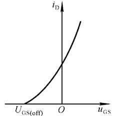

耗尽型MOSFET则存在一个关断电压（**夹断电压**），当$u_{GS}=0$时并不意味着输出为0，实际上此时MOSFET还工作在电阻区，只有达到这个负的（不一定是负的，取决于管型）夹断电压，耗尽型MOSFET才会真正关断

### 温度特性

耗尽型NMOS当温度升高时，d极电流下降

**温度升高**会导致MOSFET的内部分子热运动加剧，进而使内电流增大，g极外电场**对导电沟道的控制能力下降**，对应的结果需要按照MOSFET的型号决定

### 场效应管重新梳理

需要注意：耗尽型FET在$u_{GS}=0$时才可以工作在恒流区；增强型MOSFET中N沟道就像是N型BJT一样，需要正的$u_{GS}$才能工作在恒流区；相反，P沟道增强型MOSFET需要负的$u_{GS}$才能工作在恒流区

下面来介绍MOSFET的电路分析模型（低频模型）

1. 直流等效模型

    

    上图是从模集教材中截取的内容，板级电路设计中通常需要考虑$C_{GS}$、$C_{DS}=(C_{DB}+C_{SB})//(C_{GB})$、$C_{GD}$，还需要额外注意D-B之间和B-S之间存在因为半导体结出现的寄生二极管

    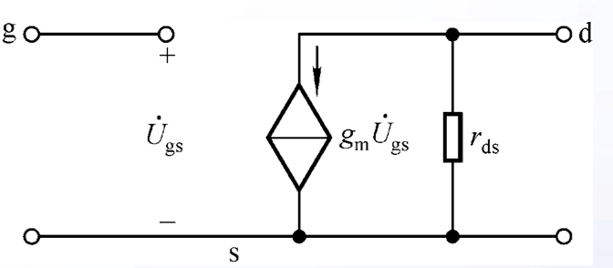

    在中低频中低压电路分析中常用的模型如上图所示，可以将gs端看作一个压控电流源，并有一个并联在ds端的电阻$r_{ds}$，可近似看成一个无穷大的电阻或一个无穷小的电导。这个电阻就是MOSFET的输出电阻，常常用以下公式描述
    $$
    r_o=\frac{\frac1\lambda +V_{DS}}{I_D}\approx \frac{V_E L}{I_D} \\
    沟道调制长度\lambda =\frac{1}{V_E L}
    $$
    λ仅与工艺有关，在65nm节点，λ大约在4V/μm，对于板级使用，只要认为它是个与管型有关的系数就可以了，可以从datasheet直接查阅MOSFET的输出电阻参数

    根据之前所说的MOSFET转移特性可推导出跨导$g_m=\frac{\partial i_D}{\partial v_{GS}}|_{v_{DS}=Const}$，这个方程描述了MOSFET在线性区的工作状态

    电路设计中并不会使用该模型，因为它缺少细节，这个模型往往会在模电考试和**定性分析电路**中出现

2. 交流等效模型

    非常简单，MOSFET因为输入电阻可以看作无穷大，三极管中很多冗余参数都可以舍弃，

    只要了解
    $$
    g_m=\frac{\partial i_D}{\partial v_{GS}}|_{v_{DS}=Const}
    $$
    即可
    
    但是在小信号情况下，还可以用$I_{DQ}$近似$i_D$得到
    $$
    g_m=\frac{2\sqrt{I_{DO}I_{DQ}}}{U_{GS(th)}}
    $$

## MOSFET工艺

当前主流MOSFET有四大工艺分支：

1. 平面型MOSFET（Planar MOSFET）

    这是最早出现的生产工艺，最成熟且成本较低。该工艺采用离子注入的方式将所有有源区电极（源极、漏极、体极）和栅极都制造在芯片同一平面上，电流横向流动。当前的数字集成电路往往采用这种工艺制造大量MOSFET。但对于功率MOSFET来说，芯片面积较大导致沟道长度过长，也就是说导通电阻 $R_{DS(on)}$ 就会很大，这就导致不适合大功率应用。

    一般来说这种MOSFET具有更高的抗击穿能力（因为沟道更长），因此对于想要节省成本的高压应用，还是需要用到这种工艺制造的器件

2. 垂直双扩散MOSFET（VDMOS，Vertical Double-diffused MOSFET）

    当前市面上大部分功率MOSFET都采用这种结构，也被称为“DMOS”。该工艺下，源极区和P型有源区通过两次扩散工艺形成。因此源极和栅极在顶部，漏极在底部，电流是垂直流动的（从源极流向漏极），这就带来了更大的电流承载能力，导通电阻 $R_{DS(on)}$ 也比平面MOS更小。同时，MOS的击穿电压主要由垂直的漂移区决定，易于实现高压应用。

    综上所述，这种MOSFET在当前市面上很常见，具有耐受中高压、导通电阻小、功率等级高的特点，但成本相对平面型MOSFET稍贵

3. 沟槽型MOSFET（Trench MOSFET）

    这是对VDMOS的进一步改进。栅极被制作在一个刻蚀到硅片内部的“沟槽”中，形状类似字母U。

    > 可以将其理解为将STI浅槽隔离工艺应用在MOSFET中

    在这种情况下，MOSFET的沟道是垂直的，包裹住沟槽，这会显著降低导通电阻 $R_{DS(on)}$，并且垂直栅极使得栅极电容也减小了（因为Cgs小了）。但作为弊端，这种工艺的击穿电压也比较低，因此常常被用于低压大电流的场合。同时，由于栅极尺寸很小、无需占用芯片面积，这种MOSFET也被用于DC-DC转换器这样的数字模拟混合集成电路内。

4. 屏蔽栅沟槽型MOSFET（SGT-MOSFET）

    这是对Trench MOSFET的重大升级。它在沟槽底部引入了“屏蔽栅极”（Shielded Gate）的结构，所以它具有两个栅极：控制栅（Control Gate）位于沟槽的上半部分，通过栅氧化层控制沟道的开启和关闭，也就是之前在提的MOSFET栅极；而屏蔽栅（Shielded Gate）位于沟槽的下半部分，被较厚的氧化层与控制栅隔开，通常与源极相连它处于固定的低电位。由于引入了屏蔽栅，这就导致整个沟槽的深度要更深

    沟槽型MOSFET的栅极非常靠近位于漏极的漂移区，这就导致米勒电容 $C_{gd}$ 较大，这会影响MOSFET的开关速率。而在SGT-MOSFET引入屏蔽栅以后，它充当了一个低电位屏蔽层，将控制栅与高压的漂移区隔开，从而显著降低了米勒电容。总的栅极也受此影响大大降低，因此SGT-MOSFET常常被用于高频大电流开关。

5. 超结MOSFET

    这是一种专为高压应用设计的MOSFET。在片上通过交替堆叠垂直的P型柱和N型柱来取代VDMOS的N型漂移区。在关断时，P柱和N柱相互补偿，形成大面积的耗尽区，可以维持更高的击穿电压，同时极大地降低了高压器件（尤其是VDMOS）的导通电阻 $R_{DS(on)}$。因此，这种MOSFET普遍被用于AC-DC电源、照明逆变器等需要高压和高效率的领域。当然，这种MOSFET的成本也更高。

# 基于场效应管的基本放大电路

基本放大电路也可以基于场效应管实现，实际上由于MOSFET技术比较成熟，很多功率放大器件都会基于MOSFET工艺实现。但是场效应管是电压控制电流器件，其GS极在低压中低频近似为开路，导致MOSFET基本放大电路的一些特性与三极管基本放大电路不同，集中体现在以下几点：

* 输入电阻普遍偏大
* 存在一个相对较大的g极寄生电容和s-d极寄生电容
* 同拓扑电路整体性质与三极管放大电路存在差别

## MOSFET基本放大电路拓扑

MOSFET放大电路就是三极管放大电路的翻版，因此了解该部分之前应该先阅读下一部分【基本放大电路】

> 在阅读以下内容前，请确认已经阅读完了【基础放大电路部分】，并务必*熟悉三极管放大电路的分析方法*

### 共源放大电路

对应共射放大电路，拓扑如下所示

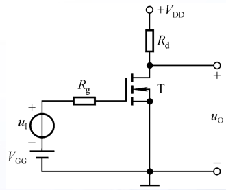

1. 静态分析

    在设计实际放大电路之前需要先设置好管子的静态工作点。该电路可以使用三种方式获得稳定的静态工作点

    1. 基本偏置

        和上面的基本拓扑一样，可以完成基本的放大任务，但是存在很多问题

        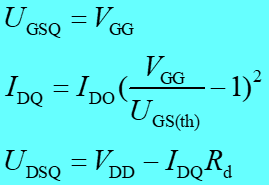

    2. 自给偏压电路

        这个电路可以由正电源获得负偏压，这样就能放大正负周期信号了，但是只有结型场效应管、耗尽型MOS管才适合使用这种方式。自给偏压电路**不适合增强型MOS管使用**，因为在共源放大电路中，需要较大的驱动电压才能让增强型MOSFET工作，但是输入耦合电容C1会对交流信号大量分压，使得带载能力弱的信号无法驱动MOSFET

        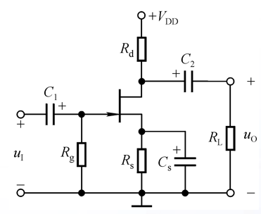

    3. 分压偏置电路

        一般来说MOSFET都会使用这个拓扑来获得完善的静态工作点

        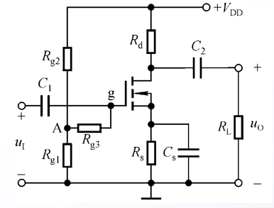

2. 动态分析

    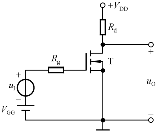

    对应的交流等效电路如下（可以看到忽略了很多东西）

    

    不难看出，共源放大电路的特点就是输入电阻即答，输出电阻由“上拉电阻Rd”决定
    $$
    R_i=\infin \\
    R_o=R_d\\
    A_u=-g_m R_d
    $$

### 共漏放大电路

对应共集放大电路，拓扑如下所示

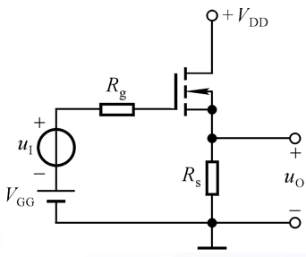

对应的电路分析等效如下

可以看到
$$
R_i=\infin \\
R_o=R_s//r_{GS} \\
A_u=\frac{g_m R_s}{1+g_m R_s}
$$

> 最后请读者重新阅读最开头的datasheet，看看能不能读明白

