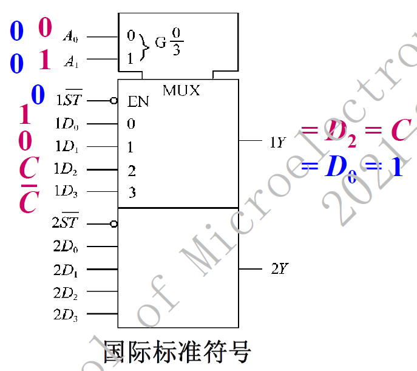
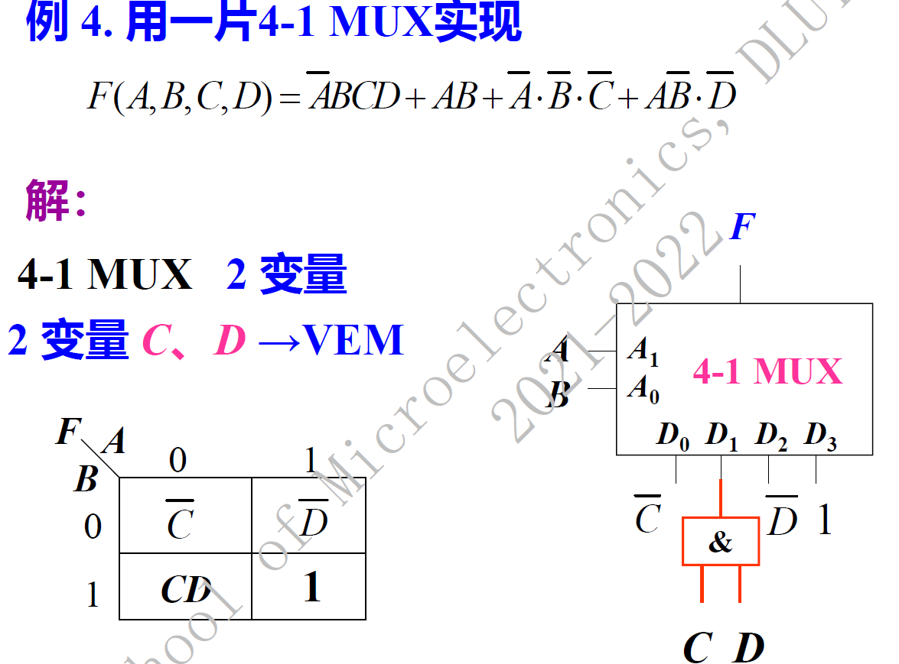
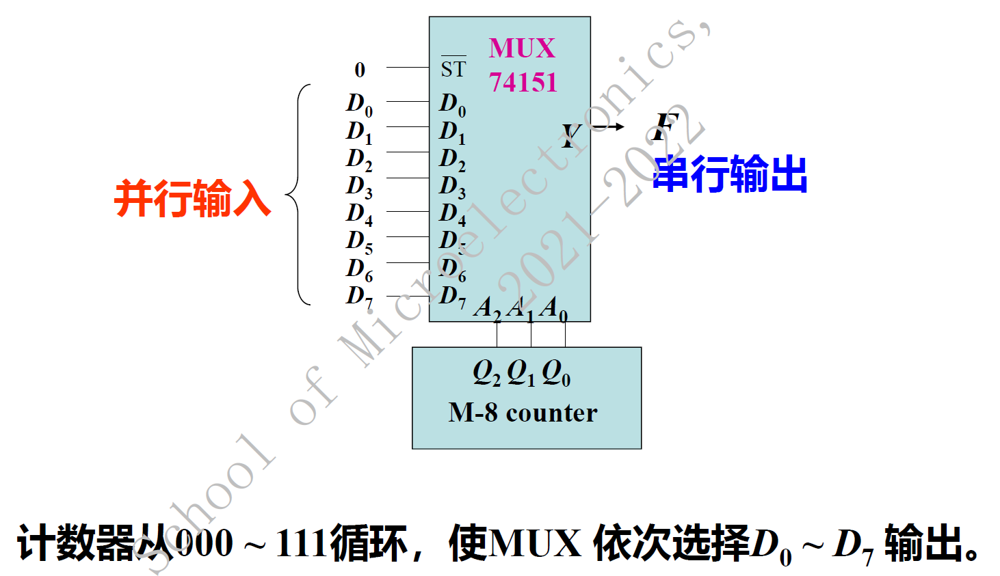

# 电路设计从入门到弃坑21【多路选择器】

## 多路选择器

在多路输入数据中选择一路进行输出的组合电路称为**多路选择器**

使用n位地址线控制位可以控制$2^n$位的数据输出。控制码是几，就把第几号数据送到唯一的输出端

**多路选择器又简称为MUX**，是一种非常常用的基本组合逻辑电路

### 多路选择器74153

这是一个2合一4-1线多路选择器（**四选一**）

上下两个1Di、2Di是分离的，但都通过Ai（地址线）控制

注意到使能端低电平有效

### 多路选择器74151

这是一个8-1线多路选择器（**八选一**）

地址输入是Ai，数据输入是Di，唯一数据输出为Y

注意到低电平有效

### 用MUX实现逻辑函数

**一个MUX只能实现一个逻辑函数**

可以通过

1. 将多变量的逻辑函数化简为地址输入位数变量的VEM形式

    比如需要用74153实现$F(A,B,C,D)$，那么它只有两个地址位，需要先画出带C、D的VEM卡诺图

2. 将VEM卡诺图化简

3. 对应最小项mi将Di数据的输入设置为对应卡诺图里面的数据

> 给出一个示例
>
> 

## 数据分配器

和MUX相反，**数据分配器**的功能是：控制数码是几，就把输入数据送到第几路输出端

因此**数据分配器简称为DEMUX**

可以使用译码器74138实现1-8DEMUX

> 译码器的内容会在下一篇介绍

### 多路数字开关

通过将MUX 和DEMUX 结合使用，可以实现时分多路数据通信

### 数据并行-串行转换

 使用计数器和MUX可以实现移位寄存器的功能，进而进行串行-并行输出

