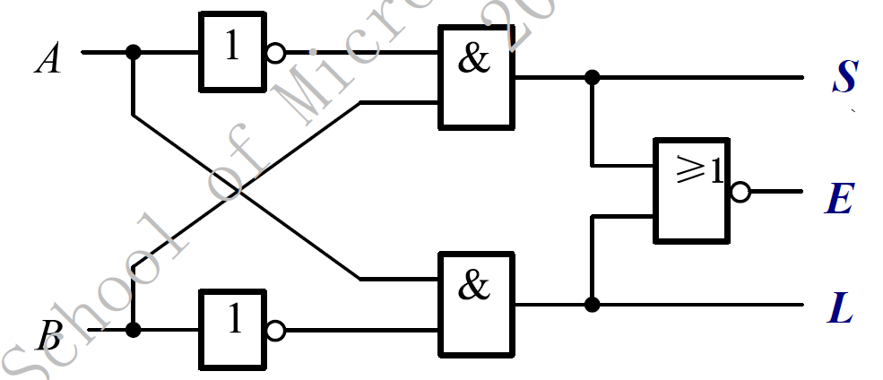
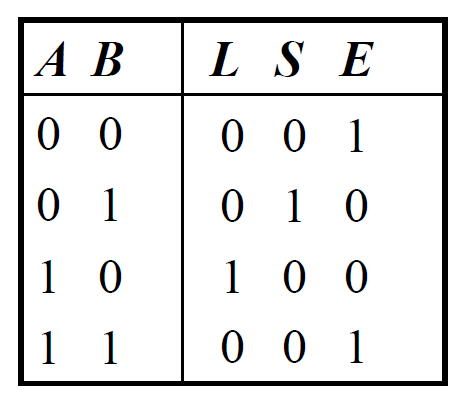
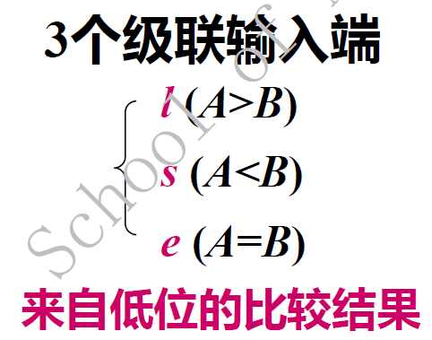
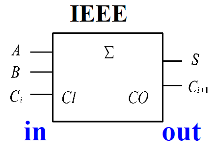
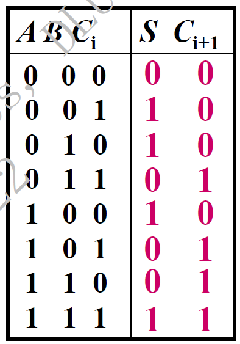
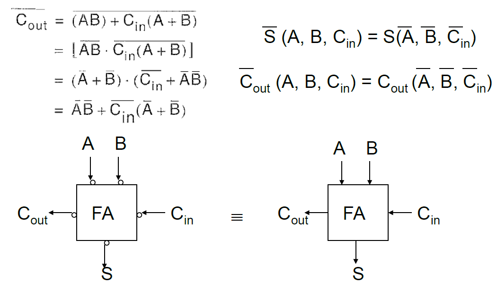
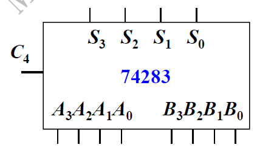

# 电路设计从入门到弃坑23【数字运算电路】

## 比较器

功能: 比较两个无符号二进制数的大小

### 74LS85

四位二进制数比较器

结果对应的位出1

从高位开始比较

可以级联输入端l、s、e进行扩展

比较步骤：

1. 先用高位片，若高位片比出结果（A>B or A<B), 则与级联输入状态无关
2. 若高位片相等(A=B)，再看级联输入，即看低位片比较结果l s e
3. 若低位仍相等，则A=B

## 加法器

加法逻辑本质上就是列竖式，从右往左依次加每一位，同时求出进位来给到高位。利用逻辑电路可以通过将加法拆分成两个部分实现加法器。一个逻辑负责进位，一个逻辑负责求和，这便是半加器，它可以但也仅仅可以实现一位加法的逻辑

### 半加器

低位：异或门，输出和S（Sum）

高位：与门，输出进位C（Carry Out）
$$
S=A \oplus B,C_o=AB
$$

半加器的局限性：半加器没有考虑来自低位的进位，无法构成N位的加法器

### 全加器

为了能够处理多位加法，我们需要考虑来自低位的进位，通过真值表可以分析出只需要将求和逻辑设置成三个输入异或，将进位逻辑设置成三路表决器（只要有两个或以上的1输入，就输出1），就能得到全加器了

低位：三路异或门，输出本位和S

高位：三路表决器，输出进位C
$$
A=A\oplus B\oplus C_{i},C_{i+1}=AB+AC_{i}+BC_{i}
$$

全加器可以接收来自前一位的进位，因此它可以进行级联得到任意位的加法器

> 全加器的本位和S=“1，2，4，7”表示对应最小项
>
> 进位C=“3，5，6，7”表示对应最小项

当然，加法器也不一定必须使用上面的逻辑表达式，也可以使用能实现真值表的其他表达式，而对于电路来说，其他形式的表达式可以复用电路模块、节省资源

### 串行进位加法器和超前进位加法器

对于基本全加器，我们可以发现它存在“*反向特性*”：将S和C的表达式写出来，对其输入的每一个数取反，会发现等于输出的取反

考虑基础的加法器链，并行输入，串行进位: 结构简单, 速度慢

超前进位加法器相当于四个全加器同时计算，提高速度

74283就是一个常见的超前进位加法器，运算速度相对较快

