# 电路设计从入门到弃坑25【数字信号】

**数字信号**指的是承担数字运算或电路时钟作用的信号，不同于模拟信号，数字信号一般是方波或类方波（三角波、梯形波等），并且一般通过频率描述周期性的数字信号，他们有一个统称：脉冲信号

**脉冲信号**：作用在电路中短暂的电压或电流信号

脉冲信号是既非直流又非正弦交流的电压或电流，常见的波形有**方波**、**三角波**、**梯形波**、**锯齿波**等，波形在时间轴上不连续

数字电路中通常使用方波作为时钟源或触发信号，因为它的抗干扰能力强、传输速度快、相对稳定

如上图所示，一个理想的脉冲信号就是方波，其中有三个重要参数：

**脉冲宽度**$T_W$：简称脉宽，指脉冲高电平持续时间

**周期**T：信号的周期，它的倒数就是频率f

**幅度**$V_m$：也称为幅值，就是方波的高电平值

**占空比**D：$D=\frac{T_W}{T}$，高电平持续时间占方波周期的百分比

实际的脉冲信号不一定是理想方波，更可能是梯形波，如下图所示

实际的脉冲信号存在

**上升时间**$t_r$：信号从10%Vm上升到90%Vm所用时间

**下降时间**$t_f$：信号从90%Vm下降到10%Vm所用时间

在**同步时序电路**中, 作为时钟信号的矩形脉冲控制和协调整个系统的工作，时钟脉冲的特性直接关系到系统能否正常工作，信号脉冲的传输速度和稳定性直接关系到系统输出的正确性

> 异步时序电路里面虽然很少用到脉冲，但是现在根本就没有可供大范围应用的异步时序电路，所以说脉冲就是是同步时序电路的关键

在板级电路设计中常常涉及到的“**眼图**”测量就是为了确定PCB传输线上面的数字信号时序是否正常，上升和下降时间对数字电路的工作有重要影响

一般来说电路的时钟信号可以通过两种方法产生

* **多谐振荡器**：可以通过多谐振荡器直接生成方波信号
* **晶振或其他已有信号整形变换**：利用晶振的输出信号经由皮尔斯震荡器得到方波信号，或通过两个反相器得到不那么精确的方波信号

## 555定时器

555定时器是最经典的时基数字电路之一，很多厂家都有生产，比较有名的型号就是NE555，TI、NI、HTC等都有生产

这里摘录了DIODES的NE555的datasheet资料

它是一个简单的8pin芯片，但是可以实现三种典型应用

* **施密特触发器**
* **单稳态触发器**
* **多谐振荡器**

引脚定义如下

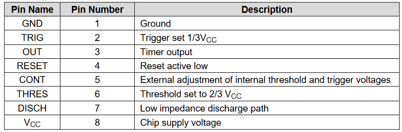

NE555里面1和8脚用于供电，3脚输出，4脚是低电平有效的复位端

2脚是1/3 Vcc的触发设置，6脚是2/3 Vcc的阈值设置

7脚是放电通路，5脚用于内部阈值和触发电压的调整（看到下面会发现5脚VCO的设置会对电路参数有很大影响）

下面是从datasheet里面截取的内部原理图，仅供参考

下图是555定时器最经典的功能表，务必牢记（详细内容在后文解释）

**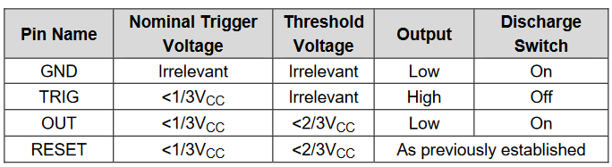**

官方给出了几套示例应用电路，分别是

**单稳态振荡器**

下方说明里面指出对应延迟脉宽$T_W=1.1R_A C$，这是一个很重要的结论

**多谐振荡器（无稳态振荡器）**

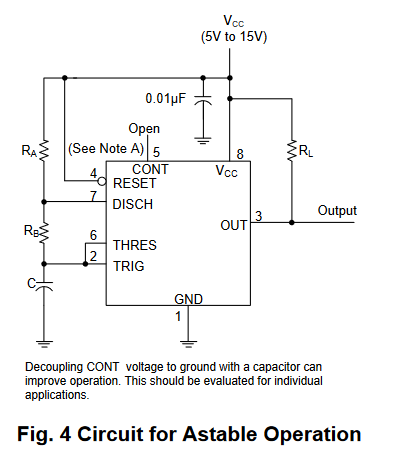

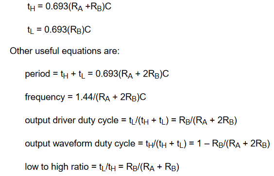

可以看到周期$T=0,7 (R_A +2R_B)C$，同时占空比由两个电阻决定$D=1-\frac{R_B}{R_A+2R_B}$

**脉宽调制电路**

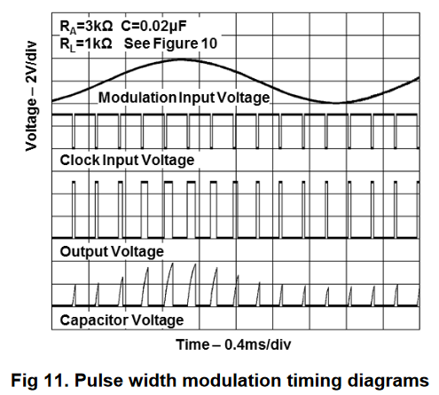

**相位调制电路**

以上两个电路都可以直接用在载波调制电路里，能够达到相对较高的精度

**级联定时器**

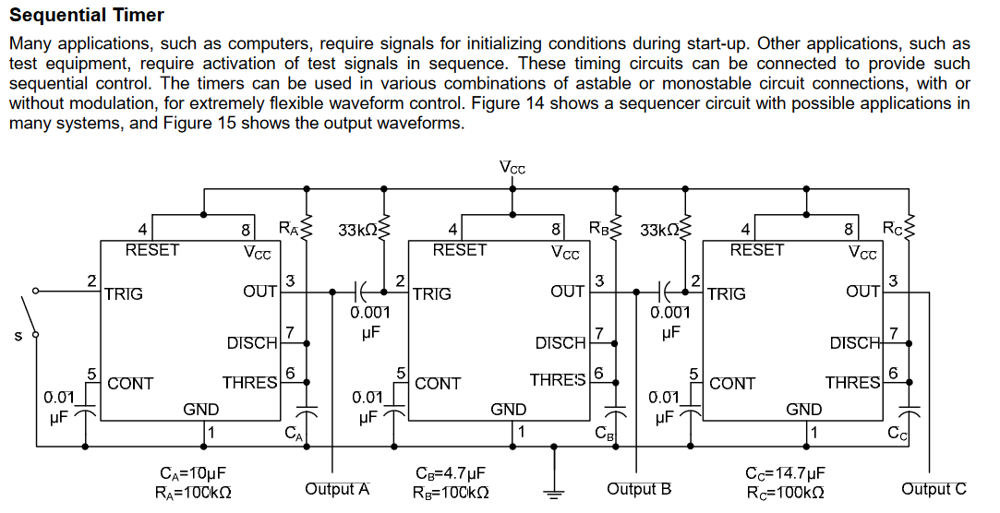

通过将前一级定时器的输出连接到后一级的输入来实现定时器的级联应用，每一级都可以设置成单稳态、无稳态，从而实现多种多样的功能。上图为一个顺序脉冲电路，生成如下的波形

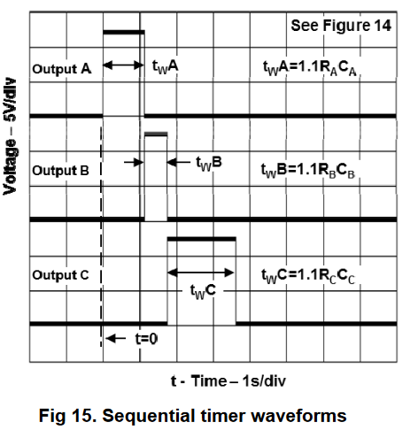

### 555定时器的结构

555定时器由以下部分组成

* 3个5kΩ采样电阻
* 2个电压比较器
* 1个基本RS-FF
* 1个放电管

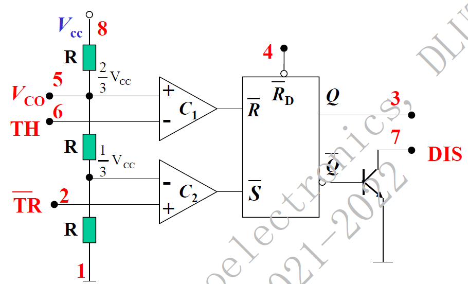

其中比较器逻辑为

实际上这个比较器可以通过运放实现，不过各个厂商的555内部都有自己不同的实现方法

基本RS-FF的逻辑为

该电路就是555的核心了，后面定时器的工作状态表也是根据它推出的

管脚图如下所示

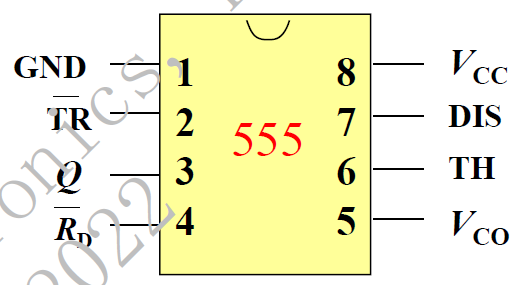

> 这个图的内容务必牢记，因为电路考试里面往往不会给出

### 555定时器的基本功能

555的工作状态表如下所示

## 555定时器的基本应用

### 施密特触发器

**施密特触发器**：具有滞后特性的数字传输门

与一般的非门相比，施密特触发器具有**回差电压**（滞回电压），有更好的噪声抑制特
$$
\Delta U=V_{T+}-V_{T-}
$$
也就是说一般的非门会根据当前输入电压是否达到阈值输出一个反相的电压，但是施密特触发器会在高电平向低电平触发时使用V1阈值电压；在低电平向高电平触发时使用V2阈值电压

这个特性看起来很像滞回比较器——实际上**滞回比较器的另一个称呼就是施密特触发器**

之前讲过的所有滞回比较器的内容都可以套在施密特触发器上，可以认为滞回比较器是对模拟电路实现拓扑的描述，而施密特触发器是更加“数字”的描述

使用以下符号表示（带有施密特性质的数字电路符号都在上面标记一个这样的图案）

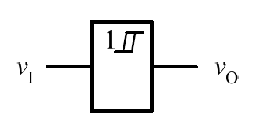

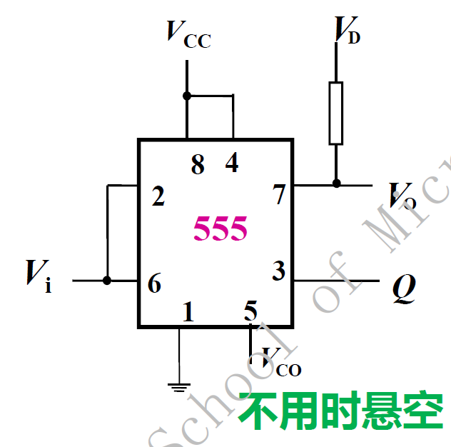

使用上面的电路构成施密特触发器

注意

* pin-2和pin-6连在一起接输入端
* pin-5不用时悬空，如果使用的话会直接决定三个5kΩ电阻分压的大小，从而改变器件参数
* pin-7要接上拉电阻到电源方便放电

由于555定时器具有三个分压电阻，可以在回差电压的范围内让RS-FF工作在保持状态

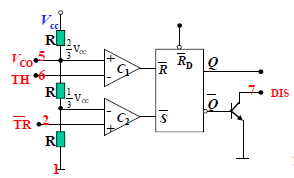

> 不难发现（通过对两个电压比较器的虚断-虚短分析和三个分压电阻的观察），VCO决定了TH的比较电压，进而决定了TR分压的比较值，这就是5脚用于内部阈值和触发电压的调整的原因

可以算出回差电压
$$
\Delta V=\frac13 V_{CC}
$$
有$V_{T+}=\frac23 V_{CC}$，$V_{T-}=\frac13 V_{CC}$

当$V_{CO}$启用时，有$V_{T+}=V_{CO}$，$V_{T-}=\frac12 V_{CO}$

> 特别地，门电路也可以构成施密特触发器，如下图所示
>
> 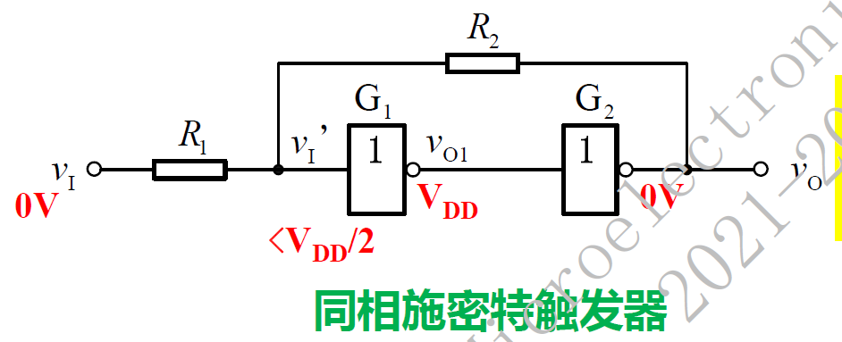
>
> 其中$V_{T+}=\frac12 V_{DD}(1+\frac{R_1}{R_2})$，$V_{T-}=\frac12 V_{DD}(1-\frac{R_1}{R_2})$
>
> 有回差电压$\Delta V=\frac{R_1}{R_2}V_{DD}$

施密特触发器常用于对原始的方波、三角波、正弦波信号进行处理，得到一定频率的时钟信号提供给数字系统，著名的*皮尔斯震荡器*中也有用到

常见的集成施密特触发器74LS132则将4个与非门（施密特与非门）封装在一起

### 单稳态触发器

单稳态触发器具有两个状态：一个稳定状态，一个不稳定状态（称为暂稳态）。单稳态触发器通常处于稳定状态，在触发时**临时**变到不稳定状态，在不稳定状态持续$T_W$时间后，自动回到稳定状态

如下图使用555定时器构成单稳态触发器

注意电路中：

* 6、7脚相连
* 2脚（触发端）接输入
* 非触发时输出高电平，下降沿触发
* 通过电容隔直特性让VCO悬空，同时防止引入干扰，如果让它接到某个信号脚会导致输出错乱
* R、C为定时元件

通过计算可以得到时间常数$\tau=RC$，并且延迟脉宽
$$
T_W=1.1RC
$$

> 除了基于555分立元件的单稳态触发器外，还可以使用74LS121这个集成单稳态触发器实现电路
>
> 
>
> 注意它的暂稳态延迟脉宽$T_W=0.7RC$
>
> 实际电路如下
>
> 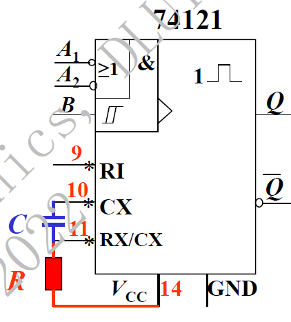

### 多谐振荡器

**多谐振荡器**即产生矩形波的自激振荡器，它是无稳态的振荡电路，会周期性的从一个暂稳态转到另一个暂稳态

本质上和模拟电路里面的方波发生电路一样

使用下面的电路基于555定时器实现多谐振荡器

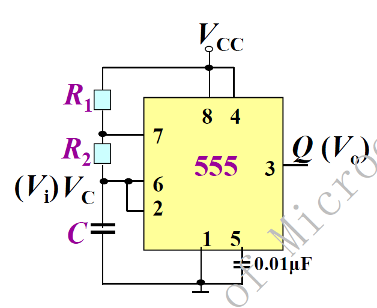

注意电路连接有以下要点：

* pin-2、pin-6相连接入RC电路的串联点
* pin-7连接RC电路放电点

工作时的电压如下，可以发现电容两端电压近似为三角波

> 有些不要求精确性的电路里常常用这个电容两端的电压变化实现三角波

经过计算得到

**振荡周期**
$$
T=0.7(R_1+2R_2)C
$$
**占空比**
$$
D=\frac{R_1+R_2}{R_1+2R_2}
$$
对电路进行如下改进，得到**占空比可调的多谐振荡器**

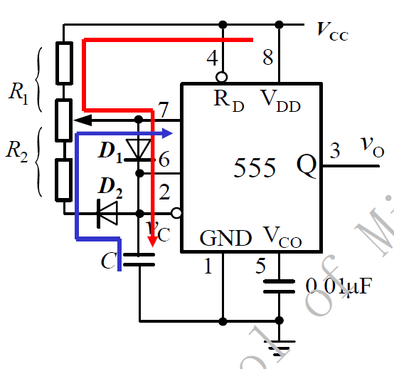

不难发现，该电路主要增加了Vcc到C的充电通道和pin-2到pin-7的放电通道

于是得到

**振荡周期**
$$
T=0.7(R_1+R_2)C
$$
**占空比**
$$
D=\frac{R_1}{R_1+R_2}
$$
当且仅当$R_1=R_2$时，输出占空比为50%的方波

### 基于施密特触发器实现的多谐振荡器

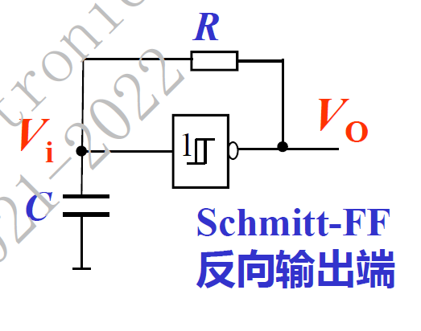

这个电路用的就是电容的充放电特性——和555多谐振荡器的原理一样

**将施密特触发器反相输出端经RC积分回路接入输入端，利用输入电压在VT+与VT-之间往复变化，在输出端得到矩形脉冲**

**该电路会相对不精确地输出占空比不可调的方波，周期**
$$
T=0.7RC
$$
如果需要调节占空比，可以类似555定时器通过二极管引入两个充放电回路

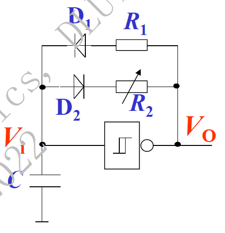

此时$D=\frac{R_1}{R_1+R_2}$，且$T=0.7(R_1+R_2)C$

## 多谐振荡器的应用

> 例题：用555定时器设计一个每隔2s振荡3s的多谐振荡器，其振荡频率为200Hz，D=1/2，电容取10μF
>
> 该要求可以利用两个多谐振荡器级联实现，第一级多谐振荡器用于产生每2s震荡3s的控制信号，第二级电路则用于产生200Hz的固定频率震荡
>
> 于是可以规划
>
> * 振荡器A：占空比不可调，D=3/5，周期为5s
> * 振荡器B：占空比可调，配置D=1/2，周期为1/200=0.005s
> * 用振荡器B中555定时器的4脚复位端来控制振荡器B是否工作
>
> 
>
> 于是可以设计电路如下
>
> 

上面的例题主要解决了定时器级联电路的设计问题，定时器级联电路主要设计目的有

* 延长振荡周期：一个电路的RC常数不够大，可以通过多个定时器级联实现振荡周期倍增
* 周期性振荡：就和上面的例题一样
* 频率变化的振荡：这里引入下面的例题进行说明

> 例：叮咚门铃电路。门铃的特点是按下按钮后发出高频的声音，随后声音变为低频，针对这个特点可以设计如下电路
>
> 
>
> 该电路本质上是把两个RC振荡电路并联，用一个RC振荡电路控制555使能端，另一个RC回路为555提供振荡源
>
> 有人按铃，$V_{CC}$同时向C1和C2充电，C1控制555定时器pin-4，C2用于振荡
>
> 按下按钮后，
>
> **充电时**
> $$
> T_1=0.7(R_3+R_2)C_2
> $$
> **放电时**
> $$
> T_2=0.7R_3 C_2
> $$
> 得到总周期
> $$
> T=0.7(R_2+2R_3)C_2
> $$
> 松开按钮后，
>
> **充电时**
> $$
> T_3=0.7(R_1+R_2+R_3)C_2
> $$
> **放电时**
> $$
> T_4=0.7R_3 C_2
> $$
> 得到总周期
> $$
> T=0.7(R_1+R_2+2R_3)C_2
> $$
> 从而制造出两种不同频率的声音

上面的例题使用额外的一套RC振荡回路实现输出频率变化，无法实现频率的连续变化，下面使用级联的555实现不停变化的信号频率

> 例：使用555定时器实现救护车、警笛等扬声器发声电路
>
> 因为555的第5脚控制端外接一个参考电压，可以改变触发电平值，当第一级555的第3脚输出方波为低电平时，输出信号加到第二级555的第5脚，它的输出振荡频率就变低，当第一级555的第3脚输出方波为高电平时，第二级555的振荡频率变高，其变化的信号通过驱动电路，使扬声器发出高、低音交错的鸣救护车的警笛声。改变RC回路的值，警笛声的频率也会相应变化。
>
> 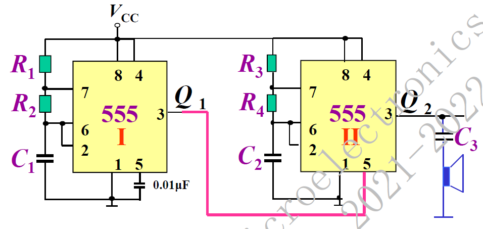
>
> 两个电路可以分别计算，其中电路I的频率决定声音变化的频率，电路II的频率决定了声音的频率

