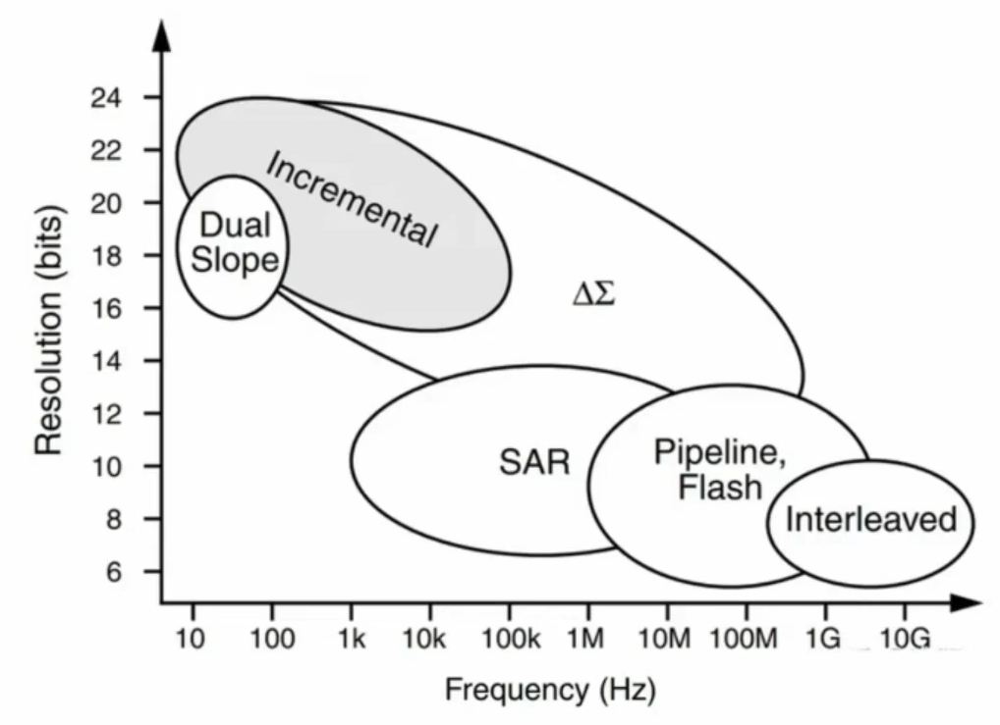
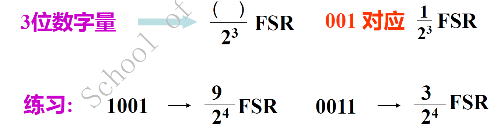
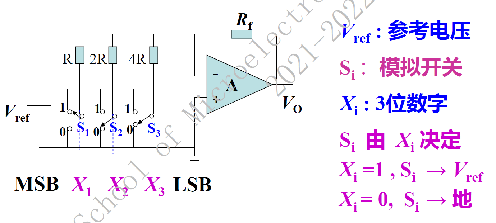

# 电路设计从入门到弃坑26【数模混合电路基础】

到目前为止，我们已经完成了对模拟电路和数字电路基础的全部介绍。后面几章的内容基本是对前面所有内容的补充，包含了数模混合电路和大规模数字电路设计的相关知识

实际上目前所用的大部分电路都是数模混合电路，模拟部分对应系统电源、传感器信号接收和前处理、高频信号的收发等等，数字部分负责对来自模拟世界的数据进行计算分析，统筹整体电路的功能。在模拟电路和数字电路之间存在着一个接口，这个接口可以是简单的开关管、滤波器或者电阻分压网络，但应用比较广泛的就是**ADC/DAC**，模数/数模转换器。

## ADC

A/D转换器的**分辨率**用输出二进制数的位数表示，位数越多，误差越小，转换精度越高。

**转换速度**是指完成一次转换所需的时间

在理想情况下，所有的转换点应当在一条直线上。**相对精度**是指实际的各个转换点偏离理想特性的误差。

ADC工作的四个步骤

1. 采样
2. 保持
3. 量化将采样—保持后的信号幅值转化成某个最小数量单位（量化阶梯/间隔）的整数倍
4. 编码：将量化后的数值用代码表示出来

确保满足香农采样定理$f_s \ge 2 f_m$

### 逐次逼近型ADC（SAR-ADC）

这是目前各种通用电路常见的ADC类型，特点就是中规中矩，采样速率、分辨率都不高不低

### FLASH型ADC

Pipeline型ADC和Flash型ADC是采样速率最快的两种ADC，但其分辨率很难做高。

Interleave型的ADC并不是指某种特定结构的ADC，SAR ADC和Pipeline ADC都可以被做成Interleaved ADC来提高采样速率

下图给出了一个3bit Flash ADC的结构

一个Nbit Flash ADC包含2N个电阻和2N-1个比较器。电阻构成了**分压电阻网络**，为各个比较器提供基准电压。每个电阻上的基准电压都要比网络中下一个基准电压大1 LSB，这样当外界电压输入比较器的另一端后，所有接收到高于基准电压的比较器都会输出1，接收到低于基准电压的比较器会输出0。这样，2N-1个比较器就会像水银温度计一样输出从低位向高位排列的“111......1100......000”数码，这样的输出编码被称为**温度计码**

由于温度计码不便使用，一般会在后级电路中加入**温度计码-格雷码-二进制码**的转换电路（**编码器**）。外部电路可以直接读取二进制码来获得量化结果。格雷码被引入是由于比较器存在亚稳态：这里使用的过零比较器会引入一定正反馈以获得迟滞比较特性，但在速率提高的情况下，还是容易出现误码——如果不使用格雷码，温度计码的误码会导致2个位的误差，这样的转换噪声是很致命的（试想一下一个8bit ADC在最高位发生了亚稳态反转）；但引入格雷码后，由于相邻两个格雷码值之间只会存在1个位的差别，这样即使出现亚稳态，也只会导致1 LSB的转换误差，无伤大雅。

Flash ADC的结构相当于完全并行的比较器阵列，它的比较和量化延迟只有一个流水线（比较器延迟+编码器延迟）的运行时间，因此只要比较器的带宽能接受，ADC的**转换速率**就可以做得非常**高**

Flash ADC还是有两大缺点：**功耗大**、**分辨率低**。由于比较器个数为2N-1，随着分辨率增加，比较器的个数也要增加，这会大大增加ADC功耗。此外，在高速信号情形下，信号带宽增大就要求电阻网络的带宽增大，而在集成电路中，并没有很好的解决增大电阻带宽的方法，设计者只能考虑调整电阻长度和宽度来减小寄生电容、寄生电感，这导致电阻阻值减小，电阻网络的功耗也会增大。分辨率问题是Flash ADC结构导致的系统问题——大量比较器的参数难以保证一致，就更容易出现亚稳态，影响ADC的ENOB

### Σ-Δ型ADC

### 积分型（Incremental）ADC

积分型ADC可以被归类为Σ-Δ ADC的一种

## ADC性能分析

### 分辨率、转换时间、采样率

### DNL和INL

### THD

### SINAD

### ENOB

### SFDR

## DAC

将数字量转化成与其成正比的模拟量

最小分辨率电压$V_{LSB}$：两个相邻数码转换输出的电压差，可用最低有效位1LSB表示
$$
V_{LSB}=\frac{1}{2^n}FSR
$$
最大输出电压$(2^n-1)V_{LSB}$

### 权电阻型DAC

又称为电阻网络DAC

### R-2R梯形DAC

