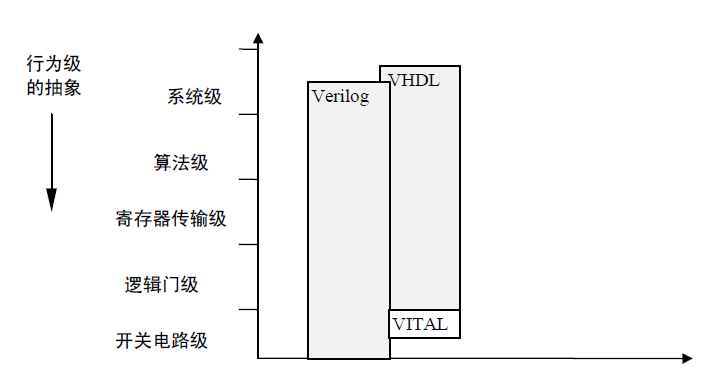
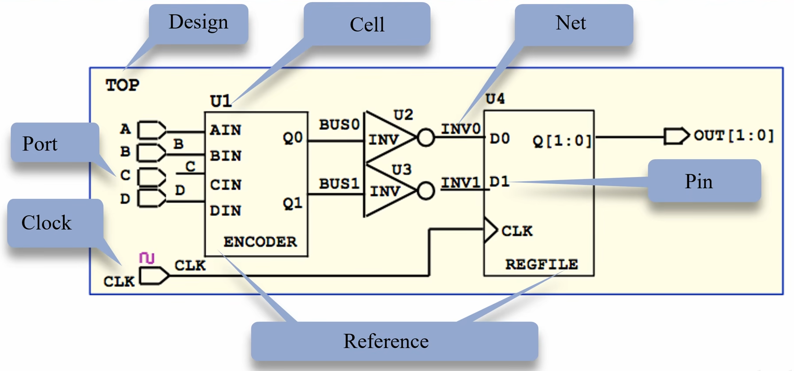

# 电路设计从入门到弃坑27【大规模数字电路】

之前所介绍的数字电路都是基于74门——这是最基础最宏观的数字电路组成形式，如果需要的话完全可以使用一大堆8050、8550三极管或是其他型号MOS来搭建出74门，然后再将其按功能组装成需要的电路。但很显然现在的超大规模集成电路（VLSI）和极大规模集成电路（ULSI）系统是不可能用这样的数字电路搭建的。实际上**之前所讲述的内容大都过时了**。

现代的集成电路设计者们采用计算机主导的设计工作流来“编写”而不是“绘制”数字电路。数字电路的基础元件还是那些元件，但设计流程和方法论发生了翻天覆地的变化

> 基础的数字电路理论是无法支持我们往集成电路领域探索的。从基础原件来讲，数字集成电路中的基础三极管、MOSFET器件换成了CMOS、FinFET、GAA等先进工艺——不过这些不是本篇博文要讨论的。构成数字电路最基础的逻辑门、时序电路、状态机等理论还是被沿袭下来，只不过相比于上古时代的手绘电路，现代人更倾向于使用*EDA软件*和*HDL*来“编写”电路，交给计算机处理较为模糊的*RTL*到每个逻辑门的中间映射过程，交给工艺研发人员和后端layout人员（以及EDA工具）处理每种逻辑门到基础器件之间的映射

下面最终几篇博文会基于**Verilog HDL**讨论传统的基础数字电路原理与现代的数字电路设计工作流之间的关系

## Verilog简介

首先说一下本部分参考的教程：夏宇闻老师的《Verilog数字系统设计教程》、正点原子FPGA教程、多位b站up主视频（主要为：https://www.bilibili.com/video/BV1PS4y1s7XW、https://www.bilibili.com/video/BV1oD4y1274b、https://www.bilibili.com/video/BV1S541147GB）

硬件描述语言**HDL**是一种用形式化方法来**描述**数字电路和设计数字逻辑系统的语言。它可以使数字逻辑电路设计者利用这种语言来描述自己的设计思想，然后利用电子设计自动化**EDA**工具进行仿真，并综合到门级电路，再用ASIC或FPGA实现其功能。目前常见的HDL包括

* **Verilog HDL**：本部分介绍
* **VHDL**：与Verilog同时代的HDL，常见于各大硬件厂商的底层元件库
* **SystemVerilog**：Verilog的改进版本，能够更好地进行系统级硬件描述，还引入了非常实用的验证语法，且已经被标准化，因此正在业界中与Verilog并存甚至逐渐替代传统的Verilog
* **Chisel**：基于Scala的新兴HDL，能用面向对象的语法生成Verilog网表文件，可以直接送入EDA后端运行
* **HLS**：高层次综合，直接从类似C++/OpenCL/OpenMP的语法综合成硬件电路
* **Spinal**：与Chisel类似，但更加语法贴近底层硬件描述的新兴HDL
* **myhdl**：基于Python的伪HDL，先从python语法转换成Verilog RTL文件，再进行综合，本质上不是一个HDL，但由于语法面向对象，比较适合编写测试向量仿真，常常在硬件开源项目中使用

> 到这里为止你可能还不理解什么是“**综合（synthesis）**”，只要记住这个名称就好。包括后面会遇到测试向量（TestBench）、编译、验证等等专有名词
>
> 后面会对它们尽心详细讲述

### Verilog和HDL的历史

Verilog是上世纪80年代（1983年）由Cadence的第一个合伙人Phil Moorby首创（当时任职于GDA公司）；在1984-1985年，他又提出了用于快速门级仿真的XL算法并设计出第一个关于Verilog-XL的仿真器。在1990年，Cadence决定公开Verilog HDL语言，于是成立了OVI（Open Verilog International）来负责Verilog HDL语言的发
展。IEEE于1995年制定了Verilog HDL的IEEE标准，即Verilog HDL1364-1995，这也是一直沿用至今的Verilog95标准

> 这个标准是很早期的版本，现在用得比较多的还是Verilog01标准；更新的Verilog05标准与SystemVerilog出生在同时代，基本上能被SystemVerilog替代
>
> 顺便一提，根据一位业界大佬描述，目前ARM、Nvidia、Cadence这些业界龙头中更多使用SystemVerilog的可综合部分来替代Verilog，不过Verilog仍是应用最基础最广泛的HDL

最早数字逻辑电路及系统的设计规模比较小也比较简单，其中所用到的FPGA或ASIC设计工作往往只能采用厂家提供的专用电路图输入工具来进行。工程师还需要花大量时间进行艰苦的手工布线。这种低水平的设计方法大大延长了设计周期。而采用Verilog HDL输入法时，由于Verilog HDL的**标准化**和**工艺无关性**，可以很容易地把完成的设计移植到不同的厂家的不同的芯片中去，并在不同规模应用时可以较容易地作修改。在仿真验证时，Verilog也可以进行测试向量的编写，因为里面有很多借鉴C和Pascal的语法，虽然它们是“不可综合”的，不能直接在电路描述中使用，但是可以用它们方便地编写**测试向量TestBench**

此外，**Verilog综合器生成的数字逻辑**是一种标准的电子设计互换格式（EDIF）文件，**独立于所采用的实现工艺**。有关工艺参数的描述可以通过Verilog提供的属性包括进去，然后利用不同厂家的布局布线工具，在不同工艺的芯片上实现。这使得工程师在功能设计和逻辑验证阶段可以不必过多考虑门级及工艺实现的具体细节，只需要利用系统设计时对芯片的功能需求，施加不同的约束条件，来完成电路的设计和仿真

Verilog等HDL的出现成功让数字集成电路设计的前端逻辑设计和后端实现设计解耦。这也是为什么现在很多芯片人自称“硅农”——与“码农”对应，现代芯片设计中也需要使用到大量计算机编程语言、工具和自动化脚本。同时也导致集成电路**IP**发展壮大。

> IP即知识产权。我们一般在文艺作品、发明专利中见到它，但商品、软件乃至集成电路虚拟器件和虚拟接口模型都可以作为知识产权来进行商品化，因此IP在集成电路设计领域特指能够直接拿来使用的电路设计。原初的电路设计中，IP通常指的是一张张电路图或者SPICE网表模型，而随着HDL的出现，IP也变成了*代码*的形式。
>
> 因为有了HDL，很多公司发现可以像软件公司那样为其他公司外包设计电路，并以综合好的Verilog网表形式交付IP，进而让半导体企业从最原始的IDM（设计-制造一体化）向Fabless（IP设计）发展
>
> 随着90年代GNU组织壮大和Copyleft、GPL等概念的兴起，以电路设计为领导的硬件开源运动也开始出现。IP本来是商业化、非常昂贵的，但随着越来越多人了解HDL并设计自己的电路，很多IP也以开源免费的形式发布，Verilog普及有一定功劳

把功能经过验证、可综合、实现后电路结构总门数在5000门以上的Verilog HDL模型（也可以是VHDL等由HDL实现的电路模型）称为**软核**，把由软核构成的器件称为**虚拟器件**。在新电路的研制过程中，软核和虚拟器件可以借助EDA综合工具与其它外部逻辑结合为一体。从而大大缩短设计周期，加快了复杂电路的设计。

把在某一种现场可编程门阵列（FPGA）器件上实现的，验证正确且总门数在5000门以上电路结构编码文件称为**固核**。把在某一种专用半导体集成电路工艺的（ASIC）器件上实现的，验证正确且总门数在5000门以上的电路结构掩膜称为**硬核**

### Verilog语法特点概述

Verilog的语法很简单，学过C语言就能理解得七七八八，但用它描述电路的难点不在于语法，而在于“**描述电路**”

Verilog最大的好处就是可以用if-else选择、for循环、数组、generate生成、define宏定义这样的高级语言描述来表达电路结构。从verilog代码到生成的电路之间还可以使用**编译器**、**综合器**进行代码逻辑和电路实现优化。但是这样一来，很多新手就只认为这是一种软件语言，没法建立从Verilog代码到实际电路之间的联系。

很多人在教新手学Verilog HDL的时候都会强调“Verilog有不同于C语言的并行化思维”、“Verilog写的是电路”、“不要把Verilog当C写”，但新手都听得迷迷糊糊——虽然Verilog确实具有这几个特点，但大伙都没说清其本质：**HDL硬件描述语言**

> 下面的内容推荐配合https://www.bilibili.com/video/BV1PS4y1s7XW一起阅读，或者先看一遍视频，再结合本文查缺补漏
>
> 本文下列部分内容也来自该视频

Verilog可以进行如下范围的硬件描述



* 系统级、算法级：统称**行为级**（Behavior Level），描述硬件的抽象行为，比如一个万年历可以用一系列if-else语句和计数器构成，Verilog可以用C那样的语法描述行为级

* 寄存器传输级：也就是常说的**RTL**（Register Transfer Level），基于寄存器reg和连线wire描述电路，比如一个多路选择器，可以用一组寄存器（存放多路选择器的选择端）和一组连线（被寄存器控制）来描述

    这一级描述不太好抽象说明，最好看后面的例程

* 逻辑门级、开关电路级：统称**器件级**，描述一个具体的逻辑门乃至开关管。Verilog代码经过编译生成的文件就是使用这一级描述的。具体使用的器件由EDA厂商的元件库决定，也就是说Verilog可以像AD、Multisim、Allegro这些板级EDA一样通过组合具体元件的形式完成数字电路设计

    这一级描述就最直观反映了“硬件描述”的特征。如果你用过SPICE描述，可能会对这一层比较熟悉，但实际上我们做设计过程中并不与这级直接打交道，所有转换工作都是由编译器和综合器完成的

正对应于这三种分类，**Verilog HDL的可综合语法可以分成三个主要板块：行为级硬件描述、RTL描述、模块例化**

**综合指的是将Verilog语法的代码转化成Verilog网表的过程**。**网表（Netlist）又称为连线表，指的是用基础逻辑门来描述数字电路的方式**，SPICE就是一种典型的网表语法，很多电路仿真工具都提供基于SPICE的仿真，但这里的网表特指数字电路设计中的**Verilog网表，是一种基于Verilog的网络**（Net，注意指的是电路分析理论意义上的网络而不是因特网）**连线描述**。

> 由于本篇讲述的主要是Verilog的语法和应用，因此不对EDA作过多展开，这里处于背景介绍再提一下
>
> 在从Verilog到电路网表乃至实际器件（光刻掩膜板）的过程中，主要需要经过以下步骤（随EDA厂家、工具链安排可能存在不同）：
>
> * 编译优化（Optimization）：对Verilog源代码按照编译器（Compiler，用于处理编译优化和编译步骤的EDA工具，和软件意义上的编译器类似）内置规则进行初步优化，并排除语法错误
> * 编译/转译（Compile/Translation）：对Verilog代码进行处理，得到中间态代码，这样的代码更容易被综合器接受以优化综合得到的电路。中间态代码仍是Verilog语法，但更加贴近底层，一般是逻辑门级描述或开关电路级描述。当然根据软件不同，Verilog代码也可能被转换成软件自己规定的中间态代码，但一定是与工艺无关的
> * 综合优化：按照综合器内置规则对编译后的中间态代码
> * 综合（Synthesis）：将优化后的中间态代码转换为Verilog网表的过程。一般来说可以用综合这个词来取代上面所有流程，因为上面这些过程用到的工具一般都被集成进了综合器内部。得到的Verilog网表级别是逻辑门级描述或开关电路级描述，但是与之前的中间态代码不同——中间态代码并没有使用到EDA厂商提供的器件库，也就是还是抽象的电路描述，没有映射到实际电路中；但是综合后得到的网表全部使用器件库的描述，与厂商提供的Verilog器件模型息息相关，综合使用的器件库不同会影响到后面的布局布线
>
> 到这里为止的流程被称为设计**前端**，下面的流程被称为设计**后端**。前端与工艺无关，最多使用到器件库用于仿真，但后端需要参照工艺库进行设计
>
> * 综合后优化：按照综合器内置规则对综合后得到的Verilog网表进行连接优化，调整得到电路的门数或连线数
> * 导入元件：根据要应用的领域确定使用什么元件——如果是IC设计则需要选用对应Fab提供的PDK；如果是仿真则需要导入EDA厂家提供的虚拟元件库；如果是在FPGA上实现则需要使用对应厂家的后端工具来根据网表选用合适的片上资源
> * 布线前优化：针对导入的元件进行网表结构微调，并按照布线工具的内部规则针对每个大模块优化内部小电路的连接
> * 布局布线：按照选用的器件进行电路布局布线，这一步通常是由后端设计人员辅助完成，设计人员指定模块的范围，EDA工具按照指定位置进行细节布线。布线工作需要消耗大量计算资源（布线是NP问题），因此会比综合慢很多倍
> * 布线后优化：根据厂商提供的工具，针对时序、片上资源消耗等进行优化

Verilog除了能描述硬件，还提供了用于验证硬件设计的语法，也就是其**不可综合**部分。实际上Verilog中的不可综合语法是要多于可综合语法的，在本篇后面介绍中将优先讲述可综合的语法，用于验证的不可综合语法会在后面博文中讲述。

> 所谓**硬件验证**（**Verification**），就是测试我们设计出来的硬件的功能是否正确。在Multisim或者Proteus中，我们只需要点击运行就能让电路跑起来，实际上是封装了SPICE网表和器件仿真模型。在基于Verilog等HDL的大规模数字电路设计中，我们需要使用专门的验证语法乃至验证语言、验证框架来测试一个电路模块

### Verilog硬件设计工具链

这里简单介绍一下常用的Verilog工具链

* 代码编辑器：用于编辑Verilog源码、提供语法高亮、自动补全、代码提示、代码规则检查等

    * Vim、Emacs、GVim：老牌代码编辑器，学习曲线比较陡峭，但是由于时间积累了大量方便易用的Verilog插件，而且轻量化、可以在服务器上通过远程编辑代码，在某些团队中甚至会强制要求使用
    * Sublime：轻量的代码编辑器，代码高亮功能做得不太好
    * VSCode：现代的编辑器，使用人数很多因此有越来越多的Verilog插件出现，但使用插件会比较消耗资源。而且这个东西是会联网的（通过联网同步保存用户数据），一般有保密需求的服务器上不会部署

* 仿真器：用于Verilog行为级仿真

    * IVerilog：开源Verilog仿真器，提供基本的综合、网表仿真功能
    * Verilator：开源Verilog仿真器，到目前一直在更新，提供比较优秀的综合、仿真功能，支持SystemVerilog、C、SystemC仿真
    * GTK-Wave：开源Verilog波形查看工具，能从IVerilog、Verilator生成的网表仿真文件中提取仿真波形进行检查

    * VCS：Synopsys家的仿真工具
    * Xcelium：Cadence家的仿真工具套件，其中的xrun能提供很快的仿真运行速度
    * Verdi：Synopsys家的Verilog波形查看工具

* 综合器

    * Yosys：开源的综合器，基于开源EDA工具链OSS-CAD提供，这个工具链集成了IVerilog、GTK-Wave、Yosys等一整套开源IC工具，能完成从前端设计综合到后端布局布线乃至FPGA比特流文件生成的全套工作
    * DC：Synopsys家的综合器
    * Genus：Cadence家的综合器

* FPGA工具

    * Vivado/Vitis：AMD（Xilinx）提供的FPGA工具链，使用Xilinx家的UltraFast工作流（其实还是传统IC工作流，只不过引入了他家的一些快速开发工具降低门槛）进行FPGA设计。自带全套IC设计、仿真、综合、布局布线工具
    * Quartus：Intel（Altera）提供的FPGA工具链，使用传统的IC工作流进行FPGA设计。自带全套IC设计、仿真、综合、布局布线工具

### 可综合的Verilog语法

很多人说Verilog的语法非常类似**C**，但实际上Verilog与**Pascal**之间的联系也很密切


### 变量类型

**wire**：表示电路中的连线，在仿真波形中不可见

**reg**：表示电路中的锁存器、寄存器等元件，在仿真波形中可见。需要注意：reg变量仅仅是一种语法定义，不等于电路中的寄存器，只有时序逻辑中的reg变量才会被综合成寄存器，某些特殊形式的reg变量还可能被综合成锁存器

always块和initial块中赋值的变量只能是reg型；assign语句中赋值的变量只能是reg型


### 数据类型

Verilog中可综合的整数字面量写法如下

```verilog
[size]'<base> <value>
```

其中`base`为o或O时表示八进制数，b或B时表示二进制数，d或D表示十进制数，h或H表示十六进制

`value`是基于base的值的数字序列，可以选取数字（包括十六进制中的a、b、c、d、e、f）和z（表示高阻态）和x（表示不定态），其中字母不区分大小写；并且该项中允许使用下划线`_`来分隔每个数字

`size`一项是可选的，表示数的位数（单位是bit）

特别地，`size`和单引号`'`之间，`base`和`value`之间可以出现空格，但单引号`'`和`base`之间禁止出现空格

> ```verilog
> 4'b0010 //合法
> 8'h3_f //合法
> 4 'B 01x_1 //合法
> 2' b 10 //不合法
> ```

### 运算符


### 连续赋值语句

**assign**语句是用于描述*驱动*的，也被称为*连续赋值语句*。其左边应该是wire类型数据，作为赋值的对象；右侧可以是reg也可以是wire。

一般用法是

```verilog
assign <left_value> = <right_value>;
```

等号右侧的变化会被立即计算并用来驱动等号左边的量

如果右侧是wire类型，将被视为连线或组合逻辑

```verilog
wire a;
wire b
assign a = b;
```

上面语句的意思是将导线a和b连接在一起

```verilog
wire in_a;
wire in_b;
wire out_c;
assign out_c = in_a & in_b;
```

上面语句描述了一个与门，a和b与运算后输出到c

若右侧是reg类型，将视为使用一个reg驱动一条导线

```verilog
wire net;
reg driver;
assign net = driver;
```

上面语句就相当于将寄存器driver的输出端引出，并与net导线连接在一起，这样net会随着driver的输出变化


### 电路块语句

**组合逻辑**是输出随输入发生即刻变化的电路，Verilog允许使用多种方式描述组合逻辑电路，主要包括块语句式和连线式。通过always块配合一定逻辑表达式来描述组合逻辑

```verilog
always(*)
```

也可以直接使用assign语句在寄存器与寄存器、网络与网络、寄存器与网络之间插入组合逻辑电路

```verilog
assign <net> = <net/reg>
```


### 阻塞赋值和非阻塞赋值


### 选择结构


### 二维数组和三维数组


### 生成块和循环展开


### 位宽截取表达式


### 例化


### 参数和宏


### 可综合Verilog设计中的一些原则

* 少用除法与取余，少用逻辑非

    简化电路的实际实现，减少对综合器的依赖

* 多用括号划分优先级

    增强代码可读性

* 学会使用vect[a +: b]和vect[a -: b]这样的位宽截取表达式，可以简化很多运算

* 涉及到有符号数的处理一定要小心，注意移位、赋值时的隐式类型转换（表达式中有一个无符号数就会让整个表达式都按无符号运算）

* 如果是设计ASIC，则使用异步复位，因为厂家库中FF带异步复位端，可节省资源；如果仅在FPGA上运行，则使用同步复位，因为FPGA上的FF一般默认不带异步复位端

* 例化时，可能有些管脚没用到，可在映射中采用空白处理

* 模块的输出信号最好使用assign赋值，直接将寄存器类型的变量值赋给输出信号，中间不要夹杂其他运算符，否则即便行为级功能仿真正常，布线后时序仿真以及上板运行也容易出错；大位宽的信号更应该经过一拍寄存后再传给下一模块

    > 举例如下
    >
    > ```verilog
    > output TDATA;
    > 
    > //运行不稳定的写法：MUX组合逻辑连接
    > assign TDATA = (tvalid) ? tdata : 'b0;
    > 
    > //更稳定的写法：打一拍时序连接
    > assign TDATA = tdata_reg;
    > always @(posedge clk)
    >     if(!rst_n)
    >         tdata_reg <= 'b0;
    >     else if(tvalid)
    >         tdata_reg <= tdata;
    >     else
    >         tdata_reg <= 'b0;
    > ```
    >
    > 使用存储器IP如移位寄存器、BRAM、FIFO时，其输入输出数据最好经过了一拍寄存，以保证信号稳定，给再利用留出足够的建立时间。

* 


## 从硬件设计角度理解Verilog


### 写硬件而不是画硬件

**初学者应当明确两点：尽量使用RTL级的HDL描述来避免“将芯片全盘托付给EDA工具”；简单的电路可以用波形检验，但复杂电路尽量使用验证语法来进行随机覆盖测试**

现在的先进EDA工具一般会提供可选的图形化编辑方式，最常被提及的就是Vivado的Block Design功能——这固然方便开发者，但对于初学者来说直接使用图形化编辑并不是一个好的学习方法。

板级工程原理图使用GUI完成设计，因为需要处理的线束很少，并且需要以人类能理解的方式传递给Layout工程师；但片上电路针对的是数百万门级别的大规模、超大规模电路，总线宽度高达上百位，想使用图形化的方式只能让工程师化身星际职业选手（笑）

使用HDL可以很好地安排复杂互联结构，而且相较图形化具有更高的灵活性。熟练的开发者可以合理利用Block Design这样的自动化拉线工具加快设计流，但新手还是应该优先体会HDL的灵活性，不应被图形化界面干扰

> 很多初学者通过比赛来提高自己的HDL编码能力，但由于比赛时间紧任务重，只能选择使用图形化的“编码方式”，最后导致没有学到通用的HDL编码，只对某个厂商的某个工具产生依赖，从一般意义上讲这对后续发展是弊大于利的

更进一步，写HDL的时候也要避免使用“直观”“图形化”的行为级描述，因为这样会将生成的电路托付给EDA工具，结果好坏全部依赖于综合器的性能。如果是FPGA电路的话，行为级描述是被推荐的——引入HDL就是为了加快开发效率，并且FPGA厂商会尽量保证综合器在各个型号器件上的一致性；但如果是编写一个IP，行为级描述可能会导致一个IP在Yosys环境（一个开源的EDA工具链）下通过了验证，但在S家的DC（DesignCompiler工具）中得到了错误的结果，这中间有着复杂的原因，使用RTL级描述可以尽可能保证换用综合器时的硬件一致性

看波形是很直观的，学习很多总线的时候看波形比看仿真结果要方便很多，但波形也有其局限性——固然可以分析一个AXI-Master接口或者一个I2C Slave接口，但如果是片上系统中复杂的片上互联结构（Interconnection）就很难用挨个信号检查波形的方式来仿真测试了。

现代的硬件测试语言（HVL）包括SystemVerilog和对应的验证仿真测试库如UVM都会提供一整套仿真验证的环境来完成随机覆盖测试并以代码结果、覆盖率等方式说明模块的功能是否满足需求。

### 写硬件而不是写软件

Verilog不是软件编程语言，而是HDL硬件描述语言。写Verilog需要“**心中有电路**”，推荐在动手写之前先绘制电路功能或结构框图，将电路的大致框架搭好，再逐个部分编写




### 写RTL而不是写抽象行为


### 写良好时序而不是写竞争冒险


### 写同步电路而不是写异步电路

**同步时序逻辑**是指电路中寄存器的值只可能在唯一确定的触发条件发生时刻改变，使用同步时序逻辑的数字电路简称**同步电路**。同步时序逻辑的一般触发条件可以用Verilog如下描述：

```verilog
always @(posedge clock)
```

表示该always块内寄存器变量重新赋值的情形只能在clock上升沿发生。

**异步时序逻辑**是指触发条件由多个控制因素组成，任何一个因素的跳变都可以引起触发，使用异步时序逻辑的数字电路简称**异步电路**。电路中寄存器的时钟输入端不是都连结在同一个时钟信号上。例如*用一个触发器的输出连结到另一个触发器的时钟端去触发的就是异步时序逻辑*。**用Verilog设计的可综合模块必须避免使用异步时序逻辑**——不但是因为*许多综合器不支持异步时序逻辑的综合*，而且也因为*用异步时序逻辑很难控制由组合逻辑和延迟所产生的竞争和冒险*。当电路的复杂度增加时，异步时序逻辑无法调试。工艺的细微变化也会造成异步时序逻辑电路的失效。

> 触发器需要在时钟上升沿的前后一段时间数据保持稳定；否则触发器无法在规定时间内达到稳定状态，出现振荡和错误状态，导致**亚稳态**
>
> 亚稳态一般发生在跨时钟域传输、异步信号采集中。**同步系统中，输入总是与时钟同步，一般不会发生亚稳态**。
>
> 这里涉及到建立时间、保持时间和响应时间三个概念。**建立时间**即在触发器的时钟信号上升沿到来以前，数据稳定不变的时间，一般用**Tsu**表示。如果建立时间不够，数据将不能在这个时钟上升沿被稳定的传入下一级触发器。**保持时间**表示在触发器的时钟信号边沿到来后，数据稳定不变的时间，一般用**Th**表示。如果保持时间不够，数据同样不能被稳定的打入下一级触发器。触发器输出的**响应时间**是触发器的输出在时钟触发沿到来之后多长的时间内发生变化，即触发器的输出延时，用**Tco**表示。
>
> 理想的数字信号是以阶跃的形式完成跳变，但实际上没有这样的信号，我们会让时钟信号跳变得很快来近似（时钟信号一定要比数字信号变化得快，也就是时钟频率一定大于信号频率），但触发器电路是存在电容的，在被时钟触发的过程中，Tsu实际上是下一级电路电容进行充放电的最短所需时间，Tco是上一级电路电容完成进行充放电的最短所需时间。
>
> 在一个时钟触发沿，前一级触发器先采集输入的信号，将电平缓存，用时Tco；再将电平输出给中间电路（或传输线），需要耗费传输时间Ttrans。于是有下一级能够准确接收电平的**建立时间条件**
> $$
> T_{clk}-T_{co}-T_{trans} \ge T_{su}
> $$
> 我们至少需要保障：下一级触发器的建立时间要等于一个周期时钟时间减去上一级触发器与中间电路消耗时间，也就是下一级电路电容的充电要在上一级电路彻底放电之前完成
>
> 同理，在下一级触发器采样过程中，需要满足电平经过响应时间、传输线延迟之和大于下一级触发器的保持时间，也就是
> $$
> T_{co} +T_{trans} \ge T_h
> $$
> 这被称为**保持时间条件**
>
> 当中间电路、时钟信号都满足这两个条件的情况下，才能避免亚稳态产生，否则会出现像下图Tmet一样的亚稳态。
>
> 

异步时序逻辑中触发条件很随意，任何时刻都有可能发生，所以记录状态的寄存器组的输出在任何时刻都有可能发生变化。而同步时序逻辑中的触发输入至少可以维持一个时钟后再二次触发。这是一个非常重要的差别，因为我们*可以利用这一个时钟的时间在下一次触发信号来到前，为电路状态的改变创造一个稳定可靠的条件*。

> 在同步电路中，触发信号是时钟上升沿或下降沿，触发器的输入与输出是经由两个时钟来完成的，第一个时钟的上升沿（或下降沿）为输入作准备，在第一个时钟上升沿（或下降沿）到来后到第二个时钟上升沿（或下降沿）到来之前的这一段时间内，有足够的时间使输入稳定。当第二个时钟上升沿（或下降沿）到来时，由前一个时钟沿创造的条件已经稳定，所以能够使下一个状态正确地输出。
>
> 若在同一时钟的跳变沿下对寄存器组既进行输入又进行输出，很有可能由于门的延迟使输入条件还未确定时就输出了下一个状态，这会导致逻辑的紊乱。
>
> 使用同步时序的工作方式有一个前提：确定下一个状态所使用的组合电路的延迟与时钟到各触发器的差值必须小于一个时钟周期的宽度。只有满足这一前提才可以避免逻辑紊乱
>
> 实际电路中采用如下方式保证该前提成立：
>
> * 全局时钟网络布线时尽量使各分支的时钟一致
> * 采用平衡树结构，在每一级加入缓冲器，使到达每个触发器时钟端的时钟同步
>
> 通过这些措施基本可以保证时钟的同步，在后仿真时，若逻辑与预期设计的不一样，可降低时钟频率，就有可能消除由于时钟过快引起的触发器输入端由延迟和冒险竞争造成的不稳定从而使逻辑正确

因此Verilog RTL级的综合就是基于如下规定的：同步时序逻辑比异步时序逻辑具有更可靠更简单的逻辑关系，用Verilog设计可综合的电路与复杂状态机必须使用同步时序逻辑

尽管如此，我们有时候还需要使用到跨时钟域的接口器件，这时候就需要尽可能想办法避免亚稳态

最简单的方法就是**采用多级D触发器**打拍传递异步信号，这就是我们常说的“**乒乓缓存**”

> 第一级寄存器产生亚稳态后，如果直接输出很可能将亚稳态传递下去导致系统崩溃
>
> 添加了第二级D触发器后，相当于多给了寄存器一个时钟周期的时间恢复稳定，因此出现亚稳态的**几率会大大减小**
>
> 触发器级数越多，出现亚稳态的几率就会越小。但一般来说两级寄存器已经足够（第二级寄存器稳定输出概率为90%以上；第三极寄存器稳定输出的概率达到99%以上），而不需要再添加额外的级数浪费片上资源。

利用类似的思想，我们还可以实现**异步FIFO**，利用格雷码实现一个FIFO状态机，并使用双边乒乓缓存来完成跨时钟域数据传输


### 写流水线而不是写全展开


## 一些常见的Verilog电路实现

### 边沿检测

对数据打两拍，然后通过两拍数据之间的逻辑关系来判断出是上升沿还是下降沿

```verilog
reg data_d0, data_d1;
always@(posedge clk or negedge rst_n) begin
    if(~rst_n) begin
        data_d0 <= 'h0;
        data_d1 <= 'h0;
    end
    else begin
        data_d0 <= data;
        data_d1 <= data_d0;
    end
end
assign pos_edge = data_d0 && ~data_d1;
assign neg_edge = ~data_d0 && data_d1;
```

### 串行转并行

输入1bit位宽的数据将其合并为8bit位宽数据输出，输入输出都通过valid来表明此数据有效

可以通过两种方式实现，计数器和移位寄存器

```verilog
reg [2:0] cnt;
reg flag;

always@(posedge clk or negedge rst_n) begin
    if(~rst_n) begin
        cnt <= 'h0;
        data_o <= 'h0;
        flag <= 1'b0;
    end
    else if(valid_i) begin
//方法一：计数器
        data_o[cnt] <= data_in; //低位优先
        // data_o[7-cnt] <= data_in; //高位优先
//方法二：移位寄存器
        // data_o <= {data_o[6:0], data_in}; //低位优先
        // data_o <= {data_in, data_o[7:1]}; //高位优先
		cnt <= cnt + 1'b1;
		flag <= 1'b1;
    end else begin
        flag <= 1'b0;
    end
end

always@(posedge clk or negedge rst_n) begin
    if(~rst_n)
        valid_o <= 1'b0;
    else if(cnt == 3'b111 && flag)
        valid_o <= 1'b1;
    else
        valid_o <= 1'b0;
end
```

### 并行转串行

输入8bit位宽的数据将其转换为1bit位宽的数据输出，输入输出都通过valid来表明此数据有效

```verilog
reg [2:0] cnt;
reg [7:0] data;
reg bit_flag;

always@(posedge clk or negedge rst_n) begin
    if(~rst_n)
        data_o <= 'h0;
    else if(valid_i)
        data <= data_in;
    else if(bit_flag)
        data_o <= data[cnt];
end

always@(posedge clk or negedge rst_n) begin
    if(~rst_n)
        bit_flag <= 1'b0;
    else if(valid_i)
        bit_flag <= 1'b1;
    else if(cnt == 3'b111)
        bit_flag <= 1'b0;
end

always@(posedge clk or negedge rst_n) begin
    if(~rst_n)
        valid_o <= 1'b0;
    else if(bit_flag)
        valid_o <= 1'b1;
    else
        valid_o <= 1'b0;
end

always@(posedge clk or negedge rst_n) begin
    if(~rst_n)
        cnt <= 'h0;
    else if(bit_flag) begin
        if(cnt == 3'b111)
            cnt <= 'h0;
        else
            cnt <= cnt + 1'b1;
    end
end
```

## 状态机

关于状态机的相关内容可以参考笔者另一篇博文《FPGA学习笔记【对状态机的讨论】》

这里不再讲述状态机相关内容

## Verilog缺陷

如果你设计过或者正在设计一套相对大规模的电路系统，那么你很可能发现Verilog的恶心人之处：

* 例化繁琐，需要大量手动连线且不支持端口数组表达
* 位于中间层的各个模块需要使用大量连接信号
* 依赖宏和EDA工具，参数化能力和代码复用能力弱
