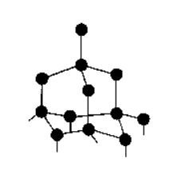
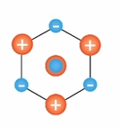
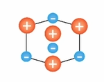
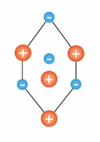
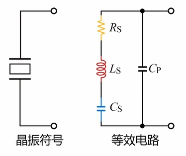
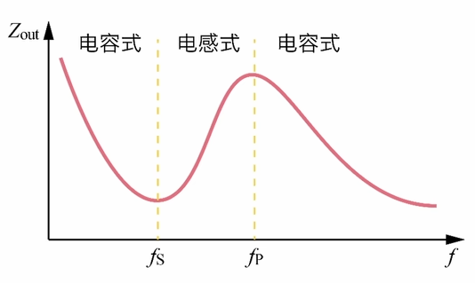
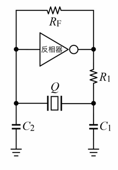
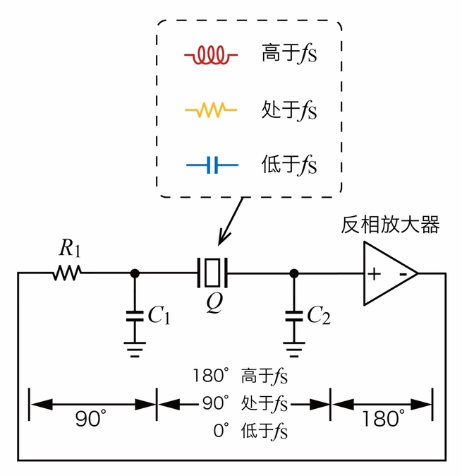
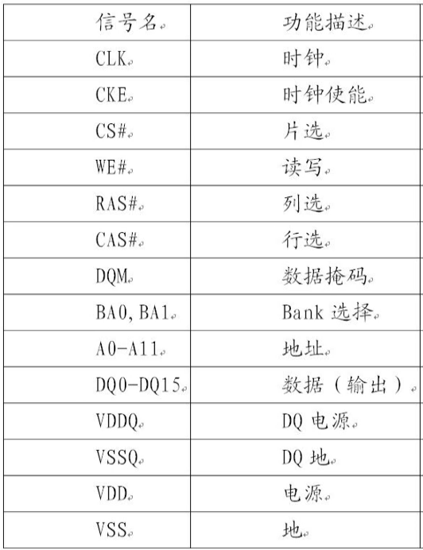

# 电路设计从入门到弃坑28【可编程数字电路】

## 时钟源

现在的数字电路一般需要比较精准的时钟源，为了产生这样的信号，可以使用经典的RC振荡器电路或LC振荡器电路，但这些电路始终存在精度不高（频偏大）的问题。我们更多采用的是基于**石英晶体振荡器**，即**晶振**的时钟源方案，它可以产生较高精度（一般在±20ppm以下，特殊设计的温度补偿晶振和有源晶振可以达到±5ppm）的数字时钟信号

### 晶振

晶振分为**有源晶振**和**无源晶振**。无源晶振实际上就是一个石英晶体经特殊切割后使用金属连线引出制造而成；有源晶振则是在无源晶振的基础上加入外部电路制造的集成电路，它能够在晶振的基础上实现更加稳定的时钟信号输出，能输出差分时钟或可编程时钟。无论什么样的晶振都是以石英晶体为基础。经典的石英晶体结构如下图所示

如果换一个角度从上往下看，它的结构就变成了这样

带正电的硅原子和带负电的氧原子交错排布

> 氧的电负性比硅的大，因此在晶体中氧原子带负电。但总体上看，晶体的正电中心和负电中心是重叠的，因此呈现电中性

当在水平方向上施加压力后，由于该排布的晶体结构容易形变，就导致正电中心和负电中心分开，晶体原子排布变成了这样

电荷中心的错位就导致产生了晶体的极化，原本电中型的晶体会在施加压力的两侧产生正负电荷

相反，如果施加水平拉力，晶体原子排布就会变成

这样由于外界压力变化导致晶体极化现象，从而在晶体两个相对表面上出现正负相反电荷的现象被称为**正压电效应**。不难想到，如果在晶体被反复施加压力和拉力，两端就会产生交变的电荷。

相反，还有**负压电效应**：在极化方向上施加交变电压，会引发晶体的伸长和缩短

> 负压电效应是因为晶体内原子因为电负性不同受到电场作用力偏离平衡位置导致的

当两个压电效应结合，在晶体两端加交变电压，导致晶体机械振动的同时又产生了交变电场，这一特性就让石英晶体在电路中的行为*类似RLC串联网络*，网络参数与晶体的切割方式、几何形状、尺寸等因素有关

等效电路中Rs是晶振内部材料固有电阻导致的，而Ls和Cs则是压电效应的等效体现，Cp是由晶振引脚和焊点共同带来的寄生参数。对于晶振来说，作为固定参数Cs远大于寄生参数Cp，但当频率升高时，Cp将作为主要阻抗贡献者。具体的频率特性如下图所示

晶振具有两个谐振点，分别是串联谐振频率fs和并联谐振频率fp
$$
f_S =\frac{1}{2\pi \sqrt{L_s C_s}} ;f_P=\frac{1}{2\pi \sqrt{L_s C_s||C_P}}
$$
由于Cs远大于Cp，fs和fp一般非常接近（Cp对谐振频率的影响很小），差别在几十Hz到几百kHz，而晶振正要在fs和fp之间的电感状态工作

> 原因在于晶振要配合经典的*皮尔斯振荡器*使用，在后文中叙说

**串联谐振时**，Ls和Cs谐振导致输出阻抗达到极小值，其**Q值将达到最大**（*晶体的等效电感远高于其电容电阻值*），可到2万至20万；并联谐振时，Cp与晶体的等效电感（在fs和fp之间，晶体表现为感性）发生并联谐振，此时晶振输出阻抗达到极大值，一旦超过并联谐振频率，晶体就会表现为容性，不再能产生时钟

> 应用中很少使用RC振荡器而选择晶振的原因正在于晶振的Q值能高非常多，并且晶振的有效工作频率就在fs到fp中间的几百kHz，这相当于自带负反馈

### 皮尔斯震荡器

只有晶振是无法产生时钟信号的，应用中多次采用皮尔斯振荡器电路搭配使用。下面是皮尔斯振荡器电路的拓扑，它的主要部分是一个反相放大器接法的运放（在数字电路中多采用反相器或施密特触发器实现），其中C1、C2被称为匹配电容

> 实际电路中，需要时钟的芯片内部集成皮尔斯振荡器，晶振和匹配电容则外接出来。这是因为当前的硅工艺集成电路和晶振封装工艺不匹配，需要很高的成本（先进封装）才能把石英晶体和die合封到芯片中；并且石英晶体的高频振荡不是理想的，会带有不同频率的谐波，容易对芯片内部电路造成串扰，如果先通过皮尔斯振荡器输入芯片，再通过PLL则能更好地抑制干扰

使用中，皮尔斯振荡器的工作状态如下

引入这个电路的目的就是要**让晶振满足巴克豪森准则**：增益大于等于1且反馈相位差大于360度。通过一个反相放大器，我们可以轻松获得大于等于1的增益，但相位差就需要电路中不同子电路的相频特性来贡献

我们从Q右侧输出来看：首先信号通过一个反相放大器，获得了180度的相位差；随后进入由R1和C1组成的一阶低通滤波器，传递函数$G=\frac{1}{1+R_1 C_1 s}$，它能够贡献90度的相位差。之后信号进入由Q和C2构成的RLC串并联网络。这时我们只需要该串并联网络提供至少90度的相位差，信号就可以自激振荡起来

根据晶振的工作模式，可以发现，当信号频率小于fs时，信号会通过一个串联电容和一个并联电容，提供0度的相位差，这会让信号迅速衰减，无法构成自激振荡；当信号频率大于fp时同理；当信号频率处于fs时，该网络相当于一个串联电阻和一个并联电容，即一阶低通滤波，贡献90度的相位差，因此等于fs的信号能够自激振荡；当信号频率在fs和fp之间时，该网络相当于一个串联电感和一个并联电容，它是二阶低通滤波器，能够最多贡献180度的相位差，也满足相位差大于360度的条件。最后可以发现所有大于等于fs且小于fp谐振频率的信号被筛选出来，通过自激振荡形成稳定的时钟信号。由于在该工作状态下，晶振输出阻抗极小值对应fs频率信号振幅最大，幅频特性上升得又很“陡”，其他频率信号会被较好地衰减掉

> 虽然晶振能够提供稳定的时钟信号输出，但它会输出从fs到fp所有频率的信号（即使偏离fs的谐波会被较大的输出阻抗衰减掉，但仍会有大量靠近fs的频率成分留存），也就是存在一个相对大的抖动（jitter），需要后续电路的参与滤除

为了让输出信号保证稳定，还可以在反相器两端跨接一个大电阻（一般在1MΩ以上），构建控制放大器放大倍数的反馈

## CPU

## IO和板级总线协议

## 存储器

存储器是数字电路系统的重要组成部分

### EEPROM

电可擦除可编程只读存储器（EEPROM或称为E2PROM）是比较老式的ROM，一般用在单片机扩展存储或者黑匣子。电脑主板BIOS上面也会采用EEPROM存储配置信息（不过现在很多都换成了SPI Flash）

大多数采用I2C总线与主器件连接，读写速率很慢，但胜在成本低、工艺老、可靠性很高

### Flash

Flash是最常见的ROM之一，速率较低（通常信号时钟频率低于50MHz），内部电路都采用静态存储。不过随着闪存工艺技术的提升，Flash已经通过3D堆叠架构实现较高的读写速率

便宜的Flash一般使用SPI、SDIO或者QSPI接口；现在固态硬盘上面用到的Flash颗粒会用到高速总线

### SRAM

### SDRAM

同步动态随机存储器（SDRAM）是工控领域很常见的一类RAM，适用于各种不同频率的主控设备扩展内存。

一般采用并口与主设备连接，常见下面这样的接口定义

地址线、数据线分开，并由行、列选择信号、读写信号、时钟信号等进行控制

内存与ROM不一样，一般都是要求读写速度越高越好，因此SDRAM会被放在距离CPU很近的位置，由于时钟频率高，PCB走线还会考虑等长布置

### DDR SDRAM

DDR作为一个最常见的SDRAM形式，拥有目前最快的RAM读写速率，它可以在时钟线上升沿、下降沿各采集一次总线上传来的数据，因此被称为双倍速率（Double Data Rate，DDR）

目前主流应用是DDR3（广泛应用在各种场合，但已经接近淘汰）、DDR4（广泛应用在各种场合）、DDR5（多应用在高端PC、服务器）

DDR2是DDR的升级，IO速率为400MHz（DDR的速率是200MHz），并且引入了差分的时钟线DQS/DQS#

DDR3新加入了TDQS/TDQS#差分线用于8位RAM的时钟线。不过DDR3的时钟速率提高到了800MHz，供电电压也从DDR2的1.8±0.1V降低到了1.5±0.075V

DDR4对DDR3进行了一个更大的升级，加入了8位预读取电路，使得颗粒外部频率是内部时钟频率的8倍，大大提高了数据传输速率，并将供电电压从1.8V进一步降低到1.2V

## FPGA

