# 电路设计从入门到弃坑6【集成运算放大器简介】

集成电路是以半导体单晶硅为芯片，采用专门的制造工艺，把晶体管、场效应管、二极管、电阻和电容等元件及其之间连线组成的完整电路制作在一起，使之具有特定功能的电路技术

集成运放是一种典型的模拟集成电路，集成运放具有以下基本特征：

* 级间直接耦合
* 能够方便制造对管（一致性良好的对偶晶体管），因此广泛采用差分放大电路和电流源电路
* 能够方便地实现复杂电路，使得性能良好
* 使用有源元件来替代难以集成的无源器件，甚至会使用大量晶体管替代电阻、电容
* 多采用复合管工艺

**实际集成运放的性能非常高**，以至于常常可以近似为理想运放，分析外特征和电气特性时也常常使用理想运放模型进行等效

理想运放即理想运算放大器，就是将集成运放的各项技术指标理想化得到的电路模型，具有以下指标：

* 开环差模电压增益$A_{od}=\infin$
* 差模输入电阻$r_{id}=\infin$
* 共模抑制比$A_{od}=\infin$
* 输出电阻$r_O=0$
* 输入失调电压、电流、零漂均为0

一言以蔽之，*输入电阻无穷、输出电阻为0、开环电压放大倍数正无穷、共模抑制比正无穷的差分放大器*

可以推导出它的重要特征：

* 伏安特性是阶跃函数，i<0时输出$-U_{OM}$，i>0时输出$+U_{OM}$，在i=0时发生跃变
* 虚短：两输入端电势相等
* 虚断：两输入端节点流向运放输入端的电流为0

上面三个结论会在后面的运放应用部分详细梳理，这里请先当作背景知识记一下

实际的集成运放还是和理想运放有些区别。

一个是它的工作区域分为线性区和非线性区，实际运放的放大倍数无法达到正无穷，因此它的非线性区*相对*较宽

> 实际通用运放的$A_{od}$能够达到几十万倍，因此是“相对较宽”
>
> 这也导致集成运放工作在线性区时的最大输入电压$u_P-u_N$值仅为**uV**级别，需要使用反馈机制才能让它工作在线性区

本篇的重点在于集成运放的内部结构，一个典型运放的结构框图如下所示：

其中，

* 偏置电路：为各级放大电路设置合适的静态工作点。采用**电流源电路**（电流镜）构造，为晶体管**提供偏置电流**
* 输入级：又称前置级，多采用差分放大电路。要求**输入电阻**Ri**大**，**差模放大倍数**Ad**大**， **共模放大倍数**Ac**小**，**输入端耐压高**。
* 中间级：又称主放大级，多采用共射放大电路。要求**有足够的放大能力**。
* 输出级：又称功率级，多采用准互补输出放大电路。要求**输出电阻**Ro**小**，**最大不失真输出电压**Uom尽可能大。

下面来单独讨论各级结构

## 输入级

**输入级常常**（一定会）**使用差分放大电路拓扑**，目的有三个：

* 抑制共模信号，**防止零漂**
* 提高差模放大倍数，**增大输入电阻**
* 使用高压对管，增大耐压

对运放输入级来说，最重要的性能指标就是很大的输入电阻和高共模抑制比

因此运放中常常使用差分放大电路，并构造一个“长尾”电流源来抑制零漂。具体内容会在下一篇中谈到

## 电流源电路

电流源电路组成了运放总体的供能系统，可以说运放的所有电路都离不开电流源电路

一般使用三极管或MOS管组成**镜像电流源电路**（也称为电流镜），如下图所示

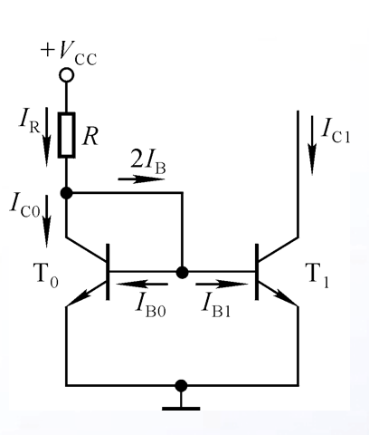

其中有$I_R=(V_{CC}-U_{BE})/R$，因为两个三极管对称，在三极管参数一定时左右分得电流相等，可以推出$I_R=I_C+\frac{2I_C}{\beta}$

经过变换可以推导出
$$
I_C=\frac{\beta}{\beta+2}I_R
$$
也就是说当$\beta>>2$时，总有$I_C\approx I_R$，并且不受其他因素干扰

**通过设置Vcc和IR的值就可以确定对管的c极电流，从而让处于c极这一支路上所有串联元件电流相等**

> 考虑厄利尔电压时，c极电流要加入修正项；同时考虑c-e电压产生的c极电流变化，可确定如下公式
> $$
> I_C=I_S(e^{\frac{V_{BE}}{V_T}}-1)(1+\frac{V_{CE}}{V_A})\\
> \frac{I_{C1}}{I_{C0}}=\frac{1+\frac{V_{CE1}}{V_A}}{1+\frac{V_{CE0}}{V_A}}
> $$
> 可以发现这个电路得交流小信号模型中诺顿等效电压
> $$
> V_{Th}=I_OR_o=I_{C1}\frac{V_A}{I_{C0}}=V_A
> $$
> 则如果电流源输出为开路，会有$-V_A$这么强的电压出现在晶体管T0两端，很危险；但事实上不会发生这种情况，因为电流源两端电压达到0时晶体管会进入饱和态，上面的公式失效
>
> 需要额外注意，在集成电路中，使用超过MΩ级的电阻是很消耗硅片面积的，如果可能，尽量不要使用大电阻来获得某个值的电流，而应该换用电路拓扑，比如使用、**改进型的基本电流源**、**Widlar电流源（微电流源）**、**威尔逊电流源**、或者使用特殊制造工艺的**多重电流源**

当要求提供很小的静态电流，但无法使用大电阻时，可以采用**微电流源**拓扑作为替代方案

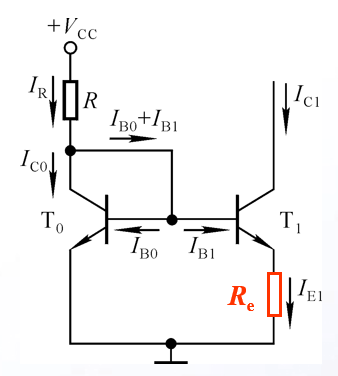

它仅在T1的e极加入了一个反馈电阻，可以获得以下方程
$$
U_{BE0}-U_{BE1}=U_T ln(\frac{I_{E0}}{I_{E1}})=I_{E1}R_e
$$
于是可得$I_{E0}\approx I_{C0}\approx I_R=\frac{V_{CC}-U_{BE0}}{R}$

设计过程中首先要确定$I_{E0}$和$I_{C0}$，然后选定R和$R_e$

> 电路中的电阻甚至也可以用一对电流源替换，这样能大大减少使用的电阻，晶体管工作在并联模式，电路的输出电阻
> $$
> r_{replace}=(1+\beta)r_{o2}
> $$

电流源电路可以通过并联来扩展，如下图所示的**多路电流源**就是用一个三极管作为镜像源，同时提供三路输出

这个电路需要根据每一路需要的静态电流来选取$R_{e_n}$的值，恒有以下方程
$$
U_{BEn}+I_{Rn}R_{en}=U_{BE0}+I_{Rm}R_{e0}
$$
任意两路的be结电压和电阻分压之和都相等$U_{BEn} \approx U_{BE0}$，在晶体管管型一样的情况下，可以得到
$$
I_{Rn}R_{en}=I_{R0}R_{e0}
$$
选取合适的Re即可在镜像源能提供电流的范围内得到任意恒定电流

在集成电路中，可以很方便地在三极管上制造多个集电极，于是就可以制造出这样的电路：

它和这个电路等效：

三个集电区面积为$S_0、S_1、S_2$，则有
$$
\frac{I_{C1}}{I_{C0}}=\frac{S_1}{S_0} \\
\frac{I_{C2}}{I_{C0}}=\frac{S_2}{S_0}
$$
所以常常通过这个结构利用c结面积变化来实现不同的恒定电流

> 简单介绍一下一些改进型的电流源
>
> **改进型基本电流源**是在电流源镜像b极和镜像源三极管c极之间加入一个额外的三极管，可以把它较做加射极输出器的电流源
>
> 
>
> 参考电流$I_R=\frac{V_{CC}-V_{BE1}-V_{BE3}}{R_1}$，输出电流$I_O=I_{C2}=\frac{I_R}{1+2(\beta^2+\beta_F)}$
>
> 这个电流源的最大特点就是通过引入反馈晶体管减少输出电流对晶体管参数的依赖性，两个晶体管参数不完全一致也可以得到相对高精度的电流源输出
>
> **威尔逊电流源**常常用于提供高输出电阻的高精度电流输出，广泛应用在各种集成运放内部
>
> 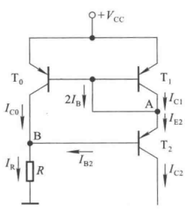
>
> 这个电路可以看作在有源负载电路基础上改进而来，**有源负载电路**就是把基本镜像电流源中的NPN管换成PNP管，这样就实现了灌电流输出，对外可以看成一个吸收电流的网络，可以提供一个恒定的吸收电流。威尔逊电流源在有源负载输出端加入一个调整管，可以让$I_{C2}$高度稳定，只要三个PNP管的特性近似，就可以达到较高的输出精度
> $$
> I_{C2}=(1-\frac{2}{\beta^2+2\beta+2})I_R\approx I_R
> $$
> 当β很大或很小时，都可以认为$I_{C2}\approx I_R$

MOSFET同样可以构成电流源，显而易见可以通过类似的构造，**通过修改MOSFET沟道尺寸来实现各种不同的输出电流**

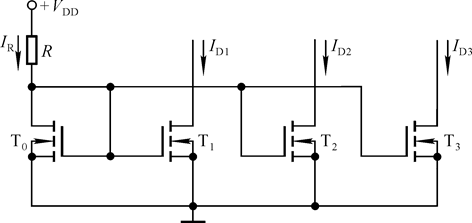

沟道长宽比S=W/L，则$\frac{I_{Dn}}{I_{D0}}=\frac{S_n}{S_0}$

## 放大级

运放中常使用的放大级电路一般是共射放大电路，可以提供很高的放大倍数

针对高频、高精度、低温漂等特性设计的专用运放也会使用共基放大电路

这一部分电路实际上已经在之前的三极管放大电路部分介绍过，不再赘述

## 直接耦合互补输出

互补输出级是直接耦合的功率放大电路，基本要求有：

* 带载能力强：必须有足够的驱动能力，为外界负载提供大电流，自身压降也要低
* 直流功耗小：静态工作电流小，自身损耗低
* 负载电阻上无直流功耗：不存在零漂
* 最大不失真输出电压大：双电源供电时$U_{OM}$接近电源电压；单电源供电时也要接近1/2的电源电压

最常用的电路拓扑就是**推挽输出**的OCL电路

详细内容将在之后介绍

## 集成运放的基本应用

从集成运放开始，模拟电路就进入了“宏观”应用，在此之前的内容都是模拟电路的底层基础（也包括之后要提的集成运放内部结构）；而此后的内容将会和信号与系统紧密结合——通过集成运放对模拟信号进行控制和变换

### 电压传输特性

上图就是经典的集成运放电压传输特性：两个非线性区，一个很窄的线性区

理想运放的电压传输特性可以近似为一个阶跃函数

对于运放的宏观应用，突出三个重点

* 反馈：需要使用反馈来让运放保持在线性区
* 虚短、虚断：两输入端电位相等、流入电流为0
* 非线性：利用运放的非线性工作状态搭建数字电路

### 运算电路

运算电路的**输出电压**是**输入电压**某种运算的结果，也就是运算电路能实现关系式$u_o=f(u_i)$

分析和设计过程中都需要依靠**虚断**和**虚短**特性作为出发点，配合基本的电路定律进行定量分析或通过信号与系统的角度进行定性分析

> 大家可能对下面的电路一头雾水，暂且放下疑问，简单了解公式即可，我们会在后面详细分析它们

1. 比例运算电路（放大器）

    * 基本正相：$u_o=(1+\frac{R_f}{R})u_i$

        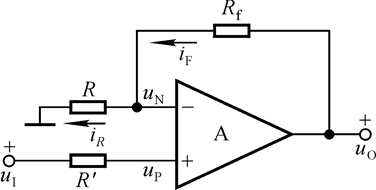

    * 电压跟随器：$u_o=u_i$

        

    * 基本反相：$u_o=-\frac{R_f}{R}u_i$

        

    * T型反馈网络：$u_o=-\frac{R_2+R_4}{R_1}(1+\frac{R_2//R_4}{R_3})u_i$

        

2. 模拟加法电路

    * 反相求和：$u_o=-R_f(\sum_{k}^{n} \frac{R_{ik}}{R_k})$

        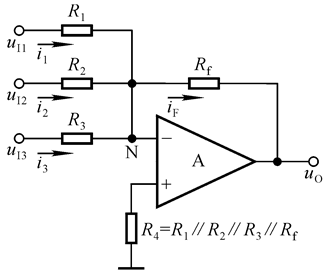

    * 同相求和：$u_o=R_f(\sum_{k}^{n} \frac{R_{ik}}{R_k})$

        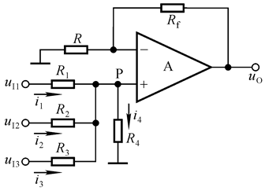

3. 模拟减法电路

    

    $u_o=\frac{R_f}{R}(u_{i2}-u_{i1})$

4. 模拟乘法电路

    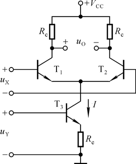

    $u_o=\frac{R_c}{2U_TR_e}u_Xu_Y$

    用下列符号表示模拟乘法器

    

    延伸出乘方电路

    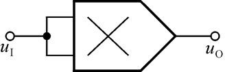

5. 模拟除法电路

    

    $u_o=-\frac{R_2}{R_1}\frac{u_{i1}}{ku_{i2}}$

    可延伸出开方电路

    

    $u_o=\sqrt{-\frac{R_2}{kR_1}u_i}$

6. 积分电路

    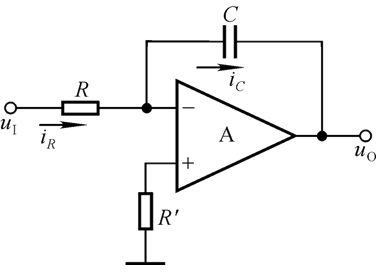

    $u_o=-\frac{1}{RC}\int_{t_1}^{t_2}u_i dt +u_o(t_1)$

    若u1再t1~t2为常量，则$u_o=-\frac{1}{RC}u_i(t_2-t_1) +u_o(t_1)$

7. 微分电路

    

    $u_o=-RC\frac{du_i}{dt}$

8. 对数电路

    

    $u_o=-U_T ln\frac{u_i}{I_S R}$

9. 指数电路

    

    $u_o=-I_SRe^{\frac{u_i}{U_T}}$

### 信号处理电路

1. 信号生成器电路

    用于生成特定频率特定波形模拟信号的电路

2. 有源滤波电路

    无源滤波电路的滤波参数随负载变化，而有源滤波电路中常常使用电压隔离器将滤波电路和负载隔离，这样就能让滤波参数不变，得到更大带宽；但是相应的有源滤波电路不是功率电路，输出电压电流大小受器件的参数和供电电源功率限制

    * 低通滤波器**LPF**：阻高频、通低频
    * 高通滤波器**HPF**：阻低频、通高频
    * 带通滤波器**BPF**：只允许特定频率信号通过
    * 全通滤波器**APF**：实现频率-相位转换或相移的特殊滤波器
    * 带阻滤波器**BEF**：只阻止特定频率信号

3. 有源负载电路

    用于模拟各性质负载的电路
    
    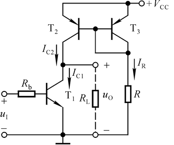
    
    本质上就是一个提供拉电流的镜像电流源，只不过一般都会通过限制输出电阻来控制它的功率

