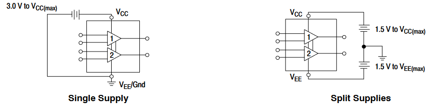
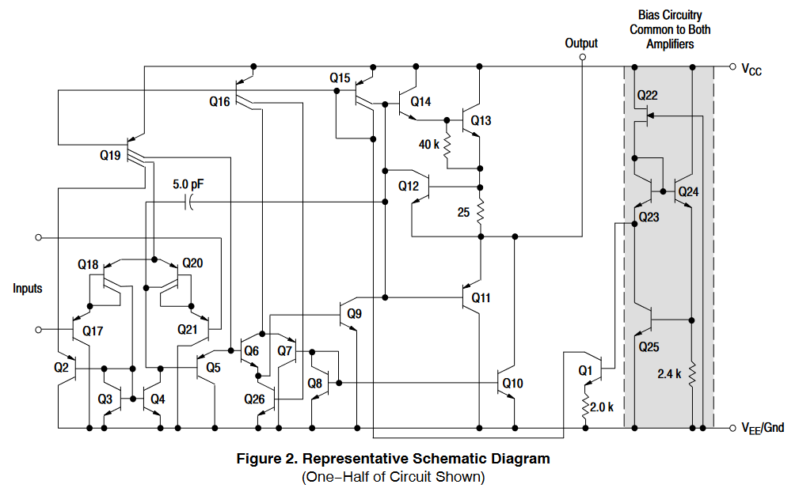
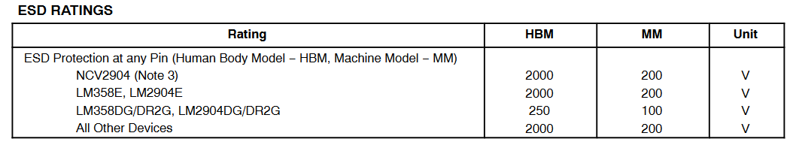
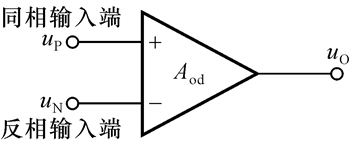
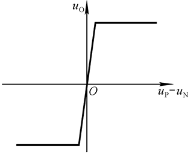
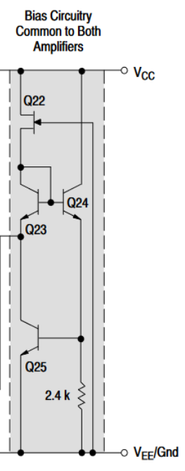
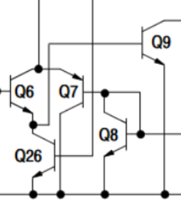
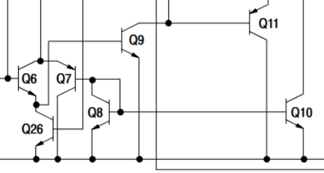
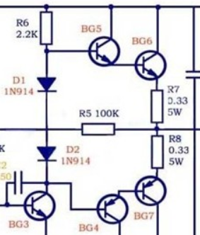

# 电路设计从入门到弃坑7【集成运算放大器的构成】

在之前的运放简介部分，已经介绍过运算放大器的基本构成，这部分要结合电路原理推导来详细说明一下集成运放的构成

在开始之前我们先来看一个经典运放LM358的datasheet

如右上角图片所示，LMx58家族有三种主要封装：比较大体积的PDIP-8、小体积的SOIC-8和不常见的Micro8，一般来说个人DIY最常用的就是DIP-8封装，而如果制作PCB的话还是应该选择体积较小相对性能更好的SOIC-8

左侧介绍也已经说了：LM358是LM324这个四路运放芯片的一半，也就是双运放IC，它们都属于**通用运放**，运放是分为各种特化类型的，相关内容会在之后介绍。它们的供电电压很宽：最低3V最高32V，同时还能使用负电源

右下角部分就是它的封装图了，内部包含两个输入输出独立的运放模块，而它们共用一套供电

下面这部分简要介绍了IC的性能，基本上现代的运放都得标配这些

可以看到它支持两套供电方式：单电源或双电源，注意之前说的宽供电电压在双电源使用的情况下就会变成标定的1/2

> 目前市面上所有现代的运放都可以使用单电源供电，也都可以使用双电源供电，不过根据运放具体电路不同，实际性能可能会有所差距

下面是我们的重点：内部电路图

看起来很复杂，但是不要慌，我们接下来就要把这个电路图分成四个基本部分，用上一部分说过的结构去分析它

这一部分都是对运放性能的阐述，这部分内容会放到下一篇博文的应用部分去仔细说明

后面的datasheet还附上了典型应用（typical application），同样会放到下一篇博文说明

## 集成运放概念复习

理想运放是一套双输入单输出的差分放大器，共模和差模输入电阻都为无穷大，输出电阻为0，差模电压放大倍数为正无穷大，共模电压放大倍数为0，通频带也为无穷大；实际运放已经能够近似成理想运放，所以之后的推导都会以理想运放模型为基础，只有在需要修正的时候才加以补充

## 输入级、放大级和偏置电路

输入级就是应用长尾式差分放大电路，放大级就是应用一套级连或者使用达林顿管的共射放大电路，而偏置电路使用的镜像电流源在上一篇中已经讲过，这里不再赘述

这里主要结合之前的知识对上面的LM358内部电路进行一下分级

先看最右边，这个电路是两套运放的共同偏置电路，负责提供一个总偏置电位，电流通过Q23的e极节点输出到Q1，进而调节左侧Q15的输出电流。

Q15、Q16和Q19是主要的偏置电流提供管，同时Q15还具有为输出极提供推挽电流的作用

再来看输入级这边的一坨管子

可以很明显地发现Q17、Q18、Q21、Q20共同构成一套改良的差分放大器作为输入级，同时长尾端所需电流源由Q3、Q4实现，它们所需的电流供能和偏置都来自Q19，Q2、Q5则起到反馈作用，这两个管子先按下不表。再来看右下角的一堆

它们都纠缠在一起，看起来不好拆解，于是按节点找到周围的管子

发现右边的Q8、Q10是一个镜像源，Q10的c极又被直接拉到输出端，Q8的镜像输入则来自Q7b极；Q6、Q26的偏置都来自电流源Q16，它们似乎组成了一对推挽输出极，输出在Q9放大后推给了Q11，看似放大级的构造但是分析不出什么，那我们再来看看上一级差分放大电路的输出具体到了哪里

它通过一个5pF电容耦合到了Q12的c极和Q9的c极，这就很明显了：右下角一坨电路并不是放大级：其中的Q6、Q7、Q26、Q8都是为Q9提供信号的，它们把来自Q5的信号变换为反相后，由Q9输出一个拉电流，这样就能实现对信号负半周的放大了。这里电路的主要作用是通过反馈消除信号的失真并增宽通频带

真正的放大级由Q14、Q9共同组成，Q14是一个射随器，输出电流被送到Q13上通过40k电阻转化成电压信号驱动Q13；而Q9的拉电流负责驱动Q11；Q11、Q12是典型的推挽输出级，也就是驱动级（后面会详细讲），它可以提供很大的输出电流；这个输出电流又被25欧电阻采样为电压信号反馈给Q14和Q9，从而稳定输出，消除交越失真

最后说会Q2、Q5两个电阻，这两个电阻主要构成了运放的保护回路——当电流过大时，两管会直接导通以卸掉电流源电路的额外功率，Q5还会通过Q6、Q7等反馈机制把后续的输出稳定下来

> 以上内容全部为个人理解，很多内容有错漏见谅，恳请各位批评指正
>
> 网上对于这种通用运放的分析太少了......只能自己胡诌（

分析电路的基本方法如下：

* **了解用途**：了解要分析的电路的应用场合、用途和技术指标
* **拆解电路**：将整个电路图分为各自具有一定功能的基本电路，按信号流通顺序或反馈回路顺序或功能模块顺序依次分析各个子电路
* **分析功能**：定性分析每个子电路的基本功能和性能，如果分析不通应该从输出端的反馈回路看回来
* **统观整体**：从模块分布确定电路相互连接关系以及连接后电路实现的功能和性能，分析整个电路的性能特点
* **定量计算**：对于含有电容、电阻等元件的电路，一定仔细看好参数，通过计算或估算或计算机仿真确定其作用和电路参数

## 驱动级

驱动级通常使用一套功率放大器拓扑，因为集成运放的主要使用目的是放大模拟信号而不是进行功率输出，所以一般都会简单使用消除了交越失真的OCL电路，详细内容可以参考后面的功率放大电路部分，这里仅做简要介绍

一般使用下面的这个结构组成推挽输出级

这个拓扑称为消除交越失真的准互补**OCL电路**，左侧两个二极管利用它们的管压降，配合上面的R6来消除后面三极管的**交越失真**

> 交越失真是在输入信号发生正半周-负半周交替的时候，由于电压没有达到晶体管门限电压，负责放大的晶体管并不导通，在对应部分出现输出电压为0的特殊情况
>
> 通过让晶体管处于放大区和截止区之间的临界状态或让晶体管提前/延后导通可以消除交越失真
>
> 
>
> 上面的波形描述的就是交越失真了
>
> 这里用的方法就是让两个二极管-0.7V的电势差和三极管be结+0.7V的电势差相互抵消，于是就能让三极管上管提前导通，下管延后导通，从而消除交越失真

两个NPN-PNP管e极接到一起，NPN管c极接正电源，PNP管c极接负电源，两者b极接到同一个信号输入，这就构成了图腾柱放置，也就是所谓的**推挽输出**。其中NPN管称为**上管**；PNP管称为**下管**，正半轴时NPN管导通，负半周时PNP管导通，这样就能放大整个波形了

不过这种交替导通并消除交越失真的电路会导致晶体管一直工作在放大状态，发热严重效率相对低。这种电路称为*甲乙类功放*电路

后面的内容中会仔细讲解功率放大电路，这里就先理解这部分电路是为了运放能够获得**低输出电阻**、**大电流输出能力**和**宽通频带**就可以了

## 集成运放分类

> 偷懒放了老师ppt截图，基本分类就是这样——上面这些东西都比较理论，实际上知道每个概念都在讲什么就好

如果按照性能指标分，就有以下几种主要类型

* **高阻型**：输入电阻很大，可高于10^12Ω，一般用于**仪表放大器**的输入级
* **高速型**：高频截止频率高，通频带宽会相对窄一些，但是SR很高，可达1000V/μs，用于各种高速设备（ADC/DAC等）
* **高精度型**：优化失调、温漂抑制、噪声特性，可以达到100dB以上的开环差模放大倍数
* **低功耗型**：优化静态功耗和动态功耗，一般用于低功耗设备
* **大功率型**：一般会被做成功放IC的形式，但本质上也是个运放，但是会牺牲开环放大倍数
* **仪表放大器**：由多个运放构成的复合电路，放大倍数极大、失真度极低
* **隔离运放**：输入输出-供电端不共地，实现隔离
* **缓冲放大器**：又称为缓冲门，常用于数字电路或高频模拟电路，一般用高速的三极管或MOS管实现，用于两级电路之间耦合，高输入电阻、低输出电阻、高通频带和几乎为1的放大倍数
