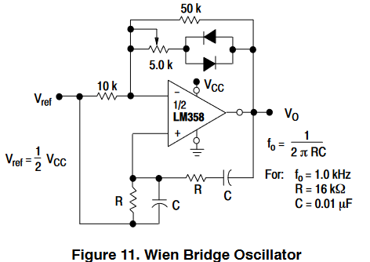
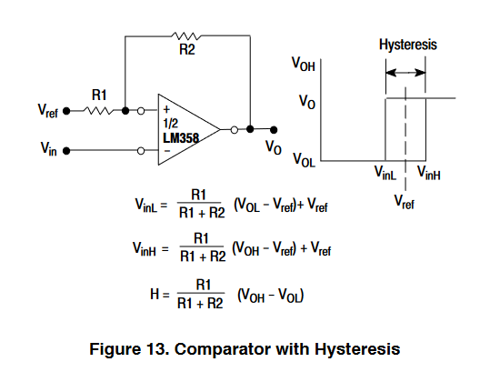
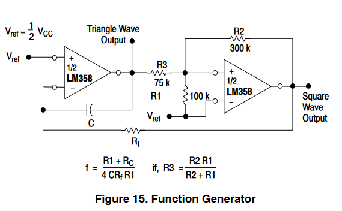

# 电路设计从入门到弃坑8【集成运算放大器的应用】

这一部分主要在上一篇博文的基础上说明集成运放在“运算”和“放大”方面的应用。至于运放在信号处理方面的应用，笔者将其放到了模拟信号部分

## 集成运放的性能指标

* 开环差模增益$A_{od}$
    $$
    A_{od}=\frac{\Delta u_o}{\Delta(u_P -u_N)}
    $$
    若实际电压放大倍数为$A_u$

    则$A_{od}=20lg|A_u|$

* 差模输入电阻$r_{id}$
    $$
    r_{id}=\frac{\Delta(u_P -u_N)}{\Delta i_P}
    $$

* 共模抑制比$K_{CMR}$
    $$
    K_{CMR}=20lg|\frac{A_{od}}{A_c}|
    $$

* 输入失调电压$U_{IO}$：使输出电压等于零时在输入端需要加的补偿电压

    对应有输入失调电流$I_{IO}$和它们的温漂

* 最大共模输入电压$U_{IC_{max}}$：能正常放大差模信号时容许的最大共模输入电压

* 最大差模输入电压$U_{ID_{max}}$：如果输入超过此值，输入级差分管会损坏

* 上限截止频率$f_H$

* 下限截止频率$f_L$

* 转换速率$SR$：描述运放对大信号的反应速度
    $$
    SR=\frac{du_O}{dt}|_{max}
    $$

## 放大电路

很多传统教材中都把比例运算电路归属于运算电路，但是针对运放的本质特性，笔者决定将两个比例运算电路单独划分为“放大电路”应用（参考了《模拟电子系统设计指南（基础篇）》的章节安排），主要以二者为例介绍理想运放的分析方法

之前已经介绍了理想运放的概念，这里来定量推导出理想运放的性质

### 理想运放

定义理想运放的输入级满足以下条件：

* 输入阻抗无穷大
* 无限接近甚至能超过电源所能提供的输入电压范围
* 差分增益无穷大
* 共模电压抑制比无穷大
* 信号带宽无穷大
* 失调电压、偏置电流、失调电流无穷小或可忽略

对应实际运放的输入级就有缺点：

* **运放输入级存在一定带宽限制**
* **运放电源供电电压对运放输入和输出电压范围有很大影响**

定义理想运放的输出级满足以下条件：

* 输出阻抗无穷小
* 无限接近甚至能超过电源所能提供的输出电压范围
* 信号失真无穷小或可忽略
* 信号带宽无穷大

同样，**实际运放的输出级难以达到上面所说的信号带宽和输出电压范围要求**

通过上面的两个理想定义，可以推导出理想运放的基本特点：

* **开环增益无穷大**
* **输入电阻无穷大**
* **输出电阻为0**

由于输入阻抗无穷大，可知输入端没有负载效应，输入同相输入端和反相输入端的电流均为0，存在**虚断**现象
$$
I_N=I_P=0
$$
理想运放的输出阻抗为0，因此在输出端没有负载影响，可以得到$U_o=A_{ol}V_d$，其中$V_d$是运放同相输入端和反相输入端电压之差。当运算放大器工作在线性区时，要求$V_o$必须是一个有限的电压值，有$V_o=\frac{V_o}{A_{ol}}$，又因为理想运放的开环放大倍数$A_{ol}=\infin$，则$V_d=0$，表示运放的差模输入电压非常小，两个输入端近似等电位，存在**虚短**现象
$$
U_N=U_P
$$
于是我们推导出了理想运放的最基本方程，以后所有理论推导都需要基于**虚短虚断等效**

除此之外，再来复习一下叠加定理：一个线性电路中，如果同时存在多个电源，则任意一支路的电流或电压，等于这个电路中各个电源分别单独作用时，在该支路中产生的电流或电压的代数和

在计算运放的输出$u_o$与多个输入$u_{ik}$关系时，常常要忽略其他$u_i$并在计算最后把结果相加

**集成运放的一般关系式可以描述为$u_o=f(u_i)$**

**集成运放在工作在线性工作区有前提条件：引入负反馈**。此时候有$u_o=A_{od}(u_P-u_N)$

对于同相放大电路，有$A_{od}=1+\frac{R_f}{R_t}$

对于反相放大电路，有$A_{od}=-\frac{R_f}{R_t}$

这正是将同相/反相比例运算电路归类为放大电路应用的原因

### 反相比例运算电路

对于上述电路，存在
$$
i_f=i_R=\frac{u_i}{R} \\
u_o=-i_f R_f=-\frac{R_f}{R} u_i \\
R'=R//R_f
$$
电路通过引入**电压并联负反馈**来保证运放工作在线性区

对于该电路，还需要额外注意$R_f$虽然能够有效反馈，但是会导致部分噪声杂波被引回输入端放大，进而对整个电路系统带来较大*噪声*，**$R_f$决定了反馈深度，而反馈深度越深也就是$R_f$越大，系统噪声干扰越大**，所以可以改进这个电路为**T型反馈网络反相比例运算电路**

在这个电路中，有
$$
i_2=i_1=\frac{u_1}{R_1} \\
u_M=-\frac{R_2}{R_1}u_i \\
u_o=u_M -(i_2+i_3)R_4 \\
i_3=-\frac{u_M}{R_3} \\
u_o=-\frac{R_2+R_4}{R_1}(1+\frac{R_2//R_4}{R_3})u_i
$$
这个大式子肯定记不住，我们不妨来讨论一下分析的逻辑：整体电路就是个反向比例运算电路，但是在反馈网络部分进行了改变。首先看孤零零的$u_P$，发现它通过R5直连地，于是根据虚短特性得到
$$
u_P=u_N=0
$$
随后就能直接得到
$$
i_1=i_2=\frac{u_i-0}{R_1}=\frac{u_i}{R_1} （虚断导致流入负端的电流为0）
$$
也就是上面*第一个式子*

接下来发现好像没什么可分析的了，这时候就需要发散思维，引入一个新变量让计算更简单——如果你对电路原理的节点电流法比较熟悉，那么肯定直接想到在M点使用KCL：$i_2+i_3=i_4$

于是挨个列写方程
$$
i_2=-\frac{u_M}{R_2} \\
i_3=-\frac{u_M}{R_3} \\
i_4=\frac{u_M-u_o}{R_4}
$$
不难发现这里已经推出了上面*第四个式子*

考虑之前得到的$i_1=i_2=\frac{u_i}{R_1}=-\frac{u_M}{R_2}$

可以计算$u_M$
$$
u_M=-\frac{R_2}{R_1}u_i
$$
这就是上面的*第二个式子*了

发现似乎并没有推出什么新东西，于是回到节点电流法
$$
i_4R_4=u_M-u_0=(i_2+i_3)R_4 \\
u_o=u_M -(i_2+i_3)R_4
$$
这就得到了*第三个式子*

四个式子联立带入节点电流法解得答案。

> 这个推导思路似乎不太连贯，因为这个推导基于“有什么用什么”的逻辑（很多情况下实际问题就是需要多猜，但这个题目显然就不适合这样一边碰壁一遍写方程的思路）
>
> 还有另一个较为连贯的逻辑：以M点电位为基础
>
> 虚断虚断特性对应运放本身的性质，而整个系统可以分成两部分：运放和反馈网络。不难想到将整个反馈网络看作一个独立子系统进行求解，于是就能很自然地发现节点电流法对系统R2、R3、R4最有效，设置$u_M$也就很自然了。求解出子系统的性质也就是节点电流法方程后，直接有
> $$
> -\frac{u_M}{R_2}-\frac{u_M}{R_3}=\frac{u_M-u_o}{R_4}
> $$
> 综合已经得到的公式
> $$
> i_1=i_2=\frac{u_i}{R_1} \rightarrow u_M=-\frac{R_2}{R_1}u_i
> $$
> 求解方程组就可以直接得到答案了

### 同相比例运算电路

这个电路引入了**电压串联负反馈**，由下式确定它的放大特性
$$
u_o=(1+\frac{R_f}{R})u_i
$$
对于这个电路，存在两种特例情况

如上图，左边表示$R=\infin$；右边表示$R=\infin且R_f=0$

在这两种情况下都可以确定$1+\frac{R_f}{R} \rightarrow 1$，进而有
$$
u_o=u_i
$$

> 如果只有$R_f=0$时候会怎么样？如果你问了这个问题，说明还没有掌握反馈网络的灵魂
>
> 反馈网络决定了运放的$A_{od}$，而我们在上面通过虚短虚断特性推导出的同相比例运算电路表达式里面的$\frac{R_f}{R}$是来自对反馈网络的抽象，而在下面的这个特例里面，只要求$1+\frac{R_f}{R} \rightarrow 1$这个条件——也就是只要满足这个条件的电路拓扑都可以有$u_o=u_i$的表达式，所以说只有$R_f=0$的时候，也存在$u_o=u_i$
>
> **为了实现目标而引入反馈网络，而不是为了反馈网络去强行规划一个目标**。在设计电路的时候使用这个思路，分析电路的时候也应该依靠这个思路，先把握电路拓扑的应用目标（也就是所谓的识别电路），再对应确定每个元件的取值

## 运算电路

### 反相求和运算电路

### 同相求和运算电路

### 加减运算电路

### 积分运算电路

### 微分运算电路

### 对数运算电路

### 指数运算电路

### 乘法/除法运算电路

一般来说可以通过下面的拓扑结构实现乘法/除法运算电路

但实际上乘法运算电路用不到运放——只需要几个三极管就可以构成模拟乘法器了

上图称为**变跨导型模拟乘法器**，有表达式
$$
u_o=\frac{R_c}{2U_TR_e}u_Xu_Y
$$
实际使用中一般会在多方面进行改进，不会简单使用这个拓扑。在电路中常常用下面的符号表示

理想情况下k值是不会变化的
$$
u_o=ku_Xu_Y
$$
可以将两个输入端连接到同一个输入电压来获得乘方运算

$$
u_o=ku_i^2
$$
如果对正弦波使用这个电路，除了电压乘方外还会让信号二倍频

$u_o=2kU_i^2(1-cos2\omega t)$

将这个电路倒置在反相比例运算电路的反馈网络中，可以实现除法运算

但是需要注意：要求k值和$u_{i2}$值是同极性的，否则会导致输出不正确甚至损坏设备
$$
u_o=-\frac{R_2}{R_1}\frac{u_{i1}}{ku_i2}
$$
可以将$u_{i2}$接入$u_o$处实现开方运算
$$
u_o=\sqrt{-\frac{R_2}{kR_1}u_i}
$$

> 不难发现：**若集成运放的负反馈通路中为某种运算电路，则整个电路实现其逆运算**
>
> 对于开方电路是这样，对于上面的那些运算电路也是这样
>
> 这是因为运放的负反馈网络属性可以描述为
> $$
> -\frac{R_f}{R} <-^{负反馈}-> A^{-1}(B)
> $$
> A表示反馈网络拓扑的电压输出与输入之间的关系

## 有源滤波器

在电路原理里面已经介绍过基于RLC串并联网络的滤波电路，这种基于无源器件的电路被称为**无源滤波电路**

基于有源器件的滤波电路就是**有源滤波电路**了

理想的滤波电路呈现阶跃函数$\delta(t-t_0)$的特性

但是实际的滤波电路往往存在过渡带-通带-阻带三个区域。

> 无源滤波电路会受到负载的影响，当负载感抗/容抗较大的情况下或信号频率非常高/非常低的情况下，负载会影响滤波器的带宽和有效频率；而**有源滤波器可以通过负反馈进行自我调节**，从而不受或很少受负载的影响
>
> 对于一般的无源滤波器，存在
>
> 空载时
> $$
> A_u=\frac{1}{1+j\frac{f}{f_p}}
> $$
> 带载时
> $$
> A_u=\frac{A_{up}}{1+j\frac{f}{f_p}} \\
> A_{up}=\frac{R_L}{R+R_L} \\
> R为滤波电路内阻
> $$

滤波电路的特性可以通过两种频率特性描述，分别是**幅频特性**和**相频特性**

相频特性一般通过**波特图**的形式描述

幅频特性一般通过电压放大倍数-信号频率图的形式描述

> 上面的内容在之后的频率响应章节会仔细介绍，这里简单说明一下定义。
>
> **幅频特性**：电路的$A_u(f)$函数
>
> **相频特性**：电路的$\phi(f)$函数
>
> **波特图**是一种使用对数坐标系反映电路频率响应的标准图示

四种滤波电路的幅频特性如下所示：

* **高通滤波器**HPF

    

* **低通滤波器**LPF

    

* **带通滤波器**BPF

    

* **带阻滤波器**BEF

    

有源滤波器中，常常**使用电压跟随器隔离滤波电路与负载电阻**，因此可以达到滤波参数不随负载电阻变化的特点。同时可以实现电信号放大，更能滤出需要使用的信号频段。但是它也存在缺点：**无源滤波电路可用于高电压大电流**；而**有源滤波电路是信号处理电路，输出电压和电流的大小受有源元件自身参数和供电电源的限制**

### 同相输入低通滤波器

有传递函数
$$
A_u(s)=(1+\frac{R_2}{R_1})\frac{1}{1+sRC}
$$
可见它属于一阶电路

具有上图这样的幅频特性
$$
A_u=\frac{A_{up}}{1+j\frac{j}{j_p}} \\
f_p=\frac{1}{2\pi RC}
$$
对上述电路改进为二阶如下

幅频特性

$$
(1+\frac{R_2}{R_1})\frac{1}{1-(\frac{f}{f_0})^2+3j\frac{f}{f_0}} \\
特征频率f_0=\frac{1}{2\pi RC} \\
截止频率 f_p \approx 0.37f_0
$$
这个电路虽好，但是它的过渡带太拉跨了，于是我们进行下面的改进，引入一个稍弱的正反馈，制成**压控电压源二阶LPF**

这回的图像就舒服多了

### 反相输入低通滤波器

这个电路就是在积分运算电路基础上改进而来

具有幅频特性
$$
A_u=-\frac{R_2}{R_1}\frac{1}{1+j\frac{f}{f_0}} \\
f_p=f_0=\frac{1}{2\pi RC} \\
A_{up}=-\frac{R_2}{R_1}
$$

### 高通滤波器、带通带阻滤波器的对偶性

高通滤波器与低通滤波器对偶，将LPF的电阻电容互换后即可得到一阶HPF、简单二阶HPF、压控电压源二阶HPF电路等

带通滤波器只要使用LPF和HPF组合即可

* LPF与HPF**串联**得到**带通滤波器**
* LPF与HPF**并联**得到**带阻滤波器**

还可以将**低通环节加在负反馈通路来实现高通**，本质上和之前讲述的逆运算实现一样。但是这样制成的滤波器一般称为**状态变量型滤波器**

> 很多时候运算电路和有源滤波器的拓扑结构很像，但是一定要记住：运算电路针对信号时域进行变换；有源滤波器针对信号频域进行变换

