# 电路设计从入门到弃坑8【集成运算放大器的应用】

这一部分主要在上一篇博文的基础上说明集成运放在“运算”和“放大”场景的应用。至于运放在信号处理方面的应用，笔者将其放到了模拟信号部分

回看理想放大器组成的各种电路，我们会发现其中广泛应用到**反馈**这个概念。将输出倒送回输入就是反馈，或者说复杂一点：**电学系统中，将输出信号通过某种方式回送到输入环节，和原理输入信号合并形成净输入信号，抑或是单独作为输入信号，进而影响输入输出性能的举措称为反馈**。下一章我们将仔细对反馈的概念和如何正确分析反馈机制进行深入梳理，这里引出反馈概念是为了让读者进一步意识到：由于运放的开环放大倍数实在太大了，完整的运放系统需要一个“刹车”来让随着输入信号猛烈摆动的输出信号稳定下来，并按照我们想要的规律变化。

很多情况下，我们都使用如下图所示的简单反馈电路

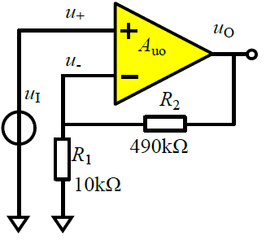

这个电路通过R1、R2分压，将输出信号的一部分（本图中是取1/50分压）回送到反相输入端，从而让整个电路的电压增益达到50倍。我们考虑一个更普遍的情况：将两个电阻换成一个函数网络，如下图所示

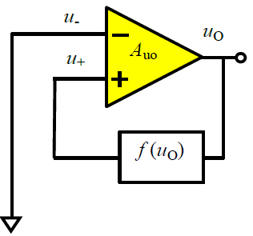

可以发现输出信号通过函数处理后回送到输入端，有理由认为通过这样的电路能够将函数`f`作用到输入信号上，获得稳定的输出`Vo=f'(Vin)`

基本的讲解到此为止，读者可以参考下一章内容来理解反馈，本章的重点还是在集成运放本身

## 集成运放的性能指标

首先来回顾集成运放的性能指标，读者参考上一章的datasheet，应当能从表格中提取出下面这些参数，它们是描述运放性能的基础参数

* 开环差模增益$A_{od}$
    $$
    A_{od}=\frac{\Delta u_o}{\Delta(u_P -u_N)}
    $$
    若实际电压放大倍数为$A_u$

    则$A_{od}=20lg|A_u|$

* 差模输入电阻$r_{id}$
    $$
    r_{id}=\frac{\Delta(u_P -u_N)}{\Delta i_P}
    $$

* 共模抑制比$K_{CMR}$
    $$
    K_{CMR}=20lg|\frac{A_{od}}{A_c}|
    $$

* 输入失调电压$U_{IO}$：使输出电压等于零时在输入端需要加的补偿电压

    对应有输入失调电流$I_{IO}$和它们的温漂

* 最大共模输入电压$U_{IC_{max}}$：能正常放大差模信号时容许的最大共模输入电压

* 最大差模输入电压$U_{ID_{max}}$：如果输入超过此值，输入级差分管会损坏

* 上限截止频率$f_H$

* 下限截止频率$f_L$

* 压摆率$SR$：描述运放对大摆幅信号的反应速度
    $$
    SR=\frac{du_O}{dt}|_{max}
    $$

## 放大电路

很多传统教材中都把比例运算电路归属于运算电路，但是针对运放的本质特性，笔者决定将两个比例运算电路单独划分为“放大电路”应用（参考了《模拟电子系统设计指南（基础篇）》的章节安排），主要以二者为例介绍理想运放的分析方法

之前已经介绍了理想运放的概念，这里来定量推导出理想运放的性质

### 理想运放

定义理想运放的输入级满足以下条件：

* 输入阻抗无穷大
* 无限接近甚至能超过电源所能提供的输入电压范围
* 差分增益无穷大
* 共模电压抑制比无穷大
* 信号带宽无穷大
* 失调电压、偏置电流、失调电流无穷小或可忽略

对应实际运放的输入级就有缺点：

* **运放输入级存在一定带宽限制**
* **运放电源供电电压对运放输入和输出电压范围有很大影响**

定义理想运放的输出级满足以下条件：

* 输出阻抗无穷小
* 无限接近甚至能超过电源所能提供的输出电压范围
* 信号失真无穷小或可忽略
* 信号带宽无穷大

同样，**实际运放的输出级难以达到上面所说的信号带宽和输出电压范围要求**，也能从之前的datasheet看出端倪

通过上面的理想定义，可以推导出理想运放的基本特点：

* **开环增益无穷大**
* **输入电阻无穷大**
* **输出电阻为0**

由于输入阻抗无穷大，可知输入端没有负载效应，**输入同相输入端和反相输入端的电流均为0**，存在**虚断**现象
$$
I_N=I_P=0
$$
理想运放的输出阻抗为0，因此在输出端没有负载影响，可以得到$U_o=A_{ol}V_d$，其中$V_d$是运放同相输入端和反相输入端电压之差。当运算放大器工作在线性区时，要求$V_o$必须是一个有限的电压值，有$V_o=\frac{V_o}{A_{ol}}$，又因为理想运放的开环放大倍数$A_{ol}=\infin$，则$V_d=0$，表示运放的差模输入电压非常小，**两个输入端能够看作等电位**，存在**虚短**现象
$$
U_N=U_P
$$
于是我们推导出了理想运放的最基本方程，以后所有理论推导都需要基于**虚短虚断等效**

除此之外，再来复习一下叠加定理：一个线性电路中，如果同时存在多个电源，则任意一支路的电流或电压，等于这个电路中各个电源分别单独作用时，在该支路中产生的电流或电压的代数和

在计算运放的输出$u_o$与多个输入$u_{ik}$关系时，常常要忽略其他$u_i$并在计算最后把结果相加

**集成运放的一般关系式可以描述为$u_o=f(u_i)$**

**集成运放在工作在线性工作区有前提条件：引入负反馈**。此时候有$u_o=A_{od}(u_P-u_N)$

对于同相放大电路，有$A_{od}=1+\frac{R_f}{R_t}$

对于反相放大电路，有$A_{od}=-\frac{R_f}{R_t}$

这正是将同相/反相比例运算电路归类为放大电路应用的原因

### 实际运放

实际的运放中，很多参数都与理想参数有着差距。回顾上一篇博文对LM358的介绍，我们来仔细看一下运放的参数

1. **供电电压$V_S$**

    市面上能买到的所有运放都可以使用单电源或双电源供电，但根据型号不同供电电压也有所不同

    就LM358来看，可以使用3到32V的单电源供电，或是压差在3~32V的双电源供电

    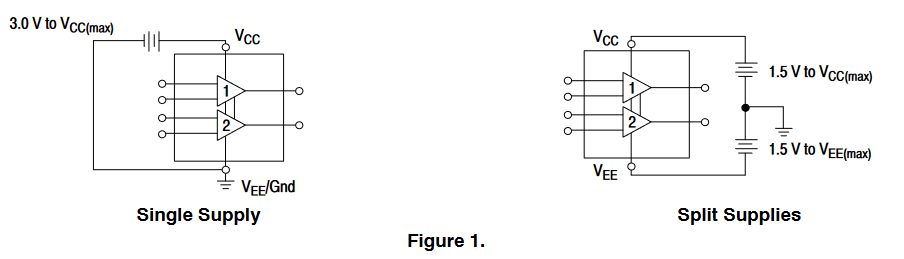

2. **输入偏置电流$I_B$**

    与理想运放的虚断不同，实际运放流入反相端和同相端的电流不为0，存在输入偏置电流（Input Bias Current，IBC）
    $$
    I_B = \frac{I_{B+} -I_{B-}}{2}
    $$
    定义两个电流的差为输入偏移电流（Input Offset Current，IOC）
    $$
    IOC=I_{B+}-I_{B-}
    $$
    实际运放应当保障该参数尽可能小，越小的输入偏置电流代表着运放的输入阻抗越大

    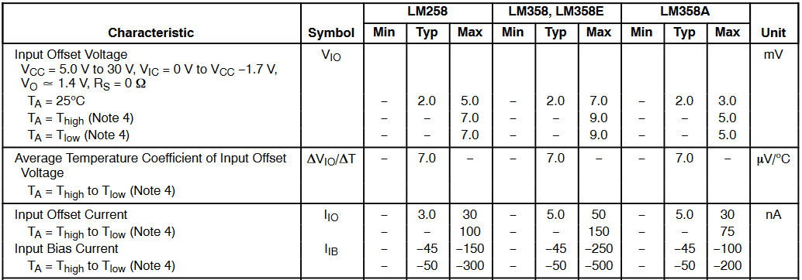

    可见LM358的IOC可以达到nA级别

3. **噪声$V_n$**

    实际运放的噪声来自白噪声和$1/f$噪声两部分，其中白噪声与频率无关，而$1/f$噪声与频率有关

    噪声的单位是$nA/\sqrt{Hz} @1kHz$，这个1kHz就是针对$1/f$噪声设计的单位，不同频率下的噪声可能会有所不同

    > 安森美的LM358数据手册里面没有收录噪声，因此这里换了TI的手册
    >
    > noise、noise density都代表噪声
    >
    > 噪声的单位实际上是电压密度，在频率上积分得到噪声电压

    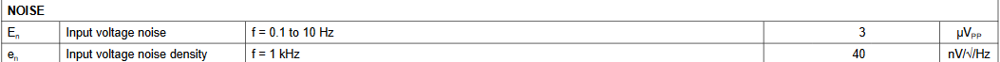

    噪声是固有、随机且无法被消除的，是由集成电路制造过程中器件特性和电路工艺导致的电压偏差导致。我们希望器件的**噪声越小越好**。当放大小信号时，噪声会让放大后的信号失真，因此必须选用低噪声运放

4. **静态电流$I_Q$**

    运放在没有负载情况下的待机电流被称为静态电流，本质上是运放中晶体管建立静态工作点时消耗电源功率对应的电流。在低功耗场合要关注该指标，选择低功耗的运放

    > 安森美的LM358依旧没有标出，换用TI的数据手册

    

5. **输入失调电压$V_{OS}$**

    理想运放具有虚短特性，同相端、反相端电压相等。但实际运放中同相端和反相端难免会出现失配，因此产生了一个固有电压差，称为**输入失调电压**

    一般希望这个参数越小越好

    通用运放和精密运放往往用这个参数作为参考划分：$V_{OS}>1mV$的运放是通用运放，$V_{OS}<1mV$的运放是精密运放

    > TI比较特殊，会把某些$1mv \ge V_{OS} \ge 0.5mV$但其他性能相对差的运放也归类为通用运放

    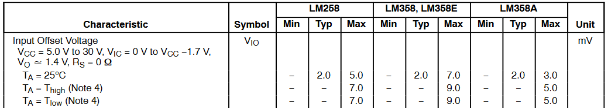

    我们发现LM358的$V_{OS}=2mV$，因此它被划分成通用运放

6. **增益带宽积GBW（GBP）和压摆率（SR）**

    当运放在小信号（$V_{PP}<1$）下工作时，可以近似把运放的带宽和增益的乘积看作定值，称为**增益带宽积**（Gain Bandwidth Product，GBP或Gain BandWidth，GBW）

    在选择运放的带宽时，要注意
    $$
    GBP > K*Gain *f
    $$
    其中系数K是10~100之间的系数，Gain是运放的开环放大倍数$A_{op}$，f是信号的频率。该式表示GBP应该比开环放大倍数乘信号频率的10到100倍更大，才能将输入信号不失真地放大

    对于需要高Q值的Sallen-key结构运放拓扑，需要使用高GBP的运放：当Q>1时，增益带宽积至少为$GBP>100*Gain*Q^3 *f_c$

    **压摆率**（Slew Rate，SR）又称为电压转换速率，定义是在单位时间内电压升高的幅度，一般单位有V/s、V/ms、V/us、V/ns。

    一般我们用它来衡量运放在某一频率下输出大幅度信号的能力。**压摆率不变时，输出信号幅度越大，运放能输出的信号频率上限就越小**。

    为了保证输入信号不失真，至少有
    $$
    SR \ge 2\pi fV_{opp}
    $$
    其中$V_{opp}$表示最大输出电压摆幅（峰峰值），单位为V；f表示输入信号的频率，单位为MHz

    > 假设如果要把最大电压为1V，频率为1MHz的正弦波放大6倍（$V_{opp}=6 - (-6)=12$），那么需要
    > $$
    > SR \ge 2*\pi * 1 * 12 =75.35
    > $$

    如果需要将高频信号放大很多，也就是f和$V_{opp}$都大的情况，就需要选择SR大的运放。一般来说驱动级运放和高速运放都要求SR较大

    > 这里还是选用了TI的数据手册，TI把GBW、SR、相位裕度、Tor、Ts都归为了频率响应

    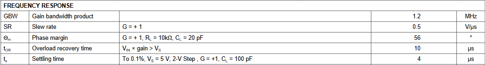

    这两个参数是选择运放最重要的两个指标

    结合GBP和SR可以计算出运放在输出最高频率信号时幅度的最大值

7. **开环电压增益$A_{VOL}$**

    这是运放最基本的参数。理想运放具有无穷大的开环电压增益，但实际运放的增益还是有限的。LM324的开环电压增益典型值大约是100V/mV，这也是大部分通用运放的参数

    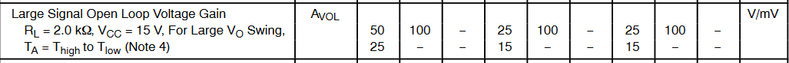

8. **输入电压范围**

    理想运放可以接收任意幅度的电压输入，但实际运放存在一个输入电压范围，超过最大值的输入信号将会导致器件损坏，而低于最小值的输入信号可能无法被放大

    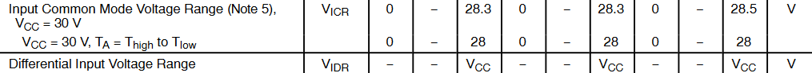

    一般来说输入电压会被分成共模电压和差模电压

    共模电压输入范围一般是由运放的制造工艺和用途决定的。工控、大功率环境下的运放会有更高的输入信号。而差模信号输入范围一般是由运放内部电路结构决定的

    如果差模电压输入范围在0到VCC电压，也就是能够达到单电源供电压差的话，这样的运放被称为**轨到轨**（rail-to-rail）运放

    > 注意，这并不是轨到轨运放的严格定义，只是轨到轨运放的一个特征

    对于非轨到轨运放，信号源用GND作为参考，当输入小信号或信号中直流分量（共模分量）小的时候，相当于输入逼近GND电源轨，如果不满足输入条件，运放将不能正常工作

    > 轨到轨实际上指的是信号能够任意地接近GND电源轨（**负电源轨**）或者VCC电源轨（**正电源轨**）
    >
    > 这样的器件能够为我们应用带来方便，应用也越来越广泛

9. **输出电压范围**

    与输入电压范围限制类似，运放的输出电压也是有一定范围的

    在数据手册中，输出电压范围可能会用两种方式标明，一种是像安森美一样的

    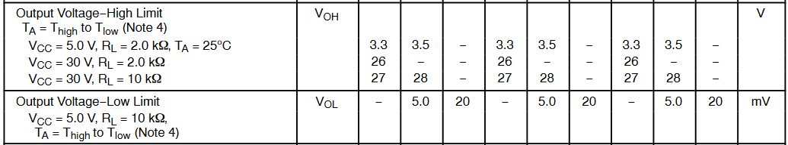

    用高压限和低压限来标明

    也可能是像TI一样

    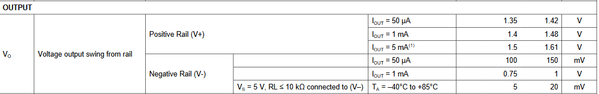

    使用Output Swing来标明

    **对于轨到轨运放，输出电压是可以任意接近GND或VCC的；但非轨到轨运放，在输出电压和VCC、GND电压之间存在着一个压差，这也是我们识别轨到轨运放的一个方法**

    LM324就是一个典型的非轨到轨运放：可以看到它在VCC=5V的情况下，存在
    $$
    V_{OH}=3.5V(max),V_{OL}=5mV(min)
    $$
    从TI的数据手册中可以发现，运放输出到正电源轨存在一个摆幅在1.35V到1.5V之间的电压；运放输出到负电源轨存在一个摆幅在100mV到0.75V之间的电压

    > 可以看一下另一个经典的轨到轨运放OPA354，它的输出电压到电源轨之间的压差仅有10mV到20mV，如下图所示
    >
    > 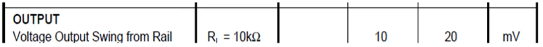

    这里给出**轨到轨运放的定义**：输入电压和输出电压可以与电源电压非常接近，几乎达到电源电压输入输出的运放。轨到轨运放分为输入轨到轨**RRI**、输出轨到轨**RRO**、输入输出轨到轨**RRIO**三种，目前市面上的主流轨到轨运放都支持输入输出轨到轨

    虽然轨到轨运放很方便使用，不需要为信号留出高压供电裕量和低压供电裕量，很适合在低压供电、小信号放大的场景下使用；但轨到轨电路设计比较复杂，价格比非轨到轨运放高一点点，在成本极度敏感应用中需要考虑一下，同时轨到轨电路会受到输出电流影响，**如果输出电流过大，会让输出电压达不到电源轨**

10. **短路电流$I_{SC}$**

    输出短路电流表示运放在输出端短路到地时能提供的最大推电流或灌电流，表征了运放的驱动能力

    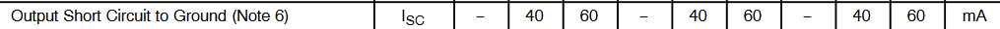

    上图是安森美提供的datasheet，下图是TI的

    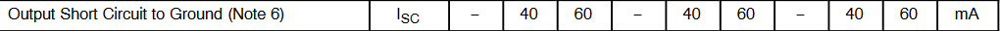

    一般来说通用运放都有着几十mA的输出短路电流，而功放一般能够承受数百mA到数A的输出电流

11. **输入阻抗和开环输出阻抗**

     实际运放的输入阻抗不是无穷大的，因此部分厂商会在数据手册中标明运放的输入阻抗

     > TI和安森美都没有给出LM324输入阻抗的参数，就不给参考了，感兴趣的读者可以自行查找OPA211的数据手册，尝试自行找到输入阻抗信息

     在高频小信号电路中，往往要让运放的输入阻抗远远大于信号源的内阻，这样才能够实现信号的精密采集

     理想运放假设输出阻抗为0，但实际上开环输出阻抗是一个比较小的值，LM324的开环输出阻抗如下图所示

     

     现在很多器件的开环输出阻抗已经能够做到几欧

12. **共模抑制比CMRR和电源抑制比PSRR**

     共模抑制比CMRR表征了运放抑制输入共模信号的能力，有些厂商会直接标出，有些厂商会使用共模抑制量（单位dB）的形式给出

     电源抑制比则表征了输出电压受电源电压影响的程度，该值越大，表示输出信号受到供电扰动越小

     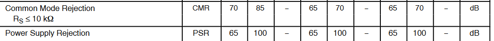

除了上述参数外，实际运放的非理想特性还会对基于虚短虚断结论的理论分析造成影响：当信号频率上升到运放开环增益下降严重（超出运放带宽）时，虚短虚断结论的前提条件不成立，结论也就失效了，这时需要使用更精确的运放小信号模型，列出整体电路的环路方程并求解来分析。

> 工业中一般会采集高频下的二阶乃至三阶运放模型，基于该模型利用SPICE仿真求解环路关键物理量

### 反相比例运算电路

基础理论部分到上面为止，下面会利用虚短虚断结论来一一分析上一章给出的运放应用电路。首先看最常用的反相比例运算电路

对于上述电路，存在
$$
i_f=i_R=\frac{u_i}{R} \\
u_o=-i_f R_f=-\frac{R_f}{R} u_i \\
R'=R//R_f
$$
电路通过引入**电压并联负反馈**来保证运放工作在线性区

> 该电路实际应用中很常见，在频率不高情况下反相比例运算电路能够提供比单管放大电路更优秀的增益和低噪声，常常用于传感器、电压信号采集

对于该电路，还需要额外注意$R_f$虽然能够有效反馈，但是会导致部分噪声杂波被引回输入端放大，进而对整个电路系统带来较大*噪声*，**$R_f$决定了反馈深度，而反馈深度越深也就是$R_f$越大，系统噪声干扰越大**，所以可以改进这个电路为**T型反馈网络反相比例运算电路**

在这个电路中，有
$$
i_2=i_1=\frac{u_1}{R_1} \\
u_M=-\frac{R_2}{R_1}u_i \\
u_o=u_M -(i_2+i_3)R_4 \\
i_3=-\frac{u_M}{R_3} \\
u_o=-\frac{R_2+R_4}{R_1}(1+\frac{R_2//R_4}{R_3})u_i
$$
这个大式子肯定记不住，我们不妨来讨论一下分析的逻辑：整体电路就是个反向比例运算电路，但是在反馈网络部分进行了改变。首先看孤零零的$u_P$，发现它通过R5直连地，于是根据虚短特性得到
$$
u_P=u_N=0
$$
随后就能直接得到
$$
i_1=i_2=\frac{u_i-0}{R_1}=\frac{u_i}{R_1} （虚断导致流入负端的电流为0）
$$
也就是上面*第一个式子*

接下来发现好像没什么可分析的了，这时候就需要发散思维，引入一个新变量让计算更简单——如果你对电路原理的节点电流法比较熟悉，那么肯定直接想到在M点使用KCL：$i_2+i_3=i_4$

于是挨个列写方程
$$
i_2=-\frac{u_M}{R_2} \\
i_3=-\frac{u_M}{R_3} \\
i_4=\frac{u_M-u_o}{R_4}
$$
不难发现这里已经推出了上面*第四个式子*

考虑之前得到的$i_1=i_2=\frac{u_i}{R_1}=-\frac{u_M}{R_2}$

可以计算$u_M$
$$
u_M=-\frac{R_2}{R_1}u_i
$$
这就是上面的*第二个式子*了

发现似乎并没有推出什么新东西，于是回到节点电流法
$$
i_4R_4=u_M-u_0=(i_2+i_3)R_4 \\
u_o=u_M -(i_2+i_3)R_4
$$
这就得到了*第三个式子*

四个式子联立带入节点电流法解得答案。

> 这个推导思路似乎不太连贯，因为这个推导基于“有什么用什么”的逻辑（很多情况下实际问题就是需要多猜，但这个题目显然就不适合这样一边碰壁一遍写方程的思路）
>
> 还有另一个较为连贯的逻辑：以M点电位为基础
>
> 虚断虚断特性对应运放本身的性质，而整个系统可以分成两部分：运放和反馈网络。不难想到将整个反馈网络看作一个独立子系统进行求解，于是就能很自然地发现节点电流法对系统R2、R3、R4最有效，设置$u_M$也就很自然了。求解出子系统的性质也就是节点电流法方程后，直接有
> $$
> -\frac{u_M}{R_2}-\frac{u_M}{R_3}=\frac{u_M-u_o}{R_4}
> $$
> 综合已经得到的公式
> $$
> i_1=i_2=\frac{u_i}{R_1} \rightarrow u_M=-\frac{R_2}{R_1}u_i
> $$
> 求解方程组就可以直接得到答案了
>
> 用哪种方法取决于个人喜好和电路分析风格，在熟练以后应当能够快速根据虚短虚断特性和反馈网络的函数关系推导出结论

### 同相比例运算电路

这个电路引入了**电压串联负反馈**，由下式确定它的放大特性
$$
u_o=(1+\frac{R_f}{R})u_i
$$
对于这个电路，存在两种特例情况

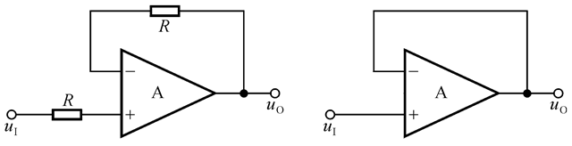

如上图，左边表示$R=\infin$；右边表示$R=\infin且R_f=0$

在这两种情况下都可以确定$1+\frac{R_f}{R} \rightarrow 1$，进而有
$$
u_o=u_i
$$

> 如果只有$R_f=0$时候会怎么样？如果你问了这个问题，说明还没有掌握反馈网络的灵魂
>
> 反馈网络决定了运放的$A_{od}$，而我们在上面通过虚短虚断特性推导出的同相比例运算电路表达式里面的$\frac{R_f}{R}$是来自对反馈网络的抽象，而在下面的这个特例里面，只要求$1+\frac{R_f}{R} \rightarrow 1$这个条件——也就是只要满足这个条件的电路拓扑都可以有$u_o=u_i$的表达式，所以说只有$R_f=0$的时候，也存在$u_o=u_i$
>
> **为了实现目标而引入反馈网络，而不是为了反馈网络去强行规划一个目标**。在设计电路的时候使用这个思路，分析电路的时候也应该依靠这个思路，先把握电路拓扑的应用目标（也就是所谓的识别电路），再对应确定每个元件的取值

## 运算电路

上面给出了几个最简单的放大电路例子，但运放另一个功能就是构造模拟运算电路，这些电路在电子管时代就已经出现并作为模拟计算机中的核心组件，随着数字集成电路的普及慢慢退化成现在教科书上的例题——尽管它们对某些模拟电路仍有重要价值

### 反相求和运算电路

反相求和运算电路就是模拟加法器，它可以将输入电压信号按输入电阻权重相加

该电路输出表达式为
$$
u_o=-(\frac{R_G}{R_1}u_{I1}+\frac{R_G}{R_2}u_{I2}+\frac{R_G}{R_3}u_{I3})
$$
对该电路的求解也可以用两种思路：关键节点或叠加原理。利用关键节点求解的方法如下，*叠加原理解法留给读者自行解决*

根据
$$
i_G=i_1+i_2+i_3=\frac{u_{I1}}{R_1}+\frac{u_{I2}}{R_2}+\frac{u_{I3}}{R_3}
$$
又
$$
u_o=-\frac{i_G}{R_G}
$$
可以简单得到输出表达式
$$
u_o=-R_G(\frac{u_{I1}}{R_1}+\frac{u_{I2}}{R_2}+\frac{u_{I3}}{R_3})
$$
变换形式即为开头表达式

> 你自行解决叠加原理了吗？没有的话建议先手算一遍再往下看
>
> 。
>
> 。
>
> 。
>
> 。
>
> 核心思路：首先求解每个输入信号单独作用时的输出电压，然后将所有结果相加，即得到所有输入信号同时作用时的输出电压。我们可以分别计算每个输入电压$u_{ix}$单独影响下的输出电压$u_{ox}$，最后将其相加，公式如下：
> $$
> u_{o1}=-\frac{R_G}{R_1}u_{I1}
> $$
>
> $$
> u_{o2}=-\frac{R_G}{R_2}u_{I2}
> $$
>
> $$
> u_{o3}=-\frac{R_G}{R_3}u_{I3}
> $$
>
> 最后
> $$
> U_o=u_{o1}+u_{o2}+u_{o3}=u_o=-R_G(\frac{u_{I1}}{R_1}+\frac{u_{I2}}{R_2}+\frac{u_{I3}}{R_3})
> $$

### 同相求和运算电路

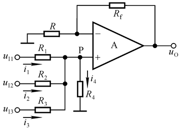

这是同相模拟加法器的电路，具有结论
$$
u_o=R_f(\sum_{k}^{n} \frac{R_{ik}}{R_k})
$$
这里的分析方法不能说与上面一模一样，只能说完全一致，就全交给读者自行计算了

### 加减运算电路

下面来看具有减法功能的电路

其输出为
$$
u_o=\frac{R_B}{R_A}(u_2 -u_1)
$$
对应地，还存在如下图所示的加减法运算电路

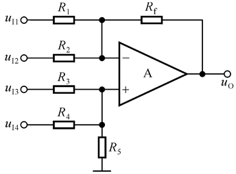

其输出为
$$
u_o=R_f ((\frac{u_{I3}}{R3}+\frac{u_{I4}}{R4})-(\frac{u_{I1}}{R1}+\frac{u_{I2}}{R2}))
$$
通过在运放反向输入端计算关键节点电流可以用和模拟加法器一样的方式推导出上面的公式。我们在这里主要看看模拟减法器电路的具体应用：它可以*计算出两个节点电位之差*

电位差是什么？电压。电压能干什么？测电流。这是很自然的联想。当然还能有更多应用，不过在这里减法器电路展现出了它经久不衰的用途：电流采样

试想在u1和u2之间接入一个非常小的电阻，然后将其串联在其他大电流回路的输出端，由于整个电路的增益可以被设置得非常大，一个微小电阻上的分压也能够被检测出来并加以放大，通过测量运放输出电压就可以计算出电阻分压值，并根据电阻本身大小计算出通过电阻的电流

这样的结构在之前的分立器件放大器部分介绍过，就是差动放大电路，显然运放的差分放大效果要比分立器件的效果好上很多

该电路在应用中存在几个明显问题：

* 输入电阻太小，下拉到地和反馈电阻会把输入到运放的信号分压
* 需要两端电阻同时变化才能调节增益，对电阻一致性要求很高，难以实际应用

芯片厂商一般会提供集成的差分放大器乃至对某些应用（比如电流采样）有特殊优化的差分放大器，它的内部集成了如上图所示的模拟减法器电路，对应的电阻基于特殊工艺制作，具有非常优秀的一致性，同时也会根据场景不同配置好不同的输入电阻大小

下图分别是集成差动放大器AD8276和高端电流检测放大器SGM8198的实例应用

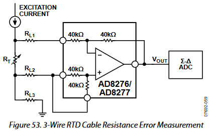

上图给出了AD8276用于精密的导线电阻误差检测应用，通过采集实际通过RT的电流来计算其电阻偏差，最右侧介入了一个精密的Σ-Δ ADC，用于把模拟信号转换成数字信号提供给计算机

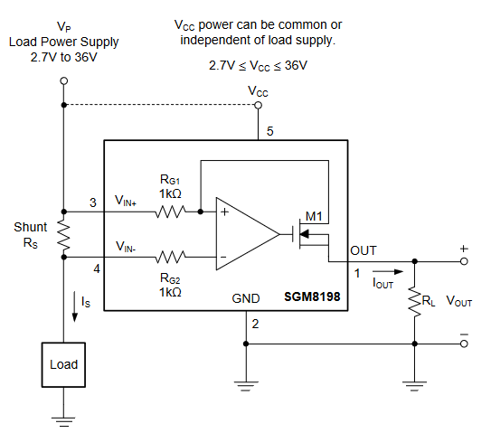

上图是SGM8198用于高端电流检测的应用，SGM8198是圣邦微生产的一款高端电流检测专用放大器，内部除了集成有运放外，还接入了一个MOSFET将输出电压信号转换成电流信号，从而增强抗干扰能力，并且用户可以自行设置$R_L$来获得不同最高值的电压，为后继电路选型提供便利

> 顺便一提，这里的“高端”指的不是“很高级”的意思，而是说采样电阻RS位于负载的高电位一侧；对应地，低端电流检测是指采样电阻RS位于负载的低电位侧

针对差动放大器，还有一类非常特殊的衍生电路：**精密仪表放大器**

在各种精密测量仪表或精密传感器的前端，常常引入一套增益极高、输入电阻极大的运放电路从而让输入端存在的共模电压被完全一致，它与一般的减法器电路具有两点区别：

* 输入电阻接近无穷大
* 通过一个电阻就可以调节其增益

换句话说就是把一般减法器电路设计上存在的问题完全解决了——不过需要付出额外两个运放的代价。仪表放大器的典型结构如下图所示

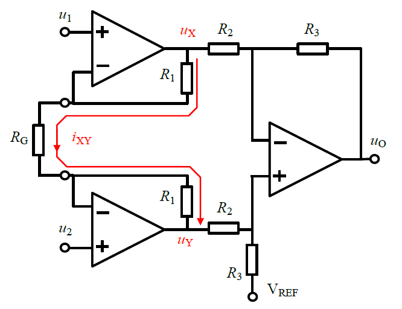

其表达式为
$$
u_O=G(u_+ -u_-), G=\frac{R_3}{R_2}\frac{R_G +2R_1}{R_G}
$$
通过调节外部电阻RG接口控制电路增益

> 注意$R_G$可以开路，但不能短路

差动放大器的分析较为复杂，这里暂且略过

> 下图展示了一个由LM358构建的仪表放大器
>
> 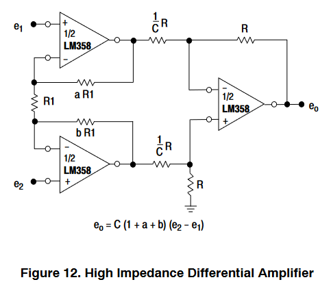

### 积分运算电路

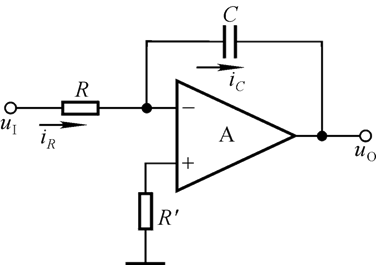

通过改变反馈网络的函数形式，可以构造出输出量是输入量积分形式的运放电路

基于虚断特性，运放反相端输入电流为0，
$$
i_C=i_R=\frac{u_I}{R}
$$
又因为虚短，运放反相端和正相端等电位，而正相端匹配电阻接地，这样的情况被称为运放构建了一个**虚地**。虚地是由于运放虚短特性出现的等效地，实质上是一个与地等电位的节点，因此在实际应用中并不存在，只有理想运放可以构建
$$
u_O=-u_C
$$
根据电容特性
$$
u_C=\frac{1}{C}\int\frac{u_I}{R}dt
$$
可以计算得到
$$
u_O=-\frac{1}{RC}\int_{t_1}^{t_2}u_I dt +u_O(t_1)
$$
如果t1、t2为常量，那么输出电压就等于在t1时刻输出的基础上对两时刻输入电压的积分
$$
u_O=-\frac{1}{RC}u_I(t_2 -t_1)+u_O(t_1)
$$
该积分电路在实际应用中很容易出现饱和，因为任何运放都具有*输入失调电压*（回顾上一章定义）和*输入偏置电流*，导致即使没有正相端匹配电阻，直接接地，都会出现一个持续流过反馈电容的电流，使电容上的电压累计增加或减小，使其最终达到输出最大电压。因此实际应用中通常在电容两端并联一个较大的电阻来避免电容电压的单调增减

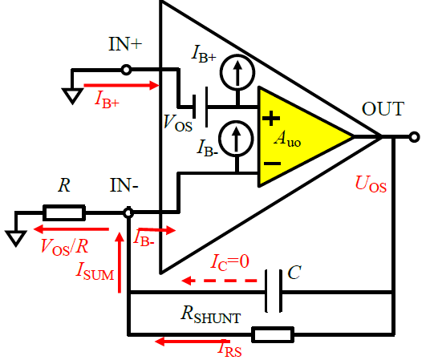

该电路是有源低通滤波器的变型，随着并联电阻的大小变化二者可以相互转化。如果并联电阻太小，随着输出电压升高，并联电阻会夺取更多电流，导致输出不再是标准的三角波

### 微分运算电路

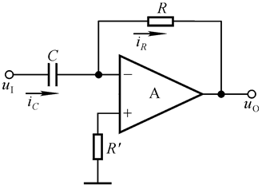

微分运算电路和积分电路原理类似，但利用了
$$
i_R=i_C=C\frac{du_I}{dt}
$$
根据反相端的虚地，有
$$
u_O=-i_R R=-RC\frac{du_I}{dt}
$$
从而实现对输入信号取微分的效果

### 对数运算电路

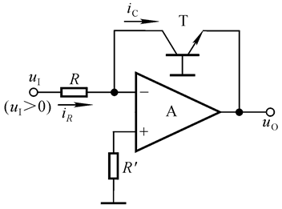

对数运算利用的是PN结端电压和电流的关系
$$
i_C \approx I_X e^{\frac{u_{BE}}{U_T}}
$$
又
$$
i_C=i_R =\frac{u_I}{R}
$$
得到
$$
u_O=-U_T ln\frac{u_I}{I_S R}
$$
由于$I_S$是一个重要的干扰项，实际应用中通常采用各种措施消除其对运算关系的影响

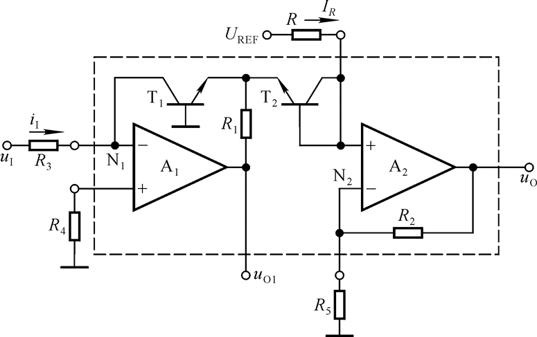

上面是非常经典的集成对数运算电路，分析重点在于求出N2点电压和输入电压的关系

已知输入端接入了对数运算电路，并通过T2与后端耦合，存在三极管T1集电极电流与BE结电压的关系
$$
i_{C1}=i_I=\frac{u_I}{R_3}\approx I_S e^{\frac{u_{BE1}}{U_T}}
$$
那么BE结电压可以被反推出来：
$$
u_{BE1}\approx U_T ln\frac{u_I}{I_S R_3}
$$
由于A2运放具有虚断性质，
$$
i_{C2}=i_R\approx I_S e^{\frac{u_{BE2}}{U_T}}
$$
得到
$$
u_{BE2}\approx U_T ln\frac{I_R}{I_S}
$$
利用两个运放的虚地，有
$$
u_{N2}=u_{P2}=u_{BE2}-u_{BE1}\approx -U_T ln{\frac{u_I}{I_R R_3}},U_T=\frac{kT}{q}
$$
于是
$$
u_O=(1+\frac{R_2}{R_5})u_{N2}\approx -(1+\frac{R_2}{R_5})U_T ln\frac{u_I}{I_R R_3}
$$
这便是消除$I_S$后的对数运算电路特性

### 指数运算电路

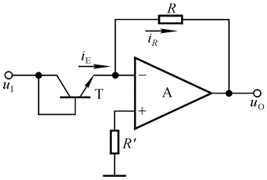

指数运算电路与对数运算电路对偶，这里仅给出结论，读者可以自行分析
$$
u_O=-I_S Re^{\frac{u_I}{U_T}}
$$

### 乘法/除法运算电路

模拟乘法器一般要求具有
$$
u_O=K u_X \times u_Y
$$
的特性，但对于大多数实际模拟乘法器，还具有一个加法端用于实现乘加运算
$$
u_O=K u_X \times u_Y +u_Z
$$
但一般来说电路符号不会包含Z端输入脚

一般来说可以通过下面的拓扑结构实现乘法/除法运算电路

但实际上乘法运算电路用不到运放——只需要几个三极管就可以构成模拟乘法器了。

上图称为**变跨导型模拟乘法器**，有表达式
$$
u_o=\frac{R_c}{2U_TR_e}u_Xu_Y
$$
该电路使用差分形式的电压输入，而在电路中常常用下面的单端输入电路符号表示

理想情况下k值是不会变化的
$$
u_o=Ku_Xu_Y
$$
可以将两个输入端连接到同一个输入电压来获得乘方运算

$$
u_o=ku_i^2
$$
如果对正弦波使用这个电路，除了电压乘方外还会让信号二倍频
$$
u_o=2kU_i^2(1-cos2\omega t)
$$
将这个电路倒置在反相比例运算电路的反馈网络中，可以实现除法运算

但是需要注意：要求k值和$u_{i2}$值是同极性的，否则会导致输出不正确甚至损坏设备
$$
u_o=-\frac{R_2}{R_1}\frac{u_{i1}}{ku_i2}
$$
可以将$u_{i2}$接入$u_o$处实现开方运算
$$
u_o=\sqrt{-\frac{R_2}{kR_1}u_i}
$$

> 不难发现：**若集成运放的负反馈通路中为某种运算电路，则整个电路实现其逆运算**
>
> 对于开方电路是这样，对于上面的那些运算电路也是这样
>
> 这是因为运放的负反馈网络属性可以描述为
> $$
> -\frac{R_f}{R} <-^{负反馈}-> A^{-1}(B)
> $$
> A表示反馈网络拓扑的电压输出与输入之间的关系

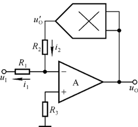

## 有源滤波器

在电路原理里面已经介绍过基于RLC串并联网络的滤波电路，这种基于无源器件的电路被称为**无源滤波电路**，基于有源器件的滤波电路就是**有源滤波电路**了

我们先了解一下关于滤波器的常识

### 滤波器

**滤波**是一个动作：对不同频率的输入信号实施不同的增益和相移来形成输出，执行这种动作的可以是硬件也可以是软件。举个例子，高通滤波器会在输入频率较高时，其增益逼近一个设定值，相移基本为0；当输入频率低于某一值后，随着频率下降，增益逐渐下降，相移开始增大，最终导致低于某一频率的输入信号被滤除

滤波分成**模拟滤波**和**数字滤波**，在模拟集成电路中我们大都在谈论模拟滤波，即输入输出信号都是连续的模拟信号；而数字滤波又被称为数字信号处理，它是针对离散域中的数字信号进行的。模拟滤波受现实世界物理规则限制，只能采用具体的模拟电路实现；数字滤波则可以在硬件或软件中实现，这是数字电路比较方便的地方。

我们现在讨论的都局限于模拟滤波。

滤波器可以分成**无源**滤波器和**有源**滤波器。无源器件组成的滤波器结构简单，信号通过就能起到滤波作用，并且器件往往能够在高频段正常工作，只是处理低频信号、电路级联的效果往往不尽如人意；有源滤波器需要额外供电，结构复杂，但通过引入反馈和放大环节，对低频信号具有非常好的滤波效果

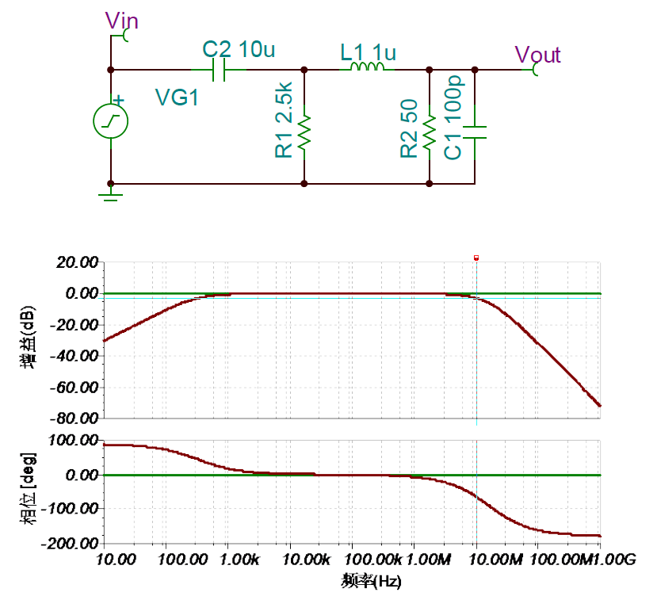

上图展示了一个无源滤波器及其特性

> 无源滤波电路会受到负载的影响，当负载感抗/容抗较大的情况下或信号频率非常低的情况下，负载会影响滤波器的带宽和有效频率；而**有源滤波器可以通过负反馈进行自我调节**，从而不受或很少受负载的影响
>
> 对于一般的无源滤波器，存在
>
> 空载时
> $$
> A_u=\frac{1}{1+j\frac{f}{f_p}}
> $$
> 带载时
> $$
> A_u=\frac{A_{up}}{1+j\frac{f}{f_p}} \\
> A_{up}=\frac{R_L}{R+R_L} \\
> R为滤波电路内阻
> $$

有源滤波器中，常常**使用电压跟随器隔离滤波电路与负载电阻**，因此可以达到滤波参数不随负载电阻变化的特点。同时可以实现电信号放大，更能滤出需要使用的信号频段。但是**无源滤波电路可用于高电压大电流**；而**有源滤波电路是信号处理电路，输出电压和电流的大小受有源元件自身参数和供电电源的限制**

滤波电路的特性可以通过两种频率特性描述，分别是**幅频特性**和**相频特性**。相频特性一般通过**波特图**的形式描述；幅频特性一般通过电压放大倍数-信号频率图的形式描述

> 上面的内容在之后的频率响应章节会仔细介绍，这里简单说明一下定义。
>
> **幅频特性**：电路的$A_u(f)$函数
>
> **相频特性**：电路的$\phi(f)$函数
>
> **波特图**是一种使用对数坐标系反映电路频率响应的标准图示

理想的滤波电路幅频特性呈现阶跃函数$\delta(t-t_0)$的特性

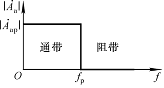

我们都希望滤波器能够接近理想滤波器，但实际上滤波器往往不是简单的阶跃函数——实际的滤波电路幅频特性往往存在过渡带-通带-阻带三个区域。

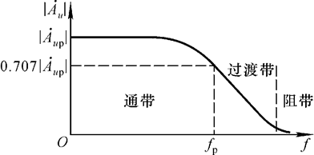

如上图所示的实际滤波器是**巴特沃斯（Butterworth）滤波器**，它的特点是通带内的频率响应曲线最大限度平坦，没有纹波，而在阻带则逐渐下降为零。它是目前最有名也是使用最广泛的滤波器，设计简单，性能没有明显缺点，因此能适应多种应用场合

还有一些滤波器在通带内的增益是不平坦的，比如**切比雪夫（Chebyshev）滤波器**。这种滤波器的通带内衰减具有等波纹起伏纹波，但过渡带比巴特沃斯要短，衰减得更快

> 切比雪夫滤波器得名并不是因为该结构是切比雪夫发明的，而是因为切比雪夫提出了切比雪夫准则，利用此准则进行设计可使滤波器的最大通带纹波最小化

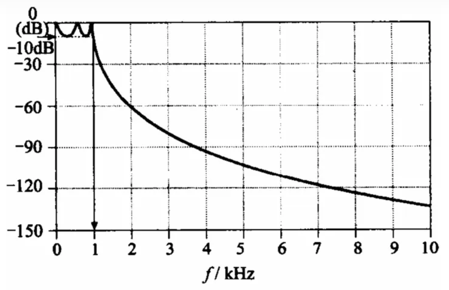

还有一种切比雪夫滤波器比较特殊，它通带内没有纹波，但阻带内有纹波或者说是陷波点，如下图所示，一般称其为**切比雪夫II型滤波器**；上面的滤波器可以被称为**切比雪夫I型滤波器**

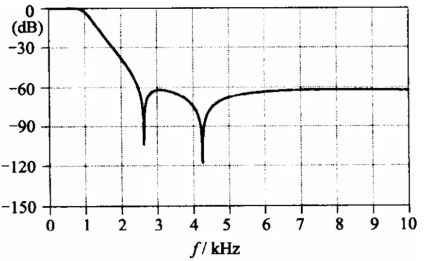

**贝塞尔（Bessel）滤波器**也比较常见，它的通带内群延迟特性最为平坦。由于群延迟特性平坦，这种滤波器能无失真地传送方波、三角波等频谱很宽的信号

从功能上看，滤波器分成**低通**、**高通**、**带通**、**带阻**、**相移（全通）**。低通滤波器和高通滤波器分别按照截止频率滤除较低频和较高频信号；带通、带阻滤波器具有两个截止频率（下限截止频率和上限截止频率），分别滤去两边和中间频率的信号。而全通滤波器能够让所有信号都通过，但对不同频率的输入信号具有不同的相移特性。几种滤波器的幅频特性曲线如下图所示

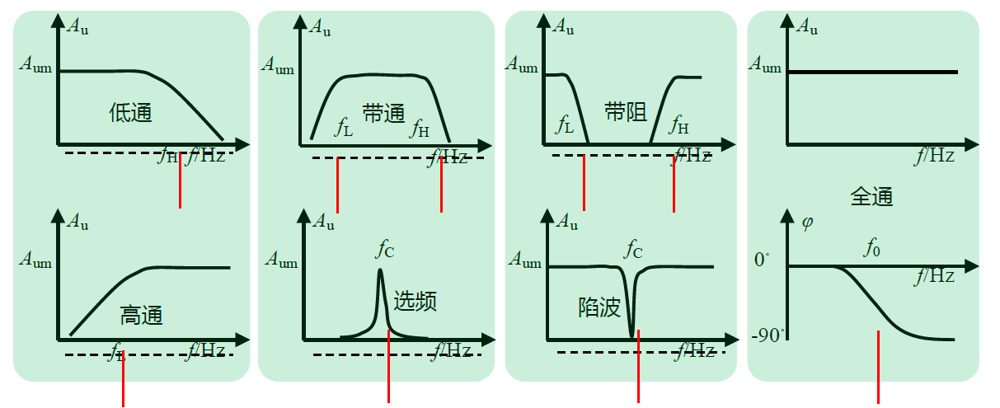

常见四种滤波电路的幅频特性如下所示：

* **高通滤波器**HPF

    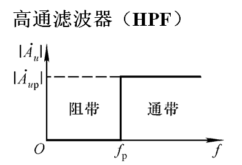

    滤除低于截止频率的信号

* **低通滤波器**LPF

    

    滤除高于截止频率的信号

* **带通滤波器**BPF

    

    滤除低于下限截止频率和高于上限截止频率的信号。如果带通滤波器的上下限截止频率相等，那么它被称为**选频滤波器**或**窄带通滤波器**，仅允许某一中心频率两边很窄频段的信号通过，只有一个特征频率。

* **带阻滤波器**BEF

    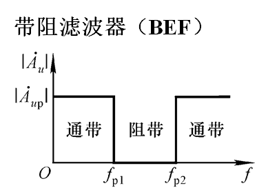
    
    滤除在下限截止频率和上限截止频率之间的信号。带阻滤波器的上下限截止频率相等时就成为**陷波器**，只对某一中心频率附近的频率量实施大幅度衰减

### 有源滤波器

目前有源滤波器已经历几十年发展，具有很多种实现，但比较常见的有下面几种：

* **运放构成**的简单有源滤波器：基于单个或级联运放构成的滤波器，比较简单

* **状态变量型**有源滤波器：基于较多级联运放，构建不同传递函数实现滤波功能的滤波器，可以通过改变关键阻容器件来实现高通、低通、带通功能，也叫**通用滤波器**

    > 这里提到的传递函数是自动控制原理相关的概念，可以简单理解成在频率上施加的函数$f_o=F(f_i)$，后面会提供更详细的介绍

* **开关电容**滤波器：基于一个增加了充放电开关的电容器，通过控制电容充放电平均电流来模拟一个变值的电阻，当开关频率（外加时钟信号）变化时整个滤波器特征频率也会发生变化，从而实现更加复杂的滤波；不过外部提供的时钟信号总会耦合到输出，需要在后级加入额外的滤波器将时钟信号滤除

作为入门，本章只介绍运放构成的简单滤波器和状态变量型滤波器

### 传递函数

在自动控制领域，会基于传递函数描述系统的频率特性。

回想电路理论中介绍过的相量：它采用复数同时描述电信号的幅度和相位信息。相量存在一个问题：它只能描述单一正弦信号在电路系统中的稳态响应。我们对其进行扩展，重新在拉氏变换的基础上导出一个能够描述任意信号随频率变化的量，这就是**复频率**

考虑一个系统的输出$u_o(t)$和输入$u_i(t)$，我们往往能找到下面这样的关系
$$
u_o(t)=F(u_i(t))
$$
函数F往往包含多个积分、微分、加减乘除，比如典型的RC电路具有描述输入-输出关系的线性常系数常微分方程
$$
RC\frac{du_C(t)}{dt}+u_C(t)=u_R(t)
$$
该方程为了处理输入信号频率，采用微分描述，考虑对两端进行拉氏变换，得到
$$
RCsU_C(s)-RCU_C(0)+U_C(s)=U_R(s)
$$
计算表达式得到
$$
U_C(s)=\frac{1}{RCs+1}U_R(s)+\frac{RC}{RCs+1}U_C(0)
$$
考虑一个单位阶跃响应，电路初值$U_C(0)=0$，考虑时间常数$RC=T$

于是有
$$
G(s)=\frac{U_C(s)}{U_R(s)}=\frac{1}{Ts+1}
$$
该式描述了在零输入状态下系统能够对输入信号做出什么样的变换，它并不是一个传统意义上的方程，而是对“操作”的表述，因此我们可以称之为**传递函数**——系统的输出时域函数拉氏变换与输入时域函数拉氏变换的比值

对于一个电路，想要写出其传递函数，需要首先根据KVL、KCL等方法列写电路特征方程，通常是一个常微分方程，然后对其两边同时进行拉氏变换，得到输入量和输出量之间的关系。但更直观的写法是：电路中的电阻记为R，电容写成$\frac{1}{Cs}$，电感写成$Ls$，随后根据一般电路分析方法列出关系式推导即可

在对微分方程拉普拉斯变换后，我们从物理世界能感受到的时域变换成了只有在信号世界才能描述的时域，这一步抽象非常关键，因为在处理信号时信号的频率往往能揭示更多本质信息。

考虑一个正弦波输入$U_i(t)=sin(\omega t)$，它具有三个关键信息：幅值、频率和相位；进行拉式变换后，我们得到$U_i(s)=\frac{\omega^2}{s^2+\omega^2}$，它就只剩下了一个关键信息：频率。其中的s就是复频率
$$
s=\sigma +j\omega
$$
其中$\sigma$表示瞬态分析参量，$j\omega$表示稳态分析分量。对于滤波器而言，我们往往关心它的稳态输出的幅频特性和相频特性，这时候我们可以仅使用$s=j\omega$，导致从复频域跌落到频域，*此时虽然增益基于传递函数描述，处于复频域，但分析结果已经位于频域*

对滤波器或者说传递函数而言，可以按照式中包含s的次数定义其阶数

> 在数学意义上，滤波器和传递函数的作用是等价的

对于
$$
A(s)=A_m\frac{1+m_1 s+m_2 s^2 +\cdots +m_m s^m}{1+n_1 s+n_2 s^2 +\cdots +n_n s^n}
$$
若$n\ge m$，n就称为滤波器的**阶数**

设计滤波器的过程就是围绕传递函数的结构、参数来设计对应电路，滤波器的阶数越高、传递函数表达式越复杂，对应的电路也更复杂，但对应滤波效果也会更接近理想滤波器

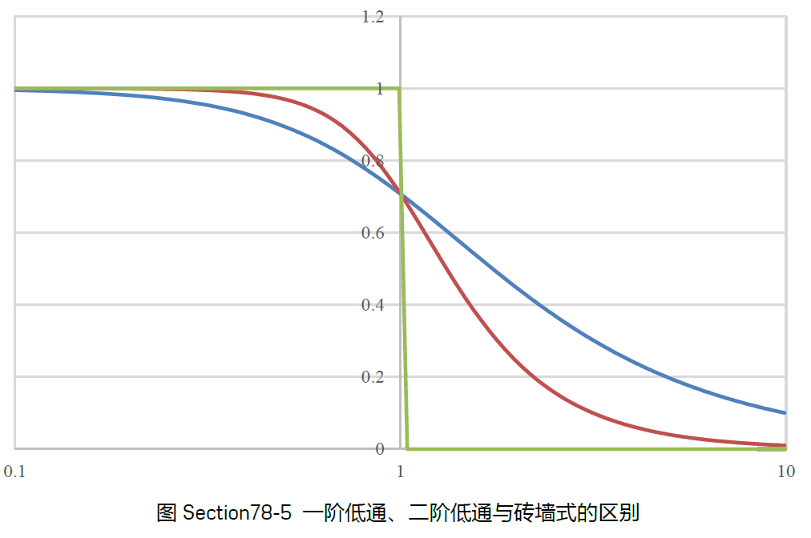

### 零极点和特征频率

滤波器的上下限截止频率是电路设计中要关注的重点，计算中，当增益的模变成中频增益的$\frac{1}{\sqrt{2}}$也就是0.707时，对应频率称为截止频率。

特征频率则是使得传递函数最简单的点，通过引入特征频率点，可以给滤波器分析带来极大方便：**当且仅当实际滤波器类型为巴特沃斯滤波器时，截止频率等于特征频率**。

> 截止频率等于特征频率，这是巴特沃斯滤波器的判定条件。更精确的判定方法要用到品质因数Q

我们可以通过基于传递函数的计算来确定**特征频率**取值

对于一、三阶等奇数阶滤波器，传递函数分母上实部和虚部相等$\sigma=\omega$的频率点称为特征频率，对应相移为±45°和±135°。对于二、四阶等偶数阶滤波器，传递函数分母上实部为0或虚部为0的频率点称为特征频率，对应相移为±90°和±180°

考虑极端情况：在窄带通滤波器增益最大处，或相移为$2\pi$的整数倍时的频点，称为中心频率$f_c$，对应传递函数分母为0的情况，即传递函数的**极点**。在陷波器的增益最小处，或相移为$2\pi$的整数倍时的频点，称为中心频率$f_c$，对应传递函数分子为0的**零点**。当然，这都是理想情况，实际滤波器中永远无法出现零点和极点

> 传递函数是复频域的表达式，因此具有复频域特色的零点和极点：将传递函数写成多项式相乘的形式
> $$
> G(s)=\frac{C(s)}{R(s)}=K\frac{(s+z_1)(s+z_2)\cdots (s+z_m)}{(s+p_1)(s+p_2)\cdots (s+p_n)}
> $$
> 其中s取z的值时能够使传递函数等于0，每个z都是传递函数的一个零点；p是分母多项式的根，称为传递函数的极点
>
> 一般地，z和p可以是实数也可以是复数，在复数情况下必定成共轭出现

### 同相输入低通滤波器

首先来看简单一阶LPF。对于一阶电路，一般只使用一只电容来提供表达式内的s。可以基于一阶RC电路得到传递函数
$$
\frac{1}{Ts+1},T=RC
$$
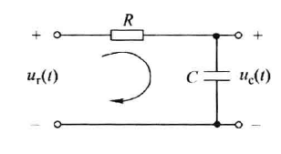

如何把他改成有源滤波器？一个直接的想法是在后级接入一个电压跟随器，形成如下结构：

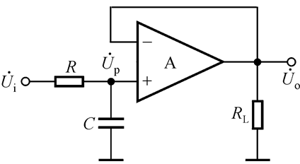

为了利用运放的增益特性，可以将电路改成下面这样

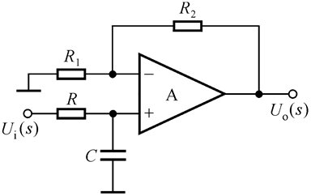

有传递函数
$$
A_u(s)=(1+\frac{R_2}{R_1})\frac{1}{1+RCs}
$$
可见它属于一阶电路

这就是**简单一阶LPF**

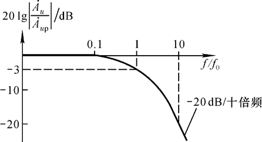

具有上图这样的幅频特性
$$
A_u=\frac{A_{up}}{1+j\frac{j}{j_p}} \\
f_p=\frac{1}{2\pi RC}
$$
将上述电路的正相输入端改成二阶RC电路，就能获得简单二阶LPF如下

幅频特性

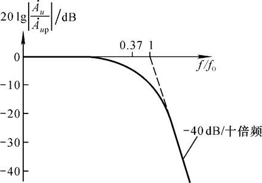
$$
(1+\frac{R_2}{R_1})\frac{1}{1-(\frac{f}{f_0})^2+3j\frac{f}{f_0}} \\
特征频率f_0=\frac{1}{2\pi RC} \\
截止频率 f_p \approx 0.37f_0
$$
这个电路虽好，但是它的过渡带还是不够窄，于是我们进行下面的改进，引入一个稍弱的正反馈，制成**压控电压源二阶LPF**

图像就舒服多了

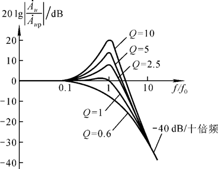

这个电路早在1955年就已经出现，由美国的Sallen和Key发表在IRE Transactions on Circuit Theory上，因此被称为SK型单位增益低通滤波器

### 反相输入低通滤波器

这个电路就是在积分运算电路基础上改进而来

具有幅频特性
$$
A_u=-\frac{R_2}{R_1}\frac{1}{1+j\frac{f}{f_0}} \\
f_p=f_0=\frac{1}{2\pi RC} \\
A_{up}=-\frac{R_2}{R_1}
$$

由于本电路具有180度反相特性，就导致相频特性为超前
$$
\phi(f)=\frac{\pi}{2} -tan^{-1}\frac{f}{f_0}
$$

### 高通滤波器、带通带阻滤波器的对偶性

高通滤波器与低通滤波器对偶，将LPF的电阻电容互换后即可得到简单一阶HPF、简单二阶HPF、压控电压源二阶HPF电路等，下列电路给出了一阶反相高通滤波器的结构

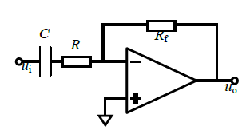

带通滤波器只要使用LPF和HPF组合即可

* LPF与HPF**串联**得到**带通滤波器**

    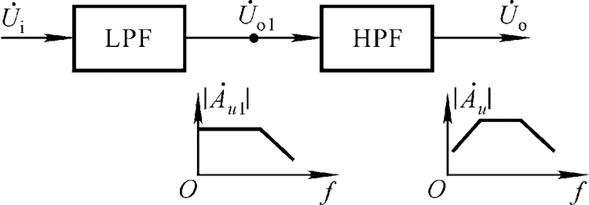

* LPF与HPF**并联**得到**带阻滤波器**

    

还可以将**低通环节加在负反馈通路来实现高通**，本质上和之前讲述的逆运算实现一样。但是这样制成的滤波器就属于**状态变量型滤波器**

> 很多时候模拟运算电路和有源滤波器的拓扑结构很像，但是一定要记住：运算电路针对信号时域变换；有源滤波器针对信号频域变换，二者在参数选择上往往具有较大区别

### 二阶滤波器的幅频特性

上面介绍了简单一阶滤波器以及如何在其基础上进行改动，获得简单二阶滤波器。实际应用中，往往需要更高阶的滤波器，而高阶滤波器可以由一阶和若干个二阶滤波器级联组成，需要专门对二阶滤波器进行计算分析，因此本部分重点介绍二阶滤波器的基础知识

首先来看二阶低通滤波器的传递函数
$$
A(s)=\frac{m_0+m_1 s+m_2 s^2}{1+n_1 s+n_2 s^2},n_2 \neq0
$$
其频域增益表达式
$$
A(j\omega)=\frac{(1-m_2 \omega^2)+jm_1 \omega}{(1-n_2 \omega^2)+jn_1 \omega}
$$
引入特征频率$\omega_0$，规定$\omega_0=\frac{1}{\sqrt{n_2}}$

对上式进行化简得到
$$
\dot{A}(j\Omega)=\frac{d+bj\Omega+c(j\Omega)^2}{1+aj\Omega+(j\Omega)^2},\Omega=\frac{\omega}{\omega_0}
$$
得到相对频率$\Omega$，它是一个无量纲的数值，代表当前输入频率与滤波器特征频率的比值。可以发现原本频域增益是和输入频率强相关的，但现在我们将特征频率归一化成相对频率变化，从而让二阶滤波器的研究更加简单。

当信号频率等于特征频率时，在数学上会出现二阶低通滤波器$\Omega=1$的情况。此时二阶低通滤波器的分母实部为0，只存在虚部，这是全部频率范围内唯一出现的。在特征频率频率处，增益的模变为
$$
|\dot{A}(jf_0)|=A_m \frac{1}{a}
$$
我们定义**品质因数Q**：特征频率处的增益的模，除以中频增益$A_m$
$$
Q=\frac{|\dot{A}(jf_0)|}{A_m}=\frac{1}{a}
$$
将这个定义代入二阶低通滤波器的传递函数，进一步归一化整理后得到频率表达式
$$
\dot{A}(jf)=A_m\frac{1}{1+\frac{1}{Q}j\frac{f}{f_0}+(j\frac{f}{f_0})^2}
$$
带入角频率即可获得幅频特性
$$
\dot{A}(j\omega)=A_m\frac{1}{1+\frac{1}{Q}j\frac{\omega}{\omega_0}+(j\frac{\omega}{\omega_0})^2}
$$
当改变品质因数时，二阶滤波器将获得不同的性质，如下表所示

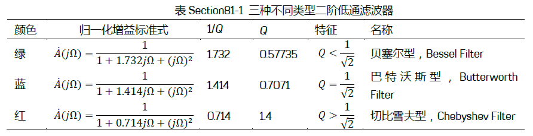

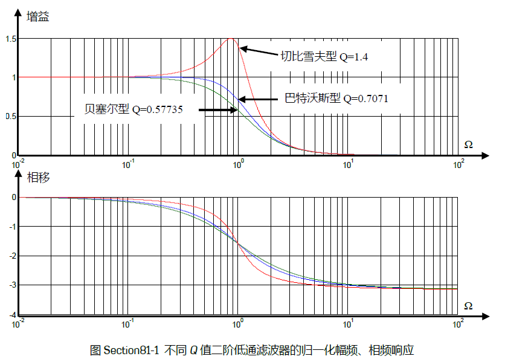

而二阶高通滤波器与之具有对偶的归一化标准式
$$
\dot{A}(j\omega)=A_m\frac{(j\frac{\omega}{\omega_0})^2}{1+\frac{1}{Q}j\frac{\omega}{\omega_0}+(j\frac{\omega}{\omega_0})^2}
$$

感谢你看到这里，现在你已经了解了简单一阶和二阶放大器的基本原理。本篇受于篇幅和基础知识，暂且搁置状态变量型滤波器的介绍，等到反馈和频率响应部分完成后再继续介绍。
