本篇博文的参考教程包括https://zhuanlan.zhihu.com/p/608306619、TI技术词典、https://zhuanlan.zhihu.com/p/437870529

# 看datasheet从入门到入坟

看datasheet是硬件佬的基本工，但看的速度和知识迁移能力就是体现一个硬件人技术积累的关键之处了。这里结合自身理解来介绍一些看datasheet的要点

## 为什么要看

1. 器件选型

    datasheet和官网的工具是两个选型的最好手段。

    > 或许以后会有AI选型，但目前ChatGPT的选型还只能作为辅助手段

    器件选型阶段读datasheet要遵循*先宽后严*的原则筛选器件：第一轮进行初筛，从备选型号中拿到参数符合需求的器件，筛去能满足关键特征指标但与产品需求不符或性价比过低的芯片；第二轮复筛，从备选器件中选择指标最优的作为上板器件

2. 原理图设计

    需要参考datasheet才能得到器件的电器性能指标和工作条件，并且要从参考设计中找出外围器件的要求，加入自己产品的设计

3. Layout

    需要参考datasheet、参考手册、参考设计中的布局布线示例部分才能做好Layout的设计

4. 参数仿真和优化

    参数仿真过程中，需要根据datasheet中标注的电器特性制作SPICE模型或传递函数模型，从而完成仿真；物理仿真中还需要根据datasheet中标明的热设计参数和封装尺寸制作模型来进行仿真；参数优化则需要根据datasheet中的电气性能曲线进行调试

## 什么值得看

**数据手册**（datasheet）：硬件设计最重要的手册，器件的电气和物理规格都在里面。后面的内容都是介绍该怎么看它

**参考手册**（reference manual/User Guide）：分成**白皮书**、**硬件参考手册**、**软件参考手册**、**用户指南**等。白皮书就是广告或者宣传单，一般不需要看。硬件参考手册一般会给出Layout方面的指导，有些BGA芯片还会提供SIPI方面的信息，布线老哥需要重点关注，但专门做硬件原理图的人一般就不需要看了。一般认为软件参考手册是给软件或者FPGA开发者看的，但硬件工程师在做BSP的时候也需要用到，不过不需要全部看完。用户指南概念比较宽，一般软件和硬件人都要看一看才行

**参考设计**（reference design/application）：抄作业用的demo，有些很常见的情景不用动脑直接抄就行

**评估板说明**（eval board user guide）：也是抄作业用的，直接开抄

## 怎么看

### 从哪找datasheet

一般有三种渠道找芯片的datasheet：

1. 原厂官网：芯片厂商官网直接搜索器件型号就能找到，或者使用官方的选型工具

    > 一般来说官网会给出一个选型工具，有些只是一个能筛选器件参数的搜索器，有的则是像TI的webench那样的选型-参考一体化工具，抑或是Xilinx的DocNav那样的一站式搜索软件

2. 第三方网站：比较常见的有**Alldatasheet**和**半导小芯**。alldatasheet上面芯片比较全，而且会收录同一种芯片的所有厂家资料，老硬件人严选；半导小芯的datasheet库还在更新，但大部分常见器件都是有的，而且支持手机app，还支持器件参数筛选、替代芯片查找等功能。个人习惯是先用半导小芯查（甚至都懒得去原厂网站），如果找不到就去alldatasheet

3. 从器件丝印反向查找

    一般做逆向工程时候很常用[芯片丝印反查网](http://www.smdmark.com/)这个站，有时候用嘉立创直接搜丝印也有奇效

> 其实还有一种方法：从选型老哥那边直接抢pdf，但我是被抢的那个，所以不推荐这个方法

### 怎么快速读datasheet

最基本的技巧肯定是**多读**！只要过了四级，读datasheet应该就不算事，遇到不懂的直接查词就好。提高自己英语水平肯定是不亏的。

> 当然，读英语肯定不如读中文爽，不过在读中文datasheet的时候很可能会遇到翻译错误的问题，导致设计出错就得不偿失了——当然，直接使用国产芯片，读原厂中文手册也不是不行

datasheet和英语论文不一样的一点就是它是成套路的，你读过一种器件的手册（前提是**每个参数都搞清楚意思**）以后，其他厂家的同型器件也基本都能理解，之后再读就从*阅读*变成了*比较*，可以快速提高阅读速度

但说到更快地读甚至不读，这就要请出AI了。

首先是AI翻译软件：**DeepL**，支持pdf快速翻译，非常方便；**有道云词典**也是一个不错的替代品，有划词翻译功能

配合AI中的顶级NLP工具：**ChatGPT**，可以达到一分钟两篇datasheet的阅读速度，极其适合器件选型

只需要输入`推荐三款xxx方面的备选芯片`的prompt，ChatGPT会自行给出或编造出至少三款可用的芯片（前提是芯片年份在2021年之前，因为ChatGPT的训练集来自2021年前的搜索引擎），你只需要找出它们的datasheet并大致分析需求就可以完成选型

如果输入`我需要一个用于xxx场景的芯片，请总结以下来自xxx芯片数据手册的段落，给出它符合场景需求或不满足需求的重点参数：xxxxxx`的prompt，在后文附上一整段数据手册原文，就可以让ChatGPT自行总结关键点，完成筛选

整个阅读流程可以被简化成：ChatGPT推荐-人工找datasheet初筛-复制粘贴原文给ChatGPT总结-人工阅读复筛。中间的所有内容都可以用中文提问，也可以用AI从英文翻译回中文进行筛选，最快速度10分钟就能够筛出十几款芯片

> 注意：不要尝试用ChatGPT查找未知芯片的datasheet，也不要轻易相信ChatGPT。这只是一个用于问答的AI，它输出的回答只取决于上下文逻辑，所以**应当让它做一些总结文段、汇总信息相关的工作**

## 都看什么

绝大多数芯片的数据手册格式都很固定，大体分为几个章节：

* **器件特性**（Features）和**应用场合**（Applications）

    宣传器件表现比较好的规格，描述一下器件的用途和目标市场等。这两部分内容就是为了让开发者能快速筛选到自己需要的芯片而编写

    对器件选型很重要，但是如果要进行参数优化，务必到正文中查询，不要被部分*虚假宣传*骗了

    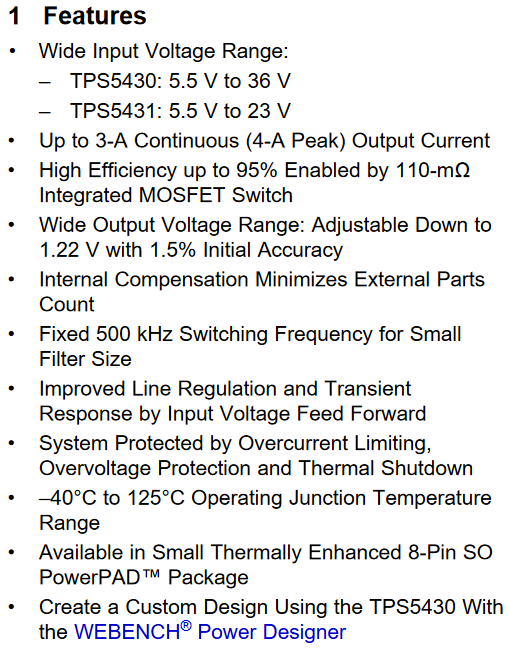

    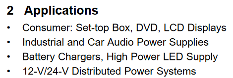

    有些厂商会把自己家的工具广告放在这里，可以部分忽略

    应用场合是一个经常被忽视的章节，但其实可以用它来进行“大面”的器件筛选——如果要应用在机器人、消费电子上，就可以不看带“仪器仪表”或“通讯设备”字样的器件；如果要应用在汽车、大功率设备上，就可以忽略标注“医疗设备”字样的器件。这可以为选型节约大量时间

* **引脚定义和功能**（Pin Configuration and Functions）

    一般会给出器件的引脚图，有些厂商会标明每个引脚的性能指标和它们的用途

    一定要仔细看，不少容易忽略的设计注意事项也写在这里，弄错引脚顺序也是最常见的设计失误之一

    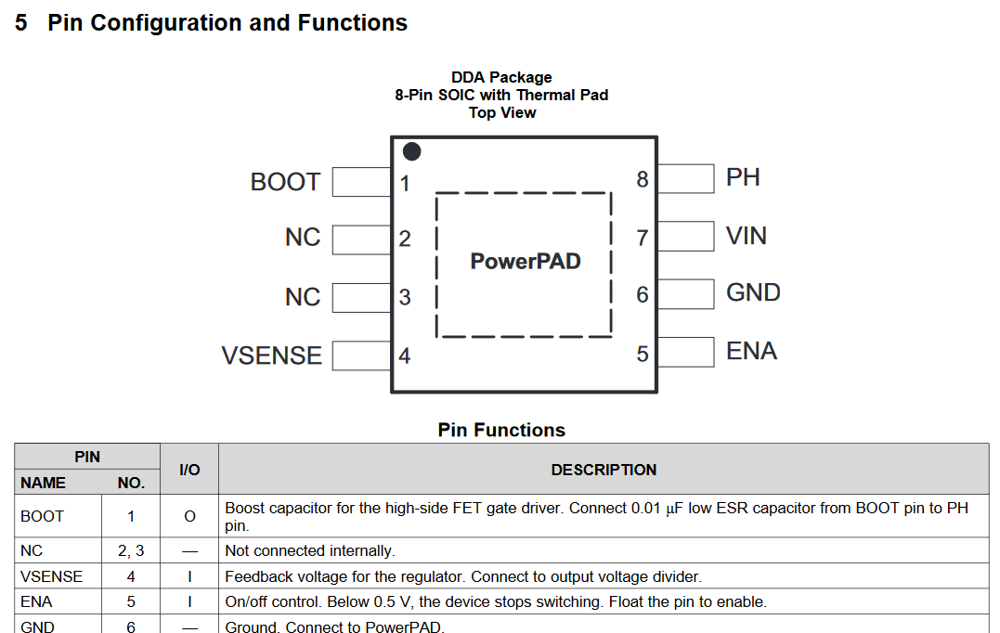

    封装上的bug是最难处理的，画错封装那就得飞大线喽

* **基本信息**（Description）

    一段介绍性的产品信息，和特性简介结合起来看就可以

    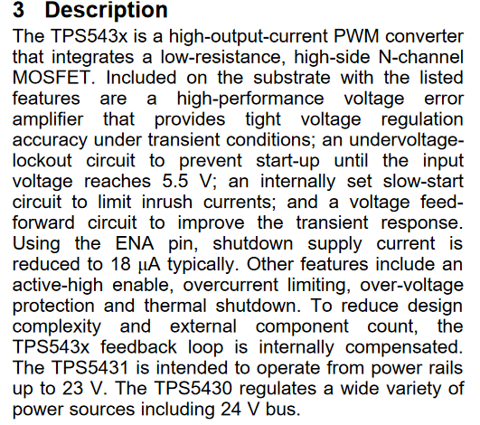

    有些厂商会把器件的小版本（不同封装尺寸/电流/电压）或重要的图表放在这个位置，一定要仔细查看具体的器件有货没货

* **器件极限参数**（Absolute Maximum Ratings）和**警告**（Caution）

    因为一般都很短，所以**很容易被忽略**，不仔细看很容易设计出错，而且一旦出错就大概率烧器件

    > 电源芯片的EN脚问题算是典中典了：有些芯片EN脚内部加了钳位，耐压远小于VIN；而另一些芯片的EN和VIN可以接在一起，如果搞错了那上电直接暴毙

    设计过程中一定要遵循这一部分的极限参数，警告中提及的事项也要认真遵循

    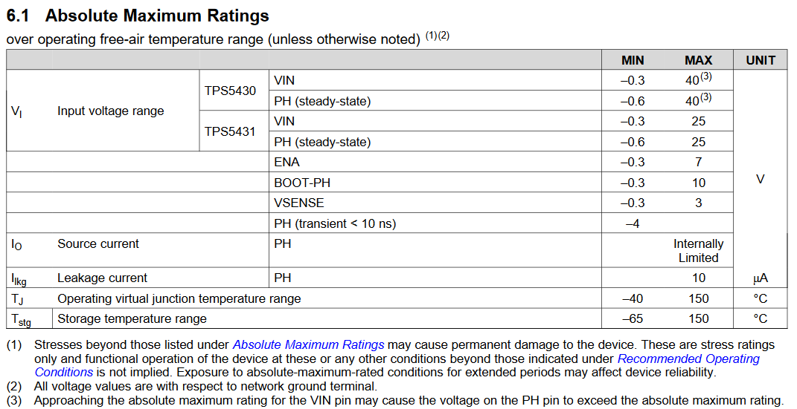

    有些小厂和老器件datasheet会把这个部分和后面的电气特性合并，器件参数优化时候需要注意

* **ESD等级**（ESD Rating）

    研发阶段一般不太关注，但需要把这个内容**传递给供应链**。ESD情况可能在产品的后续国标审核中起作用

    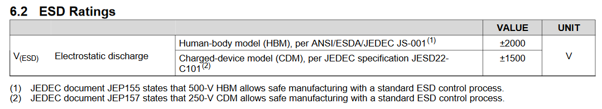

* **推荐使用环境**（Recommended Operating Conditions）

    实际上就是芯片的正常工作环境，如果超过范围的话芯片可能能用，但厂商不保证性能和datasheet标注是否一样

    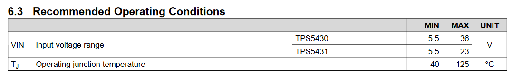

* **热参数**（Thermal Infomation）

    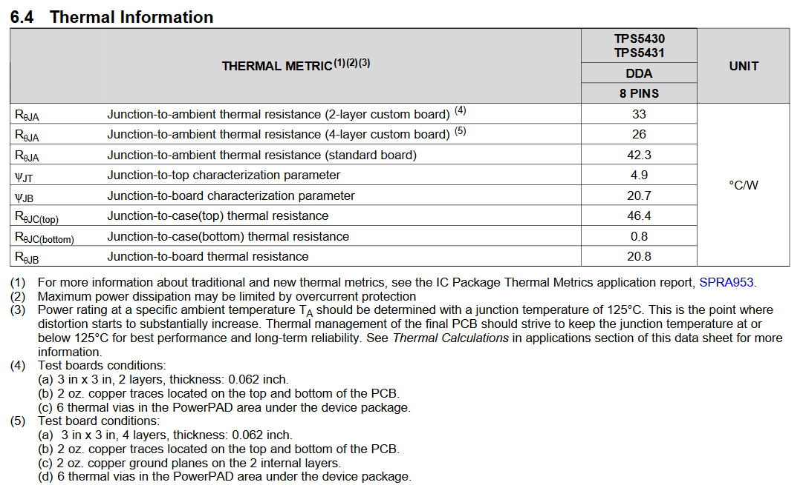

    对以前老封装需要关注一下（不关注可能会烧片），新一代封装大多加强了PCB散热途径，热阻就没有太大用处了，但可以用来快速评估芯片的热设计裕量

    > 新封装的热设计焊盘可能会在这个部分给出规格，需要注意

* **电气特性**（Electrical Characteristics）

    元件的主要电气特性都写在这里了，**务必注意表头上的测试条件**，没有限定条件的数据是没有意义的

    **作为硬件工程师一定要搞明白这些表格里所有参数所代表的意义**

    > 新手肯定对每一项都不懂，这时候就需要查看厂商提供的**技术词典**或者**参考手册**了

    遇到设计性能不达标的情况，复盘设计时大概率在这里找到答案。如果说嵌入式开发者的噩梦就是kernel panic，那硬件开发者的噩梦就是电器特性出错

    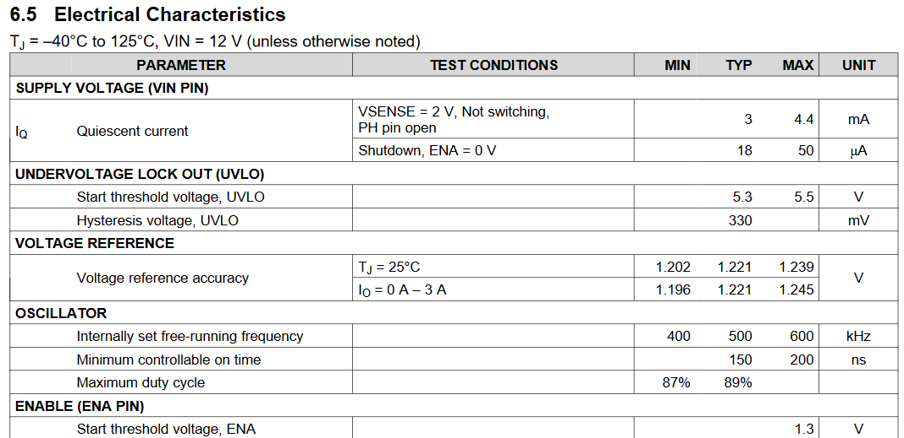

* **典型特性图**（Typical Characteristics）

    和表格一样难顶的东西，很多工程师不喜欢看，所以厂商也经常把一些不太想让你知道的特性藏在这里面

    > 最经典的一个藏就是：结温过高导致器件性能下降，对很多模拟器件来说在常温下表现非常好，但结温一高就开始拉跨。还有很多电源芯片会把自己的x轴拉的很长，假装噪声非常小的样子

    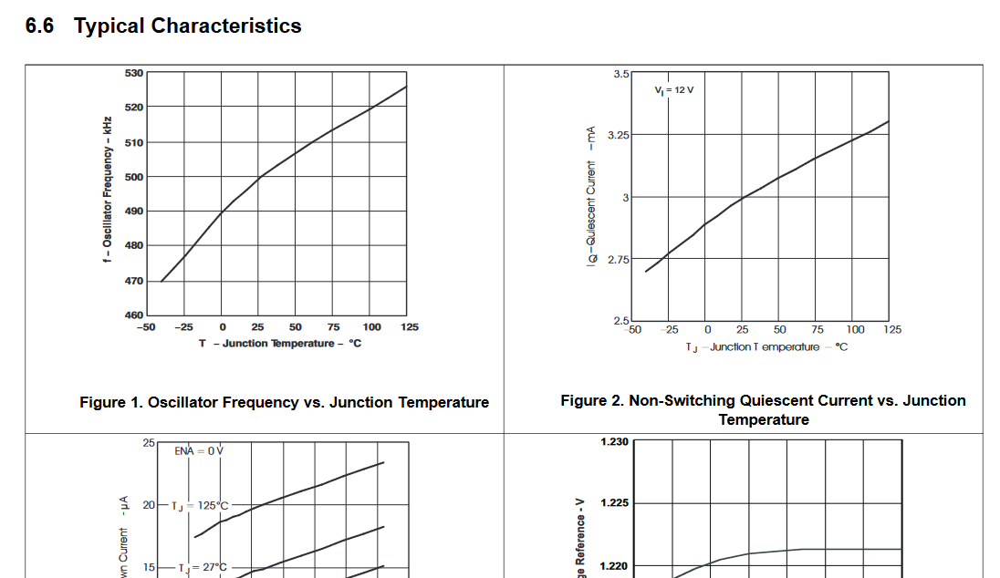

    基本可以把这个章节当作淘宝的差评区来看，能排除掉不少看起来很好实际不符合需求的芯片

* **详细介绍**（Detailed Description）和**结构框图**（Functional Block Diagram）

    一般包含了详细的器件功能说明和器件内部电路结构的框图，**非常长，但必须看完**

    很多需要软件参与的器件，寄存器配置也在这里面，这时候写底层BSP的工作就要结合这一段内容来了

    不过像是三极管、运放这些基础的模电器件都不会包含这些，相反要尽可能读明白电气特性

    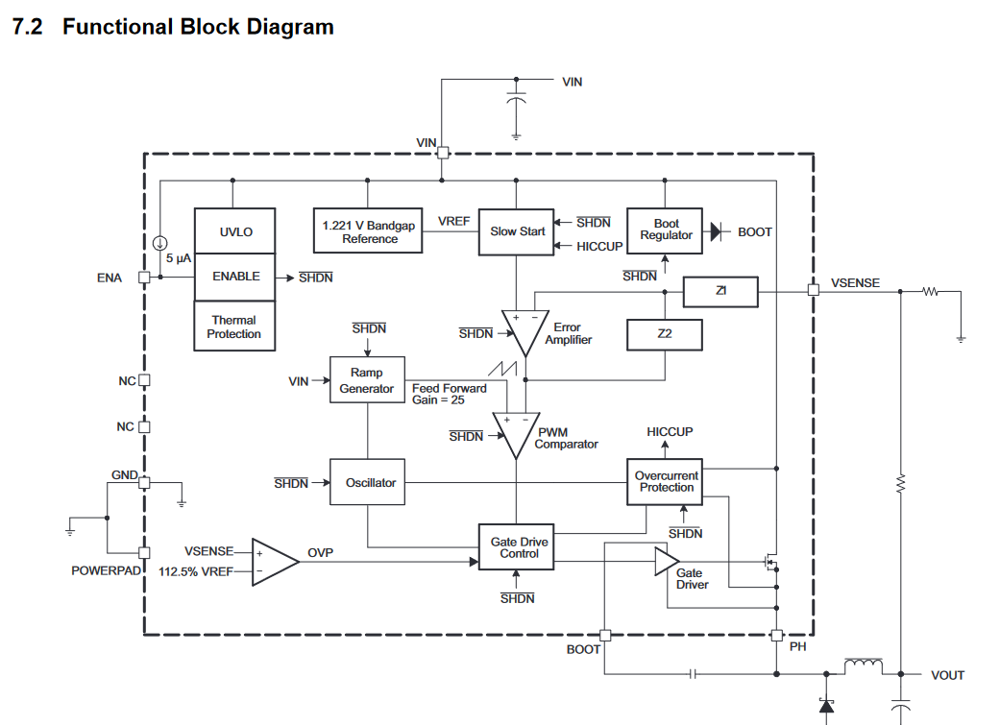

* **应用说明**（Application Information）和**典型应用**（Typical Applications）

    一般会举一些典型设计，提供一个*可以用*但肯定*不好用*的参考电路，很多设计技巧和细节也会在这里讲

    **在原理图设计和Layout的时候都需要重点关注**

    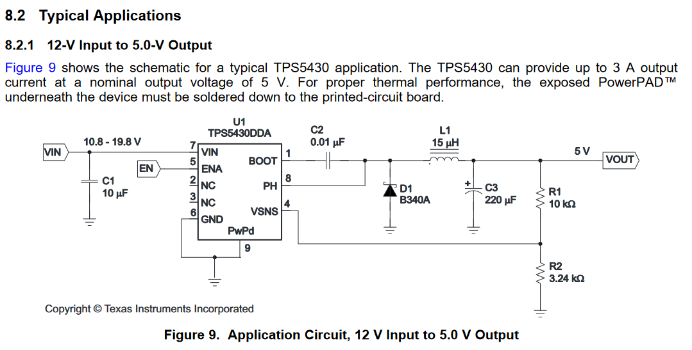

* **外围器件选型标准**（Components Selection）

    一般会提供上面参考设计中关键外围无源/有源器件的选型标准，尽可能按照推荐的封装、器件型号、器件特性来选择外围器件，如果要自行选型，也要分析清楚原厂推荐器件和自己的选型之间区别和优劣

    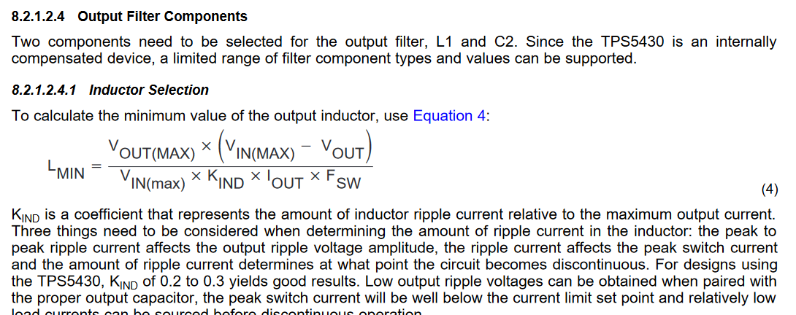

* **应用性能曲线**（Application Curves）

    提供上面参考设计中器件的实际性能表现。因为原厂都会在实验室条件下测出结果，所以一般都比拿到手自己测的结果好一些，但不会太离谱（一般厂商不会在这里虚假宣传）

    如果使用和典型设计一致的原理图，但自己的电路和厂商提供的参考性能表现出入太大，就要仔细阅读电气特性、详细介绍章节并考虑重新Layout了

    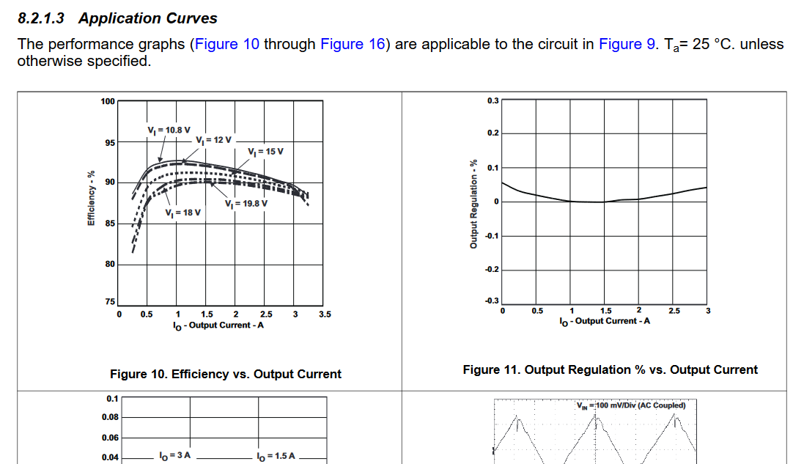

* **器件布局布线指导**（Layout Guidelines）

    Layout民工最喜欢的一章，大部分厂商提供的参考Layout都是靠谱的，照抄就可以得到和参考设计差不多的性能表现，但不排除某些厂商（包括但不限于圣邦微）给的Layout太拉跨导致不如自己Lay。

    在画PCB阶段还是需要仔细看的

    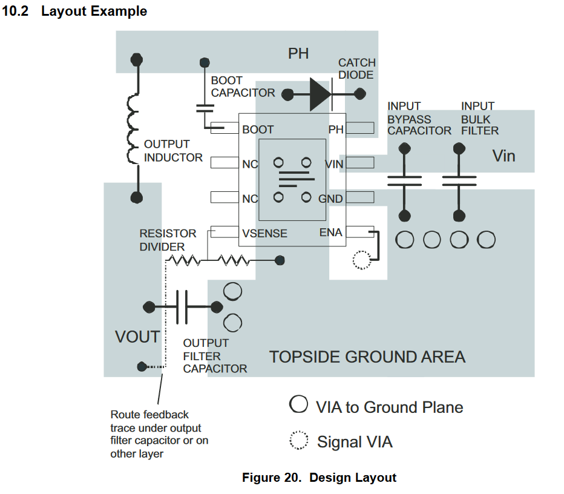

* **机械结构、包装和订货信息**（Mechanical, Packaging, and Orderable Information）

    绝对不能忽略的部分，一旦出错就不仅仅是板子问题了，还可能导致结构工程师、采购、售后AFE等线下pvp

    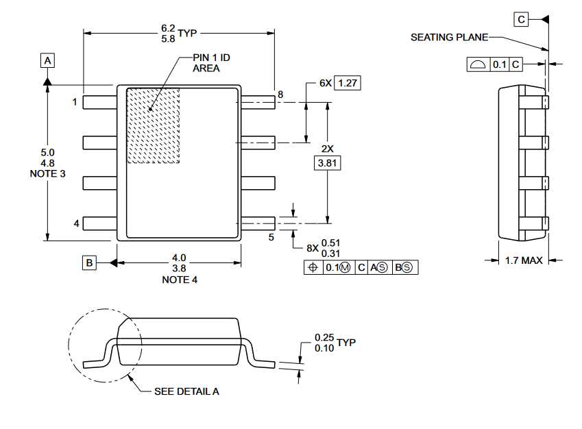

    其中参考焊盘规格是画封装必须的，不看的话连PCB都画不了

    > 一般来说厂商会给出PADS、Allegro友好的参数，可以用PCB footprint expert工具绘制焊盘后导出到各种工具

    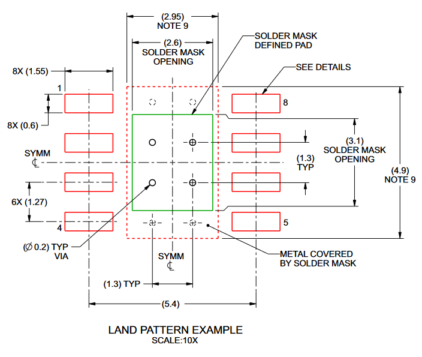

* **参考文档**（References）

    大部分情况下不用看，但对于MCU等器件，有参考文档就可以直接跳转到寄存器参数手册、软件手册、Layout手册等等相关手册中
