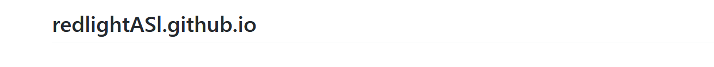
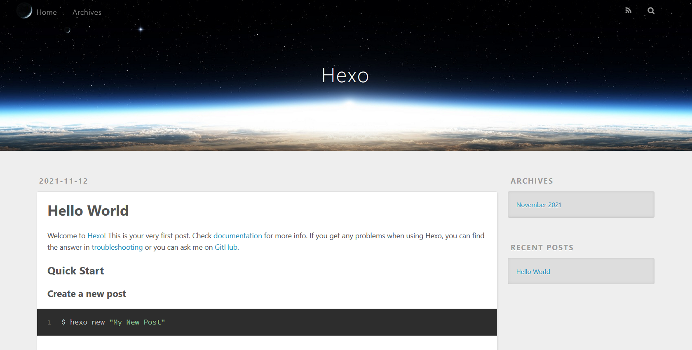

# 基于Hexo搭建个人博客过程记录

某个高中同学最近搭了个很炫酷（二刺螈浓度巨高）的个人博客

于是有点眼馋

再加上CSDN越来越拉跨，现在钱都不发了，于是直接一波转移阵地。先在博客园传了点备份，但是页面是上世纪风格......还要改主题才能行，我一个臭焊工哪学过html、css、js这些高端东西，最多就会一手看控制台。看隔壁有julao用Hexo搭了一个博客，百度了一下发现不用配置太多东西，而且用node配置——这玩意在我放弃当码农之前尝试过——于是准备上一波黑车

专门开个文档记录一下搭建个人博客的流程，为后来者提供方便

## 硬件平台选型（误）

搭之前首先要选择合适的硬件平台——网站当然要找个服务器部署了

阿里云华为云转了一圈感觉都太贵，然后发现了可以白嫖的**Github Pages**

每个Github账户都可以开一个自己的*静态网站*，域名设置为``<用户名>.github.io`，于是就可以用这个功能

> 静态网站就是用html写的可以一次编写部署的网站，服务器只提供静态内容，无需执行服务器端脚本
>
> 静态网站的缺点就是有一些功能上的限制，不能运行php和asp，不能自动读写站内的文件，不能实现物联网（硬件人哭惹）

首先进github，开个账号，我有账号了，所以跳过

然后新建一个库，命名为``redlightASl.github.io`，里面新建一个README文档，其他就不用写了

建完后，访问`https://redlightasl.github.io/`即可看到网页了



整个网站在github服务器上跑，所以硬件平台选型结束。接下来就是安装Hexo并部署到github的服务器上了

## 安装并部署Hexo

这里我使用了WSL来安装hexo，因为在linux上部署比较方便，但是我的主操作系统是windows系统

这样更方便一些

首先安装node和npm包管理器，我已经安好了，如果没安好，直接

```shell
sudo apt install nodejs
sudo apt install npm
```

然后

```shell
npm install hexo -g
```

来安装hexo

为了测试安装是否成功，随便部署一个helloworld网页看看

随便找一个目录，

```shell
hexo init blog
cd blog
npm install
hexo s
```

然后浏览器打开`http://localhost:4000/`就可以看到页面了



### 简单理解一下Hexo的思路

并不懂网络编程知识的非知名带学生红光这样理解Hexo：

> 一个用于搭建博客的make工具
>
> hexo init以后，会在目录下生成下面这些文件
>
> * _config.yml：博客的配置文件
>
>     相当于Makefile，hexo读入这个文件里的配置来实现对应功能
>
> * package.json：已安装插件的配置目录
>
>     npm安装包以后会自动更改这个文件，hexo就可以获取当前可用的插件信息
>
> * node_modules：hexo的nodejs依赖
>
> * scaffolds：一些文件模板
>
> * source：源文件目录
>
>     这里面的文件都会被加入博客，有点像编译时指定的源文件目录
>
> * themes：博客主题包
>
>     如果使用主题需要把对应的主题加入这个目录然后在_config.yml里面进行设置；这个结构有点像cmake的component机制，相当于hexo把主题和用户的文件统一编译


