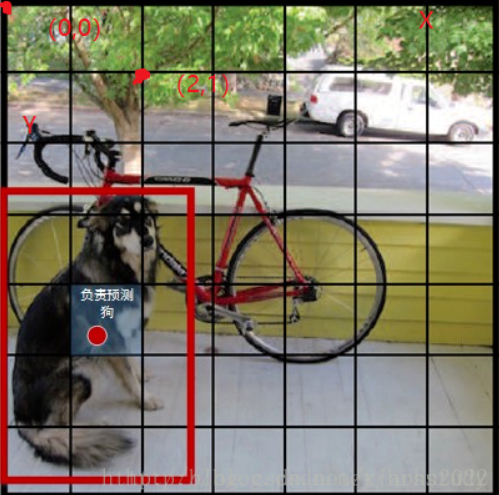
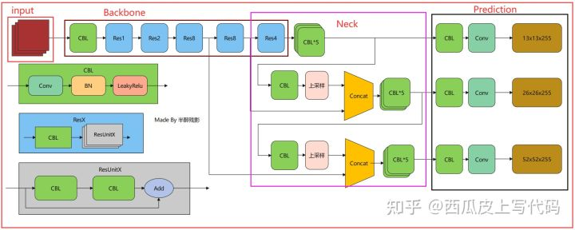
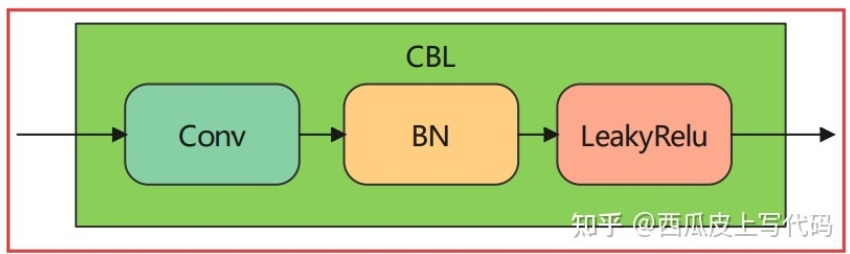
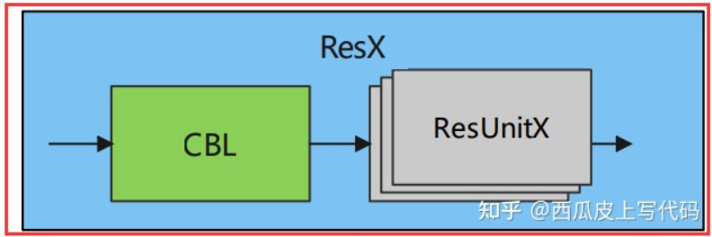
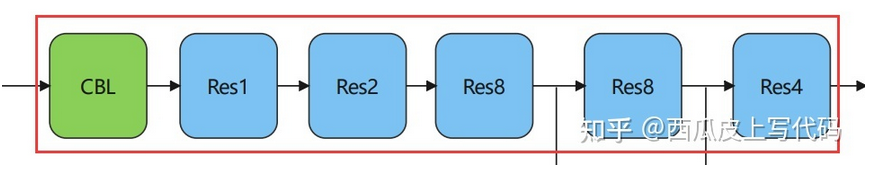

# 基于PyTorch部署YOLO算法

本篇博文主要参考[Github开源代码](https://github.com/bubbliiiing/yolo3-pytorch)及对应教程总结

参考教程列在最后

## YOLO算法原理简介

YOLO即**You Only Look Once**算法，到目前为止共有五个基本版本：从YOLO到YOLOv5，除此之外还有一些系列衍生版本，比较出名的就是旷视科技的YOLOx

其最大的特点是**运行速度很快**，可以用于实时系统——这一点和古老的RCNN算法相反，RCNN虽然很准但是太慢了

### YOLO基础原理

对于目标检测任务，一直以来有两个流派：一个思路是将其分解为两个任务，先找到图片中某个存在对象的区域，然后再识别出该区域中具体是哪个对象，对于对象识别问题可以由很多经典的CNN算法完成，但对于寻找图像中目标所在区域却不好实现。一个最简单的想法就是遍历图片中所有可能的位置，逐一检测其中是否存在某个对象，挑选其中概率最大的作为输出——显然效率低得离谱

后来Fast RCNN/Faster RCNN出现了，先从图片中选出这些**候选区**（Region Proposals），再对其中的对象进行识别，最后还需要对候选区进行微调来让它们更接近真实的bounding box，这个过程称为**边框回归**。循规蹈矩的遍历-回归也正是它慢的原因。虽然Faster RCNN能将图片识别加快到5帧，但显然完全没有办法适应工业环境

> 早期的Tow-Stage类型的算法（大都基于RNN实现）大都有这个痛点

另一个思路的One-Stage类型算法则认为可以将目标检测看成一个任务，作为其中代表性算法的YOLO被提出解决了工业应用的问题

YOLO提出了新的解决方法：**将目标检测看作独立的一个任务**，也就是只要看一眼就能知道对象和它们的位置。不过YOLO还是借鉴了候选区的逻辑，将它内含于特性**单元格**（Grid Ceil）中，从而将一幅图片大致分成很多区域，挨个区域寻找。同时YOLO也使用了预定义的**先验框**（Prier Box）来近似边框回归的过程。

一幅图片被划分成很多**单元格**（Grid Ceil），**每个单元格负责去检测那些中心点落在该格子内的目标**，如下图，狗的中心点位于红点所在单元格，该单元格负责预测这个狗，每个单元格会预测周围的复数个边界框，并获取对应边界框的置信度（Confidence Score），置信度包含两个方面：*所预测边界框含有目标的可能性大小*$Pr(object)$和*对应边界框的准确度IOU*。

> YOLO的一个原则就是“*对自己负责*”：一个Object只由一个grid来进行预测，不要多个grid都抢着预测同一个Object。更具体地说就是在设置训练样本的时候，样本中每个Object归属到且仅归属到一个grid，即使有时Object跨越了几个grid，也仅指定其中一个。具体就是计算出该Object的边界框的中心位置，这个中心位置落在哪个grid，该grid对应的输出向量中该对象的类别概率就是被定为1（该gird负责预测该对象），所有其它grid对该Object的预测概率设为0（不负责预测该对象），这样既满足了*条件概率（下面会谈到）*，也能实现目标检测任务的精准划分

边界框的准确度可以用预测框与**实际框**（Ground Truth）的**IOU**（Intersection Over Union，**交并比**）来表征

> 当对应边界框是背景，不包含目标时，$Pr(object)=0$；当边界框包含目标时，$Pr(object)=1$，这是一个二值函数。说人话就是如果边界框里面有目标的中心点，则设置$Pr(object)=1$，否则设为0
>
> IOU表征了预测的Bounding Box与真实框Ground Truth的接近程度，这个IOU是在训练阶段计算的，用来让模型收敛
>
> IOU=交集部分面积/并集部分面积，2个框完全重合时，IOU=1，不相交时IOU=0

综合上述因素，可知YOLO输出的总置信度本质上相当于一个条件概率$P(C_i|object)$，其中object表示该单元格内含有目标的可能性大小，$C_i$表示该单元格内物体是$C_i$这个种类的概率，最后可以得到$置信度Confidence=Pr(object)*IOU$



完成了单一划分单元格的预测还不够，因为实际物体有大有小，YOLOv1、v2的缺陷就在于难以预测小物体，于是从YOLOv3开始就引入了多重Scale的概念。它通过对图像下采样建立一个图形金字塔来实现针对大、中、小号物体的检测：比如一张416x416像素的图片，可以将其分成大单元格组成（每个格子是52x52像素，共有个8x8个框）、中单元格组成（每个单元格是26x26像素，共有16x16个框）、小单元格组成（每个单元格是13x13像素，共有32x32个框）的三种**特征图**（Feature Map），对每个特征图进行分析从而更完善地实现目标检测

对于多重Scale，目前主要有以下几种主流方法，如下图所示：


(a) 这种方法最直观。首先对于一幅图像建立图像金字塔，不同级别的金字塔图像被输入到对应的网络当中，用于不同scale物体的检测。但这样做的结果就是每个级别的金字塔都需要进行一次处理，速度很慢。

(b) 检测只在最后一个特征图上进行，这个结构无法检测不同大小的物体。

(c) 对不同深度的特征图分别进行目标检测。SSD中采用的便是这样的结构。缺点在于每一个特征图获得的信息仅来源于之前的层，之后的层的特征信息无法获取并加以利用。

> SSD算法采用了这样一种思路：特征层（Feature Layer）的大小随层数不断增加而逐渐减小，并且每产生一个特征层，都会对这一层进行目标检测，然后所有的检测结果都会被Fast NMS合并筛选，最终生成最后的bbox。它的原本思路是在不同深度的特征图获得后，直接进行目标检测，这样小的物体会在相对较大的特征图中被检测出来，而大的物体会在相对较小的特征图中被检测出来。这样的结构有助于检测到不同大小的物体，但是会忽略下一层可能得到的增殖特征。在实际的特征图中，深度不同所对应的特征图包含信息不是绝对相同的。随着网络深度的加深，浅层的特征图中主要包含低级的信息（物体边缘，颜色，初级位置信息等），深层的特征图中包含高等信息（例如物体的语义信息：狗，猫，汽车等等）。因此在不同级别的特征图中进行检测，听起来好像可以对应不同的Scale，但是实际上精度并没有期待的那么高。

(d) 与(c)很接近，但有一点不同的是当前层的特征图会对未来层的特征图进行上采样并加以利用。这是一个有跨越性的设计，因为有了这样一个结构，当前的特则会概念图就可以获得“未来”层的信息，从而让低阶特征与高阶特征有机融合，提升检测精度

YOLO先通过特征提取网络对输入图像提取特征，得到三种大小的**特征图**（Feature Map）：**52x52**、**26x26**、**13x13**，然后对应分出52x52、26x26、13x13个**grid cell**，如果某个目标的中心位于哪个grid cell里，就由对应的grid cell来预测目标的种类，YOLO要求每个grid cell都会预测*固定数量*的**边界框**（Bounding Box），只有和IOU最大的边界框才能用于预测对应目标

> YOLO就是用了(d)思路，YOLOv3将采样网络的最后三层输出分别使用上采样网络和Concat进行连接，进一步提取预测特征

**YOLO的输出是不能直接使用的，需要先进行解码（Decode）才能在图像上绘制图框、标记种类和确信度**

### YOLO结构与输入输出

YOLO算法大致可以分成三个部分：

* Backbone：残差卷积，用于提取图像特征，作为YOLO主干网络，可以随意替换
* Neck：上采样网络，用于将图像特征通过图像金字塔融合
* Prediction：预测结果处理，进行特征图到Tensor的映射，同时负责同一对象多种类分辨

要求输入为416x416像素的RGB图像，一般来说被保存为`Tensor[-1, 416, 416, 3]`。输出是一个`Tensor[-1, 7, 7, 30]`（v1）或`Tensor[-1, 56, 56, 255]`（v3）

每个版本的YOLO输入输出格式大都不一样，不过它们的映射关系是类似的：将输入的三通道图像（`Tensor[<输入图像宽>, <输入图像高>, 3]`）映射为对应scale的信息张量（`Tensor[<输出scale>, <输出scale>, P<每个可能目标种类的概率>+C<每个边界框的置信度>+S<边界框的位置坐标>]`）

输入很好理解，就是RGB图像

输出Scale表示的是当前特征图在x、y方向的单元格数

每个YOLO版本对应的可支持识别对象种类数决定了P：比如YOLOv1支持20种不同目标种类，那么P=20

> 需要注意：这里的概率表示条件概率，其条件概率值都是对应网格位置存在任意一种对象条件下对应目标种类的概率
>
> 也就是说如果该网格存在一个对象，那么其条件：对应网格位置存在任意一种对象的概率为1，否则为0
>
> 在此基础上，对应目标种类$C_i$的概率才是其边界框置信度概率P

最后的S是四个边界框位置参数：**width、height、centre_x、centre_y**


为了从输出的复杂Tensor中提取出最有可能的那些对象和位置，YOLO采用**NMS**（Non-maximal suppression，**非极大值抑制**）算法。其核心思想是：**选择得分最高的作为输出，与该输出重叠的去掉，不断重复这一过程直到所有备选处理完**，主要解决的是一个目标被多次检测的问题

> 在很多情况下，会被多次同一个边界框会被多次检测，但是我们希望最后仅仅输出其中一个置信度最高的预测框和对应的种类，使用NMS算法可以这样实现：首先从所有的检测框中找到置信度最大的那个框，然后挨个计算其与剩余框的IOU，如果其值大于一定阈值（重合度过高），那么就将该框剔除；然后对剩余的检测框重复上述过程，直到处理完所有的检测框

针对YOLO的实际预测过程，这里我们不考虑批输入，认为只是预测一张输入图片，以YOLOv1为例。

最终的网络输出是7x7x30的Tensor，我们可以将其分割成三个部分：类别概率部分为`Tensor[7,7,20]`，置信度部分为`Tensor[7,7,2]`，而边界框部分为`Tensor[7,7,2,4]`（*需要先根据原始图片和先验框计算出其真实值*）。然后将前两项相乘得到真正的置信度，这样所有的准备数据已经得到了（每个边界框对于所有种类各自的真正置信度）

最自然的思路就是：首先对于每个预测框根据类别置信度选取置信度最大的那个类别作为其预测标签，预先设置一个置信度阈值，将置信度小于该阈值的框过滤掉，剩余的是置信度比较高的预测框，最后再对这些预测框使用NMS算法，留下来的就是检测结果

> NMS是对所有预测框一视同仁或者区分类别进行计算需要仔细考虑。一般来说大家都**区分每个类别分别使用NMS**，但是在某些情况下一视同仁的准确度更高

YOLO算法的官方实现却采用了另外一个不同的处理思路：先使用NMS，然后再确定各个box的类别。

对于98个框，首先将小于置信度阈值的值归0，然后分类别地对置信度值采用NMS，这里NMS处理结果不是剔除，而是将其置信度值归为0。最后才是确定各个box的类别，当其置信度值不为0时才做出检测结果输出。

如下所述：

1. 设置一个Score的阈值，低于该阈值的候选对象排除掉（将对应Score设为0）
2. 遍历每一个对象类别使用NMS
3. 遍历该对象的98个Score
4. 找到Score最大的那个对象及其bounding box，添加到输出列表
5. 对每个Score不为0的候选对象，计算其与前一步输出对象的边界框的IOU
6. 根据预先设置的IOU阈值，所有高于该阈值（重叠度较高）的候选对象排除掉（将Score设为0）
7. 如果所有边界框要么在输出列表中，要么Score=0，则该对象类别的NMS完成，返回步骤2处理下一种对象 
8. 获得输出列表即为预测的对象

> 根据原论文所述，NMS算法对YOLO的性能影响很大，为了尽可能提高速度，就采用了这种不是很直接的思路

**不过两种策略结果是一样的**

### YOLO的训练特点

由于YOLO是呈现前后解耦的三个主干网络，所以训练时会优先对最前面的下采样网络（特征提取网络）进行预训练，在此基础上训练整体网络

> YOLO官方先使用了ImageNet数据集对前20层卷积网络进行预训练，然后再使用完整的网络

YOLO的最后一层采用线性激活函数，其它层都是LeakyReLU。训练中还采用了drop out和数据增强（data augmentation）来防止过拟合

### YOLOv3算法结构

YOLOv3算法结构图如下所示



可以发现算法主要由三部分组成：

* Backbone：实际上是一个Darknet53残差神经网络，用于提取图片中的特征
* Neck：进行上采样，将提取出的特征分成三个部分输出
* Prediction：用于处理图像识别结果并以锚点方式输出

将上面的结构图转换成下面的形式会更方便理解


其中Backbone部分可以看成由一个CBL和5个ResNet构成

* **CBL**：也常称为**DBL**，YOLOv3中的最小组件，包含了`Conv-BN-LeakyReLU`这样的结构，可以看成经过改进的卷积单元组合

	

	```python
	self.conv1 = nn.Conv2d(inplanes, planes[0], kernel_size=1, stride=1, padding=0, bias=False)
	self.bn1 = nn.BatchNorm2d(planes[0])
	self.relu1 = nn.LeakyReLU(0.1)
	```

* **ResNet Unit**：残差单元，结构如下图所示

	

	两层CBL加一条**残差边**就构成了残差单元，在后面会遇到**ResNetx**的写法，表示内部有x个残差组件外加一个CBL

	残差边指的是从输入直接连到输出并和两个CBL输出叠加的那一部分数据

	

	ResNetx中的CBL起到了下采样的作用

	```python
	class ResUnit(nn.Module):
	    def __init__(self, inplanes, planes):
	        super(ResUnit, self).__init__()
	        self.conv1 = nn.Conv2d(
	            inplanes, planes[0], kernel_size=1, stride=1, padding=0, bias=False)
	        self.bn1 = nn.BatchNorm2d(planes[0])
	        self.relu1 = nn.LeakyReLU(0.1)
	
	        self.conv2 = nn.Conv2d(
	            planes[0], planes[1], kernel_size=3, stride=1, padding=1, bias=False)
	        self.bn2 = nn.BatchNorm2d(planes[1])
	        self.relu2 = nn.LeakyReLU(0.1)
	
	    def forward(self, x):
	        residual = x
	        # CBL_1
	        out = self.conv1(x)
	        out = self.bn1(out)
	        out = self.relu1(out)
	        # CBL_2
	        out = self.conv2(out)
	        out = self.bn2(out)
	        out = self.relu2(out)
	        # ADD
	        out += residual
	        return out
	```

接下来会遇到[1, 2, 8, 8, 4]这个数组，表示Backbone部分是由下面的结构串成的

`CBL-ResNet1-ResNet2-ResNet8-ResNet8-ResNet4`

在两个ResNet8和ResNet4的输出部分，会引出三个Feature Map



接下来三个Feature Map会被引入到Neck部分做进一步**上采样**（UpSampling）

首先进行分析的是最小的特征图13x13：它是由ResNet4输出的，会首先被送到一个上采样层

* UpSampling：连续的五层Conv，如下所示

	这个特征图会被五层Conv处理，从而得到第一个**预测节点**输出

	```python
	def make_last_layers(filters_list, in_filters, out_filter):
	    # Generate Last Layer
	    m = nn.Sequential(
	        conv2d(in_filters, filters_list[0], 1), # get feature 1
	        conv2d(filters_list[0], filters_list[1], 3), # get feature 2
	        conv2d(filters_list[1], filters_list[0], 1), # get feature 3
	        conv2d(filters_list[0], filters_list[1], 3), # get feature 4
	        conv2d(filters_list[1], filters_list[0], 1), # get feature 5
	        conv2d(filters_list[0], filters_list[1], 3), # get result 1
	        nn.Conv2d(filters_list[1], out_filter, kernel_size=1, stride=1, padding=0, bias=True) # get result 2
	    )
	    return m
	...
	self.last_layer0 = make_last_layers([512, 1024], out_filters[-1], len(anchors_mask[0]) * (num_classes + 5))
	```

	需要注意：这里与上面的图示存在差别，因为在YOLOv3的各版本实现中Prediction部分是不同的！

* 上采样金字塔：将第一层预测节点输出作为下一次输入的一部分，通过**Concat**和第二个ResNet8的输出连接，这个操作并不会将二者相加，而是会改变输出Tensor的维度

	接下来就是再次通过5层CBL运算得到第二个预测节点的输出

	重复这一步骤，将第二个预测节点输出和第一个ResNet8的输出相Concat，再通过5层CBL就得到了第三个预测节点

最后，得到的三个预测节点被送到Prediction部分，每个预测节点都会通过两层`CBL-Conv`处理，分别得到三种不同大小的锚点

* 13x13特征图：13x13x255
* 26x26特征图：26x26x255
* 52x52特征图：52x52x255

最后一部分的PyTorch实现如下所示

```python
def forward(self, x):
	# Get Features in Shape of:
    # 52,52,256 max
    # 26,26,512 mid
	# 13,13,1024 min
    x2, x1, x0 = self.backbone(x)

    """
    Feature3 from out5
    13,13,1024 -> 13,13,512 -> 13,13,1024 -> 13,13,512 -> 13,13,1024 -> 13,13,512
    """
    # Get Branch
    out0_branch = self.last_layer0[:5](x0)
    out0        = self.last_layer0[5:](out0_branch) # out0 = (batch_size,255,13,13)
    # UpSample
    # 13,13,512 -> 13,13,256 -> 26,26,256
    x1_in = self.last_layer1_conv(out0_branch)
    x1_in = self.last_layer1_upsample(x1_in)
    # Concat
    # 26,26,256 + 26,26,512 -> 26,26,768
    x1_in = torch.cat([x1_in, x1], 1)

    """
    Feature2 from out4
    26,26,768 -> 26,26,256 -> 26,26,512 -> 26,26,256 -> 26,26,512 -> 26,26,256
    """
    # Get Branch
    out1_branch = self.last_layer1[:5](x1_in)
    out1        = self.last_layer1[5:](out1_branch) # out1 = (batch_size,255,26,26)
    # UpSample
    # 26,26,256 -> 26,26,128 -> 52,52,128
    x2_in = self.last_layer2_conv(out1_branch)
    x2_in = self.last_layer2_upsample(x2_in)
    # Concat
    # 52,52,128 + 52,52,256 -> 52,52,384
    x2_in = torch.cat([x2_in, x2], 1)

    """
    Feature1 from out3
    52,52,384 -> 52,52,128 -> 52,52,256 -> 52,52,128 -> 52,52,256 -> 52,52,128
    """
    out2 = self.last_layer2(x2_in)

    # Output
	return out0, out1, out2
```

整体来看，训练过程中对于每幅输入图像，YOLOv3会预测三个不同大小的3D tensor，对应三个不同的Scale。设计这三个Scale的目的就是为了能够检测出不同大小的物体。Tensor大小分别为52x52、26x26、13x13

以`Tensor[-1, 13, 13, 255]`为例，原始输入图像会被分成分割成13x13的**单元格（grid cell）**，每个单元格对应着3D tensor中的1x1x255这样一个长条形维度。255这个数字来源于`3*(80+4+1)`，其中`3`代表这个单元格包含3个边界框；`80`代表对应每个类别物体的置信度（Confidence）；`4`代表bounding  box的四个坐标；`1`代表物体置信度（Objectness Score）

> YOLOv3支持80个种类

如果训练集中某一个实际框（Ground Truth）对应的目标中心恰好落在了输入图像的某一个单元格中，那么这个单元格就负责预测此物体的边界框（正如开头所说的YOLO算法思路一样），中心所在的这个单元格所对应的物体置信度就被赋予1，其余的单元格则为0（也就是$Pr(object)$）。此外每个单元格还被赋予3个不同大小的**先验框**（Prior Box）。在训练过程中，这个单元格会逐渐学会如何选择哪个大小的先验框，以及如何对这个先验框进行微调（即offset/coordinate）。YOLO遵循这样的规则：**每个单元格只选取与实际框的IOU重合度最高的那个先验框**。上面说有三个预设的不同大小的先验框——作者首先在训练前提前将COCO数据集中的所有bbox使用`K-means clustering`分成9个类别，每3个类别对应一个Scale，这样总共3个Scale。这样的先验信息可以有效帮助网络准确预测每个预测框的offset/coordinate，先验框也就成为了YOLO系列的一个传统。

YOLOv3的一个改进点就是**将原来的单标签分类改进为多标签分类**。将原来用于单标签多分类的softmax层换成用于多标签多分类的逻辑回归层。

原来分类网络中的softmax层都是假设一张图像或一个目标只属于一个类别，但在一些复杂场景下，一个object可能属于多个类

> 比如预设的类别中存在apple和red apple这两类，那么就会多标签分类就会同时识别出这两个类

逻辑回归层主要用到sigmoid函数，该函数可以将输入约束在0到1的范围内，因此当一张图像经过特征提取后的某一类输出经过sigmoid函数约束后如果大于0.5，就表示属于该类。

**但是加入Sigmoid的一个问题就在于计算量大大增加了！**

### Darknet的YOLO实现

darknet是官方的YOLO实现，使用基于C/C++的Darknet编写

> 相比于TensorFlow来说，Darknet并没有那么强大，但是它完全由C实现且没有任何依赖，同时支持CPU和GPU运算

源码通过`https://github.com/pjreddie/darknet`获取

git clone以后只需要使用

```shell
cd darknet
make
```

就可以完成编译了

随后下载预训练的权重文件并将它放在darknet目录下就可以使用检测功能

```shell
wget https://pjreddie.com/media/files/yolov3.weights
./darknet detect cfg/yolov3.cfg yolov3.weights data/dog.jpg
```

darknet的yolo使用VOC格式数据集进行训练

## ultralytics的YOLOv5实现

ultralytics的实现是很经典的工业场景实现，可以有效地部署在手机平台或边缘设备上。

yolov4是yolov3基础上的大规模改进；yolov5则没有对大框架进行改动，只是调整了网络结构来提高速度和准确度

### YOLOv4结构


Yolov4在Yolov3的基础上进行了很多的创新。
**输入端**采用mosaic数据增强
**Backbone上**采用了CSPDarknet53、Mish激活函数、Dropblock等方式
**Neck中**采用了SPP、FPN+PAN的结构
**输出端**则采用CIOU_Loss、DIOU_nms操作


### YOLOv5结构

Yolov5官方代码中，给出的目标检测网络中一共有4个版本，分别是**Yolov5s、Yolov5m、Yolov5l、Yolov5x**四个模型

下面以最基础的YOLOv5s来介绍，这是yolov5中**最小**的网络。后面的3种都是在此基础上不断加深网络层数，不断加宽特征图宽度


### 配环境和模型训练

本篇重点在于把YOLO的原理，因此仅对环境配置简述

> 需要声明：在算力受限的硬件设备上部署YOLOv5是很nt的，如果想要在MCU上部署算法请选择YOLOv3及以下，或者使用专用算法抑或是YOLOX-tiny这样的魔改版YOLO算法
>
> 下面的配置步骤适用于ultralytics的其他YOLO实现部署在PC端

1. 


# 参考教程

https://pjreddie.com/darknet/yolo/

https://zhuanlan.zhihu.com/p/40332004

https://zhuanlan.zhihu.com/p/46691043

https://blog.csdn.net/qq_29462849/article/details/81100165

https://www.cnblogs.com/ywheunji/p/10809695.html

https://blog.csdn.net/xiaohu2022/article/details/79211732
