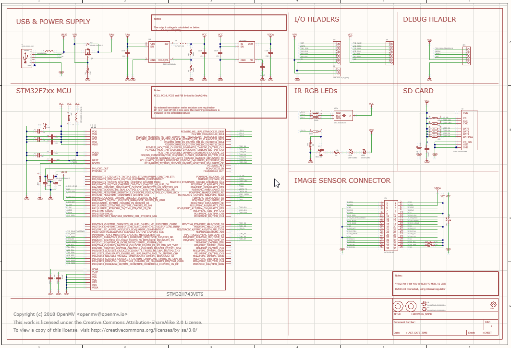
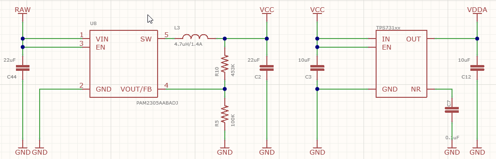
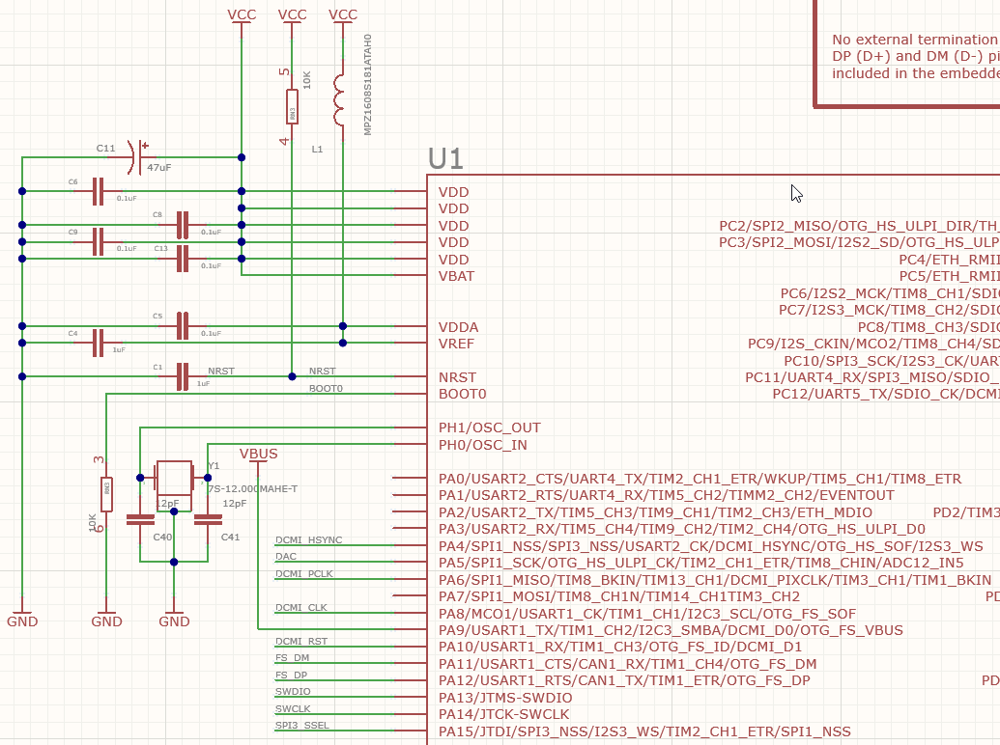

# OpenMV入门

OpenMV是一个开源的摄像头套件，可以让开发者使用MicroPython来开发嵌入式设备上运行的机器视觉项目。同时本体也可以作为一个嵌入式的CV库进行C程序开发

> 国内的代理商是星瞳科技
>
> 多少有点【数据删除】，懂得都懂，不懂得看看价格也就懂了
>
> 推荐买Github上面开源的套件，不过淘宝上面有一些恶心人的商家盗窃别人的开源成果做商品卖
>
> 当然最经济的方法还是自己做

## 硬件部分

OpenMV的官方实现基于**stm32h743vit6**，参数如下

* Cortex-M7内核，主频480MHz，带有ICache和DCache
* 带FPU、DSP和MPU
* 2MB大小的双端Flash
* 1MB的内部SRAM，包括192KB的TCM，864KB用户SRAM和4KB的备份域SRAM
* SRAM、Flash、CPU内部连接使用AXI总线，外设连接使用AHB总线和APB总线
* 带有图形处理能力较强的DMA2D、用于管理外部LCD设备的LTDC、用于管理外部存储设备的FMC

下面是OpenMV4的官方原理图

下面分功能来分析

### 电源

采用一个micro口供电，同时数据线还连到了stm32的调试口

通过一个PMOS和VIN同时为设备供电，若VIN供电电压低于USB供电电压，MOS的g极拉低导通，USB自动输出RAW供电；若VIN高于USB电压，MOS的g极拉高截止，使用VIN作为RAW供电

RAW供电会被直接送给两个LDO，一个负责产生3.3V的VCC电压，一个用于产生稳定的VDDA电压用于ADC等模拟设备

### 摄像头接口

stm32具有一个DCMI数字摄像头控制器接口，可以用于DVP协议摄像头的控制

OpenMV为了兼容更多摄像头，还引出了SPI3和I2C。官方提供了通用的摄像头和热红外摄像头接口

### stm32主控

上图给出了供电滤波电路和晶振电路，下图是电容和接地

可以看到大部分接口都被引出了

### SD卡

stm32自带SDIO，从而支持EMMC或SD卡，OpenMV可以支持SD卡

### 其他外设

板子还提供了一个三色LED接口，在上电后固件默认会让蓝色灯闪烁

同时还提供了两个LED补光灯LED2和LED3，安装在摄像头模块两侧，用一个NMOS下管驱动

### 接口

引出了stm32的I2C2、SPI2作为调试口，同时引出了三个定时器（PWM控制器）和一个DAC

调试口则完整引出SWD，而且引出了SWO

## 软件部分

