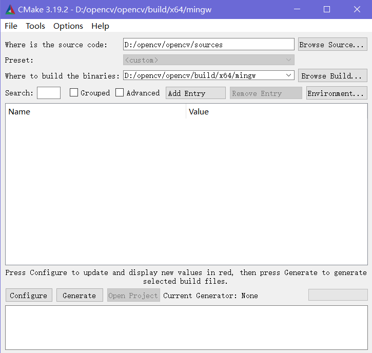
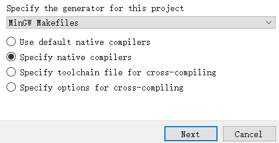

# OpenCV与经典视觉算法

本博客参考《OpenCV3编程入门》（毛星云 冷雪飞 电子工业出版社）写成（还有来自毛星云dalao在csdn写成的系列博文），本篇内容旨在总结*嵌入式设备*中常用的机器视觉算法，代码主要使用python实现，部分代码可以直接在openmv或类似的嵌入式平台上部署

> 悼念浅默大佬，感谢他为我们带来的技术博客和教程

## 配环境与hello world代码

这里没有使用原教程的VS环境，而是使用VSCode、MinGW、CMake、OpenCV源码搭建了一套通用的开发环境

注意：这是在Windows下进行搭建，Linux下的环境配置要简单很多

步骤如下：

1. 下载所有需要的软件（**这里的OpenCV使用4.5.0版本**）

    包括[OpenCV源码](https://opencv.org/)、[VSCode](https://code.visualstudio.com/)、[MinGW](https://sourceforge.net/projects/mingw-w64/files/)、[CMake](https://cmake.org/download/)

    MinGW用于编译C/C++程序，因为VSCode仅仅是一个代码编辑器，没有办法独立完成编译工作。使用VSCode+gcc的一个优点就是可以避免像VS那样生成一大堆文件，而且这一套配置可以跨平台操作，Linux和Windows都可以用相似的环境完成OpenCV开发；缺点在于它的性能没有VS那么好，不过对于学习来说已经足够了

2. 编译OpenCV源码

    先使用CMake-gui在源码目录下进行构建，生成Makefile

    

    点击`Configure`弹出以下窗口，如下配置即可

    

    下个窗口选择要使用的MinGW编译器，分别用gcc和g++编译C和C++

    

    完成配置后就让他自己构建，会花一段时间（视电脑CPU性能定，6核12线程一般十几分钟就能跑完了）

    > 注意在构建时一定要联网，因为CMake会从网上下载一些依赖包
    >
    > 很多错误都是由于依赖包连不上、下不完导致的

    中间可能会出现红色的报错，如果最后结果里面是configuring done就可以忽略；如果执行时中断，则存在其他问题。构建完毕后，在上面的选项框里勾选**BUILD_opencv_world**、**WITH_OPENGL**、**BUILD_EXAMPLES**，确保不勾选**WITH_IPP、WITH_MSMF**、**ENABLE_PRECOMPILED_HEADERS**，并且**CPU_DISPATCH**选空。**再点击一次configure**，最后结果如下：

    

    随后**点击Generate**，正常的话会显示非红色的消息Generate Done

    

    这样Makefile就建好了。可以切换到目录`${opencv根目录}\build\x64\mingw`看看，会发现有一个Makefile。随后就可以进行编译啦！使用CMD切换到MakeFile所在目录，执行`minGW32-make`命令使用多线程编译命令`minGW32-make -j <这里写需要使用的CPU核心数>`，个人建议**第一次编译使用单线程**，因为多线程编译虽然很快但是不会弹出报错信息，容易反复编译错而找不到bug所在

3. 编译源码出错，重新构建

    根据笔者的经验，**大多数编译源码的时候会出错**，所以这时候就要重新构建，去掉一些出错的部分，或者下载新版本源码，抑或是苦逼查错

    笔者编译时遇到了以下错误

    > In file included from D:\opencv\opencv\sources\3rdparty\openexr\IlmImf\ImfAttribute.cpp:44:
    > D:/opencv/opencv/sources/3rdparty/openexr/IlmThread/IlmThreadMutex.h:131:20: error: 'mutex' in namespace 'std' does not name a type
    > using Mutex = std::mutex;
    >
    > 大意是缺少**mutex**
    >
    > 凭借经验知道mutex是pthread库里面的东西，按理说不应该缺少，百度/Google/StackOverflow一下发现是MinGW-W64的问题，重下新版本，然后重新配置
    >
    > 
    >
    > 
    >
    > [ 65% ] Building RC object modules/world/CMakeFiles/opencv_world.dir/vs_version.rc.obj 
    >
    > gcc: error: long: No such file or directory
    >
    > mingw32-make[2]: *** [modules\world\CMakeFiles\opencv_world.dir\build.make:11240: modules/world/CMakeFiles/opencv_world.dir/vs_version.rc.obj] Error 1
    >
    > 这是个make的经典错误，No such file or directory基本上就是.obj文件没有生成，这时候就只能查看CMake原来的指令再手动编译一遍vs_version.rc这个文件了
    >
    > 发现上面黑体标出的部分是CMake文档中出错的指令，依照他找到原指令位于modules\world\CMakeFiles\opencv_world.dir\build.make的11240行，可以直接打开文件，搜索vs_version.rc
    >
    > ```cmake
    > modules/world/CMakeFiles/opencv_world.dir/vs_version.rc.obj: modules/world/vs_version.rc
    > 	@$(CMAKE_COMMAND) -E cmake_echo_color --switch=$(COLOR) --green --progress-dir=D:\opencv\opencv\build\x64\mingw\CMakeFiles --progress-num=$(CMAKE_PROGRESS_491) "Building RC object modules/world/CMakeFiles/opencv_world.dir/vs_version.rc.obj"
    > 	cd /d D:\opencv\opencv\build\x64\mingw\modules\world && D:\mingw64-posix-seh\bin\windres.exe -O coff $(RC_DEFINES) $(RC_INCLUDES) $(RC_FLAGS) D:\opencv\opencv\build\x64\mingw\modules\world\vs_version.rc CMakeFiles\opencv_world.dir\vs_version.rc.obj
    > 
    > ```
    >
    > 发现里面的指令为
    >
    > ```shell
    > cd /d D:\opencv\opencv\build\x64\mingw\modules\world
    > 
    > D:\mingw64-posix-seh\bin\windres.exe -O coff D:\opencv\opencv\build\x64\mingw\modules\world\vs_version.rc CMakeFiles\opencv_world.dir\vs_version.rc.obj
    > ```
    >
    > 切换到build目录后照样执行，发现编译成功
    >
    > 重新`minGW32-make`，bug解决
    
    解决所有bug后，发现编译成功
    
    
    
4. 生成完整的OpenCV库

    在编译目录下使用指令`minGW32-make install`即可将所有生成的文件整理并安装到`install`目录，将这个目录下的`x64/mingw/bin`子目录加入环境变量Path，这就让生成的动态链接库可以被调用

    在`x64\mingw\samples`子目录下保存了所有示例程序的编译结果

    在`etc`子目录下保存了常用的模型

5. 配置VSCode

    在VSCode里面安装C/C++插件，配置好三个文件后就可以按照VS的方式对OpenCV代码进行编译调试了

    分别是

    用于配置环境的`c_cpp_properties.json`

    ```json
    {
        "configurations": [
            {
                "name": "Win32",
                "includePath": [
                    "${workspaceFolder}/**",
                    "D:/opencv/opencv/build/x64/mingw/install/include",
                    "D:/opencv/opencv/build/x64/mingw/install/include/opencv2"
                ],
                // "defines": [
                //     "_DEBUG",
                //     "UNICODE",
                //     "_UNICODE"
                // ],
                "defines":[],
                "compilerPath": "D:/mingw64-posix-seh/bin/g++.exe",
                "cStandard": "c11",
                "cppStandard": "c++17",
                "intelliSenseMode": "${default}"
            }
        ],
        "version": 4
    }
    ```

    用于生成调试的`launch.json`

    ```json
    {
        "version": "0.2.0",
        "configurations": [
            {
                "name": "opencv4.5.0 debug",
                "type": "cppdbg",
                "request": "launch",
                "program": "${workspaceFolder}/${fileBasenameNoExtension}.exe",
                "args": [
                    // "/C",
                    // "${fileDirname}/${fileBasenameNoExtension}.exe",
                    // "&",
                    // "pause"
                ],
                "stopAtEntry": false, //这里如果为false，则说明调试直接运行（反之则会在编译完之后停止）
                "cwd": "${workspaceFolder}",
                "environment": [],
                "externalConsole": true, //是否调用外部cmd
                "MIMode": "gdb",
                "miDebuggerPath": "D:/mingw64-posix-seh/bin/gdb.exe", //自己针对要用的调试器进行设置
                "preLaunchTask": "opencv4.5.0 compile task", //在调试之前先进行编译任务
                "setupCommands": [
                    {
                        "description": "为 gdb 启用整齐打印",
                        "text": "-enable-pretty-printing",
                        "ignoreFailures": false
                    }
                ]
            }
        ]
    }
    ```

    用于生成任务的`tasks.json`

    ```json
    {
        // See https://go.microsoft.com/fwlink/?LinkId=733558
        // for the documentation about the tasks.json format
        "version": "2.0.0",
        "tasks": [
            {
                "label": "opencv4.5.0 compile task",
                "type": "shell",
                "command": "D:\\mingw64-posix-seh\\bin\\g++.exe",
                "args": [
                    "${file}",
                    "-o",
                    "${workspaceFolder}\\${fileBasenameNoExtension}.exe",
                    "D:\\opencv\\opencv\\build\\x64\\mingw\\install\\x64\\mingw\\bin\\libopencv_world450.dll",
                    "-I",
                    "D:\\opencv\\opencv\\build\\x64\\mingw\\install\\include",
                    "-I",
                    "D:\\opencv\\opencv\\build\\x64\\mingw\\install\\include\\opencv2",
                    "-g"
                ],
                "options": {
                    "cwd": "D:\\mingw64-posix-seh\\bin"
                },
                "problemMatcher": [
                    "$gcc"
                ],
                "group": {
                    "kind": "build",
                    "isDefault": true
                }
            }
        ]
    }
    ```

    配置完以后使用`F5`键就可以直接编译运行调试了

6. 测试

    使用以下代码进行图片读取-显示测试

    ```c++
    #include <opencv2/opencv.hpp>
    #include <opencv2/highgui.hpp>
    #include <iostream>
    using namespace cv;
    
    int main()
    {
        Mat img=imread("test.jpg");
        imshow("image",img);
        waitKey();
        return 0;
    }
    ```

## OpenCV入门

### 基本函数

```c++
imread("文件名"); //读取图像

//显示图像
void cv::imshow(const cv::String &winname, //图像窗口标题
                cv::InputArray mat); //原图像

int cv::waitKey(int delay = 0); //等候任意按键按下，参数为延时时长

void cvtColor(cv::InputArray src, //色彩空间转换
              cv::OutputArray dst, 
              int code, //表示要转换到的色彩空间
              int dstCn = 0)
    
void cv::blur(cv::InputArray src, 
              cv::OutputArray dst, 
              cv::Size ksize, 
              cv::Point anchor = cv::Point(-1, -1), 
              int borderType = 4); //均值滤波

void Canny(cv::InputArray image, //Canny算子
           cv::OutputArray edges, //边缘图像
           double threshold1, //阈值1
           double threshold2, //阈值2
           int apertureSize = 3, //Sober算子的大小
           bool L2gradient = false); //是否采用更精确的方式计算图像梯度

cv::VideoCapture capture(int i); //调用摄像头采集数据，i表示第几个摄像头设备

/* 运算计时 */
double t_0 = static_cast<double>(getTickCount()); //记录起始时间
t_0 = ((double)getTickCount() - t_0) / getTickFrequency(); //计时结束
cout << "Time elepsed: " << t_0 << " s" << endl; //输出计时结果
```

### Mat类

Mat类是OpenCV用于图像的基本数据结构，由**矩阵头**和**矩阵指针**组成。矩阵头中包含了矩阵尺寸、存储方法、存储地址等信息；矩阵指针指向存储所有像素值的矩阵，矩阵的维数由图像的存储方法决定。矩阵头长度恒定，但矩阵本身的尺寸会依图像的不同而不同，且通常比矩阵头的尺寸大数个数量级。

**OpenCV支持Mat对象的显式创建和格式化输出**

OpenCV使用**引用计数**机制来提高运行效率：每个Mat对象有自己的信息头但共享同一个矩阵——相同图像的矩阵指针可以指向同一个地址，在拷贝构造函数过程中只复制信息头和矩阵指针，从而避免了复制矩阵的大开销。

以下代码中的A,B,C三个Mat对象都指向内存中同一个数据矩阵

```c
Mat A,C;
//省略为A开辟内存的代码
Mat B(A);
C = A;
```

OpenCV还通过这个机制实现了内存的自动管理，C++、Python接口中都不需要考虑内存释放问题

如果需要复制图像的矩阵，应该使用`clone()`或`copyTo()`函数

信息头还具有特殊用法：可以创建包含边界信息的信息头来划分感兴趣区域（**ROI**）

```c
Mat ROI(A,Rect(p_1,p_2,p_3,p_4)); //通过矩形的四个端点创建ROI
```

划分ROI是CV中常用于简化算法的思路，后面还会再提到

像素值通过指定**色彩空间**和**数据类型**来存储为数字格式。色彩空间是指针对一个给定的颜色，如何组合颜色元素来对其编码。最简单的颜色空间是灰度空间（**GRAY**），它只处理黑色和白色，对两种颜色进行组合就可以得到不同程度的灰色。使用灰度空间可以很好地发现图像的深度特征。**RGB**色彩空间是最常见的，通过组合红（Red）、绿（Green）、蓝（Blue）三原色，可以产生所有其他颜色，有时为了表示透明度也会加入Alpha元素。**HSV**和**HLS**色彩空间把颜色分解成色调、饱和度和亮度/明度。YCrCb（即**YUV**）在JPEG图像中常见，主要用于优化彩色视频信号的传输，它最大的优点在于只需占用极少的带宽即可表示与RGB色彩空间一样的图像。Y表示明亮度；U和V表示色度，其中U（也就是Cr）反映RGB输入信号红色部分与RGB信号亮度值之间的差异。而V（即Cb）反映的是RGB输入信号蓝色部分与RGB信号亮度值之间的差异。*OpenCV有函数可以将图片在各个色彩空间中进行转换*。图片中每个组成元素都有自己的定义域，定义域取决于其数据类型。最小的数据类型是char，可以表示1600万种可能的颜色（RGB色彩空间）；使用float或double可以获得更精细的颜色分辨能力，随着元素尺寸增大，图像所占内存也会增大。

计算机中的图片通过像素表示，每个像素对应一个数值，分辨率为640*480的图片，就有307200个像素点，每个像素点都有自己的数值，比如RGB空间中一个三通道的值(0,0,255)表示红色的像素点，整张图片可以用一个二维数组（矩阵）表示，其中的一个像素就是二维数组中的一个元素。色彩空间决定了其编码方式，数据类型决定了其精度

```c
unsigned char image[480][640];
unsigned char pixel = image[y][x];
```

Mat类就是通过调用这样的矩阵实现图像存储功能的，因此从底层出发可以发现Mat对象能够实现矩阵功能。

将图像矩阵中表示颜色的值称为**通道**（Channel），灰度图像是单通道的：一个坐标位置有一个灰度值；RGB图像是三通道的：一个坐标位置有R、G、B三个正交（互不相干）的色彩值。

事实上，**OpenCV中将RGB图像按照通道B-G-R的顺序保存**

OpenCV提供了三种方法访问每个像素的数据，分别是：

* 指针访问：通过对Mat对象使用`[]`操作符，面向过程的思路，直接访问Mat对象底层的矩阵数据，速度最快
* 迭代器`iterator`：STL的经典用法，获得图像矩阵的begin、end，再增加迭代知道从begin到end，使用`*`操作符就可以访问到具体数据了，这种方法稍慢，但更加安全，不会发生指针越界
* 动态地址计算：该方法最慢，但是很直观，使用Mat对象的成员函数`at(x,y)`来存取图像元素

### 其他常用数据结构

* Point类：表示**点**

    ```c
    Point point;
    point.x = 10;
    point.y = 5;
    Point p = Point(3,4);
    ```

* Scalar类：表示**颜色**

    `Scalar()`表示具有4个元素的数组，常常用于传递像素值。特别地，如果只写三个参数进行初始化或赋值，OpenCV会视为三元素数组，也就是说第四个元素只有在用到时才需要写出来

    ```c
    Scalar(r,g,b,a);
    Scalar(r,g,b);
    ```

* Size类：表示**尺寸或大小**

    这是一个对`Size`模板类在`Size_<int>`下的封装，常用以下表达式表示某个尺寸（宽x高）

    ```c
    Size body;
    body.width;
    body.height;
    
    Size(3,4); //宽3 高5
    ```

* Rect类：表示**矩形**

    这个类的成员变量有

    ```c
    x; //左上角点的坐标x
    y; //左上角点的坐标y
    width; //矩形宽度
    height; //矩形高度
    ```

    它有以下几个基本成员函数

    ```c
    Size(); //返回长和宽
    area(); //返回面积
    contains(Points); //判断点是否在矩形内
    inside(Rect); //判断矩形是否在矩形内
    tl(); //返回左上点坐标
    br(); //返回右下点坐标
    
    Rect rect = rect_1 & rect_2; //求矩形交集
    Rect rect = rect_1 | rect_2; //求矩形并集
    Rect rect_shift = rect + point; //平移
    Rect rect_scale = rect + size; //缩放
    ```

### 绘制基本图形

* 直线
* 椭圆
* 圆
* 矩形
* 填充多边形

参考下面的示例程序即可

```c++
#include <opencv2/opencv.hpp>
#include <vector>
using namespace cv;
using namespace std;

const int thickness = 2; //线宽
const int line_type = 8; //线形

/**
 * @brief 绘制线段
 * @param  img              原图像
 * @param  start            起始点
 * @param  end              结束点
 */
void drawLine(Mat img, Point start, Point end)
{
    line(
        img,
        start,
        end,
        Scalar(0, 255, 0),
        thickness,
        line_type
    );
}

/**
 * @brief 绘制椭圆
 * @param  img              原图像
 * @param  center           椭圆中心点
 * @param  size             椭圆外接矩形
 * @param  angle            旋转角度
 */
void drawEllipse(Mat img, Point center, Size size, double angle)
{
    ellipse(
        img,
        center,
        size,
        angle,
        0,
        360,
        Scalar(255, 129, 0),
        thickness,
        line_type
    );
}

/**
 * @brief 绘制圆
 * @param  img              原图像
 * @param  center           圆心
 * @param  radius           半径
 */
void drawCircle(Mat img, Point center, int radius)
{
    circle(
        img,
        center,
        radius,
        Scalar(255, 0, 0),
        thickness,
        line_type
    );
}

/**
 * @brief 绘制凹多边形
 * @param  img              原图像
 */
void draw_polygon(Mat img)
{
    Point rook_points[1][6];
    rook_points[0][0] = Point(300, 300);
    rook_points[0][1] = Point(310, 450);
    rook_points[0][2] = Point(320, 470);
    rook_points[0][3] = Point(290, 340);
    rook_points[0][4] = Point(330, 400);
    rook_points[0][5] = Point(340, 480);

    const Point* ppt[1] = { rook_points[0] };
    int npt[] = { 6 };
    fillPoly(
        img,
        ppt,
        npt,
        1,
        Scalar(255, 255, 255),
        line_type
    );
}

/**
 * @brief 绘制矩形
 * @param  img              原图像
 * @param  left_top         左上点坐标
 * @param  length           长
 * @param  width            宽
 */
void drawRectangle(Mat img, Point left_top, int length, int width)
{
    rectangle(
        img,
        left_top,
        left_top + Point(length, width),
        Scalar(200, 100, 0),
        thickness,
        line_type,
        0
    );
}

int main()
{
    Mat mat(480, 640, CV_8UC4);
    vector<int>compression_params;
    compression_params.push_back(IMWRITE_PNG_COMPRESSION);
    compression_params.push_back(9);

    drawLine(
        mat,
        Point(20, 140),
        Point(80, 100)
    );

    drawEllipse(
        mat, //原图
        Point(100, 100), //确定中心
        Size(50, 30), //确定长轴和短轴
        0 //旋转角度
    );

    drawCircle(
        mat,
        Point(300, 300),
        100
    );

    draw_polygon(mat);

    drawRectangle(
        mat,
        Point(100, 100),
        30,
        80
    );

    imwrite("pics.png", mat, compression_params);
    imshow("PNG", mat);

    waitKey(0);
    return 1;
}
```

### ROI

当我们对一个图像进行处理时，常常会因为硬件限制无法对全部像素进行运算，这时候就可以考虑使用ROI分割。ROI即**感兴趣区域**，分割我们感兴趣的图像区域进行针对性计算。这个方法分为两个维度：色彩空间中的ROI和图像尺寸中的ROI

在色彩空间中取ROI即**颜色空间缩减**（Color Space Reduction）：将现有色彩空间值除以某个输入值（取整），可以获得较少的颜色数

这个算法的特点是缩减运算量，同时会缩减得到的信息准确度（图像色彩变模糊了）

> 比如颜色0到9统一取为0，10到9统一取为10......

可以直接使用uchar定义域内的颜色缩减运算
$$
I_{new}=\frac{I_{old}}{10} \times 10
$$
这样就能通过uchar除以int值来获得新的char值（向下取整），进而缩减颜色空间，得到ROI

为了进一步简化运算，常常将某个色彩空间的对应缩减值计算好以后存在一个查找表（LUT）中，生成新图像的时候采用以下算法：

1. 遍历图像矩阵的每个像素
2. 对像素应用上述公式或查表得到结果

可以使用加减赋值运算对上面的乘除运算进行简化，而OpenCV推荐使用查找表函数LUT()，通过以下代码进行处理

```c++
Mat look_up_table(1,256,CV_8U); //以256位颜色空间为例
uchar* p = look_up_table.data;
for(int i = 0;i < times;i++)
{
    p[i] = table[i];
}

for(int i = 0;i < times;i++) //依次按照查找表对输入值input进行操作，找到目标值output
{
    LUT(input,look_up_table,output);
}
```

图像尺寸上的ROI就是之前介绍过的狭义上的ROI：从图像中选择一个区域以进行进一步处理，能够减少处理时间、增加精度

一般是**圈定一个矩形区域**或**指定感兴趣行或列的范围**来定义ROI。

前一种方法使用以下语句实现

```c++
Mat img;
ROI = img(Rect(a,b,logo.cols,logo.rows)); //直接圈定一个矩形
```

后一种方式使用以下语句实现

```c++
ROI = img(Range(a,a+logo.rows),Range(b,b+logo.cols));
```

ROI的一个常见用法就是进行*图像叠加*（下面的示例是原文示例）

```c++
/* 通过一个图像掩膜mask就可以将插入部分的像素设置为掩膜图像的像素 */
bool addImage()
{
    Mat source_image_1 = imread("bottom.jpg"); //加载背景图
    if(!source_image_1.data)
    {
        printf("Error in reading bottom image!\n");
        return false;
	}
    
    Mat logo_image = imread("top.jpg"); //加载掩膜图
    if(!logo_image.data)
    {
        printf("Error in reading top image!\n");
        return false;
	}
    
    Mat image_ROI = source_image_1(Rect(200,250,logo_image.cols,logo_image.rows)); //设置ROI
    
    Mat mask = imread("mask.jpg",0); //从灰度图中加载掩膜

	logo_image.copyTo(image_ROI,mask); //把掩膜的内容复制到ROI实现图像覆盖
    
    namedWindow("使用ROI实现图像叠加");
    imshow("picture",source_image_1);
    
    return true;
}
```

### 图像处理的基本方法

作为图像叠加的扩展操作，**线性混合**操作是图像处理中典型的**二元像素操作**，它遵循以下公式
$$
g(x)=(1-a)f_a(x)+af_3(x)
$$
a是范围在0到1之间的alpha通道值，可以对两个图片实现时间上的**交叉溶解**效果，也就是前一图片缓慢消失，后一图片缓慢出现，opencv中使用`addWeighted()`函数进行处理

```c++
//计算两个数组（图像）的加权和
void addWeighted(
    cv::InputArray src1, //需要加权的第一个数组
    double alpha, //第一个数组的权重
    cv::InputArray src2, //需要加权的第二个数组
    double beta, //第二个数组的权重
    double gamma, //加到权重总和上的标量值
    cv::OutputArray dst, //输出数组，和输入的两个数组尺寸、通道数相同
    int dtype = -1 //输出数组的可选深度
)

//表示上面的公式
dst = src1[I]*alpha + src2[I]*beta + gamma
```

可以参考下面的示例使用该函数

```c++
#include <opencv2/opencv.hpp>
#include <vector>
using namespace cv;
using namespace std;

bool LinearBlending()
{
    double alpha = 0.5;
    double beta;
    Mat srcImage2, srcImage3, dstImage;

    srcImage2 = imread("mogu.jpg");
    if (!srcImage2.data)
    {
        printf("Error in read srcImage\n"); 
        return false;
    }

    srcImage3 = imread("rain.jpg");
    if (!srcImage3.data)
    {
        printf("Error in read srcImage\n"); 
        return false;
    }

    beta = (1.0 - alpha);
    addWeighted(
        srcImage2,
        alpha,
        srcImage3,
        beta,
        0.0,
        dstImage
    );

    imshow("origin", srcImage2 );
    imshow("mixed", dstImage );
    return true;
}

int main()
{
    LinearBlending();
    waitKey(0);
    return 0;
}
```


可以看到右边的图片就是左侧图片叠加了一个rain.jpg而成

**通道分离**与**通道混合**也是两个常用的图像操作，它们分别**将一个多通道数组分离成多个单通道数组**和**将多个单通道数组合并成一个多通道数组**

split函数可进行通道分离，执行如下算法：
$$
mv[c](I)=src(I)_c
$$
典型代码如下：

```c++
vector<Mat> channels;
Mat image_channel_blue;
Mat image_channel_green;
Mat image_channel_red;

source_image = imread("source.jpg");

split(source_image,channels);

image_channel_blue = channels.at(0); //将输入的source.jpg分离成三个独立的通道，放到channels中
image_channel_green = channels.at(1); //顺序是 b g r
image_channel_red = channels.at(2);
```

merge函数是它的逆向操作，可以组合一些给定的单通道数组，将他们合并成一个多通道数组

典型实现如下：

```c++
vector<Mat> channels;
Mat image_channel_blue;
Mat image_channel_green;
Mat image_channel_red;
Mat merge_image;

Mat source_image = imread("source.jpg");

split(source_image,channels); //分割
image_channel_blue = channels.at(0);
image_channel_green = channels.at(1);
image_channel_red = channels.at(2);

merge(channels,merge_image); //合并

imshow("merge_image",merge_image); //得到原图
```

## 经典CV算法

定义图像处理算子：算子是一个函数，接收一个或多个输入图像，并产生输出图像

> 算子的概念等价量子力学中引入的算符，只不过算子单纯对张量进行运算，操作数不一定具有物理意义，而算符要求变换后的张量具有一定物理意义
>
> 算子/算符都描述了从一个函数空间（如巴拿赫空间和希尔伯特空间）到另一个函数空间的映射。算子有*线性*与*非线性*之分，矩阵是最常见的线性算子。一个函数可以被视为一个向量，算子作用在函数上的过程就是对函数对应的向量做线性变换的过程。

一个算子总可以表示为：
$$
g(x)=h(f(x)) \leftrightarrow g(x)=h(f_0(x) \cdots f_n(x))
$$
最简单的图像处理变换算子是**点操作**（**pointoperators**）算子，仅仅根据输入像素值（有时会加入某些全局信息或参数）来计算相应的输出像素值，可以实现包括亮度和对比度调整、颜色校正和变换。对于点算子，可以通过乘上一个常数来实现对比度调节，通过加上一个常数实现亮度值的调节
$$
g(i,j)=a*f(i,j)+b
$$
式中a表示**增益**，控制图像的对比度；b表示**偏置**，用来控制图像的亮度；式中i、j代表像素位置

使用下面的函数来调整对比度

```c++
//在三个for循环内执行运算 g_dstImage(i,j) = a*g_srcImage(i,j) + b
for (int y = 0; y < g_srcImage.rows; y++)
{
	for (int x = 0; x < g_srcImage.cols; x++)
	{
		for (int c = 0; c < 3; c++)
		{
			g_dstImage.at<Vec3b>(y, x)[c] = 
				saturate_cast<uchar>
                ((g_nContrastValue * 0.01) * (g_srcImage.at<Vec3b>(y, x)[c]) + g_nBrightValue);
		}
	}
}
```

三个循环里面，最外层是遍历图像行，中层遍历图像列，最内层是遍历三个通道；使用saturate_cast函数对结果进行转换，防止运算结果超出像素取值范围，确保它是有效值

### 离散傅里叶变换

**离散傅里叶变换**（Discrete Fourier Transform，**DFT**）是指傅里叶变换在 时域和频域都呈现离散的形式，将时序信号的采样变换为在*离散时间傅里叶变换频域*（DTFT）的采样。对有限长的离散信号做DFT，也需要对其经过周期延拓成为周期信号以后在进行变换。实际应用中，常使用**快速傅里叶变换**（FFT）计算DFT

二维图像的傅里叶变换可表示为
$$
F(k,l)=\sum_{i=0}^{N-1} \sum_{j=0}^{N-1} f(i,j)e^{-i2\pi (\frac{ki}{N}+\frac{lj}{N})}
$$
其中**f是空间域值，F是频域值**，傅里叶变换作用在原图像后需要使用实数图像+虚数图像表示原图像，或者用幅度图像+相位图像的形式表示原图像。频域空间中，图像的高频部分代表了图像的细节、纹理信息，低频部分代表了图像的轮廓信息。可以通过滤波器来处理图像噪声，让某个特定频率范围内的噪声被去除，从而恢复原图。图像增强与去噪、图像边缘检测、图像特征提取、图像压缩等算法都可以靠DFT完成

opencv提供了`dft()`函数**对一维或二维浮点数数组进行正向或反向DFT**

```c++
void dft(
    cv::InputArray src, //原图像矩阵
    cv::OutputArray dst, //dft的运算结果图像矩阵
    int flags = 0, //转换标识符
    int nonzeroRows = 0 //非零列，用于优化函数
)

//flag可选参数
DFT_INVERSE //使用DFT逆变换
DFT_SCALE //结果以1/N进行缩放，通常用来结合DFT_INVERSE实现DFT逆变换回原图像
DFT_ROWS //对输入矩阵的每行进行变换
DFT_COMPLEX_OUTPUT //进行数组正变换，输出具有共轭特性的复矩阵
DFT_REAL_OUTPUT //进行数组逆变换，如果输入的矩阵是复共轭矩阵，则输出实矩阵，与上面的DFT_COMPLEX_OUTPUT对偶
```

如果nonzeroRows参数为非零值，函数会假设只有输入矩阵的第一个非零行非零元素，或只有输出矩阵的第一个非零行非零元素，这样可以对其他行进行更高效的处理

OpenCV围绕DFT给出了一系列函数，如果需要可以自行查看OpenCV源码和其中的注释

### 线性滤波


### 非线性滤波


### 形态学滤波


### 图像尺寸缩放


### 二值化（阈值化）


### 边缘检测


### 霍夫变换


### 重映射


### 仿射变换


## 图像处理算法的典型应用


### 寻找轮廓


### 寻找凸包


### 图像轮廓矩


### 分水岭算法


### 直方图


### 模板匹配


### 特征点检测


### 图像识别


