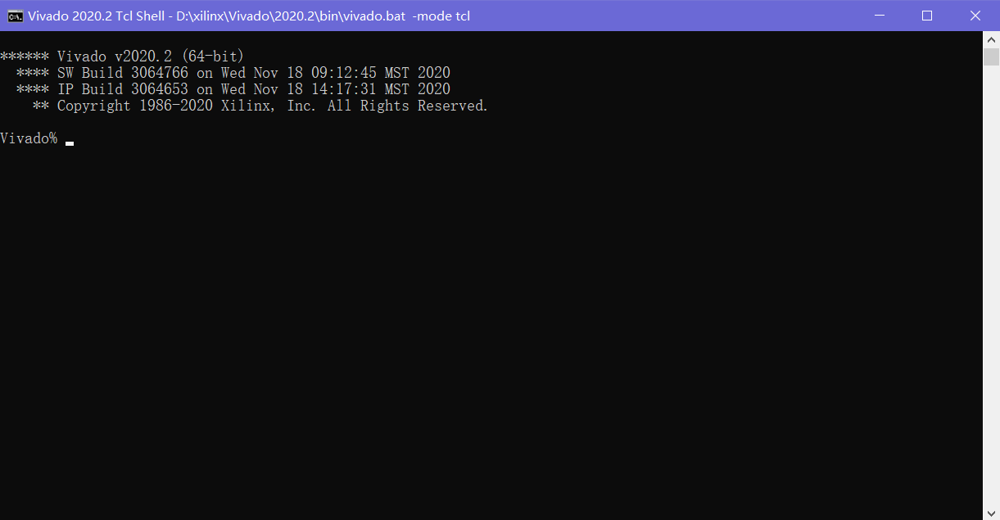
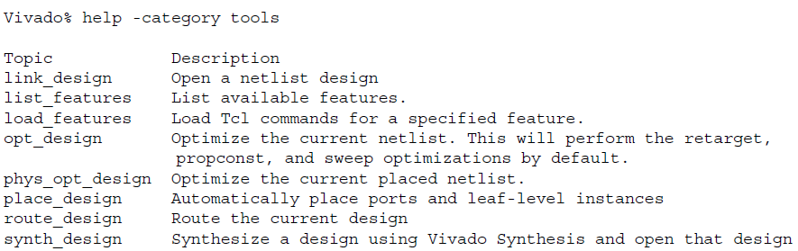

本文章部分参考https://blog.csdn.net/long_fly/article/details/78897158总结

Tcl是一种通用的脚本语言，它在**几乎所有平台上都可以解释运行**，很多软件都支持用Tcl脚本的方式执行，学会了用这个东西就相当于从GNOME、KDE换成了bash shell（确信）。Vivado也内置了Tcl解释器并提供Tcl命令行执行各种操作，更神奇的是Tcl脚本比GUI下操作VIVADO效率更高。而且Xilinx官网的文档很多都是用Tcl命令来完成操作

总结来说学习Tcl脚本语言的好处：

1. 标准语法，一通百通
2. 快速执行，增加工作效率
3. 支持程序间通信


Tcl的语法都已经在之前的博文中讲述过，下面着重介绍Vivado中的Tcl命令

# Vivado中的Tcl脚本

虽然已经品鉴过无数次，但还是先问一下，你听说过~~侠客行~~Tcl的语法吗

## 复习Tcl语法

1. 一条Tcl的命令串包含了多条命令时，用**换行符**`\n`或**分号**`;`来隔开，也就也是说Tcl可以*随便写*，后面加不加分号都没事 

2. 一条命令就是一个域的集合，域使用**空白**分开，第一个域是命令的名字，其它的作为参数来传给它

3. Tcl只支持一种数据结构：**字符串**，所有东西都是字符串，把python的对象扔掉就成了Tcl（确信）

4. 简单的示例

   ```tcl
   #这是注释
   #单行注释前要先用分号把命令结束掉，或者就换行注释
   set a 1
   #将字符串1赋值给a
   unset a;#将a取消赋值
   set b hello_1;#将字符串hello_1赋值给b
   set c "ok sir";#当字符串中间有空白时加双引号
   ```

5. 使用`$v`来引用变量`v`

6. 数组使用很方便，可以随便乱用，并且Tcl支持任意维数的数组

   ```tcl
   set i(1) 123;
   set i(16) hi;
   
   set i(1,2,3) hi;set i(1,2,4) hello;#多维数组
   puts $i(1,2,3);#输出hi
   puts $i(1,2,4);#输出hello
   ```

## 配置开发环境

如果想要一个单纯的Tcl环境，只要单独安装Tcl即可，Linux下使用`sudo apt install tcl`一键安装，照着别的教程随便写写helloworld就完事了，不过这里介绍的是在Vivado中使用特定的Tcl命令行，所以需要

1.  安装好Vivado

2. 在安装目录下找到Vivado Tcl Shell（或者找遍你的硬盘，总之找到这个东西就行）

   像下面这样：

   

   其实还可以把它放到Windows Terminal中，这个就请自行翻阅其他教程罢！

3. 在Vivado Tcl Shell中尝试输入以下命令

   ```tcl
   set i hello,world;puts i;puts $i
   ```

   应该会输出

   ```tcl
   i
   hello,world
   ```

   好的，开发环境准备完毕

## Tcl脚本常用命令与语法

* parray命令

  打印出一个数组的全部值

  ```tcl
  set i(0,0,0) h
  set i(0,0,1) e
  set i(0,1,0) l
  set i(1,0,0) l
  set i(1,1,1) o
  parray i; 
  ```

* array命令

  用于对数组进行特殊操作

  ```tcl
  #格式A：array option arrayName
  #其中option是操作选项
  array name i;#返回数组中所有元素名称
  array size i;#返回数组长度
  array startsearch i;#初始化一次遍历，返回一个遍历标识符searchId，这个东西在下面用到
  
  #格式B：array option arrayName searchId
  array nextelement i 1;#返回数组中下一个元素，如果没有则返回空
  array anymore i 1;#如果接下来还有元素则返回1，否则返回0
  array donesearch i 1;#结束遍历
  ```

* append命令

  在字符串后面追加字符串

  可以无限拼接

* split命令

  将字符串转换为列表

  ```tcl
  split niconiconi i
  #后面的字符为分隔符，需要从字符串中找，字符串会以它为分割裂开
  #输出如下
  n con con {}
  ```

* 数字操作命令

  由于Tcl中只有字符串，所以在进行数字运算时需要使用特殊的命令

  * incr

    变量自加

    ```tcl
    set a 0;
    incr a 3;#自增3
    incr a -3;#自增-3
    ```

    最后a的值还是0

  * expr

    用于识别各种表达式

    ```tcl
    expr 2>1
    1
    
    expr 10/2.0
    5.0
    
    set a [expr 1?1:0]
    1
    
    set a [expr ?1:0]
    0
    
    expr cos(0)
    1.0
    
    expr abs(-3)
    3
    
    expr round(3.456)
    3
    
    set pi 3.14;
    expr sin($pi);
    0.0015926529164868282
    ```

* 判断、循环指令

  * 判断

    if语句、switch语句

    基本与C语言一致

  * 循环

    for循环

    ```tcl
    for {set i 0} {$i < 4} {incr i} {
    	puts $i;
    }
    ```

    **注意这里的大括号间都要用空格隔开**

    while循环

    ```tcl
    set i 5;
    while {$i != 3} {
    	puts $i;
    	incr i -1;
    }
    ```

    这里的大括号间也要用空白隔开

    特别地，Tcl支持foreach循环，用于遍历整个数组或给出的数

    ```tcl
    foreach i {0 2 3 x 1 4} {
    	switch $i {
    		0 {puts a}
    		1 {puts b}
    		2 {puts c}
    		3 {puts d}
    		4 {puts e}
    		default {puts z}
    	}
    }
    
    #输出
    a
    c
    d
    z
    b
    e
    ```

    这个东西比较常用，类似python中的for循环

    ```tcl
    for {set i 0} {$i < 4} {incr i} {
    	set a[$i] [expr $i + 1];
    }
    
    #下面这个代码是错误的
    #注意分辨foreach的逻辑是一口气将i赋值成一套数组，再带入switch的控制变量中
    foreach i {0,1,2,3} {
    	switch $a($i) {
    		1 {puts a}
    		2 {puts b}
    		3 {puts c}
    		4 {puts d}
    		default {puts z}
    	}
    }
    #报错如下
    #can't read "a(0,1,2,3)": no such element in array
    #应该像下面这样使用
    for {set i 0} {$i < 4} {incr i} {
    	switch $a($i) {
    		1 {puts a}
    		2 {puts b}
    		3 {puts c}
    		4 {puts d}
    		default {puts z}
    	}
    }
    ```

* 输入/输出

  * **format命令**

    格式化输入输出

    ```tcl
    format "%s %d" hello 123
    ```

  * **scan命令**

    把字符串拆分后格式化赋值给变量

    ```tcl
    scan 12.34.56.78 %d.%d.%d.%d a b c d
    #将12.34.56.78拆分，并分别赋值给a b c d四个变量，命令返回赋值成功的变量的个数
    ```

  * **puts命令**

    直接输出到屏幕/终端

  * **文件操作**

    * cd

      和shell中的cd一样用于切换当前目录

      推荐在shell中而不是Tcl命令行中使用该操作

    * pwd

      查看当前目录

    * glob

      查看当前目录下的文件，类似shell中的ls命令，但是可以支持查询等高级功能

      ```tcl
      glob *
      
      glob *.c *.exe#查看当前目录下特定后缀的文件
      ```

    * open

      打开文件，该命令返回一个文件描述符

      ```tcl
      #命令格式如下
      #open 文件名 模式
      #能使用r只读、r+可读写、w只写（文件存在则清空内容；文件不存在则创建文件）、a追加（文件不存在则创建；文件存在，则会在文件内容最后面追加写入的数据）
      set f [open hello.tcl w]
      ```

    * read和gets

      用于读取当前文件

      ```tcl
      read $f 65536;
      #从文件指针f指向的文件中读取65536个字节的数据
      read $f
      #从文件中读取全部内容
      gets $f
      #读取文件中的单行内容
      ```

    * close

      关闭当前文件

    * eof

      用于判断是否已经读完文件，读完返回1，否则返回0

    * flush

      刷新缓冲区

    总体上文件操作和C语言的不能说完全一致，至少是一模一样

* **time**

  计算某个命令执行的时间

  ```tcl
  time "set i 1"
  ```

* **Tcl面向对象**（？）

  Tcl支持命名空间的概念

  **命名空间是命令和变量的集合，可以看成一个丐版的类**

  通过封装命名空间，就可以保证它们不会影响其他命名空间的变量和命令——封装

  所有东西都是字符串——抽象

  ——多态？不存在的！这不是c++，是Tcl哒！

  * 设置与删除命名空间

    ```tcl
    #只要在命令之前加上"namespace eval 名称"就可以设置命名空间了
    namespace eval test {
    	pro hello {} {
    		puts hello;
    	}
    }
    
    set test::i 123;#设置命名空间内的私有变量
    
    #调用“方法”和“私有变量”
    puts test::i;
    test::hello;
    
    namespace delete test;#删除命名空间
    ```

  * 不同命名空间之间的过程共享（public类）

    使用`export`和`import`完成命名空间的导出和导入就可以实现过程共享

## Vivado的Tcl库

本部分参考Xilinx官方文档**ug894** `vivado tcl脚本使用指南`编写，很多内容是对官方文档的翻译

### 基本指令

Vivado支持Tcl指令运行各种基础的控制指令，所有GUI界面中的操作都可以通过Tcl指令替代

在Vivado中使用Tcl最基本的场景就是对网表上的目标进行遍历、查找和定位，这也是对网表上的目标进行约束的基础

Vivado处理方括号的方式与标准Tcl稍有不同。

标准Tcl的方括号可以实现指令递归执行，而方括号在Verilog和VHDL名称中被视为标准字符（net、实例等），通常标识向量（寄存器reg或线网wire类型数组）的一个或多个元素，例如总线或实例数组。所以在Vivado的Tcl环境中，当方括号作为网表对象名称的一部分时，方括号不会以自底向上的递归方式计算。

> 以下三个指令是等价的
>
> ```tcl
> set list_of_pins [get_pins transformLoop[0].ct/xOutReg_reg/CARRYOUT[*] ]
> set list_of_pins [get_pins {transformLoop[0].ct/xOutReg_reg/CARRYOUT[*] } ]
> set list_of_pins [get_pins transformLoop\[0\].ct/xOutReg_reg/CARRYOUT\[*\] ]
> ```

Vivado的所有Tcl指令都支持`-help`参数，用户可以在任何指令后加入参数获得内置的提示信息

同时还有`-syntax`参数可用：用一个指令加上该参数可以列举出某个指令的参数格式

使用`-category`参数可以列出一个类型下面所有可用的指令，如下所示



需要注意：**特殊情况下Vivado的Tcl指令中的数据长度等输出会依平台而变**，比如64位平台的vivado和32位平台的vivado会输出不同的整型数据大小。在使用老平台和ISE的时候需要注意

### 无工程的Vivado使用

Vivado允许通过Tcl指令进行不依靠工程文档的综合-实现-烧录流程，下面使用官方文档的例子

总流程如下：

1. 定义一个输出目录变量$outputDir，并实际创建。这步规定了随后生成的文件保存路径

   ```tcl
   # STEP#1: define the output directory area.
   #
   set outputDir ./Tutorial_Created_Data/cpu_output
   file mkdir $outputDir
   ```

2. 读取包含设计描述的VHDL和Verilog源RTL文件，同时读取包含设计的布线约束/时序约束的XDC文件

   ```tcl
   read_verilog #用于读取verilog源文件
   read_vhdl #用于读取VHDL源文件
   read_edif #读取综合生成的网表文件（EDIF或NGC）
   read_xdc #读取将在综合和实现期间使用的XDC约束文件
   ```

   **Vivado不支持旧版的UCF格式**。

   上面的`read_*`命令用于在非工程模式下，允许直接从硬盘加载文件到Vivado中来构建一个内存中的数据库设计，不会像项目模式中那样构建一个固定的存储目录并向其中添加文件或创建依赖。

   **非工程工作模式相当于把Vivado作为一整套构建工具-综合器-布局布线器-编译器的集合，执行的所有操作都指向Vivado中的内存数据库，可以灵活安排任务执行。但开发者必须注意对源文件的任何更改，并根据需要及时更新设计**

   > 非工程模式相关内容可参考ug892设计流程指南

   ```tcl
   # STEP#2: setup design sources and constraints
   #
   read_vhdl -library bftLib [ glob ./Sources/hdl/bftLib/*.vhdl ]
   read_vhdl ./Sources/hdl/bft.vhdl
   read_verilog [ glob ./Sources/hdl/*.v ]
   read_verilog [ glob ./Sources/hdl/mgt/*.v ]
   read_verilog [ glob ./Sources/hdl/or1200/*.v ]
   read_verilog [ glob ./Sources/hdl/usbf/*.v ]
   read_verilog [ glob ./Sources/hdl/wb_conmax/*.v ]
   read_xdc ./Sources/top_full.xdc
   ```

3. 应用XDC文件中的时序约束，进行RTL综合

   所有RTL逻辑会被映射到Xilinx原语上以在内存中创建设计数据库。内存中的设计会保留在Vivado中，方便随后在其他模式下调用，可以图形形式与设计数据进行交互。综合完成后将保存一个检查点（checkpoint）供参考。

   这一步完成后设计就变成了具有时序和布线约束的未实现的网表。

   使用一个自定义命令`reportCriticalPaths`，将Notice/Warning/Violator输出到一个CSV文件中。通过查看这个文件可以快速识别哪些布线路径是改善时序的关键。

   ```tcl
   # STEP#3: run synthesis, write design checkpoint, report timing,
   # and utilization estimates
   #
   synth_design -top top -part xc7k70tfbg676-2 #这里使用了kintex-7作为实现器件
   write_checkpoint -force $outputDir/post_synth.dcp #保存检查点
   report_timing_summary -file $outputDir/post_synth_timing_summary.rpt #保存时序报告
   report_utilization -file $outputDir/post_synth_util.rpt #保存硬件使用量报告
   #
   # Run custom script to report critical timing paths
   reportCriticalPaths $outputDir/post_synth_critpath_report.csv
   ```

   **任何在本步骤（综合）之后使用的read_xdc或source命令引入的XDC文件都只会在实现步骤中使用**，它们会与网表文件和检查点文件共同保存

4. 执行实现（implement）前的逻辑和布线优化

   优化的目标是在将布线资源投入到目标前简化逻辑设计。每个步骤之后一般要运行`reportCriticalPaths`命令生成一个新的CSV文件。通过这些文件保存的数据，开发者可以进行时序/布局优化程度的可视化分析

   完成实现步骤后，脚本使用`get_timing_paths`命令检查最差时序路径的SLACK属性（延时），使用`report_timing`命令输出详细报告。而`get_timing_paths`命令返回与Tcl对象相同的时序路径，其属性对应于该路径的主要时序特征。说人话就是*用这两个指令输出总体的时序分析报告和某个路径的时序分析报告*。如果报告结果不好，脚本会尽可能优化布线以解决竞争冒险或其他延时。

   在本步骤结束时，将保存另一个检查点，并报告片上资源利用率以及设计时序分析

   ```tcl
   # STEP#4: run logic optimization, placement and physical logic optimization,
   # write design checkpoint, report utilization and timing estimates
   #
   opt_design #布线和时序处理
   reportCriticalPaths $outputDir/post_opt_critpath_report.csv
   place_design #实现implement
   report_clock_utilization -file $outputDir/clock_util.rpt
   #
   # Optionally run optimization if there are timing violations after placement
   if {[get_property SLACK [get_timing_paths -max_paths 1 -nworst 1 -setup]] < 0} {
   puts "Found setup timing violations => running physical optimization"
   phys_opt_design #如果时序不好则进行优化
   }
   write_checkpoint -force $outputDir/post_place.dcp #保存检查点
   report_utilization -file $outputDir/post_place_util.rpt #输出片上资源利用率报告
   report_timing_summary -file $outputDir/post_place_timing_summary.rpt #输出时序报告
   ```

5. 进行最后的布线并输出各种报告

   可以将报告输出到文件中，以便以后查看；也可以将报告直接输出到Vivado中以便进行更多的基于UI的交互式检查。最后导出Verilog网表，用于时序仿真。

   ```tcl
   # STEP#5: run the router, write the post-route design checkpoint, report the routing
   # status, report timing, power, and DRC, and finally save the Verilog netlist.
   #
   route_design #布线设计
   write_checkpoint -force $outputDir/post_route.dcp #保存检查点
   report_route_status -file $outputDir/post_route_status.rpt #保存各种报告
   report_timing_summary -file $outputDir/post_route_timing_summary.rpt
   report_power -file $outputDir/post_route_power.rpt
   report_drc -file $outputDir/post_imp_drc.rpt
   write_verilog -force $outputDir/cpu_impl_netlist.v -mode timesim -sdf_anno true #导出Verilog网表
   ```

6. 输出比特流文件并进行烧录

   ```tcl
   # STEP#6: generate a bitstream
   #
   write_bitstream -force $outputDir/cpu.bit
   ```

### 有工作流的Tcl指令

示例如下

```tcl
# STEP#1: define the output directory area.
# 设定工程文件
set outputDir ./Tutorial_Created_Data/cpu_project
file mkdir $outputDir
create_project project_cpu_project ./Tutorial_Created_Data/cpu_project \ #根据需要的器件创建工程文档
-part xc7k70tfbg676-2 -force
# STEP#2: setup design sources and constraints
# 设置源RTL文件和XDC约束文件
add_files -fileset sim_1 ./Sources/hdl/cpu_tb.v
add_files [ glob ./Sources/hdl/bftLib/*.vhdl ]
add_files ./Sources/hdl/bft.vhdl
add_files [ glob ./Sources/hdl/*.v ]
add_files [ glob ./Sources/hdl/mgt/*.v ]
add_files [ glob ./Sources/hdl/or1200/*.v ]
add_files [ glob ./Sources/hdl/usbf/*.v ]
add_files [ glob ./Sources/hdl/wb_conmax/*.v ]
add_files -fileset constrs_1 ./Sources/top_full.xdc
set_property library bftLib [ get_files [ glob ./Sources/hdl/bftLib/*.vhdl ]]
#
# Physically import the files under project_cpu.srcs/sources_1/imports directory
import_files -force -norecurse #调用外部IP
#
# Physically import bft_full.xdc under project_cpu.srcs/constrs_1/imports directory
import_files -fileset constrs_1 -force -norecurse ./Sources/top_full.xdc #设置约束文件
# Update compile order for the fileset 'sources_1'
set_property top top [current_fileset]
update_compile_order -fileset sources_1
update_compile_order -fileset sim_1
# STEP#3: run synthesis and the default utilization report.
# 综合
launch_runs synth_1
wait_on_run synth_1
# STEP#4: run logic optimization, placement, physical logic optimization, route and
# bitstream generation. Generates design checkpoints, utilization and timing
# reports, plus custom reports.
# 逻辑优化、实现、布局布线优化、生成比特流、检查点、各种报告
set_property STEPS.PHYS_OPT_DESIGN.IS_ENABLED true [get_runs impl_1]
set_property STEPS.OPT_DESIGN.TCL.PRE [pwd]/pre_opt_design.tcl [get_runs impl_1]
set_property STEPS.OPT_DESIGN.TCL.POST [pwd]/post_opt_design.tcl [get_runs impl_1]
set_property STEPS.PLACE_DESIGN.TCL.POST [pwd]/post_place_design.tcl [get_runs impl_1]
set_property STEPS.PHYS_OPT_DESIGN.TCL.POST [pwd]/post_phys_opt_design.tcl [get_runs impl_1]
set_property STEPS.ROUTE_DESIGN.TCL.POST [pwd]/post_route_design.tcl [get_runs impl_1]
launch_runs impl_1 -to_step write_bitstream
wait_on_run impl_1
puts "Implementation done!"
```

主要分为四步，与Vivado IDE中的操作流程一样

**创建工程-设置源RTL文件、外部IP、XDC约束等文件-综合-运行实现并输出报告和检查点、比特流**

在**工程模式下，要求工作流必须按照这四个步骤依次执行**

由于工程模式的严格要求，在【实现】步骤之前必须要定义好所有的tcl变量，通常可以有三种方式执行：在`Vivado_init.tcl`文件中定义好所有变量；在约束文件中添加一个tcl脚本文件；设置`STEPS.OPT_DESIGN.TCL.PRE`到保存有变量和指令的tcl脚本中，当且仅当`OPT_DESIGN`被使能时可用

### 在Vivado中使用Tcl脚本

Vivado提供了在设计会话期间加载和运行Tcl脚本的几种不同方法。开发者可以在*工具启动时自动加载脚本文件*，*从Tcl命令行中加载源脚本*，或者*将它们添加到Vivado IDE的菜单中*。

Vivado可以自动加载在`Vivado_init.tcl`中定义的Tcl脚本。

> 从Vivado 2017.1开始，Vivado设计套件的启动脚本已被重命名为Vivado_init.tcl，在早期的版本中，它被称为init.tcl

启动Vivado时，它会在如下位置查找Tcl初始化脚本

* Vivado安装路径/Vivado/version/scripts/Vivado_init.tcl

* 本地用户home路径

  %APPDATA%/Xilinx/Vivado/Vivado对应版本号目录/Vivado_init.tcl（Windows）

  $HOME/.Xilinx/Vivado/Vivado对应版本号目录/Vivado_init.tcl（Linux）

* 独立的本地用户home路径

  %APPDATA%/Xilinx/Vivado/Vivado_init.tcl（Windows）

  $HOME/.Xilinx/Vivado/Vivado_init.tcl（Linux）

以上三个路径优先级从高到低

也可以直接使用`source`指令从Tcl命令行中加载脚本，可以在执行某个检查点的同时运行某个脚本，实现从某个检查点重新开始执行指令

```tcl
vivado design.dcp -source myscript.tcl
```

当在运行约束文件同时使用Tcl脚本的情况下，read_xdc和source命令的行为不同。通过命令read_xdc应用约束之后，约束总是保存在检查点中。为了保证检查点内的XDC约束与它们应用到设计中的顺序相同，请使用`read_xdc -unmanaged`而不是`source`

### 编写Tcl脚本

> When writing a Tcl script, the emphasis should be, whenever possible, on providing code that can enhance the user experience. This means writing scripts that provide the same type of user experience as the embedded Vivado commands such as providing embedded Help and interactive command line argument. It is also critical to consider all the corner cases that could happen, whether Vivado objects are empty or not after using the get_* commands and so forth. It is also common when writing Tcl code, to create some lower-level procedures that are used in the code. To avoid name collision of procedures and global variables, Xilinx recommends that you develop the code within its own namespace so that name collisions are minimized.
>
> 官方建议自行编写的Tcl脚本尽可能优化用户体验，提供内嵌的帮助信息和交互式命令行参数很重要，还应该考虑到可能发生的错误。为了避免局部和全局变量的名称冲突，官方建议在自己的命名空间中开发代码以尽量减少名称冲突。

## 常用的Vivado-Tcl指令

### 将文件加入工作流

```tcl
add_files #用于在工程模式下添加文件，Vivado会自行组织文件

read_verilog #用于读取verilog源文件
read_vhdl #用于读取VHDL源文件
read_edif #读取综合生成的网表文件（EDIF或NGC）
read_xdc #读取将在综合和实现期间使用的XDC约束文件
```

### 综合

```tcl
synth_design -part <器件型号> -top <顶层文件名>
```

上面是一个常用的综合指令，为-top后面的文件进行综合

可以使用-help参数来获取参数帮助信息

其中几个比较常用的优化参数如下：

-fsm_extraction 对状态机进行优化，可支持独热码优化、是顺序状态机优化、johnson编码优化、gray编码优化、用户编码优化，自动优化等

### 实现与输出

```tcl
opt_design #布线和时序处理
place_design #实现
write_bitstream -force $outputDir/bitstream.bit #输出比特流
```

### 辅助功能

```tcl
write_checkpoint -force $outputDir/checkpoint.dcp #保存检查点
phys_opt_design #布局布线优化
write_verilog -force $outputDir/netlist.v -mode timesim -sdf_anno true #导出Verilog网表
```

### 调试器连接与烧录

```tcl
open_hw #打开硬件设备
connect_hw_server #连接到调试服务器
current_hw_target #显示当前连接的硬件目标
open_hw_target #打开硬件目标
set_property PROGRAM.FILE <比特流文件路径> [lindex[get_hw_devices]] #分配烧录文件
program_hw_devices [lindex[get_hw_devices]] #烧录比特流
```

