# stm8l101f3p6配环境记录

最近因为需要使用一个低成本、**低功耗**、**小体积**的mcu制作一套简单的spi-iic-uart转换板，综合比较了stc8（51架构）、stm8（st自研8位CISC架构）、atmel8（51架构）等单片机，最后选择了stm8l10x系列，因为

* 成本可以接受（好贵啊，但是至少比msp那种诡异的东西便宜）
* 体积最小（封装ssop20）
* 外部电路最少（唯二不需要外部晶振的单片机）
* 功耗相对低（虽然比不上TI的，但是它更便宜）
* 外设最丰富（有硬件spi、iic、uart，完全满足需求）

不过似乎这款MCU网上的资源较少，所以简单说一下配环境流程，供有需要的人参考

## 避坑

需要注意：EIDE（VSCode里面的Embedded IDE插件，可以用SDCC开发各种8位MCU）是不能对stm8l生效的（除非不用官方库函数，但是stm8不就是因为库函数快速开发才有人用的吗=_=，没库函数谁用这个又贵又没生态的东西），因为它的库函数里面自带一段编译器认证，SDCC不能对他进行编译——不过如果你的电脑上有IAR那就能用IAR编译，不过我不喜欢IAR这东西，所以就放弃了

所以**一定要按照官网流程来**，**本教程也是仅供参考**，软件这东西时效性很强的

## 配环境

首先要安装三套基础工具和驱动

### STVD：一个用于STM8开发的IDE

官网

https://www.st.com/zh/development-tools/stm8-software-development-tools.html#overview

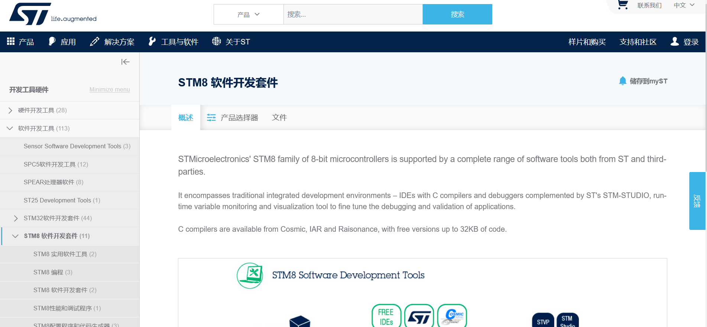

进来以后选择`产品选择器`

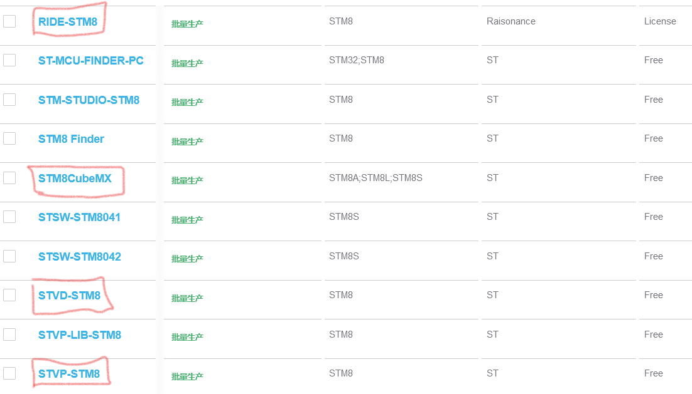

里面的`RIDE-STM8`是官方的stm8 IDE，需要license才能使用

这里选用的是采用第三方编译器的`STVD-STM8`

他还有一个烧录器`STVP-STM8`

整套开发流程就是使用`STM8CubeMX`进行芯片选型

> 这个CubeMX没有STM32那么方便能自动生成代码，官方也知道STM8那破性能，再来个自动配置寄存器自动初始化怕是要出大事

然后使用STVD配合对应芯片的库函数进行开发（也可以用寄存器，反正STM8人称小51）

最后使用STVP烧录到芯片

点击STVD进行下载

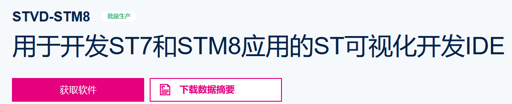

注意需要注册一个账号

这里推荐留好账号，以后会方便下载ST家的软件——如果你有下载STM32软件时留的账号那更好，直接上就行了

### STVP：一个STM8烧录软件

官网同上

下载后安装即可

### cosmic编译器：用于stm32和stm8编程的第三方编译器

STVD不能进行编译，准确的说是只能编译汇编程序

已经2022年了，就别抱着汇编往8位MCU里塞了，好歹人家20+MHz主频呢，那点性能损失不至于（老板抠门除外）

所以还得下载cosmic编译器来编译c程序，属于是奉旨脱裤子放屁

官网

https://www.cosmicsoftware.com/download.php

如下图所示，点击画出的部分直接下载即可

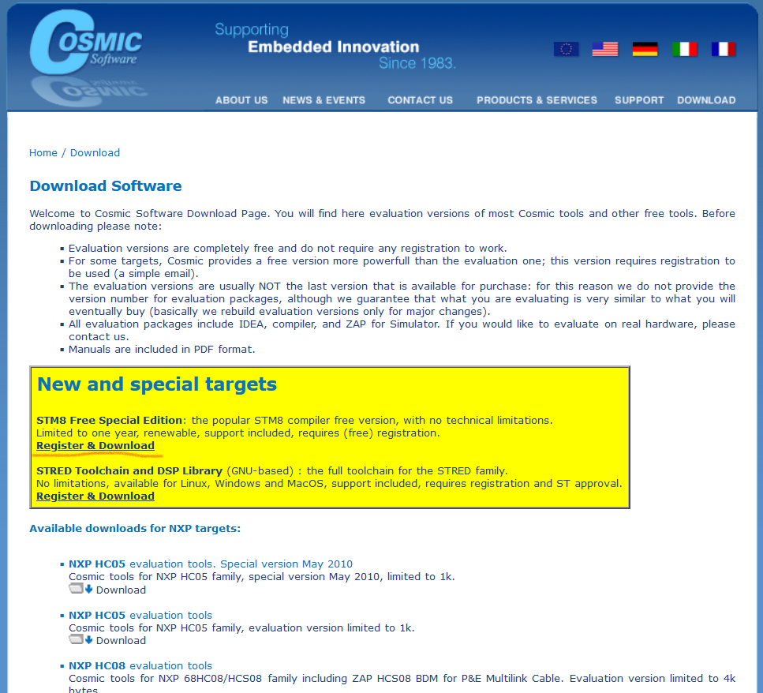

之后需要先注册，随便填一些东西，然后随便找个邮箱就可以。点击Submit提交以后就可以下载啦！

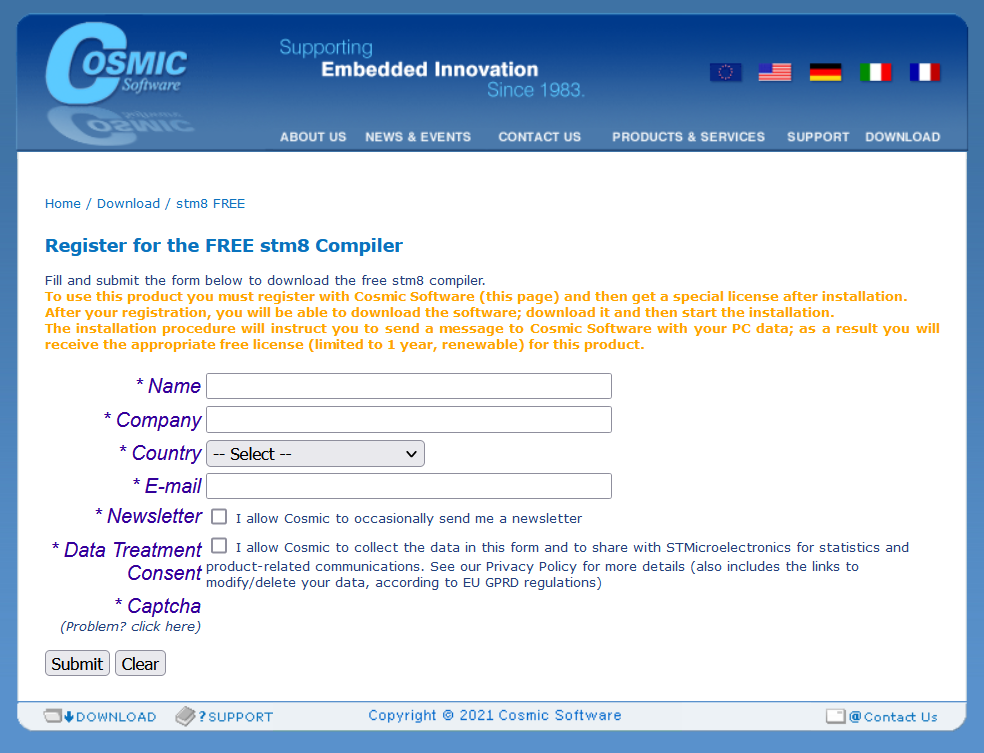

如果验证码有问题点击下面的那个`Pproblem?click here`就可以弹出验证码了

亲测不使用火狐浏览器就可以避免问题（火狐招谁惹谁了）

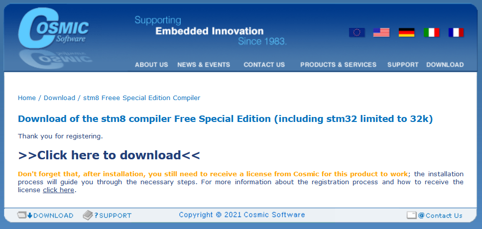

注意软件必须有license才能使用，而且对于stm8只可以使用32K免费使用权限，每台电脑是1年。必须使用邮件或在线获取license

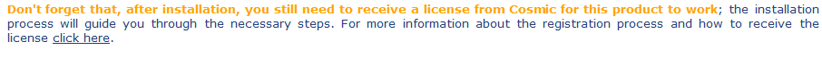

### ST-LINK驱动

把st-link的SWO连到stm8，电脑插上st-link以后进入STVP会自动安装st-link驱动

## 进一步配环境

把所有软件依次安装完毕，跟着指示一步步来就可以

然后**进入STVD**，接下来要向里面添加编译编译器

在之前安装cosmic的时候应该把cosmic的安装路径记下

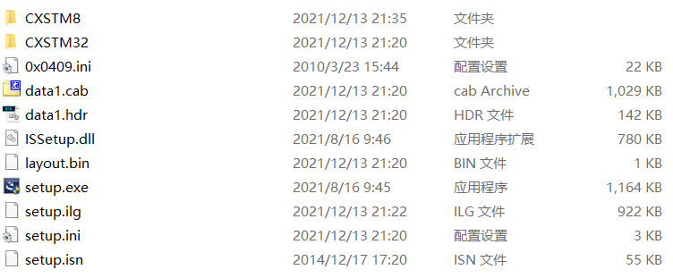

里面有CXSTM8这个目录，它就是cosmic编译器的所在位置了

回到STVD，选择【Tools】-【Option】-【Toolsets】页面进行设置。cosmic编译器所在位置，确认即可

原来的状态是这样

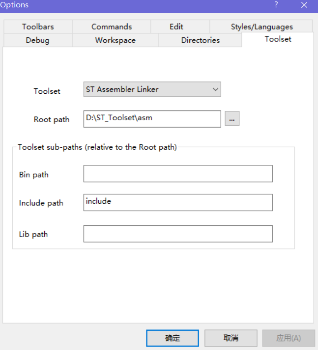

选择Toolset到stm8，配置即可

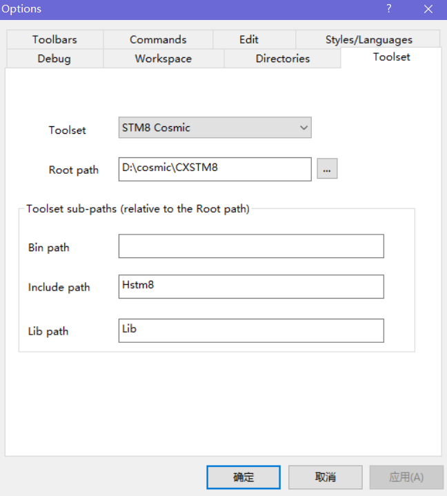

如果有弹窗提示缺少license，那就要把之前获取的license加进来，而如果license不好用还需要通过cosmic的license管理器换license

配置完以后还需要选择一个调试工具，这个只要选在用的调试器就行，比如使用ST-Link就如下设置

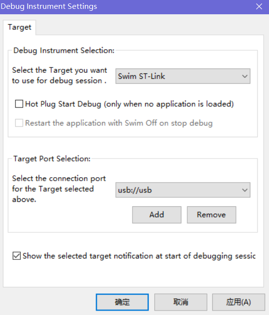

## 配软件环境

所有硬件任务都完成了，接下来就是找库函数和例程啦

ST给了一大堆例程和一个与STM32标准库很相似的STM8库

在ST官网上面的搜索框里搜索`STM8`出现下面页面

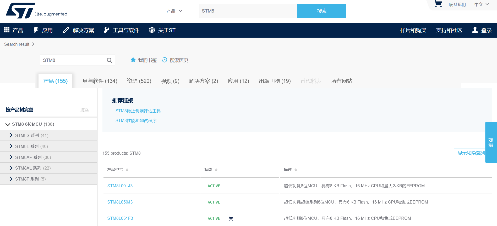

找到左侧STM8 8位MCU后，点击下面的对应系列

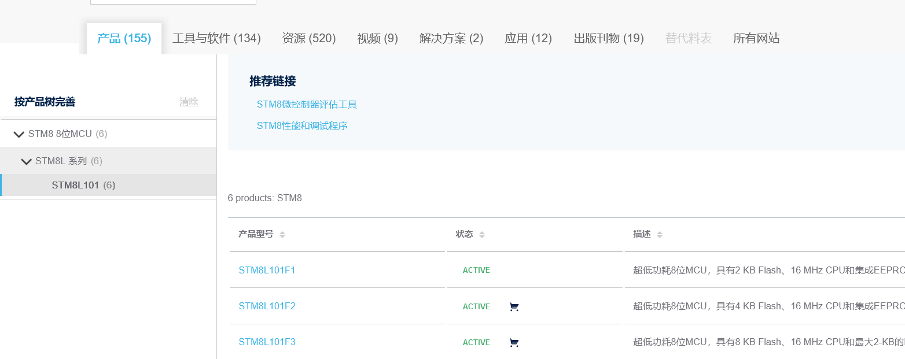

这里就是所有对应芯片的软件资源了，点击需要芯片的具体型号

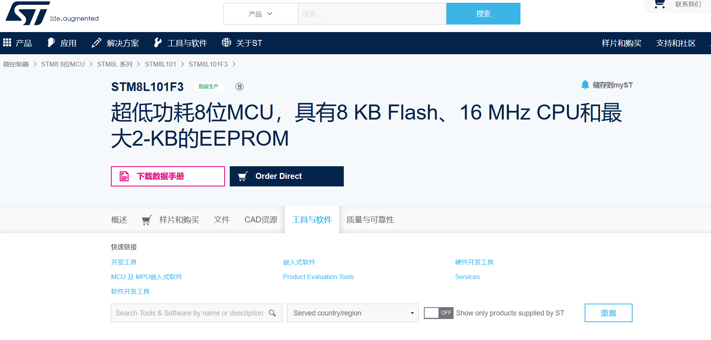

进入界面后找到`工具与软件`

往下翻，直到发现


可以发现这一栏里面有

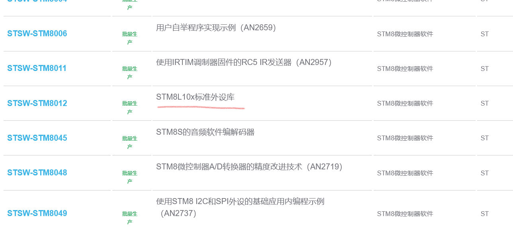

点击它

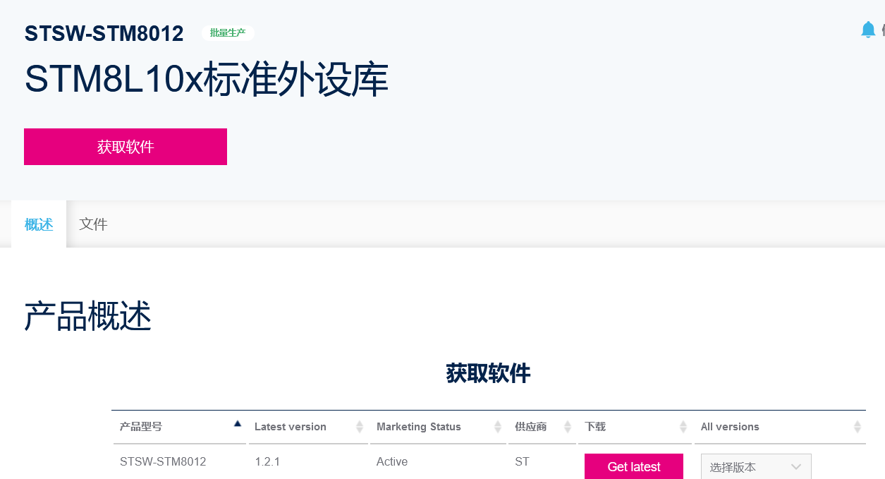

直接下载即可

## 点灯

从例程里复制一个闪灯程序

```c
#include "stm8l10x.h"

#define LED_GPIO_PORT  GPIOA
#define LED_GPIO_PINS  GPIO_Pin_2

void Delay (uint16_t nCount);

void main(void)
{
    /* Infinite loop */
	GPIO_Init(LED_GPIO_PORT, LED_GPIO_PINS, GPIO_Mode_Out_PP_Low_Fast);
    while (1)
    {
		GPIO_ToggleBits(LED_GPIO_PORT, LED_GPIO_PINS);
		Delay(0xFFFF);
    }
}

void Delay(__IO uint16_t nCount)
{
  /* Decrement nCount value */
  while (nCount != 0)
  {
    nCount--;
  }
}

#ifdef  USE_FULL_ASSERT

/**
  * @brief  Reports the name of the source file and the source line number
  *   where the assert_param error has occurred.
  * @param file: pointer to the source file name
  * @param line: assert_param error line source number
  * @retval : None
  */
void assert_failed(uint8_t* file, uint32_t line)
{
    /* User can add his own implementation to report the file name and line number,
       ex: printf("Wrong parameters value: file %s on line %d\r\n", file, line) */

    /* Infinite loop */
    while (1)
    {
    }
}
#endif
```

选择左上角【file】-【New Workspace】找到【Create workspace and project】

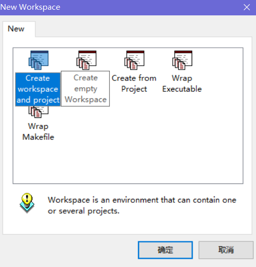

创建一个工程

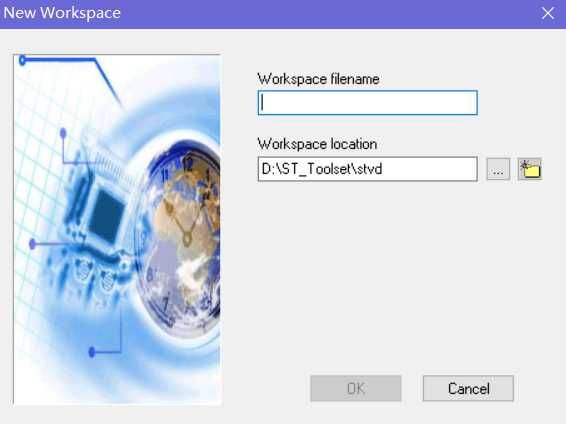

如下配置（随便打的文件名）

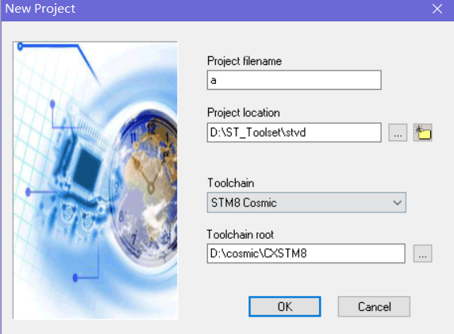

选择一个合适的型号

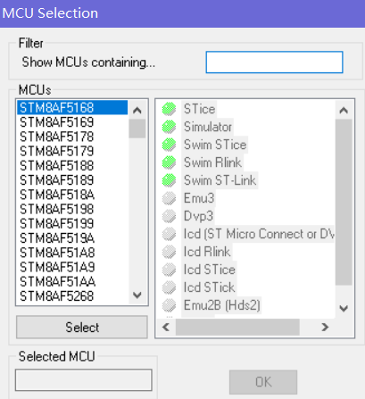

像使用keil一样把官方的STM8标准库添加进工程，并依次添加`Inc`目录里的头文件即可

再把之前那段复制的代码放到main.c里就行了

