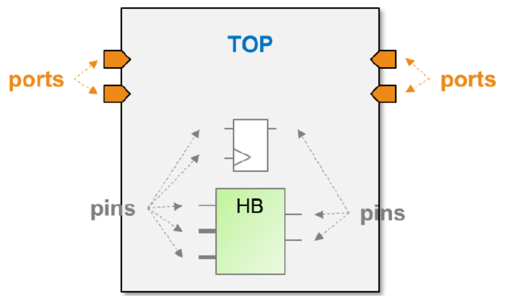

# 基于Tcl脚本使用Vivado

本博文参考高亚军《Vivado/Tcl零基础入门与案例实战》和Xilinx官方文档*ug894*编写，如有错误，**请以官方文档为准**

## 使用Tcl选取Vivado的RTL对象



Vivado对项目中的基本目标做了以下分类：

* ports：**顶层设计**的**IO**，仅限于顶层RTL模块（Top Module），用于测试的testbench封装则不会被视为顶层设计
* pins：**底层模块和门级网表**上的元件端口**IO**
* cells：**所有RTL模块**、黑盒（blackbox）、其他门级元件等
* nets：模块间连线和模块内部**连线**
* clocks：在时序约束中体现的时序和**时钟通路**

使用`get_*`命令就可以选取这五类目标

ports仅指顶层端口，所以get_ports的使用相对简单，可以配合通配符“* ”以及Tcl语言中处理list的命令一起使用

```tcl
get_ports A #仅列出叫做A的ports
get_ports * #列出所有ports
get_ports *data* #列出名字中含有data的ports

llength [get_ports *] #列出所有ports的数量
lindex [get_ports *data*]0 #列出名字中含有data的ports中的第一个
foreach x [get_ports *]{puts $x} #逐一打印所有顶层端口
......
```

不同于ports仅指顶层端口，要定位cells和nets则相对复杂，首先需要面对层次的问题

Vivado中Tcl、XDC对网表中目标的搜索是层次化（Hierarchy）的，一次仅搜索一个指定的层次（也就是current_instance），缺省值则为顶层（top）

使用指令`current_instance`更改当前所处层次

若要搜索A层次内的所有cells和名字中含有net的nets，可以考虑两种方法：

1. 先修改层次到A，再遍历

    ```tcl
    current_instance A
    get_cells *
    get_cells *net*
    ```

2. 直接使用“相对路径/绝对路径”遍历

    ```tcl
    get_cells A/*
    ```

若要将搜索层次改为A+B+C，则可以写一个循环，逐一用current_instance将搜索层次指向A、B、C，再将搜索到的cells或nets合成一个list输出即可。Vivado提供了搜索当前层次及其子层次更便捷的方法：使用`-hierarchical`参数（可以简写为`-hier`）

> 需要注意，使用该参数后面所跟的搜索条件仅指目标对象的名字，不能含有代表层次的`/`
>
> pins在Vivado数据库中表示为`<实例名>/<pin名>` 的形式，这个名字作为整体存在，实例名表示这个pin所属的实体。在使用get_pins配合-hier来查找pins时，“/”可以作为名字的一部分出现在搜索条件内

比如

```tcl
get_cells -hierarchical * #搜索top层及其下所有子层次的所有cells
```

在搜索网表中的目标时，除了上述根据名字条件直接搜索的方式，还可以利用目标间的关系，使用`-of_objects`参数（简写为`-of`）来间接搜索特定目标，例如

```tcl
get_pins -of [get_cells cell_a] #返回cell_a这个模块的所有IO
get_nets -of [get_cells cell_a] #返回cell_a这个模块内部的所有连线
```

在使用`get_*`命令查找网表中的目标时，除了名字这一直接条件，往往还需要辅以其它更复杂的*条件判断*

Vivado提供高级查找功能：使用`-filter`参数就可以结合Tcl支持的各种关系和逻辑运算符甚至是正则表达式来查找目标

## 使用Tcl指令完成Vivado工作流

FPGA的工作流和IC设计的工作流类似，但是FPGA的后端工程量要小很多。对应来讲，FPGA开发的前端设计是把RTL综合为对应的门级网表，这一步不仅能通过FPGA厂商提供的IDE等完成，也可以用IC御三家（C家、S家、M家）实现；而后端设计则是把门级网表布局布线到FPGA的LUT/CLB/DSP上实现的过程

Vivado统一了约束格式和数据模型，因此**在设计实现的任何一个阶段都支持XDC约束**，在每一步都能输出包含有网表、约束以及布局布线信息的DCP（设计检查点）

> 代价是让Vivado变得非常臃肿

Vivado的非工程模式和工程模式下都能使用Tcl指令，但是一般会将Tcl指令写成脚本在非工程模式下执行，这样的好处是能与make工具协同，方便后期开发；非工程模式也支持图形界面，产生的DCP可以直接在vivado中打开，支持GUI操作

非工程模式下，设计实现过程中的每一步数据和运行结果都存在于Vivado分配到的机器内存中，用户不主动输出的情况下不会存储到硬盘中

Vivado的工程模式本质是对Tcl命令的封装和智能调用：工程模式下的Tcl脚本更简洁，但并不是最底层的Tcl命令，执行一条工程模式下的Tcl命令（或在Vivado IDE里面点击一个按钮）相当于执行非工程模式下的数条Tcl命令

在《Vivado中的Tcl脚本》这篇笔记中已经介绍过如何使用Tcl脚本进行FPGA设计，因此这里不再赘述，主要介绍一下Vivado工作流中使用Tcl指令能完成的特殊操作

1. **Hook Scripts**

    Vivado GUI中内置了tcl.pre和tcl.post，用户可以在综合与实现的设置中找到。设计实现的每一步都有一前一后两个位置可供用户加入自己的Tcl脚本

    在执行某一步前，Vivado会优先调用设置好的tcl.pre脚本；在执行完后会调用tcl.post脚本

    对于需要额外优化的布线路径或要筛选出某些时钟通路的情况，可以考虑这个特性

2. **phys_opt_design**

    物理优化是在后端通过复制、移动寄存器来降扇出和retiming，从而进行时序优化的重要手段，一般在布局和布线之间运行，Vivado还支持布局后的物理优化。物理优化可以运行多次，并选择不同的directive来有侧重的优化时序

    使用tcl脚本中的`phys_opt_design`完成物理优化，可以针对事先通过get_nets命令找到并定义为高扇出网络的路径进行多次优化来改善时序

    布局布线之间的多次物理优化不会恶化时序，但会增加额外的运行时间，也有可能出现时序完全没有得到优化的结果。布线后的物理优化有时候会恶化THS，所以应在每一步后都运行时序报告，并通过write_checkpoint质指令写出一个DCP来保留阶段性结果

3. **增量设计流程**

    当设计进行到后期，每次运行改动很小，在开始后端实现前读入的设计网表具有较高相似度的情况下，Vivado提供**增量布局布线**功能

    在有一个已经完成布局布线的.dcp文件的情况下，可以使用`read_checkpoint -incremental`指令读入DCP并以此用来作为新的布局布线的参考。Vivado会重新利用已有的布局布线数据来缩短运行时间，并生成可预测的结果

    > 当设计有95%以上的相似度时，增量布局布线的运行时间会比一般布局布线平均缩短2倍。若相似度低于80%，则使用增量布局布线只有很小的优势或者基本没有优势

    增量布局布线对没有发生变化的设计部分造成的破坏也很小，因此能减少时序变化，最大限度保留时序结果

    一般要求用做参考的DCP文件必须是一个完全时序收敛的设计。