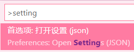
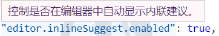
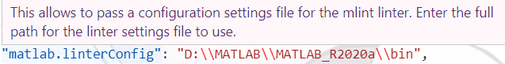
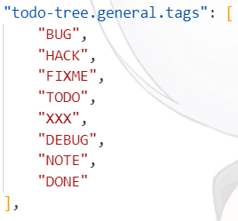
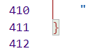
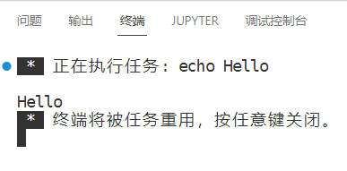
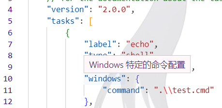
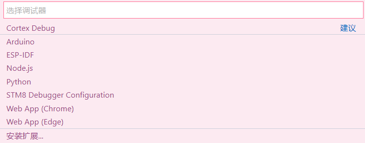
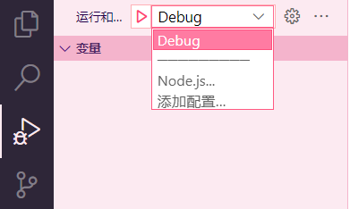

# 更好的代码编辑器

> vim、sublime、vscode使用感想

vim、emacs、sublime、vscode并不是天天写前端后端程序员的专用工具。实际上越来越多的电工（搞嵌入式的）从IAR、Keil、VS传承中走出来，转而使用这些轻量级的代码编辑器，硅农（码芯片的）更是天天和vim、emacs打交道，毕竟很多老插件不支持新代码编辑器。

笔者也算是一个用过很多代码编辑器的电工了，最近发现《Visual Studio Code权威指南》打折，直接买了一波。虽然说VSC有官方文档，这本书纯属浪费纸（迫真），个人感觉这本书的纪念意义大于实用意义——vim、emacs、sublime这些经典的代码编辑器都有自己的纸质使用指南，作为刚诞生数年的新代码编辑器，VSC能在短短时间内积累大量用户，并拥有一本属于自己的指南书，也证明了它的优秀。

什么让vscode这么优秀？易上手的操作、符合用户直觉的界面、开源生态......都是vsc发展的源泉。其中最重要的是什么呢？笔者认为VSCode的开源生态才是最关键的——emacs也是开源，但它诞生于RMS的天才；VSC不同，它源于开源社区的共同努力，这一点是区别于以往任何代码编辑器的最大特点

> 没错这里就是要吹爆VSC
>
> ~~微软拥抱开源，典中典地狱笑话了属于是~~
>
> 微软别的软件都挺恶心人，但VS一家能处（暴论）

## VSCode的基础框架

vscode的核心组件包括**Electron**、**Monaco Editor**、**TypeScript**、**LSP**、**DAP**、**Xterm.js**，还有基于web的**插件**体系（或者说微软的开源生态支持）

VSCode常被戏称为“在浏览器里面写代码”，事实上确实如此，不管是后端逻辑还是前端实现渲染，全都依赖着Web技术栈。这点有利有弊——优点是VSCode能够被搬到网页里，在物理机性能足够的情况下有高可移植性；但相对的，VSCode不像vim、emacs这些老代码编辑器那么轻量级——vim可以在嵌入式设备上跑甚至能带一大堆炫酷插件，而VSCode的原生ARM版本还有待完善（高情商），一个双核Cortex-A9可能（一定？）会卡死在VSCode上

在微软VS、GitHub的加持下，VSCode的插件数正在快速增长，并且越来越多的芯片公司将自己的SDK放到VSCode里面，微软目前还在尝试将嵌入式调试插件加入VSC，IAR等老牌嵌入式厂商也在推出vscode-like的编辑器和相关插件。

### Electron

> 如果说vim是最好的代码编辑器，那么emacs就是最好的操作系统，vscode是最好的浏览器

Electron原名Atom Shell，是GitHub开发的开源桌面应用程序框架。它基于HTML、CSS、JavaScript这些*Web前端*技术栈，以*Node.js*作为运行时，渲染引擎使用到*Chromium*。Atom、Twitch、Skype、WhatsApp等软件都基于Electron实现。

[框架官网](https://www.electronjs.org/)描述Electron的三大特性：Web、开源和跨平台，这个框架最大的特点是既可以开发桌面应用也可以将代码部署到网页，同时具有良好的跨平台特性

### Monaco Editor

Monaco是VSCode最核心的组件。这是一个基于*浏览器*的代码编辑器，支持语法高亮、代码验证、格式化、跳转、快捷键、文件比较等功能，只要有一个浏览器它就能跑。VSCode总负责人Gamma在加入微软之初的项目就是Monaco，它被广泛应用在微软的云产品、Edge和Office软件中。现在Gitee、Eclipse等公司的产品也都用上了Monaco作为在线编辑器。很多大学的oj平台、个人博客也都尝试性嵌入Monaco。一些芯片初创公司基于Monaco开发自己的SDK/IDE

### TypeScript

这是微软在2012年发布的一款开源编程语言，是JavaScript的超集，实现了元组、类型批注、推断和擦除、接口、枚举、泛型、命名空间等功能，“比JS更面向对象”。

VSCode中基于变量类型的智能提示、静态语法检查等功能就是TypeScript提供的

### LSP（Language Server Protocol）

语言服务器协议LSP是代码编辑器与语言服务器LS之间的一种协议，通过JSON-RPC传输消息，从而让各种不同的编辑器能方便嵌入各种编程语言。该协议最早是微软为VSCode开发的，2016年后随着微软推行LSP的标准化，现在LSP在vim、emacs、sublime等轻量级代码编辑器中也都很常见了。LS为代码编辑器提供了自动补全、定义跳转、代码格式化等与编程语言相关的功能

### DAP（Debug Adapter Protocol）

该协议基于JSON实现，用于开发工具和调试工具之间的通信。调试器提供了断点、变量查看和监控、多线程、堆栈调用、调试控制台等功能，而作为前端的代码编辑器界面需要一套能兼容不同语言调试器的协议，VSCode团队设计了一个被称为Debug Adapter的中间层来实现调试工具和前端之间的兼容，使用到的协议就是DAP

DAP和LSP都是为了编辑器和语言支持解耦实现的

### Xterm.js

VSCode的一个特色就是*集成终端*，可以在编辑器里面直接使用CMD、PowerShell、Bash、tmux、Cygwin等终端应用

这个功能就是基于Xterm.js开发的，它是一个使用TypeScript开发的前端组件，支持嵌入bash、vim、tmux等主流终端，支持GPU渲染和Unicode

需要注意：这是一个前端组件，通过与bash进程连接来实现终端模拟器的效果

## VSCode脚本

VSCode是非常容易上手的，基本操作和VS中一模一样，如果是习惯了vim、emacs、atom、sublime这些编辑器的用户还可以在插件中心安装对应快捷键的扩展或者直接在设置中选择对应快捷键映射，就能按照原有习惯使用VSC了。

这里主要谈一下VSC的脚本配置。VSCode使用json作为主要格式，在编写的时候会有一种在写前端的感觉（笑）

### settings.json

VSCode提供json脚本的设置和图形界面的设置方式，但是图形界面配置的方式会隐藏一些配置项，而且本质上也是在自动添加脚本，推荐老手采用json脚本配置

<kbd>Shift</kbd>+<kbd>Ctrl</kbd>+<kbd>P</kbd>来唤出指令框，输入`setting`即可找到配置文件，也可以在图形界面右侧找到打开配置文件的图标，点击即可进入配置文件



这里主要说明一下json的语法，如果想要进一步学习可以参考[菜鸟教程](http://home.ustc.edu.cn/~xie1993/json/json-tutorial.html)或者参考笔者之前写过的[cJSON简介](https://redlightasl.github.io/2021/11/14/%E7%8E%B0%E4%BB%A3C%E8%AF%AD%E8%A8%802/)

JSON即**JavaScript Object Notation**——JavaScript对象表示法，是基于JavaScript衍生出的轻量级文本数据交换格式，类似XML是独立于语言的，但比XML更小更快。

JSON具有以下特性：

* 纯文本，且人类可读
* 具有嵌套的层级结构，一个项下面还允许存在子项
* 可通过JavaScript进行解析
* 可使用AJAX进行传输

**JSON语法是JS对象表示法语法的子集**，遵从JS对象的基本描述原则：

- 数据在名称或值对中，多个数据由逗号分隔
- 用花括号保存对象，用方括号保存数组

JSON的最基本数据类型包括名称/**值对**、**值**、**数组**和**对象**

名称和值对在JSON中是同一个意思，最常见的形式就是`a:b`，例如

```json
"Character": "A"
```

它等价于JS中的赋值语句

```javascript
Character = "A"
```

JSON的值可以是**数字**（包括整数和浮点数）、**字符串**（用双引号括起）、**逻辑值**（true和false）、**数组**、**对象**、**空值**null。这个值就是上面值对右侧的那个东西，比如可以如下构建值对：

```json
"Character": "A" //字符串
"Number": 123 //数字
"int": 456 //整数
"float": 23.3 //浮点数
"logic": true //逻辑值
```

一个JSON数组需要用方括号括起来，例如：

```json
"array": ["A", "B", "C"]
```

一个数组内也可以包含多个对象（由对象构成的数组）：

```json
"array": [
    {
        "Order": 1, "Value": "ok" 
    },
	{ 
        "Order": 2, "Value": "ok" 
    },
	{ 
        "Order": 3, "Value": "ok" 
    }
]
```

JSON对象在花括号中书写，对象可以包含多个名称/值对，例如

```json
{
    "firstName": "John", 
    "lastName": "Doe"
}
```

与这条JS语句等价

```javascript
firstName = "John"
lastName = "Doe"
```

一个对象内也可以包含多个数组

那么现在你已经学会JSON了（笑），VSCode的设置中所使用的就是这样的语句，例如



```json
"editor.inlineSuggest.enabled": true,
```

通过更改后面的true或者false就可以让编辑器内自动显示内联建议了

还有一些对常用路径的设置，采用字符串值对的形式：



```json
"matlab.linterConfig": "D:\\MATLAB\\MATLAB_R2020a\\bin",
```

也有下面这样的数组：



需要特别注意：**整个settings.json存储了一个对象，需要在文件开头和末尾用大括号括起来**




### Tasks.json

VSCode支持被称为Task任务的json脚本，使用Task可以让编译、静态检查、代码构建等工作自动化。本质上Task是启动了一个进程来运行自动化脚本，其通过.vscode目录的tasks.json进行配置。

在VSCode中使用`Configure Tasks`指令就可以创建一个新任务，需要注意当前目录下的.vscode目录内不能有已经存在的tasks.json，否则会覆盖掉VSCode提供的原始模板

VSCode提供了MSBuild、Maven和.Net Core的基本任务模板还有一个helloworld空模板，这里在空模板基础上演示，生成的代码如下：

```json
{
    // See https://go.microsoft.com/fwlink/?LinkId=733558
    // for the documentation about the tasks.json format
    "version": "2.0.0",
    "tasks": [
        {
            "label": "echo",
            "type": "shell",
            "command": "echo Hello"
        }
    ]
}
```

执行`Run Task`指令，会显示出所有可运行的任务

VSCode会首先询问是否要针对错误和警告扫描任务输出，这里选择执行而不扫描，得到以下结果：



用户可以使用如下属性来自定义任务：

> 详细内容可以查看官方文档
>
> 事实上新版VSCode中，将鼠标停留在任意属性名上都会展示其功能
>
> 

* "version"：任务版本，只是一个标签

* "label"：在用户界面上显示的任务名称

* "type"：任务类型，分成**shell**和**process**两类，shell类型任务会作为一系列shell命令在bash、cmd等命令行界面（CLI）中执行，而process类型任务会作为一个进程运行（持续运行）

* "command"：真正执行的命令

* "windows"：在windows环境下执行的特殊指令对象，这个对象可以有以下属性：

    * "command"：执行的命令
    * "args"：执行命令的参数
    * "options"：其他命令选项

    同样的，linux环境下也可以定义"linux"对象，osx环境下可以定义"osx"对象

* "group"：组别。可以选择**build**、**none**、**test**三种，build组任务可以运行`Run Build Task`指令来执行，test组的任务可以运行`Run Test Task`命令来执行

* "presentation"：这是一个对象，定义了用户界面如何处理任务的输出，这个对象下可以有以下属性

    * "echo"：控制是否将执行的命令显示到面板中
    * "reveal"：可以选择**always**、**never**和**silent**，其中always表示每次运行都会展示其输出，silent表示静默输出
    * "focus"：指示控制面板是否获取焦点
    * "panel"：控制是否在任务间共享面板。可以选择new、dedicated和share，分别表示每次执行任务都会新开一个面板；为本任务维护一个专用的面板；和其他任务共享面板
    * "showReuseMessage"：控制是否显示“终端将被任务重用，按任意键关闭”的提示
    * "clear"：控制是否在执行任务之前清除终端

* "options"：这是用于控制任务工作目录、环境变量、shell值的对象，可以有以下三个属性

    * "cwd"：已执行程序或脚本的当前工作目录。如果省略则使用代码的当前工作区根目录
    * "env"：已执行程序或shell的环境。如果省略，则使用父进程的环境
    * "shell"：使用的shell

* "runOptions"：这是用于控制任务运行的对象，可以有下面的属性

    * "instanceLimit"：允许同时运行的任务的实例数，表示本任务可以同时运行多少个
    * "reevaluateOnRerun"：是否在重新运行时重新评估任务变量
    * "runOn"：对该任务何时运行进行配置。可以选择**default**或**folderOpen**，在选择后者的情况下，该任务将在文件夹打开时自动运行

上面的内容支持代码提示和补全，如果忘记的话也可以直接去官方文档查阅

任务还支持被称为**问题匹配器**（*problemMatcher*）的功能，通过配置不同的问题匹配器属性值来启用不同语言的错误和警告扫描功能

VSCode还支持**变量替换**功能，它内置了一些预定义变量，在执行任务或在配置脚本中同一将其替换成用户可能需要的变量值。常用预定义变量如下所示：

| 预定义变量                 | 替换值                                          |
| -------------------------- | ----------------------------------------------- |
| ${workspaceFolder}         | VSCode中打开目录的完整路径                      |
| ${workspaceFolderBasename} | VSCode中打开的目录名                            |
| ${file}                    | 当前打开文件的完整路径                          |
| ${relativeFile}            | 当前打开文件相对workspaceFolder的路径           |
| ${relativeFileDirname}     | 当前打开文件的上级目录相对workspaceFolder的路径 |
| ${fileBasename}            | 当前打开文件的文件名（包含扩展名）              |
| ${fileBasenameNoExtension} | 当前打开文件的文件名（不包含扩展名）            |
| ${fileDirname}             | 当前打开文件的目录完整路径                      |
| ${fileExtname}             | 当前打开文件的扩展名                            |
| ${cwd}                     | 任务启动时的工作目录                            |
| ${lineNumber}              | 当前光标所在行号                                |
| ${selectedText}            | 当前光标选中的文本                              |
| ${defaultBuildTask}        | 默认build task的名字                            |
| ${pathSeparator}           | 操作系统中用于分割目录的符号                    |

通过`${env:Name}`语法还能够引用环境变量；通过`${config:Name}`语法可以自定义引用VSCode中的配置项

使用`${input:variableID}`可以允许用户在使用脚本时输入变量，输入变量的各种属性可以用inputs属性定义

使用任务可以有效简化编译、测试等任务，免去大段指令。同时由于在CLI中直接执行指令，任务还可以调用外部shell script、python、perl、tcl等脚本，从而完成更复杂的任务

### launch.json

VSCode是支持调试功能的，为了适配工程内的各个不同调试器，VSCode使用launch.json脚本配置对应工程。在VSCode中点击左侧调试栏，点击创建launch.json文件即可在.vscode目录下创建一个配置文件


VSCode会显示运行环境的可选列表，例如



在这里以C语言调试为例，选择任意项，或直接在.vscode目录下新建一个launch.json即可

如下配置文件

```json
{
    "version": "0.2.0", //文件版本信息注释
    "configurations": 
    [
        {
            "name": "Debug",
            "type": "cppdbg",
            "request": "launch",
            "program": "${fileDirname}\\${fileBasenameNoExtension}.exe",
            "args": [],
            "stopAtEntry": false,
            "cwd": "${fileDirname}",
            "environment": [],
            "externalConsole": false,
            "internalConsoleOptions": "neverOpen",
            "MIMode": "gdb",
            "miDebuggerPath": "D:\\MinGW\\bin\\gdb.exe",//指定调试器所在路径
            "preLaunchTask": "Build"//调试开始前执行的任务，我们在调试前要编译构建。与tasks.json的label相对应，名字要一样
        } //,{} 这样加入新的项
    ]
}
```

configurations对象是对调试配置的描述，所有属性都要在这里完成，如果想要配置多种调试方法，还可以在大括号后面加入新的项

name、type都可以自定义，和之前task的配置类似。request表示请求配置类型，可以选择launch（启动程序并调试，所启动的程序在后面program项描述）或者attach（将程序附加到一个正在运行的进程中并进行调试）。这三个属性是launch.json中每个调试配置的必要属性。有了他们以后就可以把这一条配置显示在调试界面了



和任务一样，launch.json也支持"presentation"属性来配置调试时候的命令行显示。internalConsoleOptions属性也用来定义控制台显示选项；*preLaunchTask定义了在调试之前要运行的任务，postDebugTask定义了在调试结束后要运行的任务，利用这两个属性就可以在运行调试中自动化执行需要的任务，能与上面的tasks.json协同工作*

当然，像是变量替换、windows/linux/osx三系统独立属性等launch.json也都支持

但比较特殊的是，想要调试某种语言的代码，除了需要调试器以外，还需要在VSCode里安装对应语言的插件或者自行编写脚本才能进行方便的调试工作，很多插件会支持自定义的json属性，例如：

program：要调试程序的路径

args：程序调试时传递给程序的命令行参数

env或environment：环境变量

port：要附加到的进程的端口

cwd：调试所在工作目录

stopAtEntry：是否在程序入口进行断点

console：指定程序输出的位置，可以选择internalConsole调试控制台、integratedTerminal集成终端或者externalTerminal外部系统终端

此外，launch.json还支持全局配置，在settings.json中加入

```json
"launch": {
    "version": "0.2.0",
    "configurations": [{
        "type": "mytype",
        "request": "launch",
        "name": "Global Launch Program",
        "program": "${launch_program}",
    }]
}
```

这这样的对象，就可以建立一套全局适用的调试配置了

##  VSCode工程管理

### 多语言工程管理

VSCode的一个方便之处就是能适应多种语言。在嵌入式软件开发中，往往一个项目根目录里面需要包含很多子目录：

* 板级硬件原理图PCB设计：一般不需要IDE编辑，但有时候也要编辑SPICE仿真或xml文件，这就要求代码编辑器需要支持SPICE、XML、JSON等语法
* 片上硬件设计：一般使用Verilog/SystemVerilog/VHDL等语言实现，如果使用HLS的话可能还需要编辑器提供C/C++支持
* 片上硬件仿真：一般使用各种EDA软件进行片上硬件的仿真，一般会使用Shell Script、make工具或Tcl、Python等脚本语言来调用EDA软件，因此编辑器最好可以提供Shell、Tcl语法支持
* 嵌入式底层软件设计：最基础的嵌入式软件开发，使用C/C++，有时候也会用到对应CPU平台的汇编。很多时候芯片厂商会提供基于开源工具链的SDK，如果要实现复杂功能，RTOS也是必不可少的，因此编辑器还要支持Make、CMake、Kconfig等语法方便组织庞大的项目
* 嵌入式设备调试：嵌入式设备的调试过程比一般的桌面应用程序更加复杂，开发者需要使用调试器和专用的调试软件（或者OpenOCD），我们希望编辑器可以监视缓存、内存、CPU寄存器、外设寄存器、Flash数据等关键信息，最好可以显示RTOS的堆栈信息、线程信息等
* 嵌入式算法设计：涉及到算法的仿真和部署，一般要使用Matlab或Python进行仿真，转成C/C++进行部署，因此编辑器需要支持Matlab、Python、Jupyter Notebook等
* 嵌入式Linux开发：嵌入式Linux往往需要以设备树、U-Boot、Kernel、Buildroot四大件来实现移植，更有甚者会直接移植安卓环境，因此需要编辑器支持Linux一系的GNU工具语法（设备树），最好提供安卓支持

只有Vim、Emacs等老牌代码编辑器依托丰富的插件可以基本完成上面这些功能——但VSCode可以做的更好更美观

> 这就是为什么我成了VS Code死忠粉

### 插件管理

VSCode的插件商店开箱即用很方便，同时支持插件过滤器功能，通过`@`开头的指令可以定向过滤用户需要的插件，具体指令可以参考官方文档。

VSCode的插件系统也可以使用配置文件进行管理
