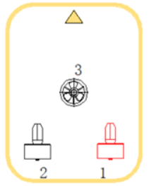
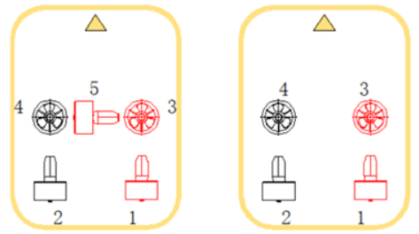
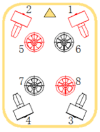

# 水下机器人技术2【ROV和AUV】

水下机器人是水下无人设备中的一种。水下机器人主要分为有缆的**无人水下机器人**（Remotely Operated Vehicle，**ROV**）和无缆的**无人自治水下机器人**（Autonomous Underwater Vehicle，**AUV**）。

## 分类

ROV是结构相对简单的水下机器人，能够在大部分浅水环境中使用，在现有环境下的实际应用前景更广阔；目前很多科研机构倾向于研制AUV，其技术难度一般比ROV更高，但由于水下环境通信、感知的物理障碍，AUV具有很高的损坏、丢失风险，受制于当前控制算法，AUV的工作规划也具有较高实现难度。因此商业公司倾向于量产ROV获得商业利益，同时推出几个型号的AUV来积累先进技术

按照运动方式不同，水下机器人可以分为

* **步行式**：采用与双足机器人类似的步行机构进行运动
* **履带式**：使用履带在河床/海床上运动
* **浮游式**：使用仿生机构或水下推进器在水中移动

其中浮游式水下机器人是目前应用最广泛的，因为其造价相对较低且更加灵活，各国科研机构和商业公司制造最多的也是浮游式水下机器人，**英国Saab Seaeye公司**和**中国鳍源、潜行创新等公司**主要生产浮游式ROV。履带式水下机器人在水下采矿、水下设备维护等需要”重劳力“的场景下非常实用，**英国SMD公司**是世界上最大的水下机器人制造商，他们主要制造的就是这类机器人。步行式水下机器人和陆地上的双足机器人一样处在一个上不来下不去的地方，卡在这了，不过前景还是很广阔的。

按照用途不同，水下机器人常常分成

* **消费级**

    消费级水下机器人主要面向民用和部分商用市场，主要功能是执行水下观测和辅助作业，一部分机器人会搭载机械臂和声呐，一般重量较轻

* **产业级**

    产业级水下机器人主要面向商用市场和政府市场，一般搭载多自由度机械臂和专用的水下作业设备，大都会搭载声呐，重量常在数百千克到数吨

* **军用级**

    军用级水下机器人主要面向政府（军队）市场，一般搭载各种武器、高精度声呐，没有固定的外形和重量，从最简单的用于排雷的ROV到巡游反潜的复杂AUV不一而足

特别地，AUV常常被分成

* **传统型机器人**：采用开放框架或流线型外壳的传统AUV，具有无缆灵活、航速快（一般不需要大型推进器就可以达到4kn以上的航速）的特点
* **仿生水下机器人**：采用各种仿生外形的的AUV，科研机构倾向于设计这样的AUV来验证控制算法或探索新的机械结构，但实际应用中还没有见到这样的机器人

## 核心技术

水下机器人作为跨学科的前沿技术领域，也具有很多核心技术，每类技术得到突破都可以让机器人的应用水平得到跨越式提升

水下机器人也是机器人，因此它同样要遵循传统机器人学的定义完成四大主要工作：**感知、规划、决策和执行**

### 高精度水下导航技术

面对复杂的水下环境，自主导航能力是限制ROV定位和AUV自主巡游的最关键环节。高精度水下导航技术基于传统的捷联惯导、智能导航算法和多传感器融合。IMU、北斗/GPS、图像声呐、CMOS视觉传感器等感知设备时实现高精度水下导航的基础。

与自动驾驶领域的SLAM不同，水下声学和高精度捷联惯导在水下导航中起核心作用；激光雷达和北斗/GPS定位在水下无法工作，CMOS图像传感器也只能在浅水或依赖大功率照明灯进行探测。因此发展水下融合导航是一个关键方向

### 水下声学感知技术

目前能够在各种海况下应用的水下目标探测设备仅限于声学设备。图像声呐、前视声呐、侧扫声呐、环形声呐、下探声呐是目前水下应用最好的传感器。声呐类似于激光雷达，但声学回波的噪声和扫描延迟都远大于光信号，滤波和处理难度极大，为了实现更低的延迟，一般采用专用DSP和FPGA搭载复杂的数字信号处理算法来实现声呐数据采集。同时能够应用在水下环境的压电陶瓷成本高昂，这导致声呐的成本极高，一个能够正常应用的声呐售价常在数百万，且核心技术被国外公司垄断。

水下声学还具有人类难以辨读的困难，因此通常需要使用算法将声学图像转换成人类能分辨的视觉图像或深度图像，再进行三维重建得到场景信息

### 水下光学感知技术

虽然水下光信号衰减非常大，但由于CMOS视觉传感器便宜（相对于声呐）且技术更成熟，因此具有不可替代的作用。配合大功率水下照明灯和水下特化的机器视觉算法，视觉感知能够很好地完成近距离精准导航、目标检测、姿态感知等工作

水下光学绝不是最佳的水下感知手段，这是由海水的物理化学性质导致的——一旦海水在雨后或由于特殊海况变得浑浊，水下视觉将一片模糊；对于河水亦是如此

### 高密度能源

水下机器人的工作环境决定了其需要大功率长时间作业，这就对高密度能源提出了要求。目前产业级水下机器人多使用动力电池电芯或内燃机供能；消费级水下机器人则多利用动力电芯供电或岸基高压供电。

目前水下机器人的电源发展趋势是混合供能、高能量密度，以此提高机器人整体续航。电动汽车的BMS方案和油电混合方案都可以应用在水下设备。同时无线充电也是一个潜在的发展方向，但由于能量利用率较低，在工业环境下很少见

### 智能控制

智能控制是目前各种无人设备的核心，借助于人工智能技术的发展，机器人的感知、规划、决策等算法都可以从普通机器人解决方案中得到借鉴

产业级水下机器人的关键执行器是多自由度机械臂，因此机械臂运动控制相关的算法也扮演着重要角色，大型水下机器人本身是一个大滞后系统，如何进行敏捷控制也是需要纳入考量的；消费级水下机器人常用于水下摄影，在轻量水下机器人中实现的抗海流和相机云台自稳算法则是关键；AUV则由于其特殊的用途和外形，需要使用复杂的控制算法来实现水下自稳、急转弯、航线规划

### 混合水下通信

目前水下通信的方案主要有有缆通信、水下声学通信、水下光通信三种，其他通信方式作用距离一般都很短，因此不纳入考量。水声通信和有缆通信都可以分成模拟通信和数字通信两种。有缆模拟通信采用电力载波（PLC）方案，将信号调制到电力线中，从而实现较远距离的通信；有缆数字通信则直接使用以太网、光纤等中远距离通信方式实现信号传输。目前有缆通信的带宽远远大于水下声学通信和水下光通信，因此在工业中广泛应用。

模拟水声通信直接利用海水信道传输数据，能量利用率低，已经被数字水下通信淘汰。利用FSK、ASK、PSK等方式的数字编码调制解调器可以将数字信号调制到海水信道传输，增加了数据带宽，抗干扰性能提高，能量利用率也大大提升。

水下光通信是一个潜在的发展方向，但由于海水的光学性质，水下光通信还需要解决诸多困难才可能得到应用。目前水声通信是水下机器人远距离通信的唯一有效通信方式，也是比较理想的无缆通信方式。

### 系统工程

水下航行器和航天器一样是融合精密制造和先进控制技术的设备，一样具有高成本的特征，也一样是复杂系统，需要利用系统工程思维进行功能规划、项目进度管理、稳定性测试等，以保障最后成品能够正常运行

## ROV基础知识简介

典型的ROV由**水面设备**（包括控制台、线缆绞车、吊机、配电系统等）和**水下设备**（包括控制舱和潜水器本体）组成。

水下设备潜水器本体在水下靠推进器、履带、拨动鳍等提供动力，装有观测设备（包括但不限于摄像头、照明灯、声呐等）和作业设备（包括但不限于机械手、机械臂、切割器等）。操作员在母船上控制水下设备，靠线缆向本体提供动力、传输信息。目前的ROV也正从简单的遥控向半自主作业演变，母船控制器和潜水器控制舱采用阶梯控制，操作人员通过人机交互系统下达抽象命令，并接收经计算机处理的信息，对潜水器本体运动和动作过程进行监视并排除故障，潜水器的具体运动则由控制舱内智能算法进行处理。

### ROV的总体设计要求

ROV的总体设计需最大程度发挥各种装置和仪器的技术性能，保证机器人设计满足规定的各项指标

1. **安全可靠**
2. **布置紧凑**
3. **预留备用空间**

ROV与AUV不同，更贴近作业场景而不是水下侦察，因此应当遵循下列原则设计机械结构：

* 阻力相对小，航速相对高
* 机械强度高
* 便于总体布局
* 工艺制造简便

有缆水下机器人通常由电缆供电，动力充足，目前最流行也是经过实践检验的机械结构就是**开放框架**。虽然运动阻力较大，但机器人总体布局方便，容易加挂和换装搭载设备仪器，框架还可以起到保护、支撑水下机器人部件的作用。

### ROV推进器布局设计

**推进器的数量**和**推进器位置布局**决定了水下机器人运动性能和姿态性能。

不具有矢量推进的ROV至少需要3个自由度：前进后退、左右转向、上下潜浮。这样就至少需要三个推进器，如下图所示

目前*SimpleROV*就采用了这一布局

然而这个结构中，推进器3将带来水平方向的扭矩，导致机器人在水中容易发生自转；同时两个水平推进器布局位置偏差也会导致机器人差速转向时出现前后方向位移。SimpleROV还有以下两个版本

它们都可以采用双垂直推进器抵消水平方向扭矩，还引入横滚这个新的自由度，是低成本水下机器人推进器布局的优秀选择

而BlueROV框架的推进器布局采用水平矢量布置，具有高推力比，能实现在任何方向上精确移动，除了差速转向还能实现侧移（侧推）功能

重载版搭载了8个推进器，能够实现6自由度全向运动

每两对推进器都采用正反桨对称布置，从而抵消水平和垂直方向的力矩。实际工作中八推全向布局能够实现更好的稳定性，但造价相对更高

### ROV稳定性设计

当一个不稳定的物体能固有地使自己处于稳定状态时，它被称为具有“正稳定性”。**通过使ROV的重心低而浮心高，可以容易地实现正的纵向和横向稳定性**。除了重心、浮心高度比外，机器人长宽比、推进器布局等都会影响ROV的稳定性

宏观看，ROV静止漂浮于水中时只受到两个作用力，即作用于重心并垂直向下的重力和作用于浮心并垂直向上的浮力，我们得到ROV平衡条件：

1. 重力与浮力的大小相等、方向相反
2. 重心G和浮心B在同一条铅垂线上

如果ROV的浮心低于重心，会导致机器人的动力学模型等效为*倒立摆*，并且由于机器人在水中的复杂受力，需要引入更加复杂的控制算法让机器人保持稳定