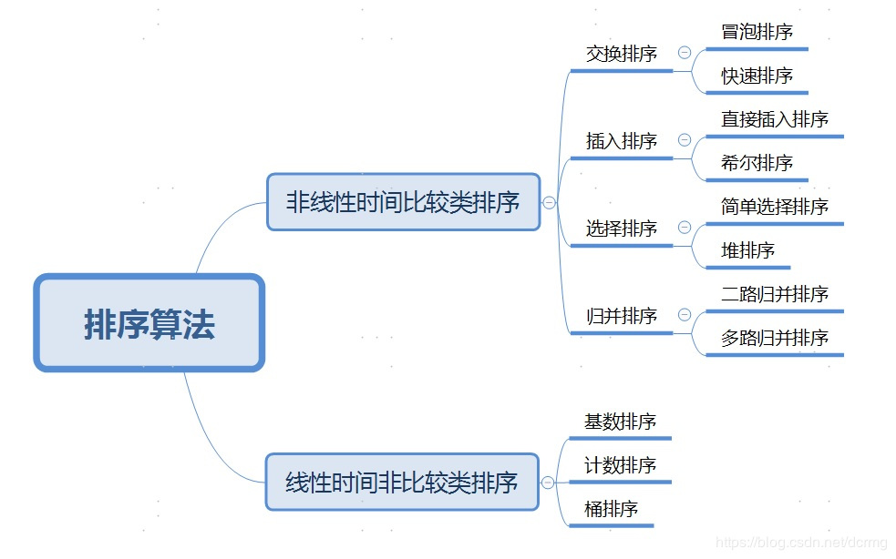

# 直接插入排序（Insertion Sort）

### 基本思想

将待排序的无序数列看成是一个仅含有**一个元素的有序数列和一个无序数列**，将无序数列中的元素逐次插入到有序数列中，从而获得最终的有序数列。

### 算法流程

1. 初始时，a[0]自成一个有序区，无序区为a[1,...,n-1]，令i=1
2. 将 a[i]并入当前的有序区a[0,...,i-1]
3. i++并重复步骤2，直到i=n-1，排序完成

**详细描述如下：**

1. 从第一个元素开始，该元素可以认为已经被排序
2. 取出下一个元素，在已经排序的元素序列中从后向前扫描
3. 如果该元素（已排序）大于新元素，将该元素移到下一位置
4. 重复步骤3，直到找到已排序的元素小于或者等于新元素的位置
5. 将新元素插入到该位置中
6. 重复步骤2

```c
//直接插入法一
void InsertSort1(int a[], int n)
{
    int i, j;
    for(i=1; i<n; i++)
        if(a[i] < a[i-1])   
        {
            int temp = a[i];                     //保存要比较的值
            for(j=i-1; j>=0 && a[j]>temp; j--)   //从后向前查找待插入位置
                a[j+1] = a[j];                   //交换位置
            a[j+1] = temp;                       //复制到插入位置
        }
}

//直接插入法二：用数据交换代替法一的数据后移(比较对象只考虑两个元素)
void InsertSort2(int a[], int n)
{
    for(int i=1; i<n; i++)
        for(int j=i-1; j>=0 && a[j]>a[j+1]; j--)
            Swap(a[j], a[j+1]);
}

void Swap(int a,int b)
{
    int temp;
    temp=a;
    a=b;
    b=temp;
}
```

# 冒泡排序

遍历数组，找到比选中数更大/小的数，交换两者位置

最简单的排序方式之一

**时间复杂度：**

1. **最好：O(n)**
2. **最坏：O(n^2)**

**空间复杂度：O(1)**

```c
//冒泡排序
void BubbleSort(int* a,int N)
{
    for(int i=0;i<N;i++)
    {
    	for(int j=1;j<N-i;j++)
        { 
            if(a[j]<a[j-1])
            {
               	Swap(a[j-1],a[j]);//交换两者位置
            }
        }
    }
}
```

# 快速排序

通过一趟排序将要排序的数据分割成独立的两部分，其中一部分的所有数据都比另外一部分的所有数据都要小，然后再按此方法对这两部分数据分别进行快速排序，整个排序过程可以递归进行，以此达到整个数据变成有序序列

算法流程如下：

1. 设定一个分界值，将数组分成左右两部分
2. 将大于或等于分界值的数据集中到数组右边，小于分界值的数据集中到数组的左边
3. 将左边和右边的数据独立排序。左侧数据可以取另一个分界值，将该部分数据分成左右两部分，同样在左边放置较小值，右边放置较大值；右侧数据同样
4. 重复上述过程，通过递归将左侧部分排好序后，再递归排好右侧部分的顺序，当左、右两个部分各数据排序完成后，整个数组的排序也就完成了
5. 停止条件就是把最后的基准分界值排序完毕

**平均时间复杂度：O(nlgn)**

当排序已经成为基本有序状态时，变为**最坏时间复杂度：O(n^2)**

**平均空间复杂度：O(logn)**

**最坏空间复杂度：O(n)**

```c
//快速排序
void QuickSort(int a[],int left,int right)
{
    if(left<right)
    {
        int i=left,j=right；
        int base=a[left];             //基准分界值
        while(i<j)
        {
            while(i<j&&a[j]>=base)    //从右往左找小于分界值的元素
                j--;
            if(i<j)
                a[i++]=a[j];
            while(i<j&&a[i]<base)    //从左往右找大于分界值的值
                i++;
            if(i<j)
                a[j--]=a[i];
        }
        a[i]=base;                   //将分界值填入最后的坑中
        QuickSort(a,left,i-1);       //递归调用，分治
        QuickSort(a,i+1,right);
    }
}
```

# 鸡尾酒排序

鸡尾酒排序也可以称为**双向冒泡排序**，它先从低到高然后再从高到低来回排序

**算法流程如下：**

1. 对数组从左到右进行冒泡排序，让最大的元素位于最右端 
2. 对数组从右到左进行冒泡排序，让最小的元素位于最左端 
3. 循环前两步操作，依次改变冒泡的方向，不断缩小未排序元素的范围，直到最后一个元素结束

**时间复杂度：**

1. 顺序排列时，**时间复杂度为O(n)**
2. 逆序排列时，**时间复杂度为O(n^2)**
3. 原始序列杂乱无序时，**平均时间复杂度为O(n^2)**

**空间复杂度：O(1)**

```c
//鸡尾酒排序
void CocktailSort(int a[], int n)
{
    int left  = 0;
    int right = n-1;
    while(left<right) //循环直到排完最后一个元素
    {
        for(int i=left;i<right-1;i++)
        {       
            if(a[i]>a[i+1]) //从左到右排
            {
                Swap(a[i],a[i+1]);
            }         
            
            right-=1; //向右移动
            
            for(int j=right;j>left;j--)
            {     
                if(a[j]<a[j-1]) //从右到左排
                {
                    Swap(a[j],a[j-1]);
                }
            }
            left+=1;
        }
    }    
}
```

# 希尔排序

希尔排序也是一种插入排序，它是简单插入排序经过改进之后的一个更高效的版本

希尔排序**把记录按下标的一定增量分组**，对**每组**直接**插入排序**；随增量逐渐减少，每组包含的关键词越来越多，当增量减至1时，整个文件恰被分成一组，算法便终止

希尔排序的步骤如下：

1. 选择增量

   希尔排序的增量可以用一个序列来表示，称为增量序列

   一般选择希尔建议的增量$gap=length/2$，即$\{\frac n2,\frac {\frac{n}{2}}{2},\cdots,1 \}$，称为**希尔增量**

   这个增量不是最优的，最优增量需要根据具体问题进行选择

2. 根据gap值将数据分组，对每一组分别进行插入排序

3. 进行下一轮迭代，得到新的分组，继续对每组进行插入排序

4. 重复迭代，直到分成1组

希尔排序中对于增量序列的选择十分重要，直接影响到希尔排序的性能

**时间复杂度：**

希尔增量最坏时间复杂度为**O(n^2)**

Hibbard增量最坏时间复杂度为**O(n^(3/2))**

**空间复杂度：**

**O(1)**

```c
//希尔排序法一
void shellSort(int a[],int n)
{
    int i, j, gap, temp;
    for(gap = n/2; gap > 0; gap /= 2)
    {
        for(i = gap; i < n; i += gap)
        {
            temp = a[i];
            for(j = i-gap; (j>=0)&&(a[j]>temp); j -= gap)
            {
                a[j+gap] = a[j];
            }
            a[j+gap] = temp;
        }
    }
}

//希尔排序法二，和上面的直接插入排序类似，用数据交换代替法一的数据后移(比较对象只考虑两个元素)
void ShellSort(int a[], int n)
{
    int i, j, gap;
    for(gap = n/2; gap > 0; gap /= 2) //分组
    {
        for(i = gap; i < n; i++) //直接插入排序
        {
            for(j = i-gap; (j>=0)&&(a[j]>a[j+gap]); j -= gap)
            {
                Swap(a[j], a[j+gap]);
            }
        }
    }
}
```

# 折半插入排序

利用二分法的思想，在一个有序的序列中，找到新元素在该序列中的位置然后插入，比直接插入排序快，但记录移动的次数没有变

**时间复杂度：**

**O(n^2)**

**空间复杂度：**

**O(1)**

```c
void ZhebanInsertSort(int a[],int n)
{
    int i,j,low,high,mid;
    for(i=1;i<n;i++)
    {
        temp=a[i];
        low=1,high=i; //设置折半查找范围
        while(low<=high)
        {
            mid=(low+high)/2;  
            if(a[mid]>temp)
            {
                high=mid-1; //查找左半部分
            }
            else
            {
                low=mid+1; //查找右半部分
            }
        }
        
        for(j=i;j>=high+1;--j)
        {
            a[j+1]=a[j]; //统一后移元素，空出插入位置
		}
        a[high+1]=temp; //插入
    }
}
```
