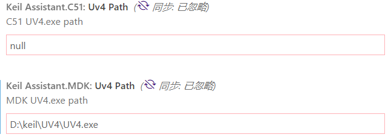

# 使用C语言进行嵌入式开发

C语言语法简单、容易上手，因此常被各大高校用于编程教学或与电子信息专业结合作为单片机的主要开发语言。通常的编程是指在桌面级平台、服务器平台、PC或其他通用计算机上进行程序编写，在现代的编程环境下，C常常被诟病“老套、不美观、面向过程、难以使用”，但事实上C11标准引入以来，Linux生态中C语言扮演着重要角色。同时，在更广阔的嵌入式开发领域，C语言作为一个有着靠近底层、高效率，而又不依靠汇编实现的编程语言发挥着重要作用

以上都是废话

这篇博文主要介绍使用C语言进行嵌入式开发的一些基础要点，并简要介绍常用的工具

本篇建立在前两篇《现代C语言》的基础上，不再介绍gcc、make、cmake、kconfig等工具

## 交叉编译器


## 串口工具

### Minicom简介

minicom是在linux环境下常使用的串口工具，它提供了命令行中访问串口的功能

安装（ubuntu为例）

```shell
sudo apt install minicom
```

基本操作如下：

```shell
minicom -s # 进入设置
minicom # 进入软件
```

在软件中先按【Ctrl】 +【a】，再按【z】即可进入设置模式，再按【x】可退出

进入设置模式后可以按上面显示的按键操作进入对应的选项

按【o】可进入串口的具体设置，包括调节波特率、选择端口都可以在这里完成

minicom默认读取`/dev/modem`，如果提示找不到，可以先使用下面的指令创建软链接到`/dev/modem`

```shell
ln -s /dev/modem 你接入串口对应的文件
```

或先使用参数进入minicom的设置界面，更改要读取的文件并保存后再正式进入软件

### Putty简介

Putty是一个多平台兼容的虚拟命令行软件

可以支持SSH、串口终端、Telnet协议、Raw数据等登陆方式

有Win、Linux、MacOS多操作系统支持

配合百度就可以轻松使用，算是非常常用的终端软件了（如果不喜欢它也可以试试**XShell**）

## 调试与OpenOCD

### JTAG接口协议

**JTAG**（**Joint Test Action Group**，联合测试工作组）是一种国际通用的标准化芯片内部测试协议，现在大多数可编程器件都支持JTAG协议，通用处理器、DSP设备、FPGA器件、大多数MCU-SoC等

标准JTAG是4数据线：

- **TMS**：测试模式选择（Test Mode Switch），用来设置JTAG接口处于某种特定的测试模式
- **TCK**：测试时钟输入（Test Clock），用于设置JTAG总线时钟
- **TDI**：测试数据输入（Test Data In），数据通过TDI引脚输入JTAG接口
- **TDO**：测试数据输出（Test Data Out），数据通过TDO引脚从JTAG接口输出

由于JTAG在定义初期，计算机设备都使用并口传输数据，因此它保留了2*8并口的标准，现在能看到的牛角座接入JTAG标准也是从并口演变而来的，只不过把一些并口数据线设为接地，一些数据线设为空脚

在传统的并口JTAG中，存在TRST、TDI、TMS、TCLK、TDO、RTCK、RESET这些数据线，因此比较冗余，在要求体积的设备上不推荐使用，但好处在于市面上大部分JTAG调试器都默认支持这个协议

**为了支持JTAG协议，需要现在器件内部定义一个TAP（Test Access Port，测试访问口），并在CPU内核里设置专门的调试指令**。TAP是一个通用的端口，要求通过使用TAP访问芯片中所有数据寄存器和指令寄存器，整个过程通过独立的TAP控制器完成，这个控制器一般使用较为复杂的状态机实现，独立于CPU内核，甚至CPU的通用寄存器都可以由它访问，因此TAP控制器一般被称为**TAP状态机**。

除了调试，JTAG还可以进行ISP在线编程；多个器件可以通过JTAG接口以菊花链的形式链接到一起，实现对多个器件分别测试

**SWD与JTAG**


SWD是ST公司在JTAG之外开发的独立的调试总线，即串行调试线（Serial Wire Debug），它只需要2条数据线即可实现高速调试：

* **SWDIO**：串行调试数据线
* **SWCLK**：SWD时钟数据线

### JLINK与ST-LINK

J-Link是德国SEGGER公司推出基于JTAG的仿真器，其实就是一个USB转JTAG的适配器，但是它做到了跨平台、高速高效、稳定性极强，配合上位机调试软件可以实现最高速的调试

ST-LINK是ST公司专门针对STM8和STM32系列芯片推出的仿真器。ST-LINK/V2可指定使用SWIM接口或JTAG或SWD标准接口对设备进行调试

### JTAG片上硬件调试原理

JTAG片上设备，也就是TAP状态机，需要实现以下数据线：

- **TCK**：TAP总线时钟。由于JTAG总线时钟是独立的，TAP时钟不会由片内总线提供，而是由片外的JTAG引脚接入
- **TMS**：模式选择信号，用于*控制TAP状态机的转换*。
- **TDI**：数据输入信号。
- **TDO**：数据输出信号。由上面两个数据线实现全双工数据传输
- **TRST**：复位信号，用来对TAP状态机进行复位（初始化）。这个信号接口在IEEE 1149.1标准里*并不是强制要求的*，因为通过TMS也可以对TAP状态机进行复位
- **STCK**：时钟返回信号，在IEEE 1149.1标准里非强制要求，这个信号用于确认指令完成状态

整个状态机的运作过程如下：

1. 系统上电后，TAP状态机进入**Test-LogicReset**（复位）状态

2. 根据TCK信号上升沿依次进行状态转移

    一般情况下会按照以下顺序进行默认检测

    1. **Run-Test/Idle**：如果之前没有指令插入，此状态下为空闲
    2. **Select-DR- Scan**：扫描设备里所有的数据寄存器
    3. **Select-IR-Scan**：扫描设备里所有的指令寄存器
    4. **Capture-IR**：某个特定的逻辑序列被加载到指令寄存器中（指令插入预备）
    5. **Shift-IR**：将一条特定的指令送到指令寄存器中（强制指令插入）
    6. **Exitl-IR**：TAP状态机退出访问指令寄存器状态
    7. **Update-IR**：强制更新指令寄存器来执行刚才插入的指令
    8. **Run-Test/Idle**：如果之前又指令插入，此状态下会完成对指令寄存器的访问

3. 通过TMS信号对TAP状态进行切换

4. 通过TDl和TDO数据线，将新的数据加载到数据寄存器中；经过一个周期后，就可以捕获数据寄存器中的数据，完成对与数据寄存器的每个寄存器单元相连的芯片引脚的数据更新

正是由于JLINK使用了Cortex-A内核搭配FPGA来实现最快速的TAP状态机，因此才能获得高速性能

### JTAG电路原理


### OpenOCD


## 总线工具


### 传统总线调试方法


### 树莓派spi与iic调试工具


## 嵌入式C语言编码推荐规则

注意：==**这里的所有编码规则都只是个人推荐！请一定要选择适合自己的统一易读的编码风格！不要被随意影响！**===

### 一般规则

1. 使用C99标准

   虽然C11支持了一些对开发者友好的新特性，但是C11的某些特性在特殊的交叉编译器上可能难以实现，为了保证代码统一性，目前还是应该使用旧一代的C99标准

   而且更重要的，可能不是所有人都熟悉C11标准，使用C99这个大部分国内院校教授的C标准有助于工作对接

2. 每个缩进使用4个空格，不要混用tab和空格

   主要为了在各个代码编辑器下实现统一规范的代码样式

3. 在关键字和左括号之间使用一个空格，在函数名和左括号之间不使用空格

   有助于区分函数和关键字（某些代码编辑器并没有函数/关键字高亮——不针对keil）

   ```c
   /* 示例 */
   if (t != 0)
   {
   	int32_t a = sum(1,4); 
   }
   ```

4. 尽量不在变量/函数/宏中使用下划线或前缀，除非有意保留统一的编码格式或用于头文件编译

   C语言和库的保留参数，懂得都懂

5. 可以适当使用前缀标注特殊的变量性质

   例如`interrupt_LED_ON`表示一个用于中断服务函数和主程序通信的全局变量

   但注意风格一定要统一！

6. 采用统一的分行大括号或同行大括号，不要混杂使用

   ```c
   for (i=0;i<N;i++)
   {
       p++;
   }
   //文件内采用统一格式
   for (i=0;i<N;i++){
       
   }
   //不要两种格式混用，否则可能会被打
   ```

7. 对于一般的变量，使用驼峰命名或下划线命名或其他适合规范的命名法，**一定不要使用汉语拼音！一定不要使用汉语拼音！一定不要使用汉语拼音！**

   例如`HelloWorld`、`test_parameter`

   杜绝`xiaozhanbihu`、`cha_bu_duo_de_le`这种诡异的东西

8. 在合适的地方采用空格拉大代码间距

   ```c
   /* 示例 */
   for (i = 0; i < N; i++)
   {
       a = 3 + 4;
       p++;
   }
   ```

   这个规范可用可不用，但注意一旦使用了这个格式化方法，一定要保持整个文件都用！否则代码会*很丑*！

9. 逗号之后使用单空格拉大间距

   ```c
   test(1, 5);
   ches(p, q, *r);
   ```

   在调用库函数的时候适合使用这个规则，有助于增加代码可读性和美观程度

10. 不要初始化静态和全局变量为`0`或`NULL`

    编译器会自动完成静态变量、全局变量的初始化工作，不显式写出是为了保证静态变量可以被很明显地看出来

11. 静态变量、全局变量、宏要大写

    非常重要的一条规则

    这些变量通常都是用于线程/函数/任务之间通信或用于指示系统资源或到处都要用的重要变量，一定要明显标明

    有些代码编辑器还会针对大写变量进行高亮

12. 声明要按照以下顺序

    * 结构体
    * 枚举
    * 整数和无符号数
    * 浮点数
    * 函数

13. 尽量在块/函数的开头声明局部变量

    有助于读者快速判断自己需要寻找的变量

14. 尽量在for循环内部声明计数变量

    ```c
    /* 示例 */
    for (int i=0;i<N;i++)
    {
        p--;
    }
    ```

15. 尽量使用`<stdint.h>`中定义的整数类型

    这是为了保证嵌入式设备中的变量位数确定，这个规范非常重要，通常可以避免一些恶性bug

    char、float、double是例外，因为char是4字节，float、double不是整数，所以可以不管

16. 不使用`<stdbool.h>`库，应分别使用1和0表示真假

    干嵌入式，连1和0都搞不明白就别干了（无慈悲）

17. 如果是接手他人代码，应该保持原有代码风格

    除非你自己用自己的代码风格重写一遍

18. `if else`语句应该单独成行并保持大括号

    ```c
    /* 示例 */
    if (a)
    {
        
    }
    else if (b)
    {
        
    }
    else
    {
        
    }
    ```

19. switch语句中的break应和case保持相同的缩进

    这个规范有助于避免忘记写break

    ```c
    switch (k)
    {
        case 1:
            abc;
        break;
        case 2:
            def;
        break;
        dafault:
        break;
    }
    ```

20. `do-while`语句孩子能够的while应和do部分的右大括号在同一行

    ```c
    do
    {
    	p++;    
    } while (k);
    ```

### Linux风格的代码规范

1. 使用doxygen注释格式

   其实个人编写的代码并不需要这个，但是如果在大工程或是团队协作中使用这个注释风格将会对工作交接（尤其是后期编写文档和展示PPT）很有帮助

2. 所有注释使用`/* */`，即使是单行注释

   对于需要特殊注明的语句使用`//`

3. 不一定要扔掉`goto`语句

   `goto`在单函数内进行条件返回的情况很好用

   但是要注意：对应的标记不论周围代码缩进如何，总保持不缩进状态

   ```c
   /* 示例 */
   void Test(void)
   {
       xxx;
       xxx;
       
       if (i)
       {
       	xxx;    
   FLAG: //不要缩进
           yyy;
       }
       
       yyy;
       xxx;
   	
       if (j)
       {
           goto FLAG; //这里使用了goto
       }
       
      	return;
   }
   ```
   
   goto代码旁边最好也通过注释显式强调
   
4. 使用<>尖括号来引用C标准库的头文件，使用""双引号来引用自定义头文件

5. 使用以下指针风格

   ```c
   /* 示例 */
   int* p; //C++风格指针，用于声明很简单的指针
   float *check_pointer; //C风格指针，用于一般指针的声明
   
   uint8_t *t = (uint8_t*)check_pointer; //指针强制类型转换
   ```

6. 使用以下风格的注释

   ```c
   /* 示例 */
   
   //多行注释
   /*
    * comment
    * comment
    * comment
    */
   
   /**
    * comment
    * comment
    * comment
    * comment
    */
   
   //单行注释
   /*
    * comment
    */
   ```

7. 普通函数固定采用下划线命名法，对结构体进行操作的函数固定采用驼峰命名法，结构体变量应固定采用驼峰命名法

   这是为了和C++的对象和方法统一风格

8. 函数返回值独立成行

9. 所有局部指针变量声明在同一行，用逗号隔开

   这个是Linux编码的一个风格，可用可不用

10. 结构体使用typedef再命名后可以使用`_t`后缀，但是原有的结构体名称不能使用后缀

11. 应该使用C99的结构体初始化风格，避免使用C11风格的初始化器

    主要用于保持代码风格统一和简洁易读

12. 函数句柄应该使用`_t`后缀

13. 大括号一定要保持良好缩进

14. 空while循环、do-while循环都要包含花括号，空for循环要用分号结束

    ```c
    while (1) {}
    do {} while (1)
    for (;;) ;
    ```

### 个人常用有助于避免bug的编码习惯

1. 使用指针后加入对指针非空的检查

   ```c
   /* 示例 */
   int* p;
   
   p=(int*)malloc(sizeof(int));
   if (p == NULL)
   {
       return -1;
   }
   ```

2. 调用有提供返回值检查的库函数后对返回值进行检查，如果出错就返回报错信息

3. 分清前增量和后增量的差别

4. 使用`size_t`作为长度或大小指示变量

5. 在自己写的库里多使用`const`保证不会被nt误用函数

6. 多使用括号和`sizeof`来避免计算顺序和变量长度问题

7. 头文件的变量一定要用extern声明并在对应的.c文件中定义

8. 头文件中最好使用C++检查来警惕有人把C库放进C++里调用

9. 如果没有对算法部分的优化或特殊考量，千万不要使用递归函数！

10. 定义宏函数时可以使用以下保护方法

    * 加入圆括号保护变量和结果
    * 使用do...while(0)保护多语句
    * 不要使用分号结尾

11. 对宏语句和预处理语句不要进行缩进！

12. 文件末尾留下一个空行

    用于应对某些讨厌的编译器/IDE报错

13. 在头文件中包含许可证

    在个人项目中能保护自己的版权，在大型项目中能够保护自己和同伙的版权

14. 使用`#program once`或`#ifndef`保护头文件

15. 头文件应该只声明公共变量/结构体/枚举/函数

16. 避免重复包含

17. 千万不要包含.c文件！

### Doxygen

这是一个为所有函数、结构或其他代码段落添加描述的辅助系统

使用Doxygen可以直接通过代码中的注释输出API文档。基本语法如下所示：

1. 由两个星开始的代码注释会被Doxygen解析，但带一个星号的注释会被忽略

   ```c
   /** 会被解析的注释内容  */
   /* 不会被解析的注释内容 */
   ```

2. 注释应放在函数和结构体前面

3. 文件头部需要使用以下格式

   ```c
   /** \file */
   ```

   否则文件不会被Doxygen解析

4. 使用`\param`来输入参数

   使用`\return`来列出返回值

   使用`\ref`来指向其他文档元素（包括函数和文件）的交叉参考

   （这其实是对LaTex的模仿）

5. 可以使用`@`来替代`\`完成上述设置（对JavaDoc的模仿）

使用指令`doxygen -g`来获得一个配置文件

STM32的标准库、HAL库和LL库，RT-Thread的源码，lwIP的源码等都遵循了Doxygen原则，很多基于Eclipse的IDE也都内置了Doxygen格式化器。一个典型的Doxygen文档如下所示（摘自STM32F407标准库）

```c
/**
  ******************************************************************************
  * @file    stm32h7xx_hal_gpio.c
  * @author  MCD Application Team
  * @brief   GPIO HAL module driver.
  *          This file provides firmware functions to manage the following 
  *          functionalities of the General Purpose Input/Output (GPIO) peripheral:
  *           + Initialization and de-initialization functions
  *           + IO operation functions
  *
  @verbatim
  ==============================================================================
                    ##### GPIO Peripheral features #####
  ==============================================================================
  [..] 
  Subject to the specific hardware characteristics of each I/O port listed in the datasheet, each
  port bit of the General Purpose IO (GPIO) Ports, can be individually configured by software
  in several modes:
  (+) Input mode 
  (+) Analog mode
  (+) Output mode
  (+) Alternate function mode
  (+) External interrupt/event lines

  [..]  
  During and just after reset, the alternate functions and external interrupt  
        lines are not active and the I/O ports are configured in input floating mode.
     
  [..]   
  All GPIO pins have weak internal pull-up and pull-down resistors, which can be 
        activated or not.

  [..]
  In Output or Alternate mode, each IO can be configured on open-drain or push-pull
        type and the IO speed can be selected depending on the VDD value.

  [..]  
  All ports have external interrupt/event capability. To use external interrupt 
        lines, the port must be configured in input mode. All available GPIO pins are 
        connected to the 16 external interrupt/event lines from EXTI0 to EXTI15.

  [..]
  The external interrupt/event controller consists of up to 23 edge detectors 
        (16 lines are connected to GPIO) for generating event/interrupt requests (each 
        input line can be independently configured to select the type (interrupt or event) 
        and the corresponding trigger event (rising or falling or both). Each line can 
        also be masked independently. 
       以下省略 
  *
  ******************************************************************************
  */ 

/**
  * @brief  Initializes the GPIOx peripheral according to the specified parameters in the GPIO_Init.
  * @param  GPIOx: where x can be (A..K) to select the GPIO peripheral.
  * @param  GPIO_Init: pointer to a GPIO_InitTypeDef structure that contains
  *         the configuration information for the specified GPIO peripheral.
  * @retval None
  */
void HAL_GPIO_Init(GPIO_TypeDef  *GPIOx, GPIO_InitTypeDef *GPIO_Init)
{
  uint32_t position = 0x00;
  uint32_t ioposition = 0x00;
  uint32_t iocurrent = 0x00;
  uint32_t temp = 0x00;
  EXTI_Core_TypeDef * EXTI_Ptr = EXTI_D1; 


  /* Check the parameters */
  assert_param(IS_GPIO_ALL_INSTANCE(GPIOx));
  assert_param(IS_GPIO_PIN(GPIO_Init->Pin));
  assert_param(IS_GPIO_MODE(GPIO_Init->Mode));
  assert_param(IS_GPIO_PULL(GPIO_Init->Pull));

  /* Configure the port pins */
  for(position = 0; position < GPIO_NUMBER; position++)
  {
    /* Get the IO position */
    ioposition = ((uint32_t)0x01) << position;
    /* Get the current IO position */
    iocurrent = (uint32_t)(GPIO_Init->Pin) & ioposition;

    if(iocurrent == ioposition)
    {
      /*--------------------- GPIO Mode Configuration ------------------------*/
      /* In case of Alternate function mode selection */
      if((GPIO_Init->Mode == GPIO_MODE_AF_PP) || (GPIO_Init->Mode == GPIO_MODE_AF_OD))
      {
        /* Check the Alternate function parameter */
        assert_param(IS_GPIO_AF(GPIO_Init->Alternate));
        
        /* Configure Alternate function mapped with the current IO */
        temp = GPIOx->AFR[position >> 3];
        temp &= ~((uint32_t)0xF << ((uint32_t)(position & (uint32_t)0x07) * 4)) ;
        temp |= ((uint32_t)(GPIO_Init->Alternate) << (((uint32_t)position & (uint32_t)0x07) * 4));
        GPIOx->AFR[position >> 3] = temp;
      }

      /* Configure IO Direction mode (Input, Output, Alternate or Analog) */
      temp = GPIOx->MODER;
      temp &= ~(GPIO_MODER_MODER0 << (position * 2));
      temp |= ((GPIO_Init->Mode & GPIO_MODE) << (position * 2));
      GPIOx->MODER = temp;

      /* In case of Output or Alternate function mode selection */
      if((GPIO_Init->Mode == GPIO_MODE_OUTPUT_PP) || (GPIO_Init->Mode == GPIO_MODE_AF_PP) ||
         (GPIO_Init->Mode == GPIO_MODE_OUTPUT_OD) || (GPIO_Init->Mode == GPIO_MODE_AF_OD))
      {
        /* Check the Speed parameter */
        assert_param(IS_GPIO_SPEED(GPIO_Init->Speed));
        /* Configure the IO Speed */
        temp = GPIOx->OSPEEDR; 
        temp &= ~(GPIO_OSPEEDER_OSPEEDR0 << (position * 2));
        temp |= (GPIO_Init->Speed << (position * 2));
        GPIOx->OSPEEDR = temp;

        /* Configure the IO Output Type */
        temp = GPIOx->OTYPER;
        temp &= ~(GPIO_OTYPER_OT_0 << position) ;
        temp |= (((GPIO_Init->Mode & GPIO_OUTPUT_TYPE) >> 4) << position);
        GPIOx->OTYPER = temp;
      }

      /* Activate the Pull-up or Pull down resistor for the current IO */
      temp = GPIOx->PUPDR;
      temp &= ~(GPIO_PUPDR_PUPDR0 << (position * 2));
      temp |= ((GPIO_Init->Pull) << (position * 2));
      GPIOx->PUPDR = temp;

      /*--------------------- EXTI Mode Configuration ------------------------*/
      /* Configure the External Interrupt or event for the current IO */
      
      if((GPIO_Init->Mode & EXTI_MODE) == EXTI_MODE)
      {
        /* Enable SYSCFG Clock */
        __HAL_RCC_SYSCFG_CLK_ENABLE();

        temp = SYSCFG->EXTICR[position >> 2];
        temp &= ~(((uint32_t)0x0F) << (4 * (position & 0x03)));
        temp |= ((uint32_t)(GPIO_GET_INDEX(GPIOx)) << (4 * (position & 0x03)));
        SYSCFG->EXTICR[position >> 2] = temp;
     
        /* Clear EXTI line configuration */
        temp = EXTI_Ptr->IMR1;
        temp &= ~((uint32_t)iocurrent);
        if((GPIO_Init->Mode & GPIO_MODE_IT) == GPIO_MODE_IT)
        {
          temp |= iocurrent;
        }
        EXTI_Ptr->IMR1 = temp;

        temp = EXTI_Ptr->EMR1;
        temp &= ~((uint32_t)iocurrent);
        if((GPIO_Init->Mode & GPIO_MODE_EVT) == GPIO_MODE_EVT)
        {
          temp |= iocurrent;
        }
        EXTI_Ptr->EMR1 = temp;
             
        /* Clear Rising Falling edge configuration */
        temp = EXTI->RTSR1;
        temp &= ~((uint32_t)iocurrent);
        if((GPIO_Init->Mode & RISING_EDGE) == RISING_EDGE)
        {
          temp |= iocurrent;
        }
        EXTI->RTSR1 = temp;

        temp = EXTI->FTSR1;
        temp &= ~((uint32_t)iocurrent);
        if((GPIO_Init->Mode & FALLING_EDGE) == FALLING_EDGE)
        {
          temp |= iocurrent;
        }
        EXTI->FTSR1 = temp;
      }      
    }
  }
}
```

Doxygen生成的文档如下所示（摘自RT-Thread）


## 使用命令行调用keil的API

### 基础指令

```shell
<UV4> <command> <project_file> <options>

# <UV4>表示keil的UV4.exe文件，注意使用绝对路径
# <command>表示要执行的指令
# <project_file>表示工程名，这个可以使用相对路径
# <options>表示参数
```

**编译示例**

```shell
d:\Keil\MDK\UV4.exe -r Template.uvproj -o Build_output.bin
```

这里编译出的文件保存为`Build_output.bin`

**烧录示例**

```c
d:\Keil\MDK\UV4.exe -f Template.uvproj -o Build_output.bin
```

这里将以MDK里选定/默认的烧录方式烧录bin文件

### 使用VSCode直接调用keil指令

VSCode中下载插件`Cortex-Debug`和`keil assistant`即可直接使用插件控制keil工程



如上图填写keil的exe文件目录即可使用