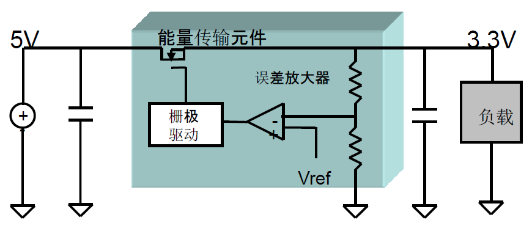
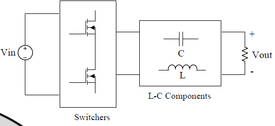
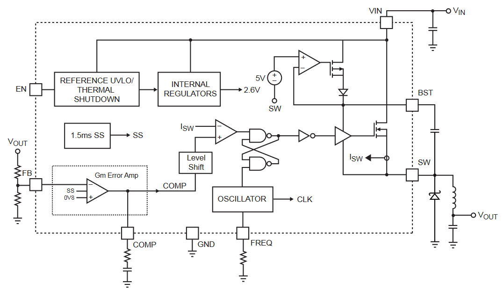

本系列博文参考《电源设计基础》（辽宁科学技术出版社）罗伯特·A·曼马诺（美）著，文天祥译总结归纳而成。如有疏漏敬请批评指正！

# 电源系统设计1【概论】

电源系统是一套上承供电系统、下连工作负载的“连接器”。针对不同需求场景，电源往往按照变换交支流（AC/DC）分为以下几个种类

*   **DC-DC**电源：常见于各种设备中的芯片供电或电平转换
*   **AC-AC**电源：常见于各种供电设施中，为后级供电系统提供初步转换
*   **AC-DC**电源：常用的直流稳压电源或开关电源在总体上说都属于这一类型
*   **DC-AC**电源：也称为逆变器，现代开关电源的初级部分就是一个小型的DC-AC电源

可以用两电阻分压得到需要的电压，这就是一个最简单的DC-DC电源，而在此之后为它的“输出端”到地跨接一个稳压二极管，就能让这个“电源”的性能更好。当然大家都知道，这种电源变换的方式很粗糙，如果用在不合适的场合还容易引起伤亡事故

>   在PC装机领域，有一个被称为红星电源的传说，这个电源以虚标功率和燃烧起火而闻名，其中输出部分就用到了两个电阻分压。
>
>   不过这个操作并不是一无是处，在很多便宜小家电中就会使用电阻分压来让小夜灯、小风扇等负载工作起来

使用运放、三极管进行线性控制就能够获得一个线性电源，当输入输出电压差小的时候，能够在较低的效率下获得稳定的电压输出，这就是当下大部分**LDO**（低压差稳压器）的原理；使用**开关电源**技术可以在理论上得到完美的效率，实际上算入所有损耗，电源效率也能轻松达到95%，但代价就是复杂的电路和更难以处理的电源管理算法。

电源作为一个复杂的电气系统，其内部元件也需要供电，特别是在使用了大量集成电路元件的现代开关电源中，**辅助电源**的效率同样重要

与此同时，电源也有自己的安规标准，包括输出纹波、高频干扰、EMI电磁兼容等等

这些内容会在之后的博文里提及，作为开始的第一篇，这里仅仅介绍一下基本的电源概念、常见元件和拓扑

## 稳压电源控制电压的手段

使用一个稳压器，放置在负载和输入电源两端，从而让它吸收掉输入输出电压之差，这样就能起到降压稳压作用并为低压负载提供供电。这是比较自然的想法。

使用一个稳压二极管可以基本实现目的，如下所示

但其中二极管损耗会很大：
$$
W=(V_{IN} - V_{OUT})(I_L+I_Z)+V_ZI_Z
$$
当且仅当输出电压小于输入电压时才能正常工作。输入输出之间的压差会由R1平衡掉，稳压管的反向击穿电阻与功率还限制了输出电流，其效率和输出精度都受到很大限制。不过，将这个思路扩展一下，只使用**电阻分压**不能让输出稳定，如果增加一个负反馈机制，那么输出将稳定很多（虽然还没能解决效率问题）

### 线性电源

使用一个比较器，将输出的电压引入反馈回路，与参考电压（想得到的电压值）比较后再转换成合适的电阻R1值，那么就能让整个电路有效工作了，这就是**线性稳压器**的基本思路。

> 所有线性稳压器都可以看成一套受控的电阻分压网络

其功率损耗还是比较大，这是线性稳压器不可避免的缺陷
$$
W=(V_{IN}-V_{OUT})I_L
$$
如果是理想状态下，用于控制反馈的半导体器件不存在损耗，整个电源的效率就等于
$$
\mu=\frac{V_{OUT}}{V_{IN}}
$$
线性稳压器的一个经典实现就是使用达林顿管作为可变电阻，用一个精密的运放作为比较器，再从输入电压处引出一个电流源为整套系统供电。过去达林顿管由多个NPN功率管构成，耐压、功率都很高，组成达林顿管后会导致C-E极电压差至少是2V，这就大大限制了线性电源的工作范围。后来随着PNP管的出现，常使用以下拓扑：

其具有低压差放大的特性，输入输出的压差可以低至0.5V，现在很多线性稳压器都采用了基于这个拓扑的改进架构。

> MOSFET也可以用在线性电源中，但是因为稳压器完全导通时需要在器件两端形成足够低的压降，MOSFET这个多子载流器件并不能很好地控制导通电阻，这就导致需要并联多个MOSFET以降低导通损耗（导通电阻），这对于控制晶圆规模来说是致命的；栅极开启电压较高的MOSFET比起小电流低电压就能使其导通的三极管，更是难以驱动，甚至需要一个额外的辅助偏置电源来进行栅极驱动（换用成本更高、没什么开启电压的PMOS也是一种方案，氪金使人变强）。不过随着现在高性能MOSFET与GaN等新材料的出现，MOSFET器件制成的线性稳压器也正在逐渐成为不错的解决方案
>
> 

线性稳压器由于结构上不可避免的缺陷，常常会导致大量发热和损耗，因此目前只有被称为LDO的电源管理芯片或是小功率的稳压器使用这种类型的拓扑。**LDO**即低压差线性稳压器，常见的型号有AMS1117、CJ1117等，常常用于提供5V-3.3V、12V-5V、3.3V-1.8V的低压小功率供电。小功率的稳压器则包括广为人知的LM317、78xx等，最好不要用它驱动超过5A的输出，否则将会出现过热、电压不稳等问题。

### 开关电源

开关稳压器可以看成在线性稳压器上进一步改进而来——原来的“晶体管可变电阻”损耗大得离谱，而且造成的都是实实在在的有功功率损耗。考虑使用一个滤波器对交流信号滤波的过程，理想状态下没有损失有功功率，同时还获得了理想的电压输出，如果将这个可变电阻换成一个DC变AC的系统，通过不同的反馈调节它，就能模拟出AC-DC电源的效果

这个DC变AC的系统一般使用*PWM发生器*，它会生成一个方波，随着反馈而来电压的高低调整其开关占空比，用于控制导通与否的晶体管全部工作在开关状态，因此损耗很小（理想情况下只存在开关动态功耗）；输出部分的滤波器则使用无源器件，从而避免了有功功率的损失，最后可以估算理想功耗
$$
W=P_{SW(open)}+P_{SW(close)} \approx 0
$$
开关管断开时，存在一个极小的漏电流；开关管导通时，由于管中内阻很小，所以管子分得电压也不大，也就是说实际情况下整体损耗是很少的。事实上整体电路损耗最大的时间段还是在导通段，而当**频率相当高、占空比相当大**的情况下，大部分时间里开关管都是关断的，于是这段时间的损耗也可以视作0。

以上这种使用方波占空比调节输出电压，配合滤波电路实现控制的方法被称为脉冲宽度调制（**PWM**），到目前为止仍在广泛使用的一个PWM生成技术如下：一个固定频率的振荡器输出高频三角波给比较器负相端；从电源输出端反馈来的电压值首先与参考电压共同输入差分放大器，控制放大二者的差模电压，随后这个差值被输送到比较器的正相端；两个波形（三角波和控制电压信号）经过比较后输出一个PWM，驱动开关管。这个振荡器输出的三角波也被称为载波，它的频率就是开关管的开关频率。

> TL494就是一个使用了该技术的芯片，它经典到现在还有不少低端充电器在使用这个作为主控
>
> 下图是mp4462的内部结构框图，现在很多大功率降压模块都用它作为主控。它提供3.5A输出电流，可以在0.8到30V之间调节输出电压，但是要保证输出电压低于输入（3.8V到36V）
>
> 
>
> 从图中可以看出电路主体就是上面所述的几个组成部分——输入差分放大器、比较器、振荡器时钟源、输出控制电路。但除此之外还包括了过流、过压保护、电压源、死区控制、斜坡补偿等等特殊的功能模块

对于一个完整的开关电源系统，通常实现了AC-DC-AC-DC这样一个信号链，第一次AC-DC变换是为了初步滤除噪声获取为电源供电的辅助电源（这是针对AC-DC电源而言，如果是DC-DC电源则只需要后面的DC-AC-DC两步变换），第二次DC-AC变换则是将低频信号转换为高频信号，从而能让变压器体积减小，第三次AC-DC则是将信号输出并完成滤波过程，可能会引入一个与源端隔离的反馈源，实现整体的负反馈控制。特别地，输出端还可以串接一个线性稳压器来让输出电压/电流更加平滑

## 稳压电源中常见的元件

### 电阻

电源中常用的电阻有三类：

* 小功率电阻

	通常使用**金属膜电阻**，它具有低成本、高精度的特征，通常以贴片元件（*SMD*）形式出现在电路里

* 大功率电阻
	通常使用**碳膜电阻**或水泥电阻，他们会很大，耐受功率较高。低端电源也会使用SMD的碳膜电阻（一般都是0805封装）来降低成本，但是其最大用途还是以直插形式用作功率电阻

* 采样电阻/精密电阻

	采样电阻要求功率极大、阻值较低，通常使用双向绕线电阻或水泥电阻，二者可以很好消除寄生电感的影响（不过还是会有一点，因此推荐这些电阻直插、外包散热片且周边没有数字器件）；精密电阻多使用昂贵的金脚电阻或干脆用线路板铜箔走线替代（阻值极低的情况）

	> 这里有一个计算公式
	> $$
	> R_s=0.47m\Omega \times \frac{L}{W}|_{1oz}
	> $$
	> 1Oz铜厚下的电阻如上式，2Oz铜厚则需要将结果除以2
	>
	> 网络上还有不少铜箔电阻计算器可用

### 电容

电源中电容的选取只有一点：**贵就是好**

90%的情况下，越贵的电容，ESR（寄生电阻）、ESL（寄生电容）、耐压、容值、温度条件就越好

> 实际电容可以视为一个RLC串联网络，在低频下体现为容性，在较高频下仍然以容性居上，而在超高频下则会体现为感性，还存在一个谐振点，谐振频率下电容表现为一个电阻

因此就需要在各种电容间进行权衡

* **陶瓷电容**、**塑料膜电容**都是常用的贴片电容材料，可以用于数控部分，但是一般电源主体关键部分的电容不会考虑它们

* **钽电容**的特点就是超低ESR和较高的价格，体积也相对较大

* **独石电容**具有相对均衡的性能，耐压一般会比较高，容值在pF等级

* **铝电解电容**相对常见，电源里面的大容值电容一般都会用它，耐压高、容值范围广，缺点就是体积很大，铝电解电容屹立在PCB之上

	> 顺带说一下，原书这里写成了铝点解电容，大伙都没看出来这个输入法问题.jpg

* **超级电容**是一类超高容值电容的统称，它们往往具有上F的容值，但是耐压奇小，一般需要串联好几个使用，更多情况下会用它们作掉电保护（不要妄想把它放在输出端）

* **固态电容**是一些特殊类别电容的统称，基本性能都不太好，但是具有较高的容值或耐压，有些电容适应于高频

### 电感和变压器

电感是一个针对需求高度定制化的器件，很多磁相关的性能指标都需要规定电感的规格。电感值决定了电感中电流的峰峰值，也决定了电感储磁的大小；电感内部还存在磁损耗，特定的磁芯影响着电感工作频率和磁损耗大小。磁性元件的磁通密度越小的电感，越容易在峰值时出现电流饱和，从而影响输出效率乃至弄坏电感器件（磁饱和时电感会变0，电流迅速上升），因此还需要配备一些保护，并斟酌材质

电源中电感一般体积越大，工作频率越低。常见的磁芯包括

* 空心：空气磁芯不会饱和，但是电感量会很低，还容易造成天线，只有射频电路的发射部分才会考虑使用螺线管密绕空心电感
* 铁心、合金芯：磁导率一般较高，铁心硬饱和，坡莫合金具有软饱和特性，二者都不适用于高频电路，但是因为铁芯便宜，所以常常作为输出电感；合金芯造成更少涡流，所以用于大电流场合
* 铁粉芯：最常见的中高频电感，体积相对较大，但是价格低、可以适用于多种场合。现在开关电源中的逆变部分高频变压器都会选用铁粉芯
* 绝缘硅钢片：高频损耗极大、体积极大、耐受涡流极大，常见于各种低频变压器

> 电感峰值的磁通密度$B=\frac{LI_{MAX}}{A_eN}$
>
> 其中A表示磁芯有效截面积，L表示电感量，I表示峰值电流，N为线圈匝数
>
> $N=\sqrt{\frac{L}{A_e}}$
>
> 几个量之间会出现相互纠缠的情况，这也是选择电感参数的难度所在
>
> 实际情况下，常常选用**合理**的电感而不是最优的电感

变压器与电感不一样，它的选型更加复杂，涉及到正激、反激、多绕组等等问题

### 二极管

电源电路中二极管的正向压降、击穿电压和功率都很重要，需要根据电路需要特地挑选；在高频开关电路中二极管的反向恢复时间是另一个重要参数，因此会使用到**快恢复二极管**，它在两端电压突然从正向变为反向时会迅速变化阻断电流，内部会有一个极大的瞬态电流，一般的二极管无法适应，很可能损坏

**肖特基二极管**是开关电路中的一个常见选择：它具有较低的导通压降、较快的恢复速度，但是价格也更贵（某些管子居然要0.7元）

### BJT与MOSFET

模电老朋友了，事实上在开关电源中MOSFET是最常出现的功率器件，因为他是一个电压驱动期间，栅极呈容性，因此导通时需要一个大瞬态电流来为电容充电，但是关断时的反向恢复时间很短，它不像三极管那样导通容易关断难，因此很适合放在大功率下实现快速关断

> 在更大功率的情况下，BJT和MOSFET的混合体IGBT就出现了，它兼具二者优势，唯一的缺点就是高昂的价格，一个民用级IGBT常常要30元以上，工业级的IGBT桥堆更是能轻松突破千元，它常常用于特高压、超大电流的场合（比如变电站的电源系统）

功率MOSFET的基本性能指标在之前的《电路设计从入门到弃坑2.5【场效应管】》部分已经介绍过，如果有需要可以参考一下

这里主要说明电源中MOSFET的关键性参数

## 开关电源的基本拓扑

