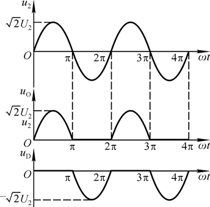
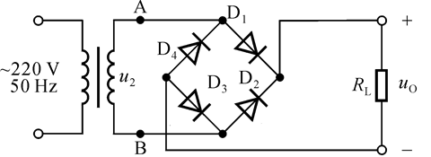
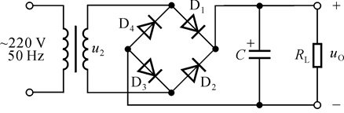
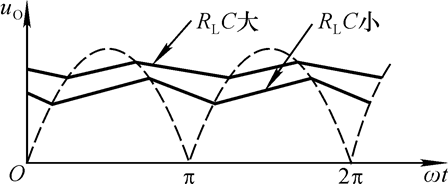
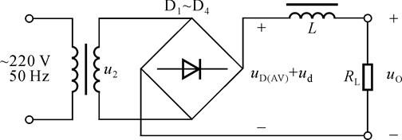
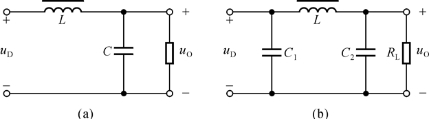
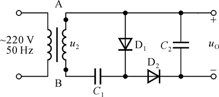
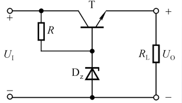
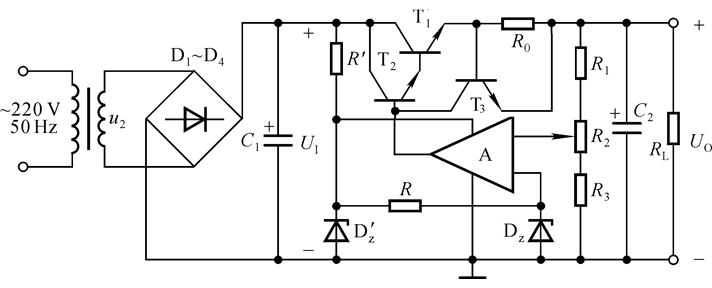

# 电路设计从入门到弃坑13【线性电源概论】

线性电源电路是一种**能量转换电路**，一般将高压交流电转换成低压直流电，但是也有一些特殊用途的线性电源会进行所谓的DC-DC变换，即将一个电压的直流电转换成另一个电压的直流电，于是就衍生出了四大类线性电源：

* DC-DC：直流转直流，常见于小功率设备上进行高效率的电压变换
* AC-AC：交流转交流，实际上起到了变压器的功能，因此这种电路常被称为“固态变压器”
* AC-DC：最传统的直流电源，多用于将220V/380V交流电转换成低压（60V/36V/24V/12V/5V）的直流电，提供给用电器
* DC-AC：逆变电路，常用于各种功率电池，可提供临时的220V/380V电源

实际上AC-DC线性直流电源目前的民用场景正在逐渐被开关电源取代，因为它在进行电压转换过程中需要先使用笨重的变压器将220V市电隔离，而且噪声相对较大，但是这里我们先用AC-DC电源的拓扑进行简要介绍，为后面的开关电源部分做准备。线性电源的另一个分支DC-DC电源则在**LDO**（低压差线性稳压器）领域大放异彩，通过经典的反馈结构可以实现对电压的高线性度变化，在良好的设计下可以达到极低的噪声（比如TI的经典低噪声LDO：*TPS7A470X*），并且传统的**线性稳压器**（如78XX）要求输入电压要比输出电压至少高出2V~3V，否则就无法正常工作。但在如5V转3.3V，这种低压差情况下，就需要使用LDO了。

## 线性电源拓扑

> 在模电课程中常常会考这样一道题：直流电源是一种能量转换电路，它将交流能量转换为直流能量；直流电源是一种信号处理电路，它将交流信号转换为直流信号。这两种说法很显然是前一种正确
>
> 可能这道题有点“咬文嚼字”：直流电源确实能把交流信号变成直流信号，但是我们需要理解一点：线性电源强调的是“电源”，而非“线性”，电源这种东西的诞生目的就是提供能量转换；而线性指的是电路拓扑内部并没有引入非线性的转换电路——像是开关电源那样使用开关管进行PWM调制
>
> 因此，要明确直流电源的一个重要参数就是**效率**

这里主要讨论的电源电路是将220V市电转换为低压12V/24V的基本拓扑，在分析过程中需要考虑两个基本问题：

* **负载变化输出电压基本不变**，因为电源的负载可能会存在一定变化范围，线性直流电源应当保证对外特性尽可能等效为理想电压源
* **电网电压变化输出电压基本不变**，因为电网电压常常会因为各种原因存在10%的上下波动，有些地区的电压波动甚至能够达到30%

### 直流电源结构

整个电源结构如下所示

输入电压首先经过一个**电源变压器**，通常采用的是**低频**的**隔离**变压器。因为一个是后续电路缺少能够进行电压转换的方法；另一个是采用的整流电路可以耐受1kV电压（一般的1n4007就可以达到1kV的耐压），但是后续的滤波、稳压电路完全无法达到这样大的耐压，即使能达到也要牺牲体积。

除此之外，常常会在市电输入端做**EMI**设计，也就是电磁兼容，这是为了防雷击、防上电后电路遭受大浪涌电流冲击（上电以后，后续电路中的电容直接短路会造成大负载）引起的电磁效应冲击电网和其他用电器。

经过降压的交流电（一般为低压，也就是不超过60V）随后就要进入**整流电路**，一般采用**全桥整流器**或**半桥整流器**两种拓扑结构。整流器也被称为*整流桥堆*，可以用二极管搭建也有集成电路的形式。它可以把交流电转换成*脉动直流*，也就是把交流电的负半周换到正半周或者把负半周削去。半桥整流器还可以搭配前面的电源变压器实现精简的全桥整流功能

这样输出的脉动直流已经可以给一些不需要精准供电的设备（直接用这个电也是心真大不怕死）使用了，但是对于一般的用电器，还是要经过后续的滤波、稳压阶段得到平滑的直流电才行。

**滤波电路**可以用一个大电容搭建，也可以应用各种有源无源滤波器乃至Π型滤波、多级LC移相网络等滤波器达到特化的滤波效果，这一步会输出相对平滑但仍存在波动的直流电。

最简单的**稳压电路**可以使用单个稳压二极管引入负反馈，在大多数简单情形下性价比很高，但是如果能用专用的线性稳压器或者进一步接入稳压电源那就能达到更线性更平滑的输出

最后，为了防止出现过流、欠压等特殊情况损坏电源或外电路，抑或是更极端的过流起火，常常还要使用**保护电路**，用专用的压敏电阻、保险丝或是反馈机制实现过压/欠压保护、过流保护等功能

>电源设计是一个非常困难且吃经验的任务，笔者对于电源的了解也不甚深入，有兴趣的同学可以去看一下《电源设计基础》（Robert.A.Mammano著）这部书

### 整流电路

下图是经典的**半桥整流**电路（半波整流）

原理很简单，就是单纯的削波电路应用

该电路可以削去交流电的负半周

但是该拓扑效率略低，不过因为它成本低且能够有效输出直流电，所以经常在一些低端电源上使用，很多开关电源的开关管供电也是使用这种拓扑搭配高压电容组成

**全桥整流器**（全波整流）则可以很好地实现完整整流功能。它利用了两对二极管依次导通的特点进行工作

半桥整流电路**输出脉动直流电压平均值**可以使用RMS法求出
$$
U_{O(AC)}=\frac{\sqrt 2 U_O}{\pi}\approx 0.45 U_2
$$
对应**输出电流平均值**$I_{O(AC)}$可以用$\frac{U_{O(AC)}}{R_L}$算出

其中二极管要承受的**最高反向工作电压**
$$
U_{R_{max}}=\sqrt2 U_2
$$
**最大整流平均电流**
$$
I_{D_(AC)}=I_{O(AC)}\approx \frac{0.45 U_2}{R_L}
$$
*全桥整流电路的输出电压和电流平均值正好是板桥整流电路的2倍*
$$
U_{O(AC)}=\frac{2\sqrt 2 U_O}{\pi}\approx 0.9 U_2 \\
I_{O(AC)}\approx \frac{0.9 U_2}{R_L}
$$
二极管最高反向工作电压和最大整流平均电流的公式不变（每个周期承担负载的二极管翻倍，但是输出本身也翻倍了）
$$
U_{R_{max}}=\sqrt2 U_2 \\
I_{D_(AC)}=I_{O(AC)}\approx \frac{0.45 U_2}{R_L}
$$
综合上述电路要求（考虑电网电压波动范围为α），可以得到需要规定整流二极管的极限参数要满足
$$
I_F>(1+\alpha)I_{D(AC)}\\
U_R>(1+\alpha)U_{R_{max}}
$$

### 滤波电路

滤波电路的基本原理就是利用电容充电时RC常数小（通过二极管充电，几乎没有电阻），充电速度快；放电时RC常数大（对负载放电，电阻相对大），于是输出电压就被“累积起来”，充电速度和正弦波上升速度保持一致，但放电速度是按指数规律下降，得到如下图所示的波形

电容滤波电路设计时要考虑**让电容充电尽量快，放电尽量慢**，这样才能让曲线更平滑

为了选取元件，引入二极管**导通角**概念，指二极管在一个周期内的导通范围

将$U=U_o sin(\omega t)$中的$\omega t$作为x轴单位，可以得到如上图所示的坐标系，这样就能以角度值表示周期内的时值。其中虚线下方的实线在x轴的投影就称为二极管的导通角θ，具体示意图如下

无滤波电容时，导通角为π；有滤波电容时，导通角一定小于π

可以发现，导通角越小，二极管要抵抗的峰值电流和反向工作电压就越大，所以说要**避免导通角过小**，也就是要**避免滤波电路和后续电路的容性成分过高**

> 有一个很简单的解决办法就是加入电感来中和容性，所以出现了LC滤波电路，或者说Π型滤波电路，它的特点就是能够输出大电流
>
> 只要加入一个电感就可以很明显地增大二极管导通角，最简单的拓扑是把并联的电容换成串联的电感
>
> 
>
> 当贿赂电流减小时，感生电动势会阻止电流减小；回路电流增大时，感生电动势也会阻止它增大，不过这种方法会为输出带来额外的交流分量
> $$
> U_{O(AC)}=u_O+U_O\approx \frac{R_L}{\omega L}u_d + 0.9U_2 \frac{R_L}{R+R_L}
> $$
> 采用下面的拓扑（左图：**LC移相滤波网络**；右图：**Π型滤波**）作为改进
>
> 
>
> 如果买不起电感，也可以换成电阻Π滤波电路

对于简单的电容滤波电路，只要考虑电容耐压
$$
U_C>1.1\sqrt 2 U_2
$$
正常工作的全桥整流单电容滤波电路中，当$R_LC=y \frac T2$时（y=3~5），
$$
U_O(AC)\approx 1.2U_2
$$

> 有时候还可以使用**倍压整流电路**
>
> 
>
> 它的输出电压
> $$
> U_{C_1}=\sqrt2 U_2 \\
> U_{C_2}=2\sqrt2 U_2
> $$
> 在马克思发生器电路中，可以用这种拓扑制造出数十万伏的高压直流，**每连接一级上述结构，电压都能够翻倍**
>
> 很多电蚊拍中都喜欢用这种拓扑，只不过它们使用逆变电路配合干电池而不是市电

### 稳压电路

最简单的稳压电路就是单稳压二极管电路，这一部分是线性电源的最后输出环节，使用三个关键参数衡量线性直流电源的性能：

* **稳压系数**：负载电流不变时输出电压相对变化量与输入电压变化量之比，表征了电源受上位电源波动的影响程度
* **输出电阻**：上位电源电压不变时，负载变化引起的输出电压的变化量与输出电流变化量之比
* **纹波电压**：输出电压的交流分量，可以用示波器测量，越低越好

单稳压二极管电路如下所示：

工作原理：

R和Dz组成了反馈回路，通过$U_R$和$I_{Dz}$来补偿电源变化

于是可得到

输出电压$U_O=U_z$

输出电流$I_{Lmax}-I_{Lmin} \le I_{zm}-I_z$

稳压系数$S_r\approx \frac{r_z}{R} \frac{U_I}{U_O}$

输出电阻$R_O=r_z//R\approx r_z$

选型时要求限流电阻$r_z$阻值合适，保证稳压管能工作在稳压状态，且不会因为电流过大而烧毁
$$
\frac{U_{Imax}-U_z}{I_{zm}+I_{Lmin}}\le r_z\le \frac{U_{Imin}-U_z}{I_{zm}+I_{Lmax}}
$$
该拓扑因为成本低、稳压性能好、简单，常在输出电压固定、输出电流变化范围小的低成本电源中使用，但是它的稳压能力还是不足

这个电路还涉及到保护电阻分流的问题，所以可以进行如下改进：**引入一套串联负反馈机制来保证输出电压稳定**

1. **加入调整管**

    为了让稳压电路能输出大电流，要加入晶体管放大

    

    该电路中，通过射随器引入了一个固定b极电压的输出端，并且将c极作为反馈端引入到输入部分，于是稳压管只要分得少许电流，大量电流会从T的ce极输出
    $$
    I_L=(1+\beta)I_O
    $$
    这个加入到晶体管称为调整管：所有反馈都要经过$U_{CE}$的调节，只要提高放大电路的放大倍数就能加深电路负反馈，从而让电路稳压性能提高，上面的电路可以用凸显调整管的方式改画

    

    > 要警惕这样做的弊端：**如果引入过深、层次过多的负反馈，电路也会产生自激振荡**

2. **加入取样电阻和基准电压**

    

    上图由以下几部分构成

    * 调整管T：用于进行负反馈控制
    * 采样电路R1、R2、R3：对输出电压进行采样，与基准电压共同决定输出电压Uo值
    * 基准电压电路R、Dz：一个相对稳定的电压，可以给比较放大电路作为调整时的参考
    * 比较放大电路A：将取样电压和基准电压比较后放大它们的差，从而调整输出电压，达到稳压效果

    当$U_o$增大时，取样电阻构成的采样网络（取样网络）会得到一个取样后成比例缩小的电压值，比较放大电路会与相对稳定的基准电压电路进行比较，放大它们的差，调整管根据这个差值调节输出电压的大小

    输出电压的调节范围：
    $$
    \frac{R_1+R_2+R_3}{R_2+R_3} U_z\le U_o\le \frac{R_1+R_2+R_3}{R_3} U_z
    $$
    整个反馈回路是一个同相比例运算电路，输出端接入调整管，构成电压串联负反馈

    > 从控制系统的角度看，整个输出构成一套比例控制算法（PID算法中的P），如果想要更完美地控制输出，还可以加入基于积分电路和微分电路的反馈

3. 线性集成稳压器

    最常见的线性集成稳压器就是78xx系列（W78xx、LM78xx等），命名中的xx表示稳压电压值，常见的有05（5V）、12（12V）09（9V）；对应的还有输出负电压的稳压器79xx系列。它们的输出电压有1.5A（78xx）、0.5A（78Mxx）、0.1A（78Lxx）等多个版本

    线性集成稳压器可以说开箱即用，只要把它接入输出端稳压电路的位置就可以实现电路稳压了，最基本应用电路如下

    

    其中Ci、Co都是旁路电容，用于稳压器旁路，消除自激振荡、高频噪声。有时候会在输出端和输入端连接一个从输出到输入的二极管，这是为了让Co放电时不通过稳压器，避免来自稳压电路的噪声干扰

    还可以引入输出电流扩流拓扑

    

    本质上就是用稳压器替换了原来的运放和基准电源，引入一个二极管消除$U_{BE}$对$U_o$的影响
    $$
    U_o=U_o'+U_D-U_{BE}
    $$
    如果$U_{BE}=U_D$，则$U_o=U_o'$，其中$U_o'$是三端稳压器的输出电压

    还有可以用于实现可调电压输出端117系列（LM117、W117等），可以通过以下电路实现可调的电压输出

    

### 保护电路

保护电路的形式比较多，最常见的就是在线性电源的交流输入端加入EMI保护和保险丝，在输出端加入过压保护和过流保护

其中保险丝和过压保护都不难理解，一个直接串联到输入端即可，另一个可以通过设置合适的稳压反馈回路实现

EMI保护最简单的形式就是“**扼流圈**”，也就是在输入端的两条连接线上加入**共模电感**，这可以直接抑制从后续电路中反馈的高频共模信号，并且隔离雷击造成的浪涌电流。

高端设备往往还会使用EMI电容、软启动电路等等，这里不深入讨论

实际电路中的过流保护往往通过如上图输出电流取样电阻R0和限流保护管T3的组合构成，**R0是个小电阻**，当电流过大时，其上分得电压过高，会导致T3导通，拉低T2的b极电位，或者说拉高输出电位，于是输出电流就被减小了

## 传统线性稳压器

> 本节内容参考《TI大学计划-电源篇》整理而成，如果想了解更详细内容可以参考本家

## 低压差线性稳压器

