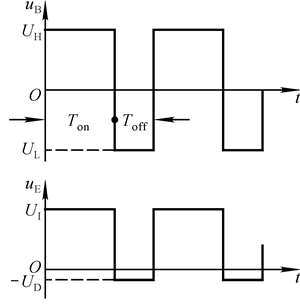

# 电路设计从入门到弃坑14【开关电源概论】

每个电路系统都需要一套电源，而一般的弱电电源都属于**DC-DC转换器**或*AC-DC转换器*。DC-DC转换器接收来自电池活其他直流电压源的输入电压并输出另一个电压，这个电压可以是与输入共地（非隔离）也可以与输入不共地（隔离），并且甚至可以是等效的电流源。功率相对较大，能用于一个电子系统供电的DC-DC转换器就是**电源**了，因为DC-DC转换器最难实现和最核心的部分往往是稳压输出，因此在特定情况下将其称为*稳压器*

当输出电压比输入电压低时，这类稳压器被称为**BUCK**转换器；当输出电压比输入电压高时，称为**BOOST**转换器

而在DC-DC转换器实现上，大致分为两类：**线性**和**开关**。线性稳压器的能量连续不断从输入传递到输出；开关稳压器的能量是以脉冲的形式从输入传递到输出，最后脉冲能量在输出端平稳释放

上一篇文章中主要谈到了线性稳压器，本篇则要简述开关电源也就是开关稳压器的特性和设计方法

如有需要的读者推荐参考《TI大学计划-电源篇》和《电源设计基础》

## 开关电源理论基础

**电源效率**定义为输出功率比输入功率

线性电源的缺点是调整管需要持续工作在甲类放大状态，因此造成很高的管功耗，导致**效率低下**（20%~49%），并且由于需要额外的散热器会导致设备**体积大，笨重，成本高**

如果让调整管工作在开关状态，就只剩下了开关动态功耗，静态功耗，**提高效率**（一般开关电源效率可达70%~95%），并且一般高频变压器总是比低频变压器体积小很多，使用高频开关管控制信号以后可以**大大减小设备体积和重量**

## 最简单的开关电源电路

开关电源最简单的思路就是先把交流逆变成直流，再通过开关管和倍压/滤波电路实现电压变换，在变换过程中要引入负反馈控制占空比，使输出电压稳定

### boost电路

技术要求：使用**大功率倍压电感**L和**高频低阻大功率倍压电容**C

### buck电路

技术要求：**大功率高频开关管**T，**使用低磁阻材料制成的主电感**L

### 推挽输出

### 单端反激电源

### 开关电源PWM调制稳压

## 复杂一点的开关电源拓扑

### SPWM与三相SPWM

### 数控开关电源

### 三相开关电源

