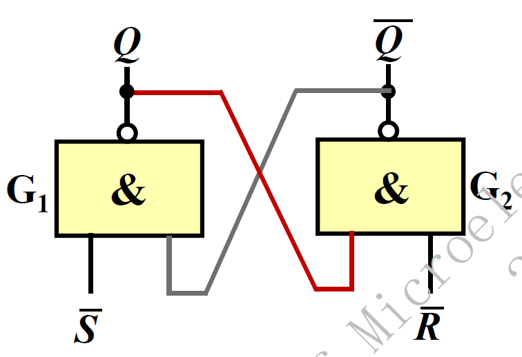
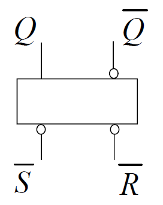

# 电路设计从入门到弃坑19【时序逻辑电路】

时序逻辑电路中使用触发器作为基本逻辑单元，它的特点就是**具有记忆功能**，能够根据当前输入和过去的输入决定当前的输出

> **触发器**是能储存一位二进制信息的基本单元，具有0和1两个稳态，并且在输入信号消失后能实现状态保持

时序电路可以按照有无时钟分成**同步时序电路**和**异步时序电路**。所有的触发器在CLK同一边沿触发的电路是**同步的**；如果没有同意时钟脉冲，那么电路就是**异步的**

一个时序电路总能归纳成如下图所示的结构，组合逻辑负责信号处理，存储部分负责记录关键数据

> 广义的时序电路就是**有限状态机**计算模型，在之后的章节里会进行讨论

## 时序电路的描述

时序逻辑电路通过三类方程描述

* **输出方程**：输出信号与输入信号和状态信号的关系
    $$
    Z=F(X,Q)
    $$

* **驱动方程**：驱动信号与输入信号和状态信号的关系
    $$
    W=H(X,Q)
    $$

* **特征方程**：下一时刻状态信号与当前驱动信号和上一时刻状态信号的关系
    $$
    Q^{n+1}=G(W,Q^n)
    $$

按照电路中输出变量是否和输入变量直接相关，可以把时序电路分成莫尔（**Moore**）型输出和米里（**Mealy**）型输出。Moore型时序电路输出仅和当前电路状态有关；Mealy型时序电路的输出不仅和当前状态有关，还和输入变量有关，二者的关系可以用下图描述

用上面的输出方程描述，Moore型$Z=F(Q^n)$，Mealy型$Z=F(X,Q^n)$

除此之外，**波形图**、**状态转移图**也可以用来描述时序电路

分析一个时序逻辑电路的流程如下：

1. 根据电路图写出输出方程和驱动方程
2. 根据两个方程互相带入获得特征方程
3. 根据特征方程写出对应的逻辑运算，画出状态图、状态表或时序图
4. 根据图表判断电路功能

## 时序逻辑电路的设计

### 通过状态图设计时序逻辑电路

1. 根据设计要求绘制原始状态转移图
2. 化简状态转移图
3. 选择触发器分配合适的状态
4. 根据状态转移图求出输出方程
5. 根据输出方程复现状态方程和驱动方程
6. 根据三个方程绘制电路图
7. 检查电路能否自启动

## 基本触发器RS-FF

最简单的RS触发器常称为**锁存器**（Latch）

两个与门交错相连就能得到它

因为其中有一个Set引脚和一个Reset引脚，所以被称为**RS触发器（RS-FF）**

Set引脚用于置位，Reset引脚用于复位

电路符号表示如下

