# 电路设计从入门到弃坑2.5【场效应管】

在详细谈MOSFET之前，我们先通过一份datasheet回顾一下MOSFET的伏安特性

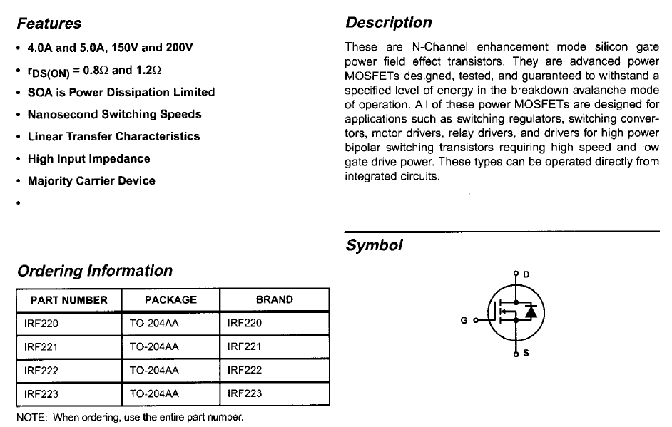

这是通用功率MOSFET IRF220的datasheet，我们可以了解到它能承受4A@150V，有些型号能够承受5A@200V，比一般的功率三极管高到不知哪里去了，同时它的导通电阻（DS电阻）仅为0.8~1.2Ω，并且具有很高的输入阻抗（High Input Impedance）

右下角是他的电路符号

这则是IRF22x系列的最大电气值，V~DS~=200，I~D~=5A，P~D~=40W，耐温达到300℃

手册下面就是详细的电气特性：

阈值电压2V\~4V，I~D~=250μA

漏电流100nA

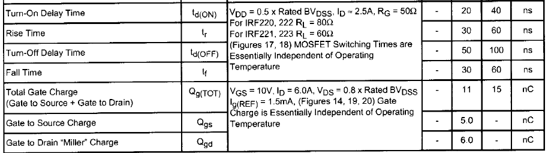

开启时延20\~40ns，关断时延50\~100ns

寄生电容有点大，但不完全大

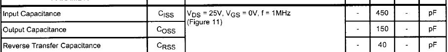

同样存在略大的寄生电感

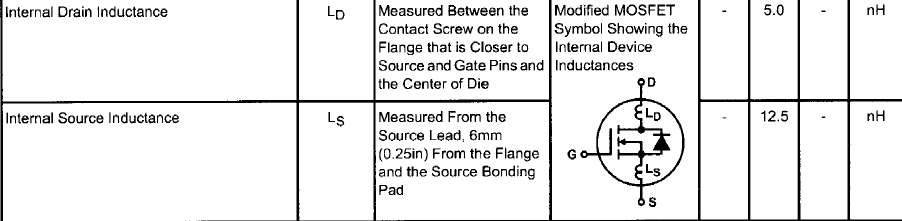

这个管子就是典型的增强型功率NMOSFET

## MOSFET伏安特性分析

场效应管可以如下进行分类

* 结型场效应管JFET

    * 增强型

    * 耗尽型

    * N-JFET

        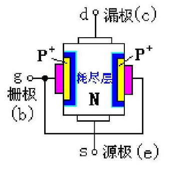

        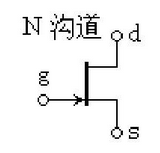

    * P-JFET

        

        

* 金属氧化物半导体场效应管MOSFET

    * 增强型

        

        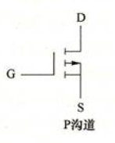

    * 耗尽型

        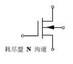

        

    * NMOS

    * PMOS

这里需要强调一下才JFET和MOSFET的区别：JFET是在同一块N形半导体上制作两个高掺杂的P区，将它们连接在一起引出栅极g，N型半导体两端分别引出两个电极，分别称为漏极d，源极s。与MOSFET相比JFET更像三极管，原理也更加“原始”：通过电压改变沟道的导电性来实现对输出电流的控制；对应MOSFET则使用电压先控制反型层，进而控制导电沟道。

结型场效应管JFET是典型的单极型管，具有噪声小、抗辐射能力强、工作电压低的特点，同时器件工艺使得其适合制造（由于成本等限制，几乎所有JFET都是）耗尽型场效应管，常用于高速器件。但是由于它需要外加电压夹断导电沟道，也就使得电压低时漏电流相对较大，不够节能，因此在数字集成电路中不常用。本部分**主要以增强型MOSFET为例介绍场效应管的性质**

> MOSFET的基本知识已经在【基础晶体管】部分提到，这里默认读者已经*相对了解了MOSFET的电路符号并且能够判断其类型*，能够*大致说出电场效应是什么*，能够*理解增强型MOSFET的三种工作模式*

### 输出特性

当$V_{GS}$恒定时，测量S-D两端电压$V_{DS}$和漏极电流$I_D$之间的关系

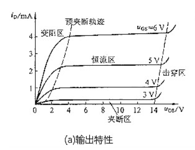

公式表述就是
$$
i_D=f(u_{DS})|_{U_{GS}=Const}
$$
当$U_{GS}$很小时，反型层未形成，导电沟道不会开启，MOSFET工作在截止区，此使存在微小的GS漏电流。

理论上MOSFET工作在该区域时，G-S之间的电阻式无穷大的。

当$U_{GS}$在增大到**阈值电压**（开启电压）时，

当MOSFET处于饱和区时，当DS电压增加时，D极电流几乎恒定，称为**饱和状态**

综上可以推导出一个MOSFET静态工作模型如下：

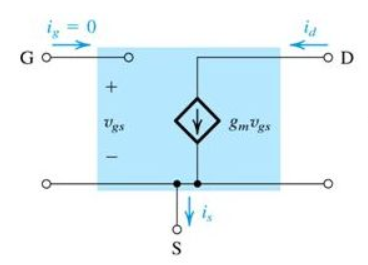

实际上该电阻值在TΩ量级

特别地，如果$u_{GS}$过大，会导致MOSFET击穿——这与$u_{DS}$无关，当$u_{DS}$超过击穿电压后，沟道内发生雪崩击穿，漏极电流急速上升，如果瞬间电流过大，会之间烧毁导电沟道部分。这个特性导致了MOSFET的GS之间很害怕静电：GS之间存在非常小的寄生电容，当外界条件变化引起感应起电或让GS带电后，即使微小的电荷也会导致大电压，进而出现下面两种**静电击穿**：

* **电压静电击穿**：栅极的薄氧化层发生击穿，形成针孔，使GS间或GD间短路
* **功率静电击穿**：静电放电形成的是短时大电流，放电脉冲的时间常数远小于器件散热的时间常数，当静电放电电流通过面积很小的半导体结时，将产生很大的瞬间功率密度，形成局部过热，于是金属化薄膜铝条被熔断，造成栅极开路或者是源极开路

应用中，增强型和耗尽型场效应管都具有类似上面这样的输出特性，对于

### 输入特性（转移特性）

输入特性又叫转移特性

当S-D两端电压$V_{DS}$恒定时，测量$V_{GS}$和漏极电流$I_D$之间的关系，即转移特性：$I_D=f(V_{GS})|_{V_{DS}=Const}$

这里主要解释一下MOSFET电压“输入”的思想

MOSFET相比三极管很特殊，它的G-S极被看作开路，所以它并不能把电流视为“输入”——而是将GS电压作为输入的信号，于是问哦们可以用一个经典的$i_D$-$u_{GS}$图像描述MOSFET在信号输入回路的电气特性

增强型：

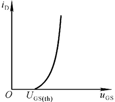

存在一个由管型决定的门限电压（**开启电压**），输入信号小于开启电压不会有输出电流，这个开启电压对应着输出特性中截止区与电阻区的分界曲线

耗尽型：

耗尽型MOSFET则存在一个关断电压（**夹断电压**），当$u_{GS}=0$时并不意味着输出为0，实际上此时MOSFET还工作在电阻区，只有达到这个负的（不一定是负的，取决于管型）夹断电压，耗尽型MOSFET才会真正关断

### 温度特性

耗尽型NMOS当温度升高时，d极电流下降

**温度升高**会导致MOSFET的内部分子热运动加剧，进而使内电流增大，g极外电场**对导电沟道的控制能力下降**，对应的结果需要按照MOSFET的型号决定

### 场效应管重新梳理

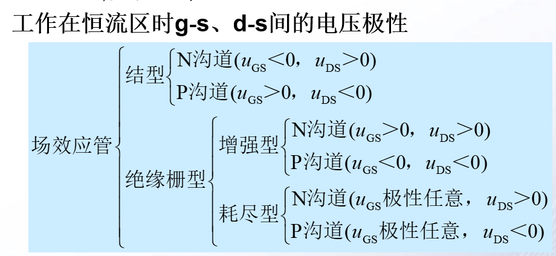

需要注意：耗尽型FET在$u_{GS}=0$时才可以工作在恒流区；增强型MOSFET中N沟道就像是N型BJT一样，需要正的$u_{GS}$才能工作在恒流区；相反，P沟道增强型MOSFET需要负的$u_{GS}$才能工作在恒流区

# 基于场效应管的基本放大电路

基本放大电路

## 三大基本放大电路拓扑

MOSFET放大电路就是三极管放大电路的翻版，因此了解该部分之前应该先阅读下一部分【基本放大电路】

> 在阅读以下内容前，请确认已经阅读完了【基础放大电路部分】，并务必*熟悉三极管放大电路的分析方法*

### 共源放大电路

对应共射放大电路，拓扑如下所示

1. 静态分析

    该电路可以使用三种方式获得稳定的静态工作点

    1. 基本偏置

        和上面的基本拓扑一样，可以完成基本的放大任务，但是存在很多问题

    2. 自给偏压电路

        

    3. 分压偏置电路

        

2. 动态分析

    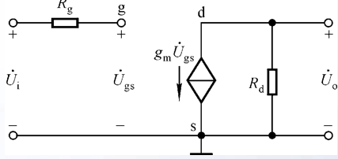

### 共漏放大电路

对应共集放大电路，拓扑如下所示

